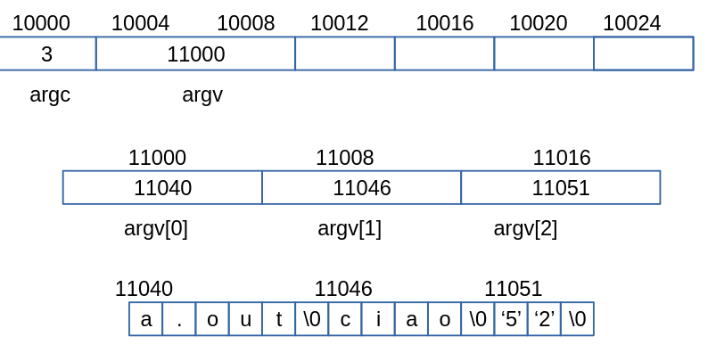

# Guida alla Programmazione in C e Strumenti di Sviluppo

## Introduzione al Linguaggio C

### Lettura e Scrittura di Interi dal Terminale

- Utilizzo di `scanf` e `printf` dalla libreria `<stdio.h>` per leggere e scrivere interi.
- Esempio: `scanf("%d", &variabile)` per leggere un intero e `printf("%d", variabile)` per stamparlo.

### Compilazione ed Esecuzione di Programmi

- Uso del compilatore GCC: `gcc -std=c11 -Wall -o nomeProgramma nomeFile.c`.
- Opzioni del compilatore:
  - `-std=c11`: Usa lo standard C11.
  - `-Wall`: Abilita tutti i principali warning.
  - `-o`: Specifica il nome dell'eseguibile.
- Esecuzione: `./nomeProgramma`.

## Allocazione Dinamica di Array in C

### `malloc`, `free`, e `realloc`

- `malloc(size_t size)`: Alloca `size` byte di memoria.
- `free(void *ptr)`: Libera la memoria allocata.
- `realloc(void *ptr, size_t size)`: Modifica la dimensione della memoria allocata.
- Importanza del controllo del valore di ritorno di queste funzioni per la gestione degli errori.

## Introduzione al Makefile

### Struttura e Utilizzo

- Un file `Makefile` definisce come costruire un programma.
- Sintassi di base:
  target: dependencies
  command

- Utilizzo: Eseguire `make target` per costruire il target specificato.

### Esempio di Makefile

- Esempio per compilare un programma C:
  nomeProgramma: nomeFile.c
  gcc -std=c11 -Wall -o nomeProgramma nomeFile.c

## Utilizzo di Valgrind

### Verifica del Corretto Utilizzo degli Array

- Valgrind è uno strumento per il debugging e la profilazione che aiuta a identificare memory leaks e altri problemi di gestione della memoria.
- Comando di base: `valgrind --leak-check=full ./nomeProgramma`.
- Interpretazione dell'output di Valgrind per identificare e correggere gli errori di gestione della memoria.

## Introduzione ai puntatori

### Uno sguardo alla RAM

La RAM del computer consiste in bytes, ad esempio 512MB = 536870912, singolarmente indirizzabili.

Ogni byte è individuato da un indirizzo tra 0 e 536870912.

Il nostro programma occupa una porzine di questa RAM, diciamo a partire dalla posizione 10,000.

Supponiamo il nostro programma contenga delle variabili intere (4 byte)

<p align="center">
  
</p>

Situazione prima della chiamata a malloc(): solo variabili intere.

Dopo la malloc: 400 byte riservati dal sistema per il mio array

<p align="center">
  
</p>

<p align="center">
  
</p>

dopo aver scritto i primi 3 elementi nell'array a[]

esecuzione di a = realloc(a, 80)

<p align="center">
  
</p>

La memoria restituita da malloc non è inizializata!

<p align="center">
  
</p>

- Malloc serve per creare un array
- Realloc per cambiarne le dimensioni
- free per distruggerlo
- un array è individuato dalla sua posizione in memoria del suo primo elemento
- toccca a noi non accedere mai a zone di memoria non assegnate a noi.

## Puntatori

- Una variabile che contiene l'indirizzo in memoria di un'altra variabile è detta puntatore.

- il tipo di un puntatore è individuato dal tipo della variabile puntata seguito ad un \*. Ad esempio int \*

- I puntatori contengono tutti la stessa cosa (un indirizzo) ma il compilatore distingue tra int \*, long \* , double \* etc.

## Estrarre l'indirizzo

- un altro modo per generare puntatori è l'operatore &
- data una variabile w se scrivo &w ottengo l'indirizzo di w nella RAM

## A cosa serve?

- Si usa solo con l'operatore |\* (dereferenziazione)
- esempio molto importante:

```c
//metto in p l'indirizzo in RAM di messi
int messi = 4;
int n = 0;
int *p = &messi;

//incremento n del valore della variabile a cui punta p (=messi)
n += *p;

//scrivo 7 nella variabile a cui punta p(=messi)
*p = 7;
```

Gli operatori `&` e `*` servono per aggirare il fatto che nel C quando chiamo una funzione i paramentri sono passati per un valore

```
main() {
  ...
  int n=7;
  fun(n);
  ...
}

int fun(int a) {
  ...
  x = a*a;
  a += x*y+a
}
```

fun non cambia il valore di n, mentre invece:

```
main() {
  ...
  int n=7;
  zun(&n)
}

int zun(int *p) {
  *p=5;
}
```

L'esecuzione di `*p=5` scrive il valore 5 dentro n

## Stringhe, argc/argv

Una stringa è un array di caratteri, in questo caso speciale non si memorizza la lunghezza ma si usa la convenzione che la stringa termina quando si incontra il byte 0. Esempio:

`char *s = "The answer is 42";`

<p align="center">
  
</p>

## I parametri della funzione main()

Il prototipo della funzione main è :
`int main(int argc, char *argv[])`
Questi parametri servono per passare al programma quello che scriviamo sulla riga di comando insieme al nome dell'eseguibile.

Esempio:
`a.out ciao 52`

<p align="center">
  
</p>
# Guida Fondamentale a fopen, fprintf, fclose, argc, argv e strdup in C

## Gestione dei File in C: `fopen`, `fprintf`, `fclose`

### `fopen`

- **Uso**: `FILE *fopen(const char *filename, const char *mode);`
- **Descrizione**: Apre un file specificato da `filename`.
- **Modalità**:
  - `"r"`: Apertura per lettura.
  - `"w"`: Apertura per scrittura (crea il file se non esiste, tronca se esiste).
  - `"a"`: Apertura per appendere (crea il file se non esiste).
  - `"r+"`, `"w+"`, `"a+"`: Varianti per lettura/scrittura.
- **Valore di Ritorno**: Puntatore a `FILE` in caso di successo, `NULL` in caso di errore.

### `fprintf`

- **Uso**: `int fprintf(FILE *stream, const char *format, ...);`
- **Descrizione**: Scrive dati formattati al file puntato da `stream`.
- **Esempio**: `fprintf(file, "%s %d", "test", 10);` scrive "test 10" nel file.
- **Valore di Ritorno**: Numero di caratteri scritti in caso di successo, numero negativo in caso di errore.

### `fclose`

- **Uso**: `int fclose(FILE *stream);`
- **Descrizione**: Chiude il file aperto associato a `stream`.
- **Importanza**: Necessario per liberare le risorse; assicura che tutti i dati siano scritti sul disco.
- **Valore di Ritorno**: `0` in caso di successo, `EOF` in caso di errore.

## Argomenti della Linea di Comando: `argc` e `argv`

### `argc` (Argument Count)

- **Descrizione**: Variabile intera che indica il numero di argomenti passati al programma (incluso il nome del programma).
- **Esempio**: `./program arg1 arg2` avrà `argc` uguale a 3.

### `argv` (Argument Vector)

- **Descrizione**: Array di puntatori a stringhe, rappresenta gli argomenti passati.
- **Accesso**: `argv[0]` è il nome del programma, `argv[1]` è il primo argomento, ecc.
- **Nota**: `argv[argc]` è sempre `NULL`.

## Copia di Stringhe in C: `strdup`

### `strdup`

- **Uso**: `char *strdup(const char *s);`
- **Descrizione**: Crea una copia di `s` allocando memoria sufficiente.
- **Importanza**: Utile per creare una copia indipendente di una stringa.
- **Gestione della Memoria**: La stringa duplicata deve essere liberata con `free`.
- **Valore di Ritorno**: Puntatore alla nuova stringa in caso di successo, `NULL` in caso di errore.

---

Questi concetti sono fondamentali per la programmazione in C, in particolare per la gestione di file e la manipolazione di stringhe e argomenti della linea di comando. Comprendere questi elementi è essenziale per scrivere programmi efficienti e sicuri in C.

## SCANF

Supponiamo di avere questa dichiarazione di variabili:

`int n;`
`char *s;`

nella memoria avremo la seguente situazione (le variabili non sono state inizializzate quindi contengono spazzatura)

scanf(“%d”,&n) -> scanf(“%d”,10000)
la funzione scanf legge l’intero 45 e lo scrive alla posizione 10000.

### Lettura di una stringa già allocata

`s = malloc(10);
scanf("%9s", s); -> scanf("%s", 777000);`
