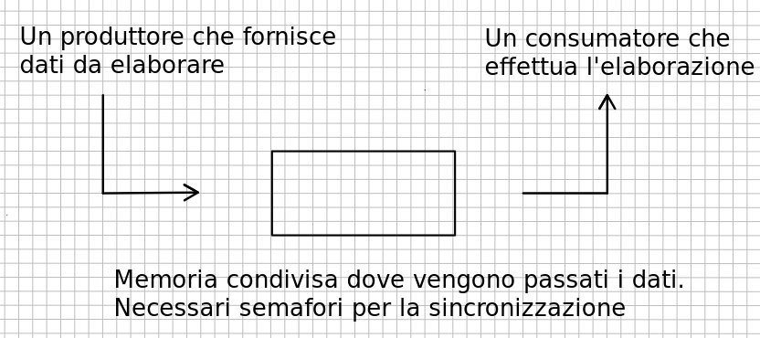
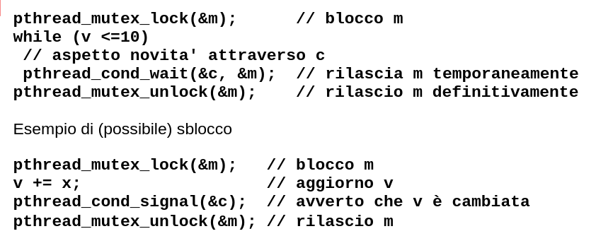
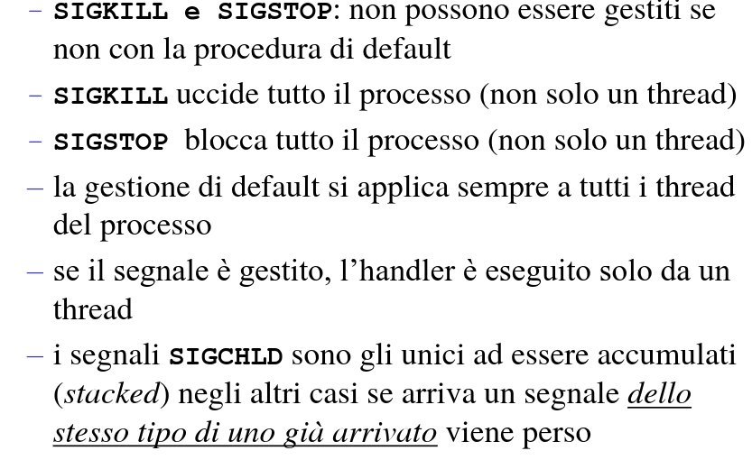

# Library functions vs System Calls

Finora abbiamo sempre usato library functions: fprint, fread, malloc, strdup, etc.

- Fanno parte della libreria C
- Forniscono un meccanismo semplice per interagire con il sistema operativo (esempio fopen)
- Forniscono comode funzionalità (esempio: strlen non interagisce con OS ma è comoda)

**System calls (per noi)**

- Funzioni nelle libreria C che offrono funzionalità "simili" alle Library functions
- Più difficili da usare, ma offronon un maggior controllo
- Perchè esistono, perchè questo nome?

Il Kernel fornisce le proprie funzionalità agli utenti attraverso delle funzioni che chiameremo kernel system call.

Le kernel system call sono indipendenti dal C, ad esempio le possiamo chiamare dall'assembler ARM con svc.

In C le system call sono funzioni di libreria che hanno una corrispondenza 1-1 con le kernel system call.

## Riassumendo

Le system call sono l'interfaccia con il kernel
Ognuna ha un singolo compito semplice
Le library function sono più sofisticate ma sono comunque basate sulle system call

1.  fopen vs open:

    fopen: È una funzione della libreria standard C che apre un file e restituisce un puntatore a FILE. Gestisce il buffering dei dati e offre vari modi per aprire un file (come lettura, scrittura, aggiunta, ecc.). Viene usata per operazioni di file ad alto livello.

    open: È una system call di UNIX/Linux che apre un file e restituisce un file descriptor, un piccolo intero. È a livello più basso rispetto a fopen e non gestisce il buffering automaticamente. Offre un controllo più diretto sulle modalità di apertura del file (es. permessi).

2.  fprintf vs write:

    fprintf: È una funzione della libreria standard C usata per scrivere dati formattati in un flusso, tipicamente un file. Funziona con un puntatore a FILE restituito da fopen.

    write: È una system call di UNIX/Linux che scrive dati in un file identificato da un file descriptor. Scrive i byte esattamente come sono forniti, senza alcuna formattazione o buffering aggiuntivo.

3.  fread e fwrite vs read e write:

    fread e fwrite: Sono funzioni della libreria standard C per leggere e scrivere blocchi di dati da e verso un flusso. Gestiscono il buffering e sono più adatti per la lettura e scrittura ad alto livello.

    read e write: Sono system call di UNIX/Linux per leggere e scrivere blocchi di dati da e verso un file descriptor. Operano a un livello più basso e non gestiscono il buffering automaticamente.
    Le differenze tra le funzioni di libreria (malloc, free, realloc, calloc) e le system call (brk, sbrk) riguardano principalmente il livello di astrazione e la modalità di gestione della memoria. Ecco un riepilogo basato sulle pagine man:

        Funzioni di libreria (malloc, free, realloc, calloc):
            malloc: Alloca una quantità di memoria specificata e restituisce un puntatore a quella memoria. Non inizializza la memoria.
            free: Libera la memoria precedentemente allocata da malloc, calloc, o realloc.
            realloc: Modifica la dimensione della memoria allocata. Può sia espandere che ridurre lo spazio.
            calloc: Alloca la memoria per un array di elementi di una data dimensione e inizializza tutti i bit a zero.

        Queste funzioni sono parte della libreria standard C e forniscono un'interfaccia di alto livello per la gestione della memoria. Sono portabili e gestiscono diversi aspetti dell'allocazione della memoria, come il framing, l'allineamento e la prevenzione della frammentazione.

        System call (brk, sbrk):
            brk e sbrk: Queste chiamate di sistema vengono utilizzate per gestire l'heap di un processo, cioè l'area di memoria che viene usata per l'allocazione dinamica. brk imposta la fine dell'area heap di un processo a un certo indirizzo, mentre sbrk incrementa l'heap di una certa quantità.

        Queste chiamate sono di più basso livello rispetto alle funzioni di libreria e vengono utilizzate direttamente dal sistema operativo o dagli implementatori di librerie di allocazione della memoria. Sono specifiche per i sistemi UNIX/Linux e offrono un controllo più diretto sulla gestione della memoria, ma sono meno facili da usare e più soggette a errori rispetto alle funzioni di libreria.

In pratica, le funzioni di libreria come malloc, free, realloc, e calloc sono usate per la maggior parte delle operazioni di allocazione della memoria in applicazioni C e C++, mentre brk e sbrk sono di solito usate a un livello più basso, spesso all'interno delle implementazioni delle stesse funzioni di libreria per gestire l'allocazione della memoria a livello di sistema.

Le studiamo le system call perchè alcune funzionalità, vedi le pipe, le richeidono.
Le pipe sono basate sui file descriptor quindi per leggere e scrivere si deve usare read/write.

# Tecnica produttori-consumatori

(vale per thread e processi)

  

Per gestire un buffer con b posizioni utilizziamo due semafori.

`sem_free_slots: (inizializzato a b)` numero di slot dove il produttore può scrivere un oggetto.

`sem_data_items: (inizializzato a 0)` numero di oggetti scritti dal produttore che il consumatore deve elaborare

Se il produttore deve scrivere qualcosa effettua:
`sem_wait(sem_free_slots)`
dopo la wait scrive l'oggetto ed effetua una
`sem_pst(sem_data_items)`
Queste operazioni mantengono i semafori allineati con il numero effettivo di slot liberi e oggeti presenti.

Quando il consumatore vuole un nuovo dato effettua:
`sem_wait(sem_data_items)`
che aspetta ci sia un dato disponibile e mantiene aggiornato il numero di oggetti sul buffer.

Il consumatore legge l'oggetto ed esegue
`sem_post(sem_free_slots)`
che mantiene aggiornato il numero di slot liberi

Dopo ogni operazione è mantenuto l'invariante:
`sem_free_slots + sem_data_items=b` (dimensione buffer)

## Come gestiamo le posizioni libere/occupate nel buffer?

Usiamo un indice p per la prossima posizione dove scriverà il produttore e un indice c per la prossima posizione dove legge il consumatore.

Grazie all'uso dei semafori abbiamo che:

c <= p <= c + b

quando c = p sem_data_items è 0 e c non può avanzare oltre, quando p = c+ b sem_free_slots è 0 e p non può avanzare oltre.

Facciamo finta di avere un buffer infinito ma accediamo alle posizioni c%b e p%b che sono tra 0 e b-1.

Si concorda un dato dummy quando si è finito di mandare dati.

# Condition Variables

Supponiamo che un thread debba aspettare che una certa variabile diventi > 10.
Usiamo le condition variables, permettendo così di rendere più efficiente l'attesa facendo eseguire il test solamente quando ha senso farlo, cioè quando la variabile da testare viene modificata.

Questo non avviene automaticamente, dobbiamo programmarlo noi utilizzando anche un mutex.

Vediamo un esempio semplificato di attesa/sblocco.

Esempio di attesa:

  

Le operazioni su C devono essere fatte con il blocco su m.
La wait rilascia m ma quando riparte lo riblocca.

La libreria ci mette a disposizione la condition variable c, tocca a noi usarla in maniera corretta insieme al mutex m e alla varibaile da testare v (la condizione da testare può coinvolgere più varibili).

Visione alternativa: i semafori sono meccanismi di attesa basati su una variabile intera che possiamo variare di +-1. Le condition variables sono un meccanismo di attesa puro, dobbiamo gestire noi le variabili con l'aiuto di un mutex.

# I segnali

**Sono 'interruzioni' software**

- comunicano al processo il verificarsi di un evento
- ad ogni evento corrisponde un segnale numerato
- un processo all'arrivo di un segnale di un certo tipo può decidere di :
  - ignorarlo
  - lasciarlo gestire al kernel con l'azione di default definita da quel segnale
  - specificare una funzione (signal handler) che viene mandata in esecuzione appena il segnale viene rilevato.

**Da chi sono inviati i segnali?**

- da processo/thread all'altro
  - usando kill(), pthread_kill()
- dall'utente con particolari combinazioni di tasti (al processo in foreground)
  - Control-C corrisponde a SIGINT (ANSI)
  - Control-Z corrisponde a SIGSTP
- dall'utente con l'utility kill della shel
- da SO per comunicare al processo il verificarsi di particolari eventi (es. SIGFPE, errore flaoting point, SIGSEGV, segmentation fault)

**Lo standard POSIX stabilisce un insieme di segnali riconosciuti in tutti i sistemi conformi**

- sono interi definiti come macro in: /usr/include/bits/signum.h

- esempi:

  - SIGKILL(9): sintetico (e non può essere intercettata) (quit)
  - SIGALRM(14): è passato il tempo richiesto (quit)
  - SIGINT(2) Control-C
  - SIGSTP(20) Control-Z
  - SIGFPE(8) floating point error (dump)
  - SIGHLD(17) cambiamento di stato in un processo filgio (ignore)
  - SIGPIPE(13) scrittura su pipe7socket senza lettori (quit)

- SD del kernel relative ai segnali

- signal handler array: descrive cosa fare quando arriva un segnale di un certo tipo

  - ignorare, trattare + puntatore al codice della funzione da eseguire (handler)
  - uno per processo (condiviso fra i thread)

- pending signal bitmap: un bit per ogni tipo di segnale

  - il bit X è a 1 se c'è un segnale pendente di tipo X
  - una per thread

- signal mask: un bit per ogni tipo di segnale
  - il bit X è a 1 se non voglio riceevere segnali di tipo X
  - una per thread

**Cosa accade quando arriva un segnale X ad un processo, con un solo thread?**

- I segnali vengono inseriti nella pending signal bitmap e controllati al ritorno da SC.
  Se la signal mask non blocca X il processo viene interrotto.

- il kernel stabilisce quale comportamento adottare controllando il contenuto del signal handler array

- se deve essere eseguito un signal handler safun:
  Si crea un frame "fittizio" sullo stack e si salva l'indirizzo di ritorno (quello dalla istruzione succesiva a quella interrotta)
- si esegue safun e il processo riprende l'esecuzione dalla istruzione successiva a quella interrotta

**Cosa accade quando arriva un segnale X ad un processo, con più threads?**

- Se il segnale è destinato ad un thread particolare T nel processo:
  - se la signal mask di T non blocca il segnale X il thread viene interrotto
  - il kernel stabilisce quale comportamento adottare controllando il contenuto del signal handler array (globale nel processo).
  - se deve essere eseguito un signal handler si procede come già discusso.

se non si sceglie un thread in aprticolare se ne assegna uno a caso e si procede come prima.

**Tipicamente:**
se il segnale è dovuto ad un errore (divisione per 0, accesso erroneo alla memoria etc) viene inviato al thread che ha fatto l'errore

- Tutti gli altri segnali vanno al processo
- i segnali generati sinteticamente vanno al thread o al rocesso (dipende dalla system call usata)

## SC per i Segnali (sigaction etc.)

- `act:` struttura che definisce il nuovo trattamento del segnale signum;

- `oldact:` ritorna il contenuto precedente del signal handler array (può servire per ristabilire il comportamente precedente)

- con `act` a NULL si prende solo il vecchio gestore

`sa_handler`: indica come gestire il segnale:

- `SIG_IGN` ignora il segnale, `SIGN_DFL` usare la funzione di gestione di default altrimenti ho il puntatore alla funzione da invocare all'arrivo del segnale.

`sa_mask`: segnali da mascherare durante l'esecuzione del gestore:

- `sigaction` blocca automaticamente il segnale per cui stiamo registrando il gestore, ma se uso lo stesso gestore per due o più segnali devo bloccarli tutti esplicitamente per evitare stati inconsistenti (il gestore viene rieseguito prima di finire).

`sa_flags:` opzioni, ne vedremo esempi in seguito. Possono esserci altri campi (system dependent)

  

## Cosa mettere nell'handler

- Durante l'esecuzione dell'handler possono arrivare altri segnali: questo può generare situazioni inconsistenti.

Quindi:

- l'handler deve essre breve, semplicemente aggiornare lo stato interno e/o terminare l'applicazione.
  Non tutte le library fun possono essere chiamate dall'handler con la garanzia che non succeda niente di strano.

- in particolare non è safe chiamare tipiche funzioni della libreria standard, come la printf(), scanf() o altre funzioni definite all'interno del programma.
