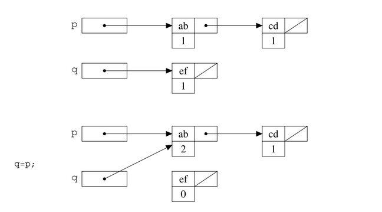
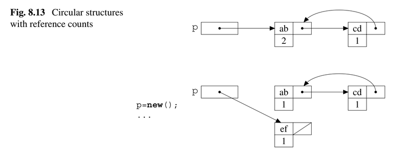
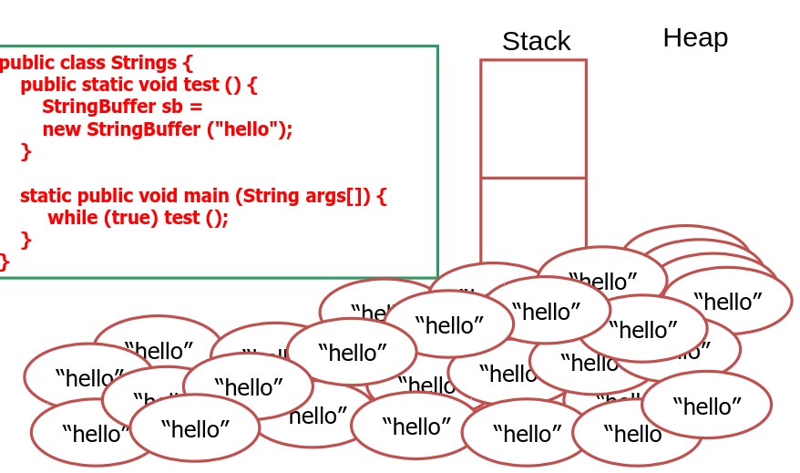

# Garbage Collector

Vediamo di fare una piccola introduzione a cosa sono, come funzionano e vediamo poi di rispondere alle domande che pone il prof:

- `motivazioni e problematiche`
- `reference counting`
- `mark-and-sweep`
- `copy collection `
- `approcci generazionali`

Sono nati dal bisogno di liberare e poter riallocare memoria dell'heap che non viene più utilizzata. Questo succede in linguaggi che non prevedeno la gestione della memoria da parte del programmatore. Vedi il `C` con `malloc` e `free`, il garbage collector non ha motivo di esistere, vedi `Java` il discorso comincia ad avere senso.

**Le operazioni del garbage collector si dividono in due fasi:**

1. _garbage detection_: distinguere tra le risorse in uso e quelle 'morte'
2. _collection_: raccogliere gli oggetti non in uso, in modo che il programma li può riutilizzare.

Le due fasi non sono sempre separate e dipende da come decidiamo che un oggetto non è più in uso e questo criterio ci permette anche di classificare i vari GC.
Non possiamo lasciare solo al GC di decidere se una risorsa può essere riutilizzata oppure no.

**Tecniche che vedremo**:

- `reference counting`
- `mark-and-sweep`
- `copy collection `

In generale però, le tecniche che consideriamo devono essere capaci di riconoscere quei campi all'interno di un oggetto che corrisponde ai puntatori.

## Reference Counting

Il modo più semplice per verificare che si sta usando un oggetto è controllare se questo ha puntatori attached to it. Questa è la reference counting technique.

Prendiamo un intero chiamato:

- `reference counter` oppure `reference count` per ogni oggetto.

Il programmatore non può accedervi. Il compito di tenere traccia di questo numero, che rispechia il numero di puntatori ancora attivi, ricade sulla macchina astratta.
Per farlo quando un oggetto viene creato, il contatore è iniziallizzato a 1.

Quando abbiamo l'assegnamento di un puntatore: `p = q;` il counter che appartiene all'oggetto puntato da `q` è incrementato di 1 mentre il contatore dell'oggetto puntato da `p` è diminuito di 1. Il contatore si decrementa quando si esce da un ambiente locale.

  

**Che succede se il contatore torna a 0?**

L'oggetto può essere ritornato nella lista degli oggetti liberi ma prima di ciò la macchina astratta decrementa anche gli contatori degli altri puntatori, collezionando ricorsivamente tutti gli oggetti di cui il contatore fa 0.

_Ecco le due fasi:_

- `garbage-detection`
- `collection`

**Il difetto di questa tecnica?** Non si riescono a deallocare le strutture circolari.

  

# Garbage collector new slides

## Gestione della memoria

- Static area:

  - dimensione fissa, contenuti determinati e allocati a compilazione

- Run-time stack

  - dimensione variabile (record attivazione)
  - gestione sottoprogrammi

- Heap
  - dimensione fissa/variabile
  - supporto alla allocazione di oggetti e strutture dati dinamiche
  - malloc in C, new in Java

`Allocazione statica`:
Entità che ha un indirizzo assoluto che è mantenuto per tutta l'esecuzione del programma.
Solitamente sono allocati staticamente:

- variabili globali
- variabili locali sottoprogrammi (senza ricorsione)
- costanti determinabili a tempo di compilazione
- tabelle usate dal supporto a run-time (per typpe checking, garbafe vollection)

- Spesso usate in zone protette di memoria

## Allocazione dinamica: Stack

- per ogni istanza di funzione a run time abbiamo un record di attivazione contenente le relative info di tale instanza.

- Ogni blocco ha un suo record di attivazione
- Lo è necessario se c'è ricorsione nel linguaggio
- Lo stack potrebbe essre omesso in linguaggi senza ricorsione (Fortran): Allocando così tutti i record di attivazione.
- Anche in un linguaggio senza ricorsione può essere utile usare la pila per risparmiare memoria.

## Allocazione dinamica con Heap

- _Heap:_ regione di memoria i cui blocchi di memoria possono essre allocati e deallocati in momenti arbitrari.

- Necessario quando, linguaggio permette:
  allocazione esplicita din memoria a run-time (malloc)
- oggetti di dimensione variabili e con un ciclo di vita.

La gestione di heap non è banale:

- gestione efficiente dello spazio: evitare frammentazione
- velocità di accesso

## Garbage Heap (Java)

  

## Heap con blocchi a dimensione fissa

L'heap è suddivis in blocchi di dimensione fissa. Inizialmente tutti i blocchi collegati nella lista libera.

Allocazione di uno o più blocchi contigui.
Deallocazione: restituzione alla lista libera

## Heap con blocchi di dimensione variabile

- Inizialmente un solo blocco, della dimensione dell'heap
- Ad ogni richeista di allocazione cerca blocco di dimensione opportuna:

  - first fit: primo blocco grande abbastanza
  - best fit: quello di dimensione più piccola, grande abbastanza.

- Se il blocco scelto è molto più grande di quello che serve viene diviso in due e la parte inutilizzata è aggiunta alla LL.

- Quando un blocco viene deallocato viene restituito alla linked list.

## Garbage Collector

Applicazioni moderne sembrano non avere limiti allo spazio di memoria.

- esempio: 16GB sui PC, 512 GB sui server
- spazio di indirizzi a 64bit

Ma l'uso scorretto fa emergere problemi come: memory leak (mancata deallocazione), dangling reference, null pointer dereferecing, heap fragmentation

La gestione della memoria esplicita viola il principio di astrazione dei linguaggi.

GC non è un astrazione linguistica.
GC è componente della macchina virtuale.

- Sviluppi recenti del GC:
- linguaggi OO: Java, C#
- linguaggi FUnzionali: Haskell, F#

## Frammentazione

**Frammentazione interna**
lo spazio richiesto è X, vengono allocati uno o più blocchi di dimensione Y > X, lo spazio Y-X è sprecato

**Frammentazione esterna**
ci sarebbe lo spazio necessario ma è inusabile perchè suddiviso in pezzi troppo piccoli

**First fit vs best fit**
FF : più veloce ma peggiore
BF : più lenti ma migliore

Con unica LL costo allocazione lineare nel numero di blocchi liberi
Per migliorare, liste libere multiple: la ripartizione dei blocchi fra le varie liste può essre:

- statica
- dinamica

## Problema: identificazione dei blocchi da deallocare

- Nella LL vanno reinseriti i blocchi da deallocare
- Come vengono individuati?
  - Linguaggio con de-allocazione esplicita (tipo free): se p punta a struttura dati, free p de-alloca la memoria che contiene la struttura.
  - Linguaggi senza de-allocazione esplicita: una porzione di memoria è recuperabiole se non è più raggiungibile in nessun modo.

## Garbage e Dangling reference

  

## Il GB perfetto

1. Nessun impatto visibile sull'esecuzione dei programmi
2. Opera su ogni tipo di programma e strutura dati dinamica, tipo strutture cicliche.
3. Individua il garbage (e solo il garbage) in modo efficiente e veloce.
4. Nessun overhead sulla gestione della memoria complessiva
5. Gestione heap senza frammentazione

## tecniche del GC

**Reference counting:**

- gestione diretta delle celle live
- la gestione è associata alla fase di allocazione della memoria dinamica
- non ha bisogno di determinare la memoria garbage

**Tracing:** identifica le celle che sono diventate garbage:

- mark-sweep
- copy collection

- tecnica allo stato dell'arte: generational GC

## Reference Counting

- Aggiugere un contatore dei riferimenti ai blocchi allocati (nuemro di cammini di accesso attivi verso ogni blocco)

- Overhead di gestione:
  - spazio per i contatori di riferimenti
  - operazioni che modificano i puntatori richiedono incremento o decremento del valore del puntatore
  - gestione in real-time (continua durante l'esecuzione)

Unix (file system) usa la tecnica dei reference count per la gestione dei file

- un file non viene veramente cancellato fintanto che ci sono hard link verso esso.

## RC features

- Incrementale:
  la gestione della memoria è amalgamata direttamente con le operazioni delle primitive lingusitiche.
- Facile da implementare
- Coesiste con la gestione della memoria esplicita da programma (esempio malloc e free)
- Riuso delle celle libere immediato.

**Attenzione ai cicli e memory leak**

Quando usi il RC c'è un overhead per lo spazio e il tempo, spazio per il contatore e la modifica di un puntatore richiede diverse operazioni.

Non permette di gestire strutture dati con cicli interni.

## Modello a grafo della memoria

È necessario determinare il root set, l'insieme dei dati "attivi" (variabili statiche + variabile allocate sul run-time stack).
Per ogni struttura dati allocata (nello stack e nello heap) occorre sapere dove ci possono essere puntatori a elementi dello heap (informazione presente nei type descriptor).
Reachable active data : la chiusura transitiva del grafo a partire dalle radici, cioè tutti i dati raggiungibili anche indirettamente dal root set seguendo i puntatori.

## Celle, "liveness", blocchi e garbage

- Cella = blocco di memoria sullo heap
- Una cella viene detta live se il suo indirizzo è memorizzato in una radice o in un altra cella live, quindi una cella è live se e solo se appartiene ai Reachable active data.
- una cella è garbage se non è live.

## Garbage Collection (GC):

attività di gestione della memoria dinamica consistente nell'individuare le celle garbage (o il garbage) e renderle riutilizzabili, per es. inserendole nella Lista Libera.

## Mark-sweep

Ogni cella prevede spazio per un bit di marcatura
Garbage può essere generato dal programma (non sono previsti interventi preventivi)
L'attivazione del GC causa la sospensione del programma in esecuzione
Marking : si parte dal root set e si marcano le celle live
Sweep : tutte le celle non marcate sono garbage e sono restitutite alla LL, reset del bit di marcatura sulle celle live

### Valutazione

Opera bene sulle strutture circolari, nessun overhead di spazio, sospende l'esecuzione, non interviene sulla frammentazione dello heap.

## Copying collection

- _L'algoritmo di Cheney_ è un algoritmo di garbage collection che opera suddividendo la memoria heap in due parti.

- "from-space" e "to-space"

- Solamente una delle due parti dello heap è attiva (permette pertanto di allocare nuove celle).
- Quando viene attivato il garbage collector, le celle live vengono copiate nella seconda porzione dello heap (quella non attiva).
  alla fine della operazione di copia i ruoli tra le due parti delle heap vengono scambaiti.
- Le celle nella parte non attiva vengono restituite alla lista libera in un unico blocco evitando frammentazione.
