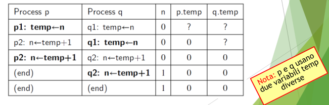

# Programmazione Concorrente 1

- Un programma concorrente contiene due o più processi (threads) che lavorano assieme per eseguire una determinata applicazione.

- Ciascun (sotto)processo è un programma sequenziale
- I (sotto)processi comunicano tra loro utilizzando varibili condivise (shared memory) o scambiandosi messaggi (message passing)

- ASTRAZIONE: i (sotto)processi sono in esecuzione contemporanea

- (**interleaving**) -> possibilità di mantenere attivi più programmi (o processi) contemporaneamente alternandone l'esecuzione nel processore.

**Sistemi multiprocessore**
Successivamente furono introdotti i sistemi multiprocessore, dotati di più CPU (e/o di CPU multi-core)

- più processi in parallelo
- eseguire le applicazioni più velocemente

  

## Esecuzione non sequenziale

Concorrenza e parallelismo sono accomunati da un aspetto:

- Esecuzione non sequenziale del programma
- Idealmente ogni (sotto)processo che costituisce il programma ha un proprio program counter che avanza autonomamente.

  

Il sistema di transizioni:

- è non deterministico (lo stato iniziale ha due alternative possibili)
- Il non determinismo **Astrae** dal criterio usato dallo sheduler del sistema operativo per scegliere quale processo far avanzare (es. processi prioritari su altri)
- Conoscendo lo scheduler si potrebbe concludere che alcuni cammini nel sistema di transizioni non sono in realtà realizzabili
- Il sistema di transizioni non fa assunzioni sullo scheduler

  

## Operazioni atomiche

Ovvero elementari e non interrompibili

### Il compilatore

Il compilatore traduce un singolo comando del linguaggio di alto livello in una sequenza di operazioni nel linguaggio macchina

  

### Analisi al livello macchina

In pratica, l'interleaving ha luogo al livello del linguaggio macchina, e non del linguaggio di alto livello.

- Sono le operazioni assembler ad alternarsi, non i comandi del linguaggio di alto livello.

**Che succede se due processi cercano di scrivere allo stesso momento la stessa variabile globale?**
Anche in caso di parallelismo l'hardware garantisce che al più un processo per volta possa scrivere una certa locazione di memoria.

_Quindi_
anche il parallelismo è ricondotto alla concorrenza dall'hardware.
La concorrenza (interleaving) è un'astrazione.

- I processi possono operare in parallelo solo su locazioni di memoria distinte.
- La concorrenza (interleaving) è un astrazione che consente di fare molte analisi dei programmi che valgono anche in situazioni di parallelismo.
- Come per lo scheduling del sistema operativo, anche le scelte operate dall'hardware saranno modellate tramite non determinismo nei sistemi di transizione.

- Ragionando ad **alto livello**, assumiamo che gli assegnamenti siano operazioni atomiche (indivisibili).
- Queste sono le due (uniche) esecuzioni possibili del nuovo esempio di programma concorrente:
- Corrispondono a due cammini alternativi nel sistema di transizioni che descrive il comportamento del programma
- In entrambi i casi alla fine n vale 2

  

- Vediamo ora lo stesso programma a livello macchina
- Queste le corrispondenti istruzioni in assembler.

  

- Rappresentazione schematica dell'esecuzione di ognuno dei due processi

  

  

## Simulare il comportamento a livello macchina

**Possibile soluzione:** simulare l'interleaving che si ha a livello macchina con assegnamenti a varibili temporanee (locali) nel linguaggio ad alto livello per disaccopiare load e store alle variabili globali (che sono corrette tra processi).

  

In questo modo si può catturare ad alto livello anche il comportamento di basso livello che nel caso precedente non veniva descritto.

  

**Altro modo** di effettuare la stessa simulazione è del comportamento di basso livello consiste nell'assumere nel linguaggio un'operazione di dereferenziazione esplicita delle variabili.

- Invece di scrivere n <- n + 1 scriveremo n <- !n+1 dove ! rende esplicita l'operazione di lettura della variabile (richiede un passo di computazione)

  

è una soluzione meno realistica (il valore 0 letto dalla variabile viene temporaneamente scritto nel codice del programma...) ma che cattura correttamente quello che accade a livello più basso (lettura e scrittura in due passi).

## Ricapitolando

**Possiamo usare la concorrenza come astrazione che:**

1. descrive il comportamento di processi tramite interleaving,
2. formalizzandoli come sistemi di transizioni non deterministici
3. ottenuti dalla semantica del linguaggio di alto livello

**Questa astrazione:**

- Cattura anche aspetti di parallelismo
  - in particolare sulle variabili globali condivise
- Cattura anche aspetti di interleaving a livello macchina
  - eventualmente aggiungendo variabili temporanee locali o esplicitando le operazioni di dereferenziazione

## Shared Memory vs Message Passing

- Due o più (sotto)processi debbano comunicare tra loro:
  - per sincronizzarsi in certi momenti
  - per scambiarsi dati

Due modi diversi per far comunicare processi:

- Memoria condivisa
- Scambio di messaggi

**Shared Memory:**
I processi possono accedere alle stesse aree di memoria.
Si sincronizzano e comunicano tra loro scrivendo e leggendo varibili condivise

**Message Passing:**

I processi accedono ad aree diverse della memoria, ma possono inviarsi messaggi e sincronizzarsi usando servizi di _inter-process communication (IPC)_ messi a disposizione dal sistema operativo.

  

## Esempio di comunicazione con shared memory

  

  

  

## Necessità di meccanismi di sincronizzazione

Gli esempi mostrano l'importanza di meccanismi di sincronizzazione:

- busy waiting
- sleep() e wakeup()
- send() e receive()
  ...

Nel caso dei thread questi meccanismi possono essere realizzati a livello di runtime del linguaggio.

Nel caso di processi, deve necessariamente essere il sistema operativo a fornire servizi di sincronizzazione e comunicazione (i processi sono isolati l'uno dall'altro).

## Visione Astratta (e semplificata) dell'hardware e del sistema operativo

  

  

Come al solito, ragioneremo sui modelli e sui costrutti linguistici, astraendo dai meccanismi che si attivano a livello hardware e di sistema operativo
