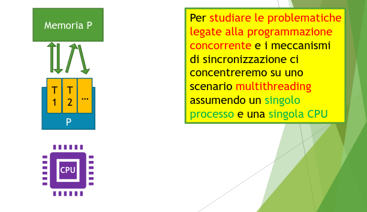

# Programmazione Concorrente

- Un programma concorrente contiene due o più processi (o sottoprocessi - threads) che lavorano insieme per eseguire una determinata applicazione.

- Ciascun (sotto)processo è un programma sequenziale
- I (sotto)processi comunicano tra loro utilizzando variabili condivise (shared memory) o scambiandosi messaggi (message passing).

**Astrazione:** I (sotto)processi sono in esecuzione contemporanea

- É un astrazione, potrebbe non essere così.

Nasce dalla necessità di far continuare l'esecuzione dei programmi durante lo svolgimento di (lunghe) operazioni di I/O

Negli anni '80, si diffondono sistemi operativi con preemptive multitasking

- Possibilità di mantenere attivi più programmi (o processi) contemporaneamente alteranandone l'esecuzione nel processore (interleaving).

- L'alternarsi dei programmi è sotto il controllo del sistema operativo.

- Richiede supporto hardware (interrupt programmabili)

## Sistemi multiprocessore

- Successivamente furono introdotti i sistemi multiprocessore, dtati di più CPU (e/o di CPU multi-core)

- I sistemi multiprocessore:

  - consentonon di eseguire diversi processi in parallelo (ossia, contemporaneamente su CPU)

  - consentono di eseguire le applicazioni (costituite da più processi) più velocemente rispetto all'esecuzione su singola CPU.

## Concorrenza VS Parallelismo

- **Concorrente:** 1 CPU e N taska contemporaneamente

- **Parallela:** N CPU ed N tasks

### Esecuzione non sequenziale

- Concorrenza e parallelismo sono accomunati da un aspetto:
- Esecuzione non sequenziale del programma
- Idealmente, ogni (sotto)processo che costituisce il programma ha un proprio program counter che avanza autonomamente.

- **Esempio** con due processi, ognuno con due comandi:
- _Processo P:_ p1, p2
- _Processo Q:_ q1, q2

Analizziamo i possibili comportamenti dell'esempio tramite un sistema di transizioni che è dato dalla semantica del linguaggio, descrive tutti i pssibili passi di computazione che il programma deve fare e tiene conto dei possibili interleaving dei processi.

<p align="center">
  
</p>

Il sistema di transizioni:

È non deterministico, così essendo, il on determinismo ASTRAE dal criterio usato dallo scheduler del sistema operativo per scegliere quale processo far avanzare (es. processi prioritari su altri).

Conoscendo lo scheduler si potrebbe concludere che alcuni cammini nel sistema di transizioni non sono in realtà realizzabili.

Il sistema di transizioni non fa assunzioni sullo scheduler (descrive tutte le esecuzioni possibili).

L'analisi fatta regge se assumiamo che le operazioni di assegnamento p1 e q1 siano atomiche.

- Elementari e non interrompibili.

### Il compilatore

Il compilatore traduce ogni singolo comando del linguaggio di alto livello in una sequenza di operazioni nel linguaggio macchina.

n = k + 1 =>
laod R1, k
add R1,#1
store R1, n

## Analisi al livello macchina

In pratica, l'interleaving ha luogo al livello del linguaggio macchina; e non del linguaggio di alto livello.

- Sono le operazioni assembler ad alternarsi, non i comandi del linguaggio di alto livello.

**Anche in caso di parallelismo l'hardware garantisce che al più un process per volta possa scrivere una certa locazione di memoria**

Quindi anche il parallelismo è riportato ad uno scenario di concorrenza.

- i processi possono operare in parallelo solo su locazioni di memoria distinte
- La concorrenza (interleaving) è un'astrazione che consente di fare motlo analisi dei programmi che varranno anche in situazioni di parallelismo.

- Come per lo scheduling del sistema operativo, anche le scelte operate dall'hardware saranno modellate tramite non determinismo nei sistemi di transazione.

Facciamo finta adesso che gli assegnamenti (del linguaggio di programmazione) siano operazioni atomiche.

Anche se ci sono cammini alternativi per raggiungere la soluzione, la soluzione rimane unica.

L'analisi ad alto livello non cattura tutti i comportamenti possibili.

Altro modo di effettuare la stessa simulazione è del comportamento di basso livello consiste nell'assumere nel linguaggio un'operazione di dereferenziazione esplicita delle varibili, è una soluzione meno realistica ma che cattura correttamente che cosa accade a livello più basso.

## Ricapitolando

Possiamo usare la concorrenza come astrazione che:

1. descrive il comportamento di processi tramite interleaving
2. formalizzandoli come sistemi di transizioni non deterministici
3. ottenuti dalla semantica del linguaggio di alto livello

`Questa astrazione:`

- Cattura anche aspetti di parallelismo
  in particolare sulle variabili globali condivise

- Cattura anche aspetti di interleaving a livello macchina
  - eventualmente aggiungendo variabili temporanee locali o esplicitando le operazioni di dereferenziazione

## Shared Memory vs Message Passing

Per coordirnare il lavoro del programma, è frequente che due o più (sotto)processi deabbano comunicare tra loro:

- Per sincronizzarsi in certi momenti
- Per scambiarsi dati

Due modi diversi per far comunicare processi:

- Shared memory
- Message passing

**Shared Memory:**
I processi (o thread, in questo caso) possono accedere alle stesse aree di memoria
e si sincronizzano e comunicano tra di loro scrivendo e leggendo variabili condivise.

**Message Passing:**
I processi accedono ad aree diverse della memoria, ma possono inviarsi messaggi e sincronizzarsi usando servizi di inter-process communication (IPC) messi a disposizione dal sistema operativo.

<p align="center">
  
</p>

## Necessità di meccanismi di sincronizzazione

Nel caso di thread questi meccanismi possono essere realizzati a livello di runtime del linguaggio di programmazione.

Nel caso di processi, deve necessariamente essere il sistema eoperativo a fornire servizi di sincronizzazione e comunicazione (i processi sono isolati l'uno dall'altro).

## Visione Astratta dell'hardware e dell'OS

<p align="center">
  
</p>

<p align="center">
  
</p>

## Noi studieremo su questo modello

<p align="center">
  
</p>

# Un modello di programmazione concorrente

Come si comporta un programma concorrente può essere descritto da un sistema di transizioni caratterizzato da interleaving e scelte non deterministiche.

Il sistema di transizioni è definito dalla semantica del linguaggio di programmazione.

Usando un modello potremo analizzare le problematiche di sincronizzare sul sistema di transizioni di un linguaggio semplice.

### Scelte di progettazione

- Thread con memoria condivisa
- thread eseguiti in modo concorrente con interleaving
- thread privi di identità
- la terminazione di un thread non è osservabile dal resto del programma.
- thread non possono essere forzati a terminare dall'esterno
- thread non restituiscono un risultato al termine

Modelleremo i thread come espressioni composte tramite un operatore di parallel composition: e1 | e2

- e1 ed e2 sono i thread eseguiti concorremente

Due o più thread concorrenti possono avanzare uno per volta.
La scela tra l'applicazione di (parallel1) e (parallel2) è non deterministica
La memoria è condivisa

<p align="center">
  
</p>

A causa dell'interleaving, il numero degli stati raggiungibili (dimensione del grafo) può crescere esponenzialmente rispetto alla dimensione del programma.

L'analisi delle proprietà del comportamento dei programmi concorrenti richiede di applicare opportuni metodi di analisi statica.

Bisogna introdurre un meccanismo di sincronizzazione, per evitare che un thread legga il valore mentre l'altro lo sta per modificare.
Rimanendo nel modello, introduciamo un meccanismo di mutua esclusione basata su "lock", che astrae i vari meccanismi presenti nei linguaggi di programmazione reali.

## Primitive di Mutua Esclusione (mutex)

Nel caso di thread concorrenti con shared memory, la primitiva di sincronizzazione di riferimento si basa sull'uso di meccanismi di locking.

- Servono per assicurare mutua esclusione per l'accesso alle locazioni di memoria condivise:
- un thread può assicurarsi per un pò di passi di essere l'unico ad accedere ad una certa locazione di memoria condivisa.
- Prevedono le primitive lock e unlock

**Come funziona**
Ad ogni area di memoria da condividere e da accedere in mutua esclusione è associato un mutex m:
un' entità astratta (un token, un testimone, ...)

- Prima di accedere all'area di memoria un thread T1 deve acquisire il mutex m eseguendo lock m:
- Se nessun altro thread T2 sta accedendo a quell'area di memoria, T1 procede
- In caso contrario, T1 si blocca in attesa che T2 (che aveva già acquisito il mutex m) lo rilasci eseguendo unlock m

La chiave per il funzionamento dei mutex è nel fatto che la primitiva lock può bloccare il thred.
Un uso coerente dei mutex in tutti i thread previene la possibilità di interleaving non desiderati.

Principi per un uso coerente dei mutex:

- Ad ogni locazione condivisa a cui accedere è associato un mutex (un mutex può esere associato a più locazioni).
- Prima di iniziare ad utilizzare la locazione, il thread fa lock sul mutex ad essa associato.
- Dopo aver terminato di utilizzare la locazione,il thread fa unlock sul mutex ad essa associato.

## Corse-graind vs fine-grained locking

**Esempi ESTREMI:**

- Unico mutex per tutte le locazioni (coarse-grained):
  l1,l2,... -> m

- Un mutex diverso per ogni locazione (fine-grained):
  l1 -> m1, l2 -> m2, ...

**Coarse grained** richiede meno lavoro al thread singolo ma blocca anche tutti gli altri che accedono ad allocazioni di memoria diverse.

**fine-grained:** sono preferibili ma hanno un altro problema ovvero il deadlock

### Deadlock

La situazione in cui il programma si blocca (definitivamente) a causa dell'uso improprio dei lock.

È dato da situazioni di attesa circolare, come quella vista nell'esempio precedente (A aspetta B intanto che B aspetta A).
È uno dei motivi per cui a volte le app in esecuzione si piantiano.

#### Risolvere i deadlock

3 strategie:

1. **Deadlock prevention** -> si stabiliscono regole controllabili staticamente (dal compilatore) sull'uso dei lock che garantiscono che i deadlock non si possano verificare.

2. **Deadlock avoidance** -> l'esecuzione del programma è monitorata dal supporto a runtime del linguaggio che si accorge di quando il programma sta per andare in deadlock e interviene cambiando l'ordine di esecuzione dei thread.

3. **Deadlock recovery** -> il programma viene lasciato libero di andare in deadlock ma se ciò accade il runtime del linguaggio se ne accorge e interviene per ripristinare uno stato senza deadlock.

#### Deadlock prevention: 2-phase locking (2PL)

Una disciplina sull'uso dei lock che previene i deadlock è il 2-phase locking (2PL)

Assume che esista un ordinamento dei mutex: m1,m2,...

Stabilisce che un thread che voglia acquisire e poi rilasciare un certo numero di mutex deve fare:

- i rispettivi lock in ordine crescente
- i rispettivi unlcok in ordine decrescente

Le sequenze di lock e unlcok devono essere eseguite completamente:

- non si può acquisire n mutex, rilasciarne solo una parte e acquisirne altri, neanche se si rispetta l'ordine.

# Costrutti di concorrenza nei linguaggi di alto livello

**Scopo:** imparare a ricondurre le primitive di sinconizzazione dei linguaggi di alto livello ai meccanismi di locking visti nel modello e comprendere il flusso di esecuzione di un programma concorrente scritto in un linguaggio di alto livello.

## Multithreading e Concorrenza in Java

Java è stato uno dei primi linguaggi a fornire costrutti di multithreading abbastanza semplici da utilizzare:

- Multithreading disponibile fin dalle prime versioni di Java.
  Modello originale, prevedeva che i thread abbiano:
- ognuno il proprio stack
- heap condiviso (shared memory)

- Lo scheduling era gestito con JWM
- Ora la JVM sfrutta i servizi i threading dell'OS
- Consente esecuzione parallela se sono disponibili più processori/core

Da Java 5 -> Concurrency API
Da Java 8 -> elementi di prog funzionale per usare lambda espressioni

### thread in Java

Un thread in Java è un oggetto di tipo Thread:

- deve contenere un metodo run() e si avvia con start()

```java
class Hello extends Thread {
	public void run() {
		System.out.println("Hello Thread!");
	}
}

class Main {
	public static void main(String[] args) {
		Thread t = new Hello();
		t.start();
	}
}

```

oopure crea un thread passandogli il task Runnable da eseguire

```java
class HelloRun implements Runnable {
	public void run () {
		System.out.println("Hello Runnable Thread");
	}

}

class Main {
	public static void main (String[] args) {
		Runnable r = new HelloRun();
		Thread t = new Thread(r);
		t.start();
	}
}
```

Facendo un uso basilare dei thread non c'è molta differenza tra estendere Thread ed implementare Runnable.

Inizializzare un thread ha un costo computazionale.
ALcune funzionalità avanzate della Concureency API consentono di gestire pool di thread.
Ad esempio: inizializzo 50 thread una volta per tutte e poi passo loro diversi (es. migliaia) di oggetti Runnable da eseguire.

## Lock e sincronizzazioni

In Java ogni oggetto dispone di un lock (mutex)

- È possibile eseguire un metodo in mutua esclusione acquisendo il lock sull'oggetto tramite il modificatore synchronized.

- L'esecuzione di un metodo "sincronizzato" è bloccante rispet ad altre chiamate dello stesso metodo o di altri metodi sincronizzati sullo stesso oggetto.

- Chiamate allo stesso metodo (d'istanza) su oggetti diversi non si bloccano tra loro.

## Coarse-grained vs fine-grained locking in Java

Il modificatore syncronized fa acquisire il lock per tutta la durata del metodo.

- Un metodo può essere molto lungo...
- È possibile che in realtà la parte critica di un metodo siano solo pochi comandi (o uno solo).

Il modificatore synchronized applica una strategia di locking coarse-grained:

- Per scoprire i costrutti di locking fine-grained vediamo un altro esempio ancora ...

Synchronized block = fine-grained locking

Le strutture dati synchronized sono thread-safe. Possono essere condivise e usate concorremente tra thread diversi senza rischi di interferenze.
Tutti i metodi nelle implementazioni di tali classi hanno il modificatore synchronized
SI usa quindi un unico lock per l'intera struttura dati.

Vector is thread safe while ArrayList no

Collections vengono usate per rendere thread safe le strutture unsafes

Generalemente L'api usa coarse-grained ma ci sono alcune strutture che usano fine-grained, vedi ConcurrentHashMap che ha un lock diverso per ogni bucket.
