# Programmazione a Oggetti

## Modularità programi

I linguaggi di programmazione supportano in vari modi la possibilità di modularizzare i programmi. Ad esempio:

- Sotto il profilo linguistico, con l'astrazione procedurale (possibilità di scomporre il problema in sottoproblemi da risolvere con specifiche procedure/funzioni)

Ad esempio:

- Sotto il profilo dei tipi di dato, con i tipi di dato astratti

```ocaml
module M1 : BOOL = struct
type t = unit option
let yes = Some()
let no = None
let choose v ifyes ifno =
  match v with
  | Some () -> ifyes
  | None -> info
end
```

Ad esempio:

- Sotto il profilo delle tecniche di compilazione ed esecuzione, con la compilazione separata e il linking.

<p align="center">
  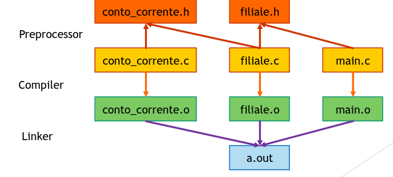
</p>

## Livello di astrazione

La possibilità di modularizzare i programmi consente di progettare e sviluppare un programma per livelli di astrazione.

Ad esempio:

- La libreria standard consente di scrivere un programma che opera su stringhe astraendo da (i.e. ignorando) come le operazioni su stringhe siano implementate.
- Per implementare un programma di gestione di banche:

1. Si implementano i moduli di gestione dei singoli conti correnti
2. Si passa a implementare i moduli di gestione di una filiale usando i conti correnti ma astraendo dalla loro implementazione
3. Si passa a implementare i moduli di gestione della rete di filiali usando il modulo della singola filiale, ma astraendo dalla sua implementazione.

Tutti i sistemi informatici complessi sono organizzati per livelli di astrazione. Ad esempio:

- Linguaggi di programmazione
  source code -> bytecode -> assembler

- Sistemi operativi
  applicazione -> sistema operativo -> hardware

- Protocolli di comunicazione su reti
  http -> tcp -> ip -> Ethernet

## Il paradigma a oggetti

- Sistema software = insieme di oggetti cooperanti
- Gli oggetti sono caratterizzati da:
  - uno stato
  - un insieme di funzionalità
- Gli oggetti cooperano scambiandosi messaggi

<p align="center">
  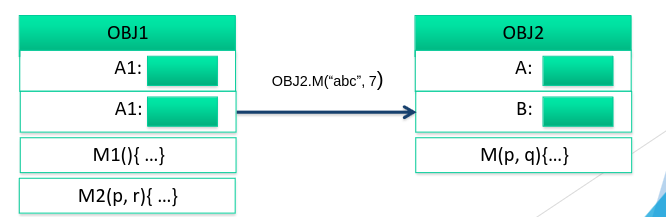
</p>

### Lo stato di un oggetto

Lo stato di un oggetto è solitamente rappresentato da un gruppo di attributi/proprietà/variabili

- Proprietà di incapsulamento
  Idealmente lo stato di un oggetto non dovrebbe essre accessibile dagli altri oggetti.

Un oggetto A non dovrebbe poter leggere/modificare le varibili che rappresentano lo stato di un altro oggetto B (information hiding)

Anzi, A non dovrebbe nemmeno aver bisogno di sapere come lo stato di B sia rappresentato (cioè, che variabili usa)...

### Lo stato del programma

Idealmente, in un linguaggio basato sul paradigma oop, lo stato del programma corrisponderebbe all'insieme degli stati degli oggetti che lo compongono.

- In aggiunta a questo, ci saranno le strutture dati di sistema necessarie per l'esecuzione del supporto a run-time (es. il run time stack)

### Le funzionalità di un oggetto

Le funzionalità di un oggetto sono solitamente rappresentate da un gruppo di metodi/funzionali che l'oggetto mette a disposizione degli altri oggetti.

I metodi descrivono il COMPORTAMENTO dell'oggetto:
ovvero, come un oggetto risponde ad un messaggio ricevuto da un altro, anche modificando il proprio stato o interagendo con altri oggetti.
Solitamente:
Invio di un messaggio codificato come chiamata di metodo
Risposta ad un messaggio codificato come restituzione del risultato

<p align="center">
  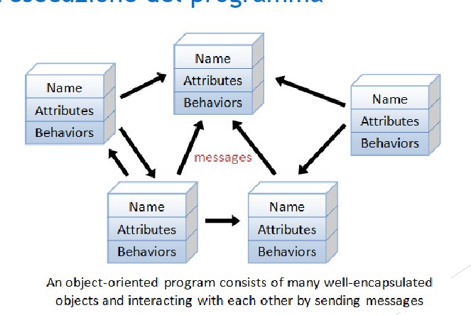
</p>

### Oggetti: caratteristiche

Oltre ad avere uno STATO e delle FUNZIONALITà, gli oggetti sono caratterizzati da:
Identità (nome che individua l'oggetto)
Ciclo di vita (creati, riferiti, disattivati)
locazione (memoria)

Rispetto al programma imperativo:
Differente struttura dei programmi (es. insiemi di classi)
Differente modello di esecuzione (es. memoria organizzata diversamente)

## OOP: Concetti

Oltre ad avere una notazione di oggetto, la programmazione object oriented introduce una serie di concetti importanti:

1. Incapsulamento e Astrazione (ragionare sul comportamento di un oggetto senza conoscerne la rappresentazione interna).

2. Interfaccia (che cosa un oggetto mette a disposizione degli altri)+

3. Ereditarietà (come un oggetto può fare proprie le funzionalità di un altro oggetto, ad esempio estendendolo)

4. Principio di sostituzione (quando un oggetto può essere usato al posto di un altro in maniera trasparente e controllata)

5. Polimorfismo (come un oggetto può processare altri oggetti indipendentemente anche di <<tipi>> diversi).

Questi sono concetti presenti in tutti i linguaggi object-oriented, ma che possono essre realizzati in modo diversi in altri linguaggi.

### Strutture linguistiche per oop

I linguaggi supportano i conceti dell'OOP come due approcci principali:

- Object-based
- Class-baed

### Approccio object based

1. Gli oggetti vengono trattati nel linguaggio in maniera simile ai record

2. I campi possono essere associati a funzioni

3. Una funzione in un oggetto può accedere ai campi dell'oggetto stesso tramite il riferimento this.

4. Javascript ad esempio consente inoltre di modificare la struttura dell'oggetto dinamicamente.

```javascript
let mario = {
  nome: "Mario",
  cognome: "Rossi",
  eta: 23,
  compleanno: function () {
    this.eta += 1;
  },
};

//aggiungo dinamicamente un nuovo metodo

mario.molesto = function () {
  return "Esci le tette";
};
```

Per creare un oggetto è anche possibile definire una funzione costruttore, da richiamare con `new`

```js
function Persona(n, c, e) {
  this.nome = n;
  this.cognome = c;
  this.eta = e;
  this.compleanno = function () {
    this.eta++;
  };
  this.nomeCompleto = function () {
    return this.nome + " " + this.cognome;
  };
}
anna = new Persona("Anna", "Rossi", 33);
console.log(anna.nomeCompleto()); // Anna Rossi
anna.compleanno();
console.log(anna.eta);
```

### Approccio Class based OOP

Un linguaggio class based prevede un concetto di <<classe>> a cui corrispondono determinati costrutti linguistici.

Una classe definisce il contenuto (variabile e metodi) degli oggetti di un certo tipo.

Gli oggetti vengono creati successivamente come istanze di una certa classe.

```js
class Persona {
  constructor(n, c, e) {
    this.nome = n;
    this.cognome = c;
    this.eta = e;
  }
  compleanno() {
    this.eta++;
  }
  nomeCompleto() {
    return this.nome + " " + this.cognome;
  }
}
rosa = new Persona("Rosa", "Bianchi", 25);
console.log(rosa.nomeCompleto()); // Rosa Bianchi
rosa.compleanno();
console.log(rosa.eta);
```

### Object based vs Class based

**L'approccio object-based:**
Consente al programmatore di lavorare con gli oggetti in modo flessibile:

1. Non è necessario scrivere il codice della classe prima di creare un oggetto
2. Si può creare tante vsrianti di un oggetto (con metodi diversi ad esempio) senza bisogno di scrivere ogni volta una classe diversa.

Però

Rende difficile predire con precisione quello che sarà il tipo d un oggetto.

1. La struttura dell'oggetto può cambiare a tempo di esecuzione
2. Ostacolo i controlli di tipo statici.

**L'approccio class-based**
Richiede al programmatore una maggiore disciplina:

1. Deve implementare le classi prima di creare un oggetto

Consente di fare controlli di tipo statico sugli oggetti

1. Il tipo di un oggetto sarà legato alla classe da cui è stato istanziato
2. Prende il nome di nominal typing

È una scelta di design del linguaggio di programmazione:

1. Dipende da che tipo di utilizzo ci si aspetta sia fatto del linguaggio di programmazione in questione.

### Inheritance e subtyping

La scelta tra object-based e class-based ha un impatto significativo sui meccanismi di ereditarietà e (sotto)tipatura del linguaggio:

- Prototype-baed inheritance (obj) vs class-based inheritance (class)
- Structural (sub)typing (obj) vs nominal (sub)typing (class)

L'eriditarietà è una funzione realizzata tramite opportuni costrutti linguisitci che consente di definire una classe sulla base di un altra esistente

**obj**
I linguaggi object baed per ogni oggetto mantengono una lista di prototipi che sono tutti gli oggetti da cui esso eredità funzionalità.

La gestione dei prototipi nel programma diventa complicata fast.

**class**
I linguaggi class based consentono di definire una classe come estensione dell'altra.

La nuova classe eredita tutti i memmbri (valori e metodi) della precedente, con la possibilità di aggiungerne altri

---

I meccanismi di inheritance inducono nozioni di sottotipo tra oggetti.

**Idealmente**, un oggetto B che è estensione di un altro oggetto A dovrebbe poter essere usato dovunque si possa usare A.

- un oggetto che descrive studente dovrebbe poter essere usato ovunque sia richiesto un oggetto che descrive genericamente una persona

### Structural subtyping

I linguaggi object-based solitamente usano una nozione di **subtyping strutturale**:

- Un oggetto B è sottotipo di un oggetto A se contiene almeno tutti membri
  <<pubblici>> (varibiabili e metodi utilizzabili dall'esterno ... vedremo) che sono presenti anche in A.

- Uno studente è sottotipo di una persona perchè contiene tutto quello che c'è in persona e anche di più

### Nominal subtyping

I linguaggi class-based solitamente usano una nozione di subtyping nominale:

- Il tipo di un oggetto corrisponde alla classe da cui è stato istanziato

- Il nome della classe diventa il nome del tipo

- Un tipo-classe B è sottotipo di un tipo-classe A, la classe B è stata definita (sintatticamente) come estensione della classe A.

- Vale la proprietà transitiva: se C estende B e B estende A, allora C è sottotipo di B e anche di A.

- Uno studente è sottotipo di una persona perchè Studente extends Persona

### Structural VS Nominal Subtyping

**Structural Subtyping** è più flessibile

- Non è necessario dire esplicitamente chi estende chi

- Favorisce il polimorfismo (la relazione di sottotipo è più debole, quindi ci sono più oggetti l'uno il sottotipo dell'altro)

**Nominal Subtyping** è più rigoroso esplicitando i vincoli del programmatore.

- Mette in relazione di sottotipo solo classi che il programmatore ha esplicitamente dichiarato essere in questa relazione (con `extends`)

- È più semplice da verificare per l'interprete (devo solo controllare se una classe è nominata nella lista degli antenati dell'altra ... non serve un confronto del contenuto delle due classi).

### Esempi

- Javascript adotto lo structural subtyping
- Java è un linguaggio class-based e adotta il nominal subtyping
- OCaml è un linguaggio in cui gli aspetti di ereditarietà sono trattati con costrutti linguistici class-based (extends), ma adotta lo structural subtyping

## Uno sguardo all' OOP in Ocaml

- Un oggetto in OCaml è un valore costituito da campi e metodi

- Sebbene esistano costrutti linguistici per la definizione di classi, gli oggetti possono essere creati direttamente senza prima specificare una classe (come in JS)

- Il tipo di oggetto è dato dai metodi che esso contiene (i campi non influiscono sul tipo).

<p align="center">
  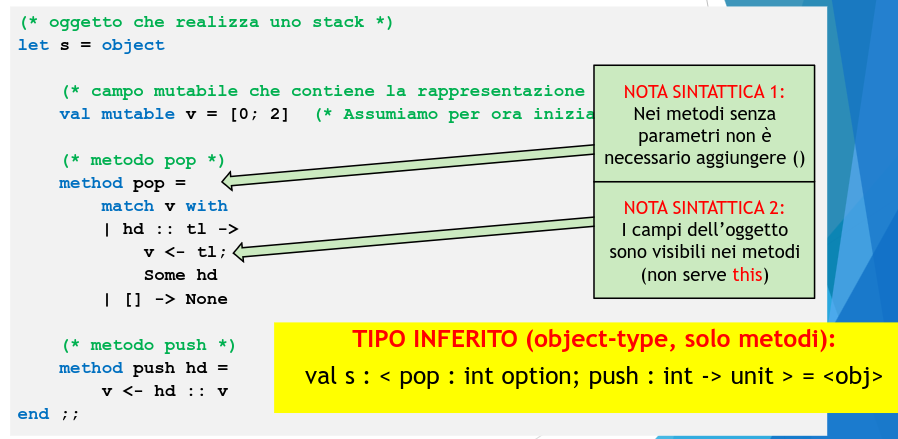
</p>

<p align="center">
  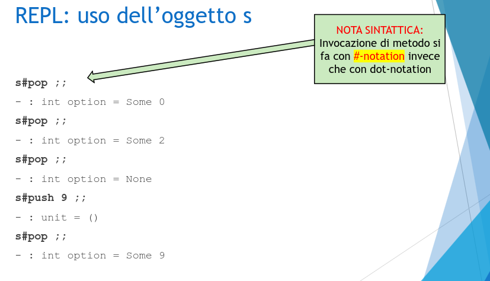
</p>

#### Digressione: Type weakening

Se nell'oggetto `s` inizializziamo `v` come lista vuota, il tipo inferito contiene variabili di tipo, ma non è veramente polimorfo...

- Benchè sia mutabile, la variabile v non potrà avere tipi diversi in momenti diversi dell'esecuzione.

- L'oggetto s dovrebbe avere tipo:

`<pop: t option; push : t -> unit >` per qualche tipo concreto t

Questo tipo concreto non è però noto al momento della dichiarazione della varibile mutabile, quindi il type checker indebolisce temporaneamente il tipo inferito includendo delle variabili di tipo.

Appena possibile (al primo utilizzo) il tipo di s sarà ricalcolato andando ad istanziare definitivamente la variabile provvisoria con un tipo concreto.

### Costruzione di oggetti tramite funzioni

Gli oggetti possono essere costruiti tramite funzioni

<p align="center">
  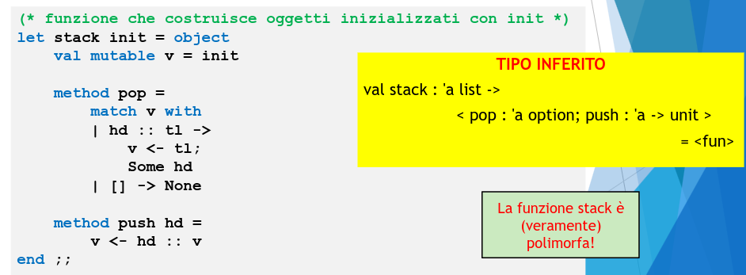
</p>

<p align="center">
  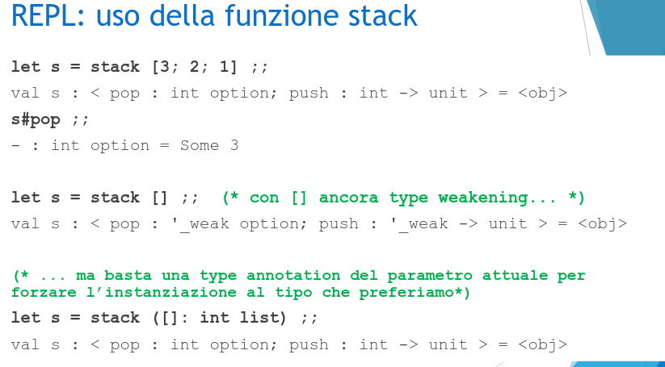
</p>

Con il type weakening basta una type annotation per forzare l'instanziazione al tipo che preferiamo.

#### Polimorfismo di oggetti

Quando si definisce una funzione che prende un oggetto come parametro, il tipo dell'oggetto viene inferito dai metodi che sono invocati a partire dall'oggetto.

- Indipendentemente dal fatto che l'oggetto sia già stato definito o meno!

<p align="center">
  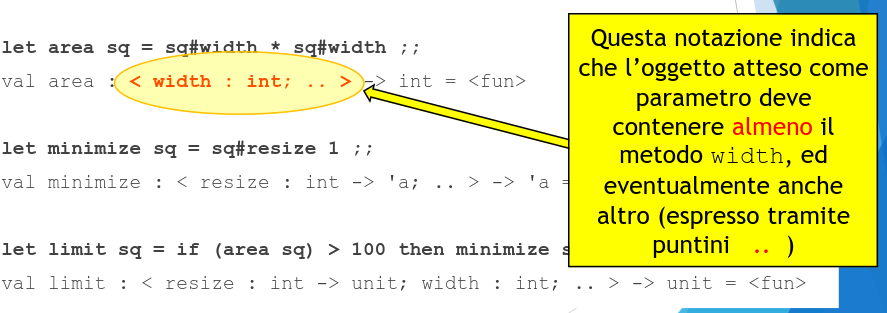
</p>

### Polimorfismo di oggetti: structural subtyping

Si applica la regola di subsumption

<p align="center">
  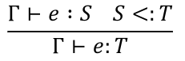
</p>

che consente di tipare un'espressione con un suo supertipo.

Ad esempio, abbiamo:

`< color: string;
    resize: int -> unit
    width: int>`

Grazie a cui, nel nostro esempio, possiamo derivare:

`Γ ⊢ 𝑞𝑢𝑎𝑑𝑟𝑎𝑡𝑜: < width : int >`

e concludere che l'oggetto quadrato può essere passato ala funzione area. Lo stesso vale per le funzioni minimize e limit.

La notazione con i puntini

`< width : int, .. >`

usata dall'interprete OCaml nell'inferire il tipo del paramentro formale di area enfatizza lo structural subtyping.

La funzione accetta un qualunque sottotipo di `< width : int>`, ossia qualunque oggetto che contiene almeno il metodo width.

Rappresenta una nuova forma di polimorfismo (di oggetti)

I puntini .. possono essere considerati come una variabile di tipo istanziabile con una lista di metodi da aggiungere a width.

### Coercion di tipi oggetto

Al di là del passaggio dei parametri a una funzione, ci sono numerose altre situazioni il subtyping degli oggetti si rende utile.

Supponiamo di definire i seguenti tipi di oggetto (tramite type):

`type shape = <area : float>`

`type square = <area : float; width: int>`

È chiaro che square sia un sottotipo di `shape` (contiene di metodi in più), quindi è lecito pensare che ovunque si possa usare un oggetto di tipo `shape` si possa utilizzare al suo posto un oggetto di tipo `square`.
(PRINCIPIO DI SOSTITUZIONE).

Facciamo una prova ... definiamo funzioni costruttore per i due tipi:

```ocaml
(* costruttore di oggetti di tipo shape *)
let shape (a:float): shape = object
method area = a
end ;;
(* costruttore di oggetti di tipo square *)
let square (w:int): square = object
method area = (float_of_int) (w * w)
method width = w
end ;;
```

se proviamo ad aggiungere square a shape non funziona, dobbiamo usare una:

**type coercion (conversione di tipo)** esplicita, tramite l'operatore `:>`

```ocaml
let lis2 = ( square 5 :> shape) :: lis1;;
```

la type coercion `e :> t` forza il type checker a trattare l'espressione `e` come fosse di tipo `t`.

- `t` deve essere un tipo più generale (un supertipo, con metodi in meno del tipo vero di `e`).

## Polimorfismo di oggetti VS Principio di sostituzione

Questo esempio mostra che i due concetti di:

- **polimorfismo di oggetti:**
  (es. una funzione che prende oggetti almeno di un certo tipo)

- **principio di sostituzione:**
  (es. un oggetto di un tipo più specifico può essere usato ovunque serva un oggetto di un tipo più generale).

  sebbene tra loro collegati, vengono trattati in OCaml in due modi diversi, infatti per il secondo è necessaria la type coercion esplicita.

Questo perchè sempre il type checker di OCaml, come già visto con i tipi primitivi, non effettua conversioni di tipo implicite.

### Type coerction di oggetti: OCaml VS JAVA

Vedremo che in Java sarà possibile fare delle type coercions da un supertipo a un sottotipo (es. trasformare shape in sqaure).

- Questo però sarà reso possibile tramite controlli dinamici di tipo svolti a runtime dall'interprete della JVM (resi più facili dal nominal subtyping).

<p align="center">
  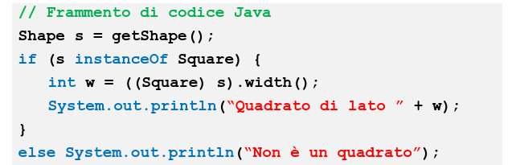
</p>

### Classi (e costrutti liguistici per l'ereditarietà)

- Abbiamo visto che OCaml consente di lavorare direttamente con gli oggeti (in stile object-based).

- Punti di forza di OO è l'ereditarietà.

- Abbiamo visto in Javascript che realizzare meccanismi di ereditarietà lavorando direttamente con gli oggetti richiederebbe di usare tecniche tipo i prototipi, il cui funzionamento è complicato.

- Ocaml quindi introduce le classi.

#### Classi

Intuitivamente, una classe è la ricetta che descrive come creare oggetti di un certo tipo.

- una classe si definisce con `class` e si istanzia con `new`

<p align="center">
  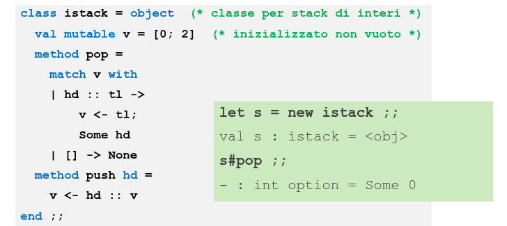
</p>

Una classe può prevedere parametri:

1. di costruzione (es. init) che vanno passati al momento dell'istanziazione
2. di tipo (es. 'a) che la rendono polimorfa

<p align="center">
  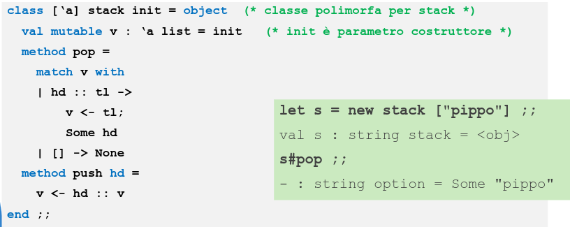
</p>

### Classi e tipi oggetto

La definizione di una classe introduce anche un tipo con lo stesso nome,

- Si tratta però solo di un `alias` del tipo-oggetto che si otterrebbe costruendo gli oggetti direttamente.

<p align="center">
  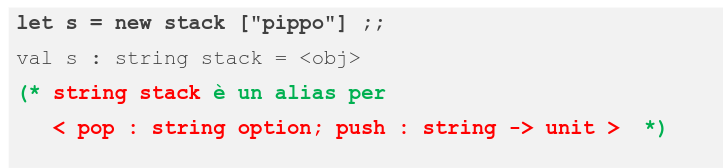
</p>

### Ereditarietà

<p align="center">
  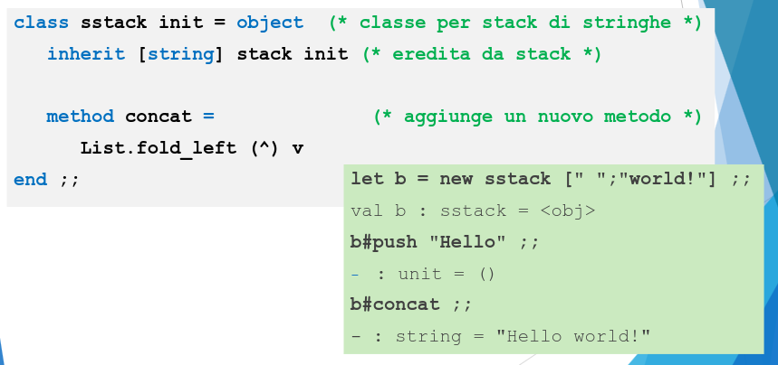
</p>

#### Overriding

<p align="center">
  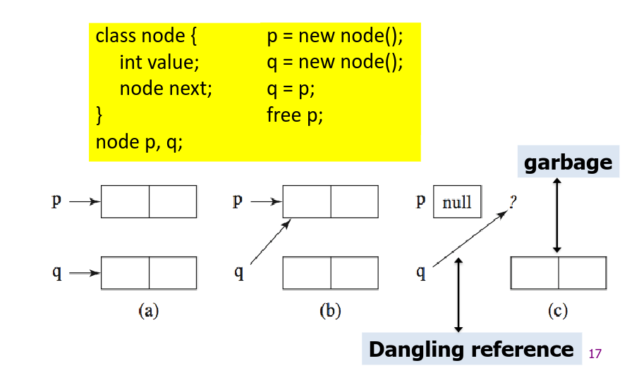
</p>
