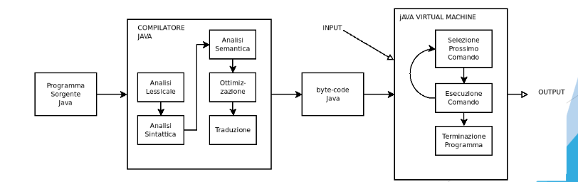
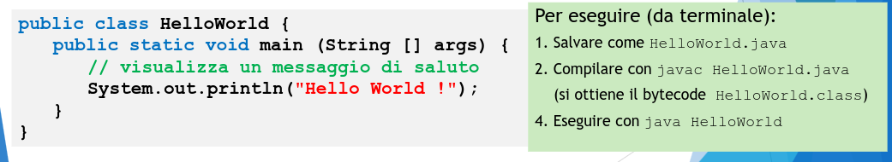
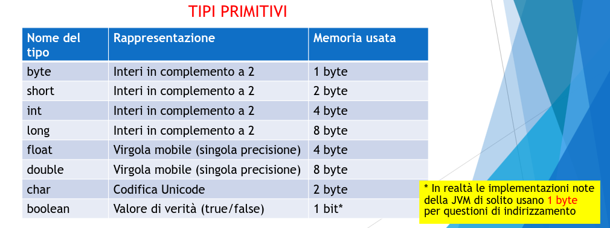
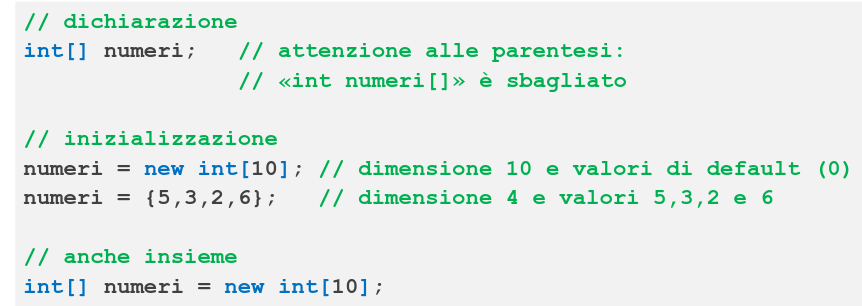
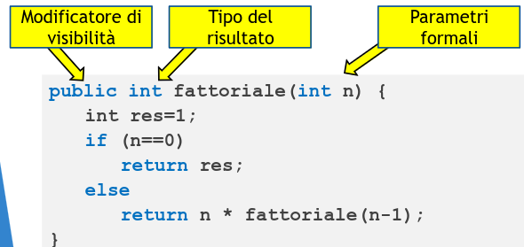

# Introduzione a Java

Gli obiettivi di `Java`:

1. Semplificare la programmazione

2. Indipendenza della piattaforma

3. Modularizzabilità

4. Robustezza e sicurezza

## Approccio: Compilazione + interpretazione

Si è scelto un approccio di compilazione + interpretazione, con un bytecode intermedio.

- Il bytecode è utilizzabile in ogni architettura per cui sia disponibile la JVM, senza ricompilare.

- Consente controlli statici (compilatore) + dinamici (interprete)

  

## Struttura di un programma Java

Il programma java è un insieme di classi:

- in linea di principio, ogni classe in un file diverso (con lo stesso nome della classe ed estensione .java)

- una classe dovrà avere un metodo main da cui parte l'esecuzione del programma

  

## Nucleo imperativo

Il corpo dei metodi è codice imperativo con una sintassi molto simile a C

  

**ATTENZIONE:** Esiste un tipo String per rappresentare le stringhe. Non è un tipo primitivo (`String` è una classe di libreria) ma è gestito in modo speciale.

Le String hanno tipo String e si possono concatenare con + come se String fosse un tipo primitivo

**Espressioni:** come in C, ma con aggiunta `true` e `false`

**Comandi:** assegnamenti, blocchi, condizionali e cicli come in C

**Dichiarazioni di variabili:**

- Le variabili locali devono essre dichiarate e inizializzate prima di poterle usare (controllo statico).

- Non è possibile ridichiarare in un blocco una variabile già dichiarata in un blocco più esterno (no shadowing)

- Non esistono variabili globali (var visibili a livello di classe ma non di intero programma).

**ARRAY:**

  

**PUNTATORI:**

- NON CI SONO! (ma ci sono riferimenti agli oggetti)

- A differenza del C, gli array possono quindi essre acceduti solo tramite l'indice, e non trattandoli come puntatori.

- A `run-time`, prima di accedere ad un array, la JVM controlla che l'indice sia compreso tra 0 e length-1, altrimenti solleva un eccezione di tipo `ArrayIndexOutOfBounds`

**FUNZIONI:**
Si usano i metodi (che possono essere ricorsivi, anche mutuamente)

  

Si possono definire anche funzioni anonime anche se il loro funzionamento è particolare.

## Classi

- Una classe consiste di variabili e metodi, e può prevedere uno o più costruttori per inizializzare le variabili.

- **Principio di astrazione:** ogni tipologia di entità identificabile nel programma caraterizzata da un comportamento autonomo dovrebbe corrispondere a una classe diversa.

- **Principio di composizionalità:** Se non modifichiamo l'interfaccia pubblica di una classe possiamo modificare e ricompilare la classe senza compromettere il resto del programma.

## Incapsulamento

I modificatori public e private consentono di realizzare meccanismi di INCAPSULAMENTO.

- La rappresentazione dell'oggetto rimane nascosta

- L'accesso dall'esterno è consentito solo tramite un certo numero di metodi pubblici.

- Dall'esterno si potrebbe non conoscere la rappresentazione

- Possibile definire metodi privati

## Interfacce

L'interfaccia pubblica di una classe può essre esplicitata usando uno specifico costrutto del linguaggio JAVA:

- Le **Interfacce**

Una interfaccia in Java contiene una specifica astratta della classe: indica quali membri pubblici la classe deve contenere.

- Rende le classi una sorta di Abstract Data Type (ADT)

## Tipo Apparente vs Tipo effettivo

Il compilatore fa i suoi controlli statici sul tipo apparente in quanto il tipo effettivo potrebbe non essere noto a tempo di compilazione.

Si potrebbe forzare il compilatore con un type cast

Il **cast (coercion)** tra due classi, due interfacce o classe/interfaccia si può fare solo se tra le due esiste una relazione di sottotipo.

- Cioè, una esplicitamente implementa o estende l'altra.

- Nominal Subtyping, non conta la struttura, conta il nome dopo 'implements/extends'

La conversione da sottotipo a supertipo (upcast) è implicita: non è richiesto cast

La conversione da supertipo a sottotipo (downcast) : richiede un cast esplicito.

## Implementare più interfacce

Nulla vieta di implementare più interfacce per una singola classe.

## Membri statici e d'istanza

Abbiamo visto che il main è un metodo statico:

- Può essere richiamato anche se non sono ancora stati istanziati oggetti della classe che lo contiene.

Distinguiamo:

- membri (var e metodi) d'istanza: codificano lo stato di ogni singolo oggetto e implementano operazioni che lavorano su tale stato

- membri (var e metodi) statici: codificano informazioni e operazioni di classe, ossia variabili condivise tra tutti gli oggetti che sono istanze di quella classe e metodi che non operano sullo stato dei singoli oggetti.

### Membri d'istanza

operativamente:

1. var d'istanza è presente in memoria in tante copie quanti sono gli oggetti.

2. metodo d'istanza: è richiamato su un oggetto e può accedere sia alle variabili d'istanza che a quelle statiche

### Membri statici

1. variabile statica: è presente una sola volta in memoria, anche prima che sia creato il primo oggetto di quella classe

2. metodo statico: può accedere solo alle variabili statiche e può essre richiamato anche se non ci sono oggetti di quella classe

## Modello della memoria

Abbiamo 3 main areas:

1. **L'ambiente delle classi** che contiene il codice dei metodi e le variabili statiche (di classe).

2. **Lo stack** che contiene i record di attivazione dei metodi con le variabili locali.

3. **Lo Heap** che contiene gli oggetti (raggiungibili tramite riferimenti) con le loro variabili d'istanza

## Riferimenti

Gli oggetti creati con new, diventano accessibili tramite riferimenti memorizzati nelle variabili locali.

Il meccanismo dei riferimenti agli oggetti funziona come in JS.

Possono verificarsi situazioni di ALIASING!
Un oggetto può rimanere orfano. In questo caso arriva il GC a liberare la memoria
