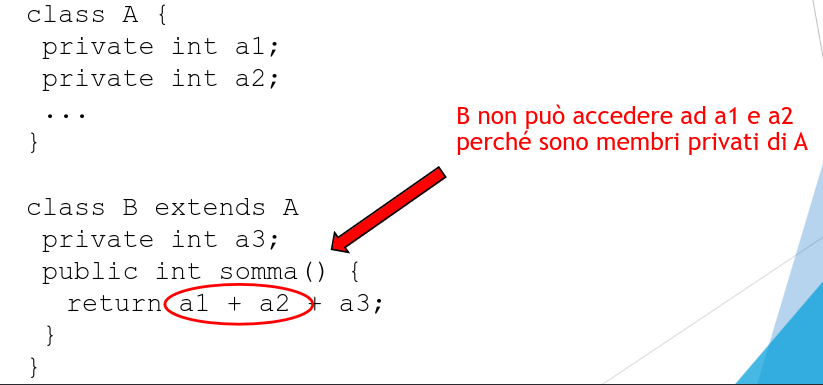
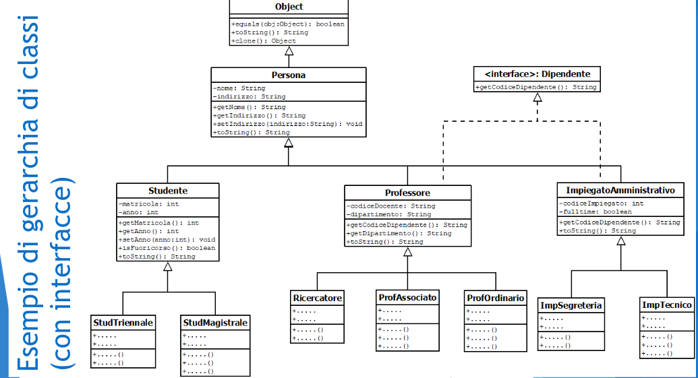
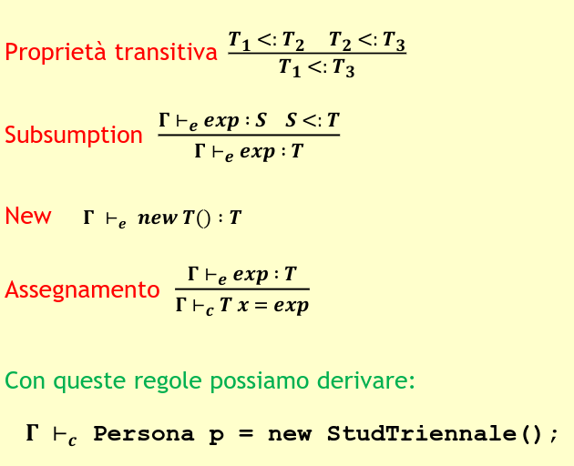
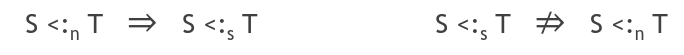

# Ereditarietà e Dynamic Dispatch

## Ereditarietà per estensione

si usa extends

In questo caso A è super-classe mentre B è sotto-classe

**Osservazione:**
Java si basa su ereditarietà singola (o semplice)
Una classe può implementare più interfacce, ma può estendere una sola super-classe.

Altri linguaggi tipo C++ prevedono ereditarietà multipla

## La classe Object

Una classe che non estende altre classi, implicitamente estende la classe di defualt Object.

Object mette a disposizioni metodi assunti essere presenti in tutte le classi tipo

- toString()
- equals(obj)
- clone()

Tra i metodi di Object, è importante sottolineare equals

- Consente di confrontare due oggetti dal punto di vista dei contenuti!
- Ogni classe può ridefinrie il metodo equals in modo da realizare un confronto sensato per il tipo di dato rappresentato dalla classe.
- Confrontare gli oggetti con == corrisponde invece a valutare se i riferimenti a quegli oggetti sono uguali (cioè, alias)

**String è speciale**:

- I valori letterali ("abcd") sono trattati ne linguaggio coem degli oggetti, ma IMMUTABILI.

- I metodi di String non modificano gli oggetti, ma ne restituiscono sempre dei nuovi come risultato.

- Il compilatore riconosce valori letterali uguali nel codice e ottimizza il codice costruendo l'oggetto corrispondente una volta sola:

```java
String s1 = "ciao";
String s2 = "ciao";
System.out.println(s1 == s2);
```

## Modificatori di visibilità e sotto-classi

Le regole di visibilità legate ai modificatori public e private valgono anche tra super-classe e sotto-classe.

<p align="center">
  
</p>

puoi usare protected invece di private se vuoi che le var siano 'visibili' dalle sotto-classi.

## Classi astratte

In una gerarchia di classi, può avere senso avere delle classi parzialmente definite.

una classe astratta è quindi una classe che contiene almeno un metodo astratto, ossia presente nella classe ma non implementato (come nelle interfacce)

- Una classe astratta non può essere istanziata
- Una classe astratta può essere estesa da una classe che si occupi di implementare i metodi astratti.

Ha lo scopo di definire un oggetto comune a più classi fornendo anche l'implementazione di alcuni metodi comuni.

## Gerarchia di classi e polimorfismo

Il costrutto extends quindi consente di creare una gerarchia di classi rappresentabile come un albero la cui radice è Object.

In Java ad ogni classe è associato un tipo di oggetto.

- Nominal Subtyping implica che la gerarchia di classi è una rappresentazione della relazione di sottotipo <: il cui elemento "Top" è Object.

- La regola di subsumption del sistema di tipi automaticamente ci consente di ottenere un meccanismo di polimorfismo per sottotipo.

<p align="center">
  
</p>

<p align="center">
  
</p>

## Teorema

Sia <: la relazione di tipo inferita dalla gerarchia di classi di Java. Per ogni coppia di classi S e T tale che S <: T, ogni membro pubblico di T è anche membro pubblico di S.

La dimostrazione segue dalla definizione di extends e implements e della transitività di <:

**Conseguenza**
_Structural subtyping_ <: è una relazione più debole del _Nominal Subtyping_

<p align="center">
  
</p>

## Overloading, overriding e dynamic dispatch

Che succede quando invochiamo un metodo su un oggetto?

Innanzitutto la chiamata deve superare i controlli statici del compilatore.

Il metodo deve essere presente nella classe che descrive il tipo apparente dell'oggetto, ossia quello della dichiarazione.

I parametri attuali devono essere compatibili con il tipo dei parametri formali del metodo.

## Overloading dei metodi

In una classe Java si possono definire più metodi con lo stesso nome (overloading di metodi)

I metodi in overloading devono avere FIRME DIVERSE

Se il metodo non viene trovato si ha un errore in fase di compilazione.
Si potrebbe risolvere con un downcasting esplicito.

**Non si può fare cast tra tipi di oggetti che non siano in relazione di sottotipo**

## Dynamic Dispatch

La JVM va alla ricerca del metodo partendo dalla classe corrente e risalendo la gerarchia.

Quindi superati i controlli di tipo statici, a tempo di esecuzione, la chiamata del metodo può trovarsi o nella classe dell'oggetto o nelle superclassi.

La ricerca parte dalla classe che corrisponde al TIPO EFFETTIVO dell'oggetto.

La JVM trova l'indicazione sul tipo effettivo nel descrittore del dato (oggetto) in memoria, inizializzato al momento della creazione dell'oggetto.

Visitare l'albero della gerarchia di classi ad ogni chiamata di metodo è una soluzione molto inefficiente.

JVM adotta una soluzione che si basa su:

1. tabelle di metodi (dispatch vector), ovvero tabelle con puntatori al codice dei metodi.

2. Sharing strutturale, la tabella di una sottoclasse riprende la struttura della superclasse aggiungenfo righr per i nuovi metodi.

In questo modo il dynamic dispatching si può risolvere staticamente.

1. Il compilatore determina l'offset del metodo nella tabella

2. l'offeset è determinato sul tipo apparente dell'oggetto

3. a tempo di esecuzione la JVM accede alla tabella della classe che è tipo effettivo usando quell'offset

4. anche se il tipo effettivo dovesse essere diverso da quello apparente, corrisponderà comunque ad una sua sottoclasse, e grazie allo sharing strutturale, la JVM accedrà comunque al metodo giusto

5. se la sottoclasse ha fatto overriding del metodo, il puntaotre che si troverà in tabella riferirà alla nuvoa versione del metodo.

Niente visita all'albero delle classi
Accesso diretto tramite offset e puntatore

## Overriding

Risalendo la gerarchia si potrebbero incontrare più metodi con la stessa firma, in questo caso la JVM esegue il primo metodo che incontra.
