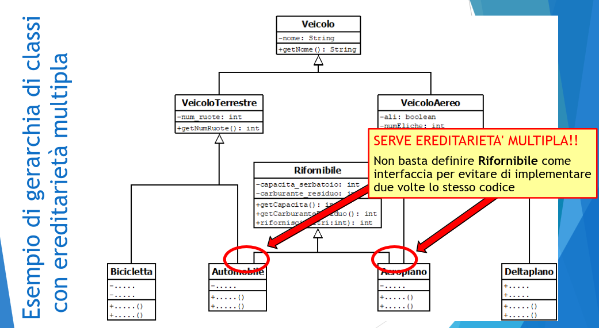
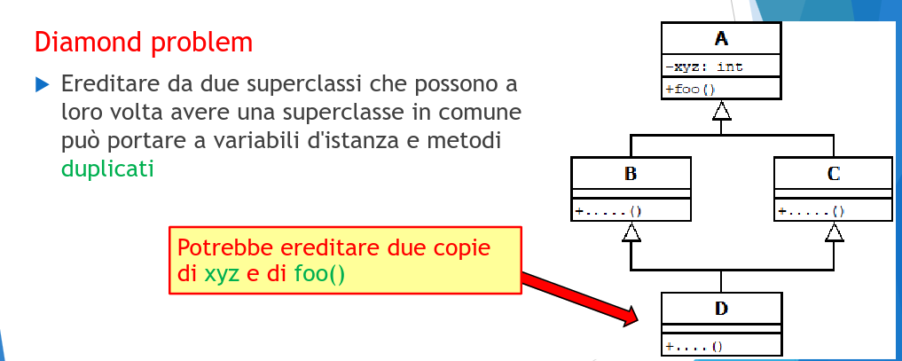
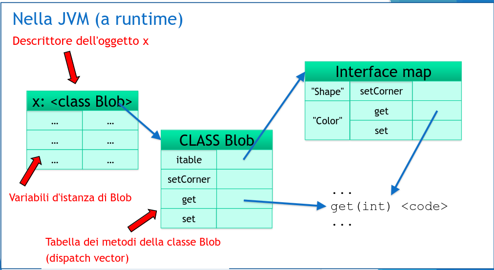
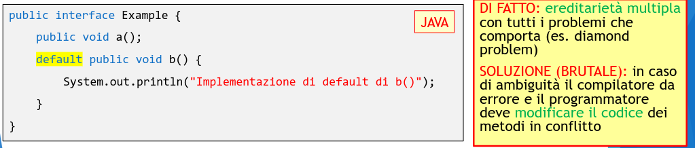
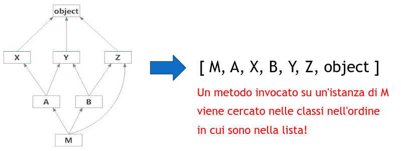

# Multiple Inheritance (e mixins)

In Java, una classe può estedere solo un altra classe.

Estendere più classi è permesso in linguaggi come C++

**Esempio**

  

## Perchè l'ereditarietà multipla è un problema?

Apre la possibilità di ereditare diverse implementazioni dello stesso metodo.

**Diamond problem**

Ereditare da due superclassi che possono a loro volta avere una superclasse in comune può portare a variabili d'istanza e metodi duplicati

  

## Multiple Inheritance nei linguaggi class-based

Diverse soluzioni disponibili.

Queste due richiedono controlli statici:

- `C++` : ereditarietà multipla e possibilità di disambiguare.

- `Java` : Interface per definire supertipi senza definire superclassi.

Questa di Python no:

- `Python` : linearizzazione della gerarchia di classi (algoritmo C3)

_Cambio di prospettiva_ : `Dart (e altri)` : composizione di classi (mixin) al posto di ereditarietà

- `viirtual inheritance:` crea un'unica copia dei "sub-objects" comuni.

## Osservazioni sulla soluzione di C++

**Vantaggi:** C++ supporta l'ereditarietà multipla senza restrizioni.

**Svantaggi:** Il programmatore deve essere consapevole di quello che fa.

**Prestazioni:**

- l'ereditarietà con repiclazione (non virtual) consente un accesso ai metodi in tempo costante ma richiede di far attenzione a non cascare nel diamond problem.

- l'ereditarietà con condivisione (virtual) risolve il diamond problem, ma ha un overhead (per questo C++ lascia questa possibilità come opzione e non default).

## Inheritance in Java

Ereditarietà singola + implementazione multiple di interfacce.

Il meccanismo di `dispatch vector` e dello `sharing strutturale` consentono di:

- determinare la posizione del puntatore al metodo anche quando il tipo apparente (statico) è un supertipo del tipo effettivo (dinamico).

- eseguire il dispatching dei metodi in tempo costante.

**Lo sharing strutturale non si può usare se la classe implementa più di una interfaccia**

Per gestire tale occorrenza, Java usa una tabella delle interfacce (itable).

- Ogni classe ha un itable con dentro i dispatch vectors di tutte le interfacce implementate

- La itable contiene una copia dei link al codice edi meotdi implementati

- Se il tipo apparente dell'oggetto è quello della classe, la chiamata del metodo si svolge normalmente (`invokevirtual` nel bytecode).

- Se il tipo apparente dell'oggetto è quello dell'interfaccia, il compilatore compila il codice in modo che il metodo sia raggiunto tramite la itable (`invokeinterface` nel bytecode).

  

## Osservazioni sulla soluzione di Java

**Vantaggi:** la soluzione adottata da Java per la gestione delle interfacce è completamente trasparente al programmatore

**Svantaggi:** Java consente un uso limitato di meccanismi di ereditarietà.

**Prestazioni:**

1. L'accesso ai metodi tramite itable può essere poco efficiente se la classe implementa varie interfacce

2. I meccanismi di caching migliorano le prestazioni dopo il primo accesso.

## Interfacce e default methods

**Problema:** in Java 8 per estendere le api con lambda espressioni senza compromettere i vecchi programmi, è stata introdotta la possibilità di aggiungere implementazioni di default dei metodi nelle interfacce!

  

## Il lavoro del compilatore

Le soluzioni di C++ e Java richiedono una fase di compilazione:

1. per controllare staticamente che le chiamate ai metodi non siano ambigue

2. per generare correttamente le strutture dati del runtime (dispatch vector/vtable e itable di ogni classe).

## E per i linguaggi interpretati (senza compilazione)?

In assenza di compilazione, la gestione dell'ereditarietà nel runtime non può basarsi su tabelle dei metodi precostruite.

- Per trovare il codice di un metodo ereditato è necessario risalire l'albero della gerarchia di classi.

- `Ma:` in caso di ereditarietà multipla la gerarchia è descritta da un grafo, non da un albero.
- Cammini di risalita diversi possono portare a implementazioni diverse dello stesso metodo.

## Method Resolution Order (MRO) in Python (accenno).

Il linguaggio `Python` usa il metodo di linearizzazione della gerarchia di classi per risolvere il problema del dispatching dei metodi con multiple inheritance e senza compilazione.

  

Il calcolo di MRO si basa sull'algoritmo C3, che garantisce:

1. determinismo (unico ordinamento)

2. conservazione dell'ordinamento locale (se una classe estende c1, c2,...cn; l'ordinamento calcolato dovrà prevedere queste classi in quest'ordine).

3. monotonia (se c1 è sottoclasse di c2, nell'ordiamento calcolato c1 dovrà venire prima di c2).

**Osservazioni:**

- Esistono gerarchie di classi non linearizzabili (errore a runtime)

- Il programmatore dovrà essere consapevole di quale versione di un metodo chiamato verrà eseguita in base all'ordinamento.

- in fase di sviluppo è utile impostare le classi è chiamatr mro() per saper quale sarà l'ordine di linearizzazione

## Riassumendo…

L'ereditarietà multipla è una funzionalità utile, ma complicata da realizzare

 La soluzione adottata in C++ è ottimale, ma richiede che il programmatore sia ben consapevole (per capire quando usare virtual)

 La soluzione di Java (prima di Java 8, con interfacce "tradizionali") è più semplice, ma non è vera ereditarietà multipla

 Le interfacce con implementazioni di default dei metodi (Java 8) sono frutto di un compromesso nello sviluppo del linguaggio (per consentire l'introduzione di elementi di programmazione funzionale) ed è meglio usarle con cautela…

 Approcci di linearizzazione della gerarchia (es. Algoritmo C3 di Python) sopperiscono all'assenza di una fase di compilazione, ma rendono la chiamata di metodi poco efficiente (bisogna visitare la gerarchia linearizzata)

 Gli approcci basati su composizione (mixin) rappresentano una valida
alternativa che potrebbe trovare diffusione nel prossimo futuro
