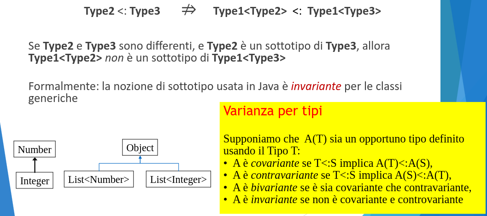

# Il principio di sostituzione di Liskov

Idealmente, la progettazione e lo sviluppo di un programma Java
dovrebbe attraversare le seguenti fasi:

1. Definizione della gerarchia di classi e interfacce da realizzare
2. Identificazione dei membri pubblici di ogni classe
3. Definizione delle SPECIFICHE di ogni metodo pubblico (condizioni sui
   parametri, sul risultato e comportamento atteso del metodo)
4. Implementazione di programmi di testing delle singole classi sulla base
   di quanto definito (membri pubblici e specifiche)
5. Definizione dei membri privati seguendo il principio di incapsulamento
6. Implementazione del codice delle classi, da verificare con i test già
   sviluppati

## Definire le specifiche

Definire le specifiche di una classe significa esprimere in modo non ambiguo il comportamento atteso dei suoi metodi pubblici

Come fare:
 Aggiungendo opportuni commenti al codice
 Esprimendo delle condizioni sui parametri e sulle variabili che siano verificabili o testabili, ad esempio, con assert

<p align="center">
  
</p>

<p align="center">
  
</p>

## Principio di Sostituzione di Liskov (LSP)

Un oggetto di un sottotipo può sostituire un oggetto del supertipo senza influire sul comportamento dei programmi che usano il supertipo.

Il principio di sostituzione di Liskov va oltre il semplice concetto di
sottotipo sostituibile per subsumption:

 Esprime una relazione tra i comportamenti dei oggetti dei due tipi

 La relazione deve valere per tutti i possibili contesti in cui la sostituzione può avvenire

Problemi:
 I contesti possibili sono infiniti
 I contesti sono programmi

Verificare se il principio LSP vale tra due classi è un problema indecidibile
• il compilatore non può farlo

Quindi il principio di sostituzione di Liskov nella pratica si traduce in un insieme di regole da seguire:

- La regola della segnatura:

1. gli oggetti del sotto-tipo devono avere tutti i metodi del super-tipo
2. le segnature (firme) dei metodi del sotto-tipo devoo essre compatibili con le segnature dei corrispondenti metodi del super-tipo.

- La regola dei metodi

1. le chiamate dei metodi del sotto-tipo devono comportarsi come le chiamate dei corrispondenti metodi del super-tipo.

- La regola delle proprietà

1. il sotto-tipo deve preservare tutt
   e le proprietà che possono essere provate sugli oggetti del super-tipo.

<p align="center">
  
</p>

<p align="center">
  
</p>

<p align="center">
  
</p>

## Invarianti e incapsulamento

La possibilità di dimostrare proprietà invarianti si basa fortemente sulla proprietà di incapsulamento della classe:

1. La rappresentazione deve essere privata! Altrimenti tra una chiamata di metodo e l'altra un esterno potrebbe modificarla violando l'invariante.

**Esempio:** se l'array che rappresenta l'insieme fosse pubblico, dall'esterno si potrebbe aggiungere due copie dello stesso elemento (accedendo direttamente all'array).

**danger:**
Quando lavoriamo variabili d'istanza di tipo non primitivo (oggetti) è comune commettere un errore di programmazione che porta ad esporre la rappresentazione, anche se privata.

# Java Generics

Meccanismo di astrazione linguistica che consente la definizione di classi e metodi parametrici rispetto al tipo che utilizziano.

Astrazione che permette di definire algoritmi che si applicano in contesti diversi, ma in cui l'interfaccia e il funzionamento generale e l'implementazione possono essere definiti in modo tale da applicarsi indipendentemente dal contesto dell'applicazione.

## Generics e la nozione di Sottotipo

- Integer è un sottotipo di Number

- List<Integer> è un sottotipo di List<Number>?

<p align="center">
  
</p>

## Perchè i generics in Java non sono covarianti?

Se Java ammettesse la covarianza su tipi generici, il seguente frammento di codice sarebbe corretto:

```java
List<Dog> dogs = new ArrayList<Dog>();
List<Animal> animals = dogs; // Non consentito perchè non vale covarianza
animals.add(new Cat());
Dog dog = dogs.get(0); // Qual'è il tipo effettivo di dog?
```

il problema è che l'assegnamento crea un alias con un tipo diverso, e la lista è modificabile!

Per i generics la nozione di sottotipo è invariante, pertanto per analogia se Type1 è un sottotipo di Type2, allora Type[] e Type2[] non dovrebbero essere correlati.

Ma Java è strano, se Type1 è un sottotipo di Type2 allora Type1 è un sottotipo di Type2[]

Scelta fatta prima dei generics.

<p align="center">
  
</p>

## Generici e gerarchie

Con i generici niente covarianza... ma c'è un apposito costrutto linguistico per fare qualcosa di simile.

<p align="center">
  
</p>

## Wildcard: ?

<p align="center">
  
</p>

## ? vs Object

<p align="center">
  
</p>

## Too good to be true: type erasure

Tutti i generics sono trasformati in Objects nel processo di compilazione.

- backward-compatibility con codice vecchio
- morale: a runtime, tutte le istanziazioni generiche hanno lo stesso tipo.

<p align="center">
  
</p>

## Considerazioni finali

 Il compilatore verifica l’utilizzo corretto dei generici

 I parametri di tipo sono eliminati nel processo di compilazione e il “class file” risultante dalla compilazione è un normale class file senza poliformismo parametrico

 JG aiutano a migliorare il polimorfismo della soluzione

 Limite principale: il tipo effettivo è perso a runtime a causa della type erasure
