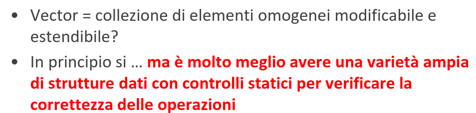
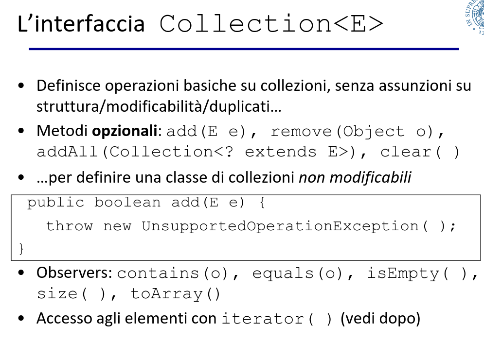
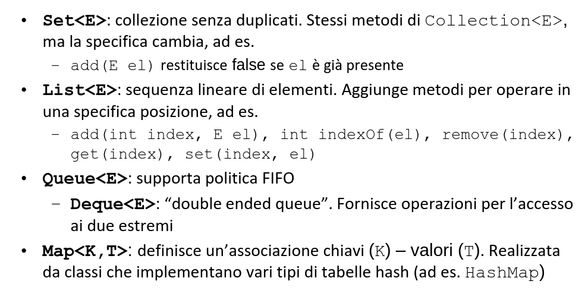
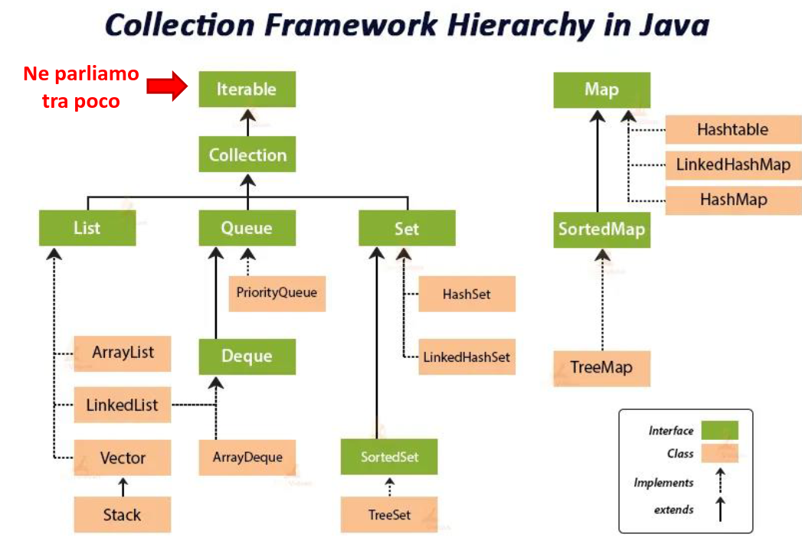
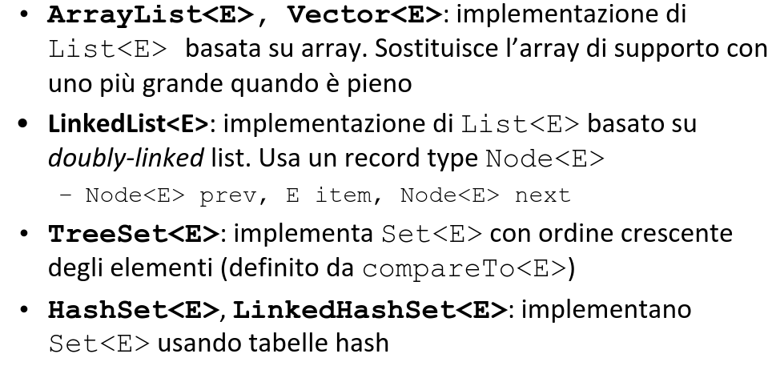
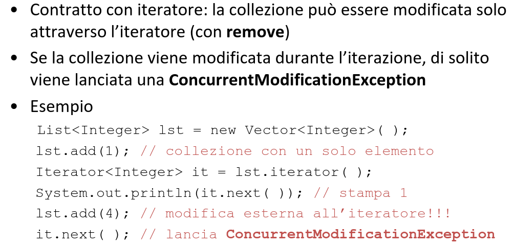

# Collezioni in Java: il Java Collection Framework (JCF)

  

• JCF definisce una gerarchia di interfacce e classi che realizzano una ricca varietà di collezioni

• Sfrutta i meccanismi di astrazione
– per specifica (vedi ad es. la documentazione delle interfacce)
– per parametrizzazione (uso di tipi generici)

per realizzare le varie tipologie di astrazione viste

– astrazione procedurale (definizione di nuove operazioni)
– astrazione dai dati (definizione di nuovi tipi – ADT)
– iterazione astratta <= lo vedremo in dettaglio
– gerarchie di tipo (con implements e extends)

• Contiene anche realizzazioni di algoritmi efficienti di utilità generale (ad es. ricerca e ordinamento)

• Una architettura per rappresentare e manipolare collezioni.
– Gerarchia di ADT
– Implementazioni
– Algoritmi polimorfi

• Vantaggi
– Uso di strutture standard con algoiritmi testati
– Efficienza implementazioni
– Interoperabilità
– Riuso del software

  

  

  

  

  

