# Macchine astratte, linguaggi,interpretazione e compilazion

## Macchina di Von Neumann

base pc attuali, due componenti principali:

- _memoria_
- _unità centrale di elaborazione_ -> esegue i programmi immagazzinati in memoria prelevando le istruzioni in codice macchina, intepretandole ed eseguendole una dopo l'altra.

## Ciclo fetch-execute

- _Fetch:_ L'istruzione da eseguire viene prelevata dalla memoria e trasferita all'internon della CPU.

- _Decode:_ L'istruzione viene interpretata e vengono avviate le azioni interne necessarie per la sua esecuzione.

- _Data Fetch:_ Sono prelevati dalla memoria i dati sui quali eseguire l'operazione prevista dalla istruzione.

- _Execute:_ È portata a termine l'esecuzione dell'operazione prevista dall'istruzione.

- _Store:_ È memorizzato il risultato dell'operazione prevista dall'istruzione.

**Implementazione Linguaggi di Programmazione**

  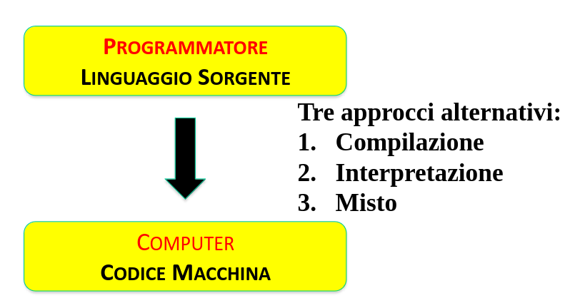

  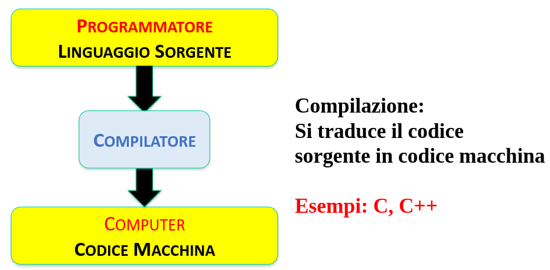

  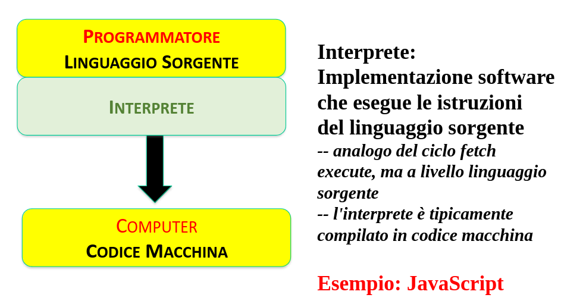

  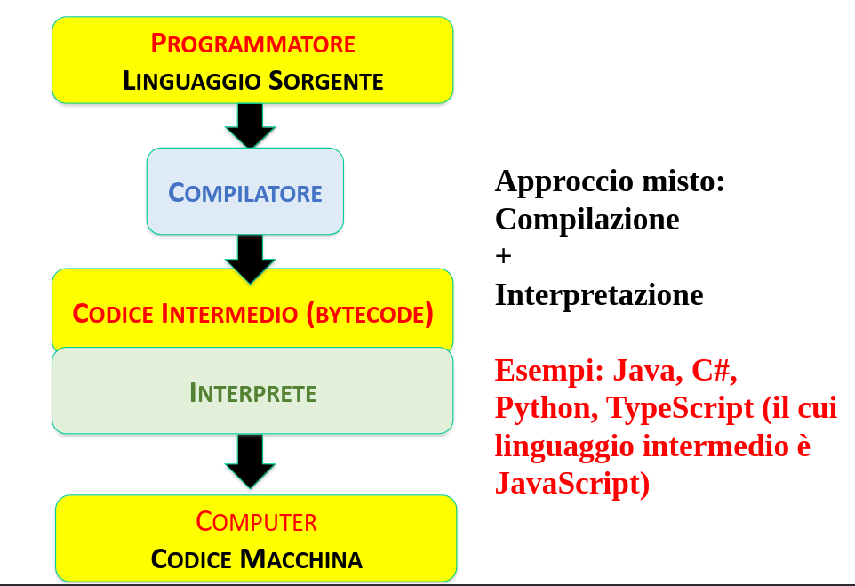

L'interprete e il computer sono entrambi esecutori di programmi espressi in un dato linguaggio. Possiamo generalizzarli usando il concetto di machinna astratta.

**Macchina**: consente l'esecuzione step-by-step dei programmi

**Astratta**: omette i molti dettagli delle macchine reali

Una VM è un sistema vituale che rappresenta il comportamento di una macchina fisica individuando:

- l'insieme delle risorse necessarie per l'esecuzione di programmi
- un'insieme di istruzioni specificatamente progettato per operare con queste risorse.

### VM: Visione Fondazionale

Una collezione di strutture dati e algoritmi in grado di memorizzare ed eseguire programmi.

- Componenti della macchina astratta:
  - Interprete
  - Memoria (dati e programmi)
  - Controllo
  - operazioni "primitive"

  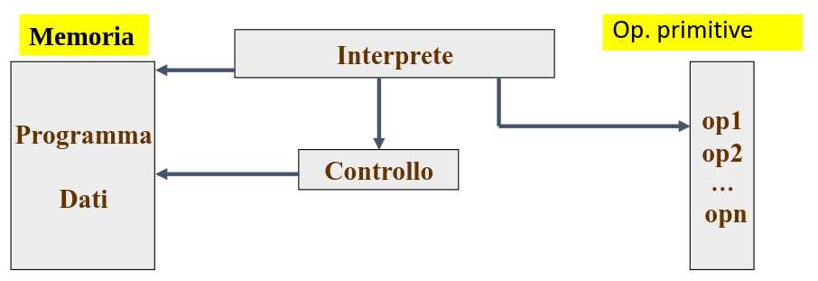

### Interprete (Componente di macchina astratta)

- In una implementazione software, l'interprete è il programma che prende in ingresso il programma da eseguire (tipicamente l'albero di sintassi astratta del programma) e lo esegue ispezionando la struttura per vedere come deve essere fatto.

- Di solito, gli interpreti consentono al programmatore di fornire il programa in formato testuale e ne fanno il parsing per generare l'albero di sintassi astratta.

- L'esecuzione del programma svolta dall'interprete deve rispettare la semantica del linguaggio di programmazione.

**L'interprete**

  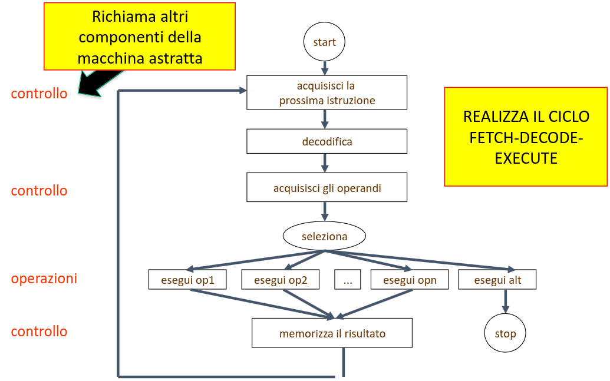

Una **componente di controllo** è una collezione di strutture dati e algoritmi per :

- acquisire la prossima istruzione
- acquisire gli operandi e memorizzare i risultati delle operazioni
- gestire le chiamate e i ritorni dai sottoprgrammi
- gestire i thread
- mantenere le associazioni fra nomi e valori denotati
- gestire dinamicamente la memoria

Le **operazioni primitive** sono una collezione di strutture dati e algoritmi per svolgere ogni singola operazione prevista dal linguaggio.

L'implementazione di una primitiva può richiedere di effettuare controlli sui dati prima di eseguire l'operazione stessa:

- controli dinamici di tipo
- controlli dinamici sull'accesso alla memoria

### Esempio : assegnamento su macchina a registri

`X = Y + 5`

`// Controllo trasferimento dati
load Y, R0`

`// load the value in Y-location into register R0
load #5, R1`

`//load constant 5 into register R1
//Esecuzione operazione primitiva
add R0, R1, R0`

ecc ecc

- `M` -> macchina astratta

- `L_M` -> linguaggio macchina di M, è il linguaggio che ha come stringhe legali tutti i programmi interpretabili dall'interprete di M

- Alle componenti di `M` corrispondono componenti di `L_M`:
  - tipi di dato primitivi
  - costrutti di controllo:
    - per controllare l'ordine di esecuzione
    - per controllare acquisizione e trasferimento dati

### Implementare un linguaggio

  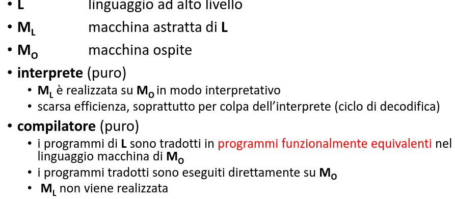

### La macchina intermedia

  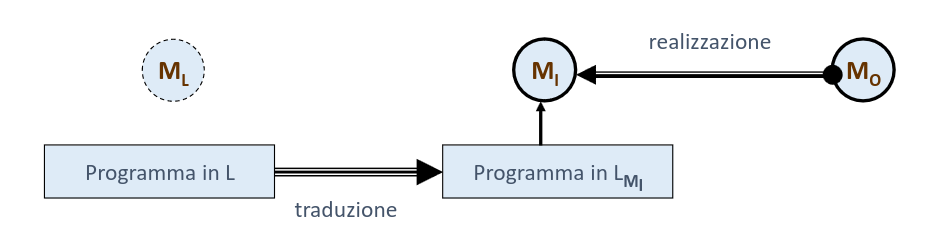

## Il Run-Time Support nei linguaggi compilati

- Molto comunemente anche i linguaggi compilati generano codice per una macchina intermedia leggermente diversa rispetto alla macchina ospite.

- Che differenza c'è tra `M_i` e `M_o` in questi casi?

### Supporto a tempo di esecuzione (run time support - RTS):

collezione di strutture dati e sottoprogrammi che devono essere caricati su `M_o` (estensione) per permettere l'esecuzione di codice prodotto dal compilatore

- `M_i = M_o + RTS`

- Il linguaggio `L_Mi` è il linguaggio di macchina di `M_o` esteso con chiamate al supporto a tempo di esecuzione.

## A cosa serve il RTS?

- In linea di principio è possibile tradurre totalmente un programma C in linguaggio macchina puro, senza RTS, ma la traduzione di alcune primitive (es: relative a i/o) produrrebbe centinaia di istruzioni in linguaggio macchina che sono sempre le stesse.

- Se le inserissimo nel codice compilato, la sua dimensione crescerebbe a dismisura.
- In alternativa, possiamo inserire nel codice una chiamata a una routine (indipendente dal particolare programma)
- tale routine deve essere caricata su `M_o` ed entra a far parte del RTS

Più il linguaggio è di alto livello, più questa situazione si presenta per quasi tutti i costrutti, per realizzare:

- meccanismi di controllo dinamico dei tipi
- gestione efficiente della memoria.

### Il run-time support del C

Il supporto a tempo di esecuzione contiene:

- varie strutture usate per l'esecuzione dei programmi
  - lo stack: ambiente, memoria, sottoprogrammi
  - la memoria a heap: puntatori ecc ecc
- i sottoprogrammi che realizzano le operazioni necessrie su tali strutture dati.
- Il codice prodotto è scritto in linguaggio macchina esteso con chiamate al RST.

### Implementazioni miste

Anche quando l'interprete della macchina intermedia `M_I` è diverso da quello della macchina ospite `M_o` è comune prevedere un RTS, implementato all'interno dell'interprete.

### L'implementazione di Java

È una implementazione mista:

- traduzione dei programmi da Java a byte-code, linguaggio macchina di una macchina intermedia chiamata Java Virtual Machine.

- l'interprete della Java Virtual Machine opera su strutture dati (stack, heap) simili a quelle del RTS del compilatore C

- Una differenza fondamentale è la presenza di una gestione automatica del recupero della memoria a heap (garbage collecotor).

## Come è fatto un compilatore?

### Compilatore

  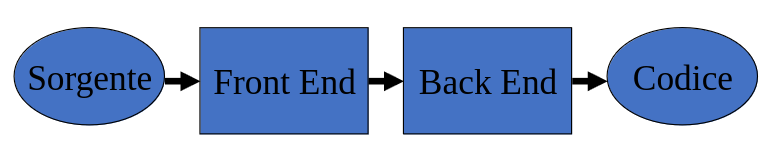

**Front end: fasi di analisi**
Legge il programma sorgente e determina la sua struttura sia sintattica che semantica.

**Back end: sintesi**
Genera il codice nel linguaggio macchina, programma equivalente al programma sorgente.

**Aspetti critici**
Riconoscere i programmi legati (sintatticamente corretti)
Generare codice compatibile con il SO della macchina ospite

### Struttura di un compilatore

  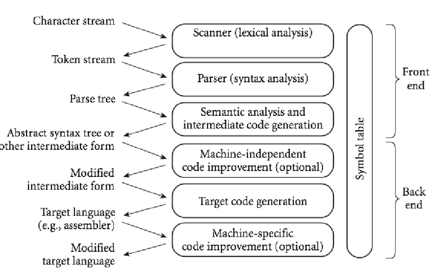

### Front End

  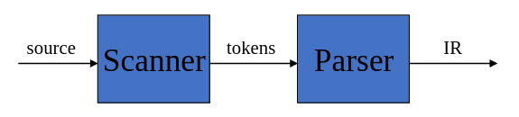

Le prime due fasi:

- _scanner:_ trasforma il programma sorgente nel lessico (token)
- _parser:_ legge i token e genera il codice intermedio (intermediate representation - IR)

### Token

- Token: la costituente lessicale del linguaggio
- _operatori & punteggiatura_
- _parole chiave_
- _identificatori_
- _letterali_

### Scanner: esempio

- Input (programma da compilare):

if(x >= y) y = 42;

- sequenza dei token
  IF LPAREN ID(X) GEQ ID(Y)
  RPAREN ID(Y) BECOMES INT(42) SCOLON

### Parser: output (IR)

- Formato tipico della rappresentazione intermedia (IR): albero di sintassi astratta (abstract syntax tree)
- è la struttura sintattica essenziale del programma senza gli aspetti di zucchero sintattico.

  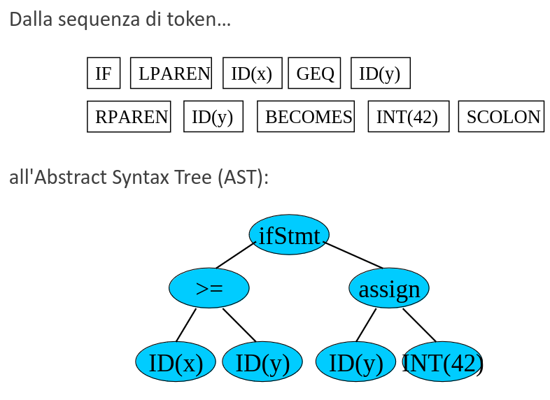

## Analisi semantica (statica)

**Type checking (statico)**
I controlli di type checking svolti dal compilatore prevengono errori a tempo di esecuzione legati all'esecuzione delle operazioni.
Esempio 3-"ciao"
Il type checker controlla che tutte le operazioni siano fatte su operandi del tipo corretto.

`Nei linguaggi che non prevedono una fase di compilazione:`

- questi controlli vengono fatti a tempo di esecuzione dal Run-Time Support implementato nell'interprete.
  _Come fa l'interprete a conoscere i tipi dei dati su cui sta lavorando?_

### Type checking statico vs dinamico

- Esempio: in C
- Type checking statico. Se il programma supera i controlli sui tipi, a tempo di esecuzione non ci saranno errori nelle oeprazioni

  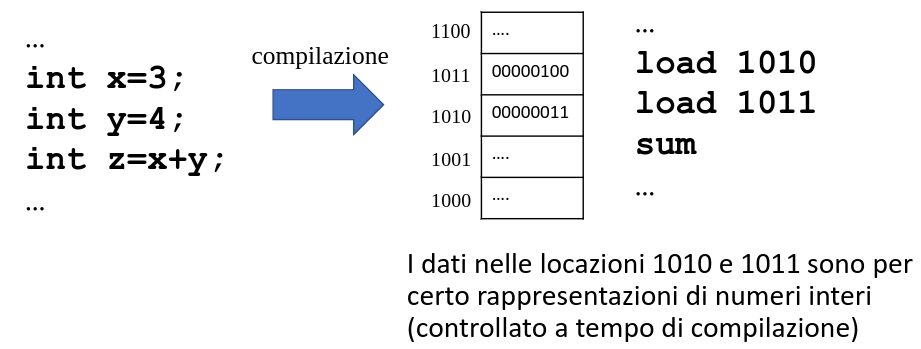

- Esempio in Javascript
- Type checing dinamico. Se il programma supera i controlli sui tipi, a tempo di esecuzione non ci saranno errori nelle operazioni.

  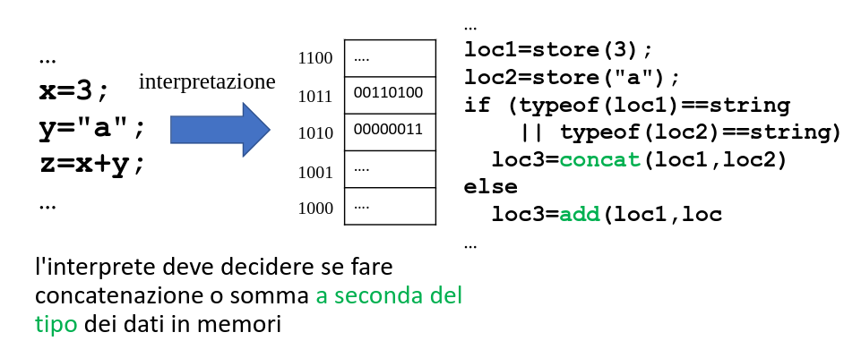

**PROBLEMA, COME FA L'INTERPETE A SAPERE CHE TIPO SONO I DATI?**
**Soluzione:** Descrittori dei dati.

Ogni dato in memoria ha associato un descrittore che ne fornisce il tipo (ed eventualemente altre info utili a RunTime)

  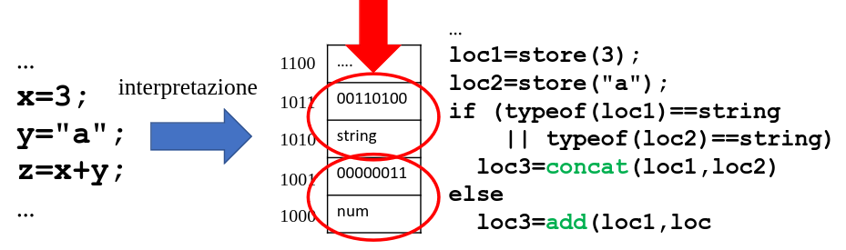

### I descrittori di dato

Nei linguaggi con controllo din tipi dinamico, ogni dato è associato a un descrittore che fornisce le informazioni necessarie per il controllo a tempo di esecuzione.
Questo implica:

- Consumo di memoria
- Tempo necessario per effettuare i controlli

I linguaggi compilati, più efficienti in questo regard.

### Analisi statica: esempi (controlli sull'inizializzazione delle variabili)

**control flow analysis**
if (b) {c = 5;} else {c=6;} initialises c
if (b) {c = 5;} else {d=6;} does not

**data flow analysis**
d = 5; c = d; initialises c
c = d; d = 5; does not

metodi di control-flow e data-flow analysis vengono utilizzati dal compilatore, ad esempio, per controllare che tutte le variabili vengano inizializzate.

## Back End

Cosa fa?
Traduce il codice nel linguaggio della macchina ospite o della macchina intermedia.
Necessaria una conoscenza della macchina ospite o della macchina intermedia (modello semantico).

  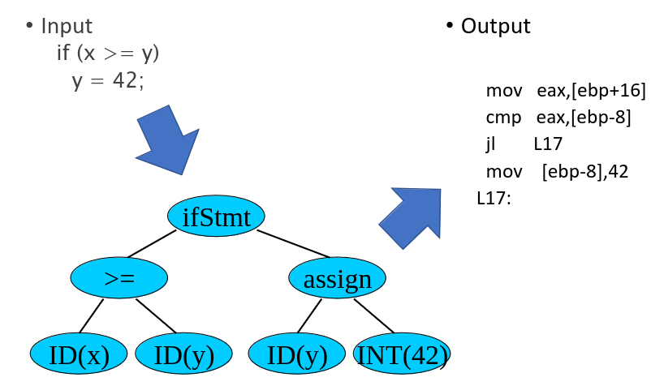

### Just in Time compiler

L'idea è di compilare codice intermedio nel codice nativo durante l'esecuzione con i vantaggi di avere un programma che continua a essere portatile e ad avere esecuzioni ottimizzate (code inlining).
C'è da dire però che ha un RTS molto complesso (ottimizza long-running activation) e il costo delle compilazioni JIT non è banale.

# Introduzione allo sviluppo di interpreti

**Componenti principali da realizzare in un interprete**

  

## Ciclo di interpretazione

L'interprete esegue le operazioni elementari del programma _una dopo l'altra_.
Le fasi di scanning/parsing possono essere svolte a livello di:

- intero programma
- singole istruzioni/espressioni.

Lo stesso vale per i controlli di tipo (e altre analisi)

- analisi statica (intero programma)
- controlli dinamici (per ogni istruzione/espressione, all'esecuzione)
- analisi statica + controlli dinamici.
