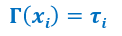

# Type Systems

## Sistema dei tipi

Un sistema dei tipi è un metodo sintattico, effettivo per dimostrare l'assenza di comportamenti anomali del programma strutturando le operazioni del programma in base ai tipi di valori che calcolano.

**Metodo sintattico:** la struttura sintattica guida il metodo di analisi del comportamento dei programmi.

**Effettivo:** si può definire un algoritmo che controlla i vincoli sui tipi e implementarlo in un compilatore o un interprete.

**Strutturale:** i tipi assegnati alle componenti di un programma sono calcolati in modo composizionale: il tipo di un'espressione dipende solo dai tipi delle sue sottoespressioni.

  

## Type safety

La mancanza di type safety permette di scrivere programmi pieni di bug.

## Controllo dei tipi

- Statico (in fase di compilazione) o dinamico (in fase di esecuzione),
- Controllo di tipo (type checker) verifica che le intenzioni del programmatore siano rispettate dal programma.
- Un programma che supera il controlo dei tipi è garantito comportarsi bene in fase di esecuzione: non applica mai un'operazione ad un valore di tipo non corretto..
- Controllo dei tipi: forma di correttezza parziale del programma.

Per dimostrare la correttezza dei sistemi di tipi è indispensabile comprendere nel dettaglio il significato dei programmi (cosa succede quando vengono eseguiti). Comprendere i sistemi di tipo porterà ad una comprensione più profonda del significato dei programmi.

Il type checker definisce una relazione binaria (E, T) che associa il tipo T all'espressione E.

Useremo la notazione E:T per indicare una coppia della relazione di assegnamento dei tipi.

I sistemi di tipo generalmente sono imprecisi: non definiscono esattamente quale tipo di valore sarà restituito da ogni programma, ma solo un'approsimazione conservativa.

La regola della composizionalità garantisce che l'espressione abbia tipo coerente.
La correttezza del sistema di tipo è espressa formalmente da queste due proprietà:

**Progresso:** Se E:T allora E è un valore oppure E -> E' per una qualche espressione E'.

Una espressione ben tipata non si blocca a run-time, può fare un passo

**Conservazione:** Se E:T e E -> E' allora E':T

I tipi sono preservati dalle regole di esecuzione.

Queste due proprietà insieme garantiscono che l'intera esecuzione dell'espresione non si blocchi a run-time.

### Progresso

Se E:T allora E è un valore oppure E -> E' per una qualche espressione E'

_Dimostrazione_
Per induzione sulla struttura della derivazione di E:T

**Casi base:**

`true: Bool`
`false: Bool`
`0: Nat`

Immediato: true, false e 0 sono valori

**Casi Induttivi**

`E = if E1 then E2 else E3:T`

# Il lambda calcolo tipato

## L'ambiente dei tipi

È una funzione (di dominio finito) che associa nomi a tipi. Noi scriveremo:

  

per indicare la funzione:

  

che associa il tipo tau_i al valore x_i

## Giudizio di tipo

Supponiamo che Γ sia un ambiente di tipo.
La notazione:

` Γ |- e:𝝉`

È usata per indicare che l'espressione `e` ha tipo 𝝉 nell'ambiente di tipo Γ.

Le regole sono applicate dal compilatore in fase di analisi statica. L'ambiente dei tipi nel gergo dei compilatori è chiamato Tabella dei Simboli.

## Type safety per lambda calcolo

La correttezza del sistema di tipo del lambda calcolo Tipato è espressa formalmente da queste due proprietà:

**Progresso:** Se 0 |- e:tau allora e è un valore oppure e -> e' per una qualche espressione e'
Una espressione senza variabili libere ben tipata non si blocca a run time

**Conservazione:** Se Gamma |- e:tau ed e-> e' allora Gamma |- e':tau
I tipi sono preservati dalle regole di esecuzione.

I tipi sono specifiche di comportamento: il sistema dei tipi che abbiamo considerato specifica input-output delle funzioni e il typechecking verifica l'adeguatezza del comportamento input-output.

Tipi e typechecking possono essere usati per verificare proprietà di programmi:

- proprietà di segretezza e autenticità dei protocolli di sicurezza
- proprietà comportamentali (assenza di deadlock) in sistemi concorrenti.

Typechecking fornisce delle garanzie di correttezza parziale e inevitabilente rifiuta alcuni programmi corretti.
La maggior parte delle proprietà interessanti non possono essre automaticamente verificate quindi i tipi possono solo dare un'approssimazione della correttezza.

**Teorema di Rice** Le proprietà che coinvolgono la previsione esatta del comportamento del programma sono generalmente indecidibili.
