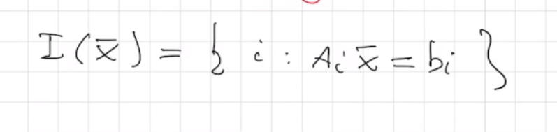
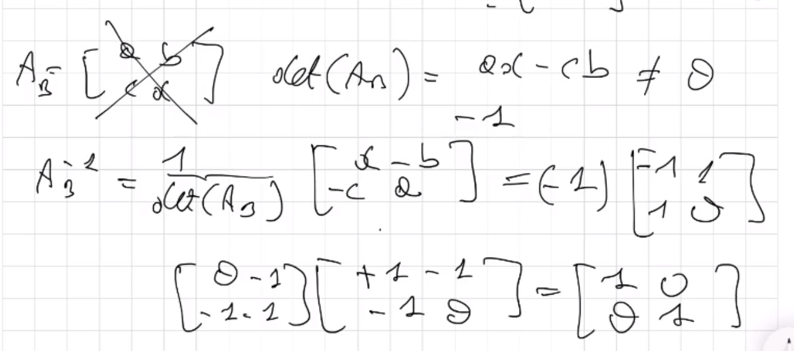

# Programmazione Lineare

## Disegnare i poliedri gemotricamente

**Involucro convesso**

  

  

  

  

  

  

  

  

  

  

  

  

  

  

  

  

  

  

  

  

  

  

  

  

  

  

  

  

  

  

  

  

  

  

  

  

  

  

  

