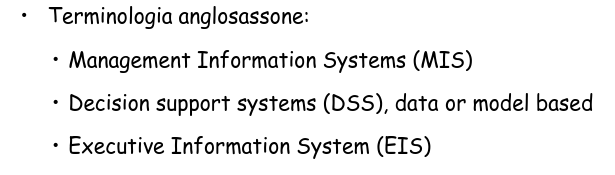

# Basi di Dati

[Link alle slides](https://elearning.di.unipi.it/pluginfile.php/75043/mod_resource/content/1/1.Sistemi_modificato_Parte_I.pdf)

## Capitolo 1

**Basi di Dati:**
è un insieme organizzato di dati utilizzato per il supporto allo svolgimento di attività.

**Sistemi informativi:**
Le BD hanno un ruolo nei sistemi informativi e nell'organizzazione dell'azienda.

Un SI di un'organizzazione è una combinazione di risorse, umane e materiali e di procedure organizzate per:

- la raccolta
- l'archiviazione
- l'elaborazione
- lo scambio

delle informazioni necessarie alle attività:

- operative
- di programmazione e controllo
- di pianificazione

  

- Il sistema informativo automatizzato è quella parte del sistema informativo in cui le informazioni sono raccolte, elaborate, archiviate e scambiate usando un sisteam informatico.

**Il sistema informatico:** è l'insieme delle tecnologie informatice e della comunicazione a supporto delle attività di un'orgaizzazione.

- **Terminologia:**
- sistema informativo =~ sistema informativo automatizzato
- sistema informativo automatizzato =~ sistema informatico

### Componenti di un sistema informatico

  

### Classificazione dei sistemi informatici

  

### Sistemi informatici operativi

- I dati sono organizzati in BD.
- DP = data processing
- EDP = Elettronic data processing
- TPs = Transaction Processing Systems

  

Le caratteristiche delle basi di dati sono garantite da un sistema per la gestione di basi di dati (DBMS, Data Base Management System) che ha il controllo dei dati e li rende accessibili agli utenti autorizzati.

### Elaborazioni su DB: OLTP (On-Line Transaction Processing)

**Sistemi transazionali**

- Uso principale dei DBMS
- Tradizionale elaborazione di transazioni, che realizzano i processi operativi per il funzionamento di organizzazioni:
- Operazioni predefinite e relativamente semplici.
- Ogni operazione coinvolge "pochi" dati
- Dati di dettaglio, aggiornati.

### Sistemi informatici direzionali

- I dati sono organizzati in Data Warehouse (DW) e gestiti da un opportuno sistema.

- Le applicazioni, dette di Business Intelligence, sono strumenti di supporto ai processi di controlo delle prestazioni aziendali e di decisione manageriale.

  

### OLAP (On-Line Analytical Processing)

  

**Elaborazione su DW: OLAP (On-Line Analytical Processing)**

- Uso principale dei data warehouse
- Analisi dei dati di supporto alle decisioni:
  - operazioni complesse e non-ripetitive
  - ogni operazione può coinvolgere molti dati
  - dati aggregati, storici, anche non attualissimi.

  

### Analisi dei dati: Requisiti

- Dati aggregati: non interessa un dato, ma la somma, la media, il minimo, il massimo di una misura.

- Presentazione multidimensionale: interessa incrociare le informazioni, per analizzarle da punti di vista diversi e valutare i risultati de business per intervenire sui problemi ciritici o per cogliere nuove opportunità.

- Analisi a diversi livelli di dettaglio: per es. una volta scoperto un calo delle vendite in un determinato periodo in una regione specifica si passa ad un'analisi dettaglaita ell'area di interesse per cercare di scoprire le cuase (dimensioni con gerarchie).

### Big Data

è un termine ampio, riferito a situazioni in cui l'approccio 'schema-first' tipico di DB o DW risulta troppo restrittivo o troppo lento.

- Le tre V:
  - Volume
  - Varietà
  - Velocità

I Big Data sono in genere associati a :

- SIstemi NoSql
- Machine Learning
- Approccio Data Lake

### Sistemi per Basi di Dati (DBMS)

**Definizione:** Un DBMS è un sistema centralizzato o distribuito che offre opportuni linguggi per:

- definire lo schema di una basi di dati (lo schema va definito prima di creare dati)
- scegliere le strutture dati per la memorizzazione dei dati.
- memorizzare i dati ripsettando i vincoli definiti nello schema.
- recuperare e modificare i dati interattivamente o da programmi

### Architettura dei DBMS centralizzati

  

Una base di dati è una raccolta di dati permanenti suddivisi in due categorie:

- i metadati: descrivono fatti sullo schema dei dati, utenti autorizzati, applicazioni, parametri quantitativi sui dati, ecc.
- I metadati sono descritti da uno schema usando il modello dei dati adottato dal DBMS e sono interrogabili con le stesse modalità previste per i dati;
- i dati: le rappresentazioni di certi fatti conformi alle definizioni dello schema, con le seguenti caratteristiche.

### Caratteristiche dei dati gestiti dai DBMS

- Sono organizzati in insieme strutturati e omogenei, fra i quali sono definite delle relazioni. La struttura dei dati e le relazioni sono descritte nello schema usando i meccanismi di astrazione del modello edi dati del DBMS.

- Sono molti, in assoluto e rispetto ai metadati, e non possono essere gestiti in memoria temporanea;

- Sono accessibili mediante transazioni, unità di lavoro atomiche che non possono avere effetti parziali;

- Sono protetti sia da accesso da parte di utenti nno autorizzati, sia da corruzione dovuta a malfunzionanti hardware e software.

- Sono utilizzabili contemporaneamente da utenti diversi.

### Un esempio di sessione con un DBMS relazionale

- il modello relazionale dei dati è il più diffuso fra i DBMS commerciali.

- Il meccanismo di astrazione fondamentale è la relazione (tabella), sostanzialemnte un insieme di record con campi elementari;

- lo schema di una relazione ne definisce il nome e descrive la struttura dei possibili elementi della relazione (insieme di attributi con il loro tipo).

- Definizione base di dati:
  `create database EsempioEsami`

- Definizione schema:
  `create table Esami (Materia char(5), Candidato char(8), Voto int, Lode char(1), Data char(6))`

- Inserzione dei dati:
  `insert into Esami values ('BDSII1', '080709', 30, 'S', '070900')`

- Interrogazione

  `select Candidato`
  `from Esami`
  `where Materia = 'BSDI1' and Voto = 30`

  - Candidato
  - 080709

Inoltre: accesso ai dati da programma, interrogarzioni con interacia grafica ecc ecc.

### Funzionalità dei DBMS

- Linguaggio per la definizione della base di dati;
- Linguaggio per l'uso dei dati;
- Meccanismi per il controllo dei dati
- Strumenti per il responsabile della base di dati;
- Strumenti per lo sviluppo delle applicazioni

#### Linguaggio per la definizione della Base di Dati (DDL)

- È utile distinguere tre diversi livelli di descrizione dei dati (_schemi_):

- livello di vista logica,
- livello logico
- livello fisico

  

**Il livello logico**: descrive la struttura degli insiemi di dati e delle relazioni fra loro, secondo un certo modello dei dati, senza nessun riferimento alla loro organizzazione fisica nella memoria permanente (Schema logico).

- Esempio di schema logico:
  `Studenti(Matricola char(8), Nome char(20), login char(8), AnnoNascita int, Reddito real)`

`Corsi(IdeC char(8), Titolo char(20), Crediti int)`

`Esami(Matricola char(8), IdeC char(8), Voto int)`

**Il livelo fisico:** descrive come vanno organizzati fisicamente i dati nelle memorie permanenti e quali strutture dati ausiliare prevedere per facilitarne l'uso (Schema fisico o interno).

- Esempio di schema fisico:
  - Relazioni Studenti ed Esami organizzate in modo seriale, Corsi organizzata sequenziale con indice
  - Indice su Matricola (Matricola, IdeC)

**Livello vista logica**
_Vista Logica_: descrive come deve apparire la struttura della base di dati ad una certa applicazione (Schema esterno o vista).

Esempio di schema esterno

- `InfCorsi(IdeC char(8), Titolo char(20), NumEsami int)`

_Esempio_:

- Nell'organizzazione di una banca, lo schema logico conterrà tutte le tabelle e i dati relativi ai conti correnti, ma anche al personale. Lo schema logico conserva tutte le informazioni della banca.

- Nello schema esterno, ogni correntista potrà accedere solo ad alcune informazioni che sono per lui di interesse: quelle relative al proprio conto corrente.

**Perchè 3 livelli di descrizone dei dati?**
Per garantire le proprietà di indipendenza logica e fisica dei dati, che sono fra gli obiettivi più importanti dei DBMS.

- Indipendenza logica: i programmi applicativi non devono essere modificati in seguito a modifiche dello schema logico.

- Indipendenza fisica: i programmi applicativi non devono essere modificati in seguito a modifiche dell'organizzazione fisica dei dati.

- Un DBMS deve prevedere più modalità d'uso per soddisfare le esegienze delle diverse categorie, di più utenti che possono accedre alla base di dati (dati e catalogo).

- Un interfaccia grafica per accedere ai dati
- un linguaggio di interrogazione per gli utenti non programmatori
- un linguaggio di programmazione per gli utenti che sviluppano applicazioni:

  - integrazione DDL e DML nel linguaggio ospite: procedure predefinite, estenzione del compilatore, precompilazione.
  - comunicazione tra linguagio e DBMS

- un linguaggio per lo sviupo di itnerfacce per le applicazini.

- **Data Manipulation Language (DML)** per l'interrogazione e l'aggiornamento di basi di dati.

- **Data Definition Language (DDL)** per la definizione di schemi (logici, esterni, fisici) e altre operazioni generali

### Funzionalità dei DBMS

- Strumenti per l'amministratore delle basi di dati
- un linguaggio per la definizione e la modifica degli schemi logico, interno ed esterno.
- Strumenti per il controllo e messa a punto del funzionamento del sistema.
- Strumenti per stabilire i diritti di accesso ai dati e per ripristinare la base di dati in caso di malfunzionamenti.

- Strumenti per lo sviluppo delle applicazioni:
- Produzione di rapporti, grafici, fogli elettronici
- Sviluppo di menu, forme, componenti grafici

**Linguaggi per le basi di dati**

- Disponibilità di vari linguaggi e interfacce diverse
  - linguaggi testuali interattivi (es. SQL)
  - comandi (come quelli del linguaggio interattivo) immersi in un linguaggio ospite
  - comandi immersi in un linguaggio ad hoc con altre funzionalità anche con l'ausilio di strumenti di sviluppo
  - con interfacce amichevoli

### Meccanismi per il controllo dei dati

Una caratteristica molto importante dei DBMS è il tipo di meccanismi offerti per garantire le seguenti proprietà di una base di dati:

- **Integrità:** mantenitmento delle proprietà specificate in modo dichiarativo nello schema

- **Sicurezza:** protezione dei dati da usi non autorizzati

- **Affidabilità:** protezione dei dati da malfunzionamenti hardware o software e da interferenze indesiderate dovute all'accesso concorrente ai dati da parte di più utenti.

**Cos'è una transazione?**
È una sequenza di azioni di lettura e scrittura in memoria permanente e di elaborazioni di dati in memoria temporanea, con le seguenti proprietà:

- _Atomicità_: le trans che terminano prematuramente sono trattate dal sistema come se non fossero mai iniziate; pertanto eventutali effetti sulle basi di dati sono annullati.

- _Persistenza:_ Le modifiche sulla base di dati di una transazione terminata normalmente sono permanenti, non alterabili da malfunzionamenti.

- _Serializzabilità:_ Nel caso di esecuzioni concorrenti di più transizioni, l'effetto complessivo è quello di una esecuzione seriale.

### DBMS, Sistemi per basi di dati.

Un DataBase Management System (DBMS) è un sistema in grado di gestire collezioni di dati che siano (anche):

- Grandi
- Persistenti
- Condivise

Garantendo affidabilità e privatezza. Deve essere efficiente ed efficace.

### Vantaggi dei DBMS

- Indipendenza dei dati
- Recupero efficiente dei dati
- Integrità e sicurezza dei dati
- Accessi interattivi, concorrenti e protetti dai malfunzionamenti
- Amministrazione dei dati
- Riduzione dei tempi di sviluppo delle applicazioni
- La riduzione dei costi della tecnologia e i possibili tipi di DBMS disponibili sul mercato facilitano la loro diffusione

### Svantaggi dei DBMS

- Prima di caricare i dati è necessario definire uno schema
- Possono gestire solo dati strutturati e omogenei
- Possono essere costosi e complessi da installare e mantenere in esercizi
- Ottimizzati per OLTP e non OLAP
