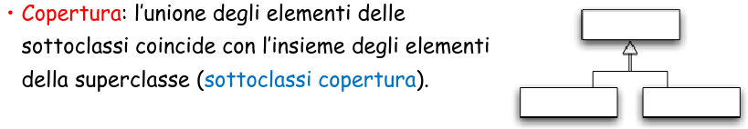

# Basi di dati Capitolo 2

[Link alle slides](https://elearning.di.unipi.it/pluginfile.php/75375/mod_resource/content/2/2e3_ModelliProgettazione_Parte_I.pdf)

## Modellazione

_Definizione:_
Un modello astratto è la rappresentazione formale di idee e conoscenze relative a un fenomeno.

- Aspetti di un modello:
  - il modello è la rappresentazione di certi fatti.
  - la rappresentazione è data con un linguaggio formale
  - il modello è il risultato di un processo di interpretazione, guidato dalle idee e conoscenza possedute dal soggetto che interpreta.
  - La stessa realtà può utilmente essere modellata in modi diversi e a diversi livelli di astrazione.

### Progettazione delle base di dati

  

La modellazione verrà discussa quindi con riferimento alla problematica della progettazione delle basi di dati.

### Metodologia in più fasi

  

  

### Modello dei dati

- Insieme di costrutti utilizzati per organizzare i dati di interesse e descriverne la dinamica.

- componente fondamentale: meccanismi di strutturazione (o costruttori di tipo)

- come nei linguagi di programmazione esistonon meccanismi che permettono di definire nuovi tipi, così ogni modello dei dati prevede alcuni costruttori.

- ad esempio, il modello razionale prevede il costruttore relazione, che permette di definire insiemi di record omogenei.

### Aspetti del problema

- Quale conoscenza del dominio del discorso di rappresenta?
  - aspetto ontologico
- Con quali meccanismi di astrazione si modella?
  - aspetto logico
- Con quale linguaggio formale si definisce il modello?
  - aspetto linguistico
- Come si procede per costruire un modello?
  - aspetto pragramtico: metodologia da seguire nel processo di modellazione

#### Aspetto ontologico:

Conoscenza concreta: i fatti.
Conoscenza astratta: Struttura e vincoli sulla conoscenza concreta

Conoscenza procedurale, comunicazioni:

- le operazioni di abse, le operazioni degli utenti
- Come si comunicherà con il sistema informatico
- Nel seguito l'attenzione sarà sulla conoscenza concreta e astratta

**Un modello dei dati** è un insieme di meccanismi di astrazione per descrivere la struttura della conoscenza concreta.

- _Schema:_ la descrizione della struttura della conoscenza concreta e dei vincoli di integrità usando un aprticolare modello di dati.

- Useremo come notazione grafica una variante dei cosiddetti diagrammi a oggetti o diagrammi ER

- Nozioni fondamentali:
- Oggetti, Tipo di oggetto, Classe
- Ereditarietà, Gerarchia fra tipi, Gerarchia fra classi

 

  

### La conoscenza concreta

riguada i fatti specifici che si vogliono rappresentare.

- Fatti specifici che si vogliono rappresentare:
- le entità con le loro proprietà
- le collezioni di entità omogenee e
- le associazioni fra entità

- Le entità sonno ciò di cui interessa rappresentare alcuni fatti
- Le proprietà sono fatti che interessano solo in quanto descrivono caratteristiche di determinate entità.

Conoscenza concreta: collezioni di entità

- Una proprietà è una coppia (Attributo, valore di un certo tipo).
- Tipi di entità: ogni entità apartiene ad un tipo che ne specifica la natura
- Collezione: un insieme variabile nel tempo di entità omogenee

**Caratteristiche delle proprietà**
Ogni proprietà ha associato un dominio, ovvero l'insieme dei possibili valori che tale proprietà può assumere:

- proprietà atomica (o primitiva), se il suo valore non è scomponibile; altrimenti è detta strutturata.
- proprietà univoca, se il suo valore è unico, altrimenti è detta multivalore.
- proprietà totale (obbligatoria), se ogni entità dell'universo del discorso ha per essa un valore specificato, altrimenti è detta parziale (opzionale).
- Proprietà costante, altrimenti è detta variabile
- Proprietà calcolata, altrimenti è detta non calcolata.

### Modellazione a oggetti: gli oggetti

Ad ogni entità del dominio corrisponde un oggetto del modello

- _Oggetto_: un'entità software con stato, comportamento e identità, che modella un'entità dell'universo.

- Lo stato è modellato da un insieme di costanti o variabili con valori di qualsiasi complessità.

- Comportamento: un insieme di procedure locali chiamate metodi, che modellano le operazioni di base che riguardano l'oggetto e le proprietà derivabili da altre.

- Un oggetto può rispondere a dei messaggi, restituendo valori memorizzati nello stato o calcolati con un procedura locale

  

### Le classi

Una classe è un insieme di oggetti dello stesso tipo, modificabile con operatori per includere o estrarre elementi dall'insieme.

  

**Il primo passo nella costruzione di un modello** consiste nella classificazione delle entità del dominio con la definizione dei tipi degli oggetti che le rappresentano

- un tipo oggetto, definisce l'insieme dei messaggi a cui può rispondere un insieme di possibili oggetti.

- i nomi dei messaggi sono detti anche attributi degli oggetti

- Il tipo oggetto nei diagrammi ER

### Le associazioni

- Un instanza di associazione è un fatto che correla due o più entità, stabilendo un legame logico tra di loro.

- Un'associazine R(X,Y) fra due collezioni di entità X e Y è un insieme di istanze di associazione tra elementi di X e Y, che varia in generale nel tempo.

- Il prodotto cartesiano (X x Y) è detto dominio dell'associazione.

  

### Tipi di associazione

Un'associazione è caratterizzata dalle seguenti proprietà strutturali:
molteciplità e totalità

_Definizione:_ (Vincolo di univocità) Un'associazione R(X,Y) è univoca rispetto a X:

- se per ogni elemento x di X esiste al più un elemento di Y che è associato a x;
- se non vale questo vincolo, l'associazione è multivalore rispetto ad X.

Cardinalità dell'associazione:

  

#### Tipi di associazione: vincoli

_Definizione (Vincolo di totalità)_

Un'associazione R(X,Y) è totale su X se per ogni elemento x di X esiste almeno un elemento di Y che è associato ad x, altrimenti è un associazione parziale.

## Conoscenza Concreta: Gerarchie di classi

Spesso le classi di entità sono organizzate in una gerarchia di specializzazione / generalizzazione. Una classe della gerarchia minore di altre viene detta sottoclasse
(le altre sono superclassi).

Due importanti caratteristiche delle gerarchie:

- ereditarietà delle proprietà
- gli elementi di una sottoclasse sono un sottoinsieme degli elementi della superclasse

- Fra i tipi oggetto è definita una relazione di sottotipo, con le seguenti proprietà:
- è asimmetrica, riflessiva e transitiva
- se T è sottotipo di T, allora gli elementi di T possono essere usati in ogni contesto in cui possano apparire valori di tipo T (sostitutività).
  In particolare:
- Gli elementi di T hanno tutte le proprietà degli elementi di T
- per ogni proprietà p in T, il suo tipo in T è un sottotipo del suo tipo in T.

Gerarchia semplice o multipla.

### Ereditarietà

L'ereditarietà permette di definire:

- un tipo oggetto a partire da un altro
- l'implementazione di un tipo oggetto a partire da un'altra implementazione

  

### Gerarchia fra classi

Fra le classi può essere definita una relazione di sottoclasse, detta anche Sottoinsieme, con le seguenti proprietà:

- È asimmetrica, riflessiva e transitiva
- Se C è sottoclasse di C', allora il tipo degli elementi di C è sottotipo del tipo degli elementi di C' (vincolo intensionale)
- Se C è sottoclasse di C', allora gli elementi di C sono un sottoinsieme degli elementi di C' (vincolo estensionale)

  

  

### Relazione tra sottoinsiemi

  

**Sottoclassi scorrelate:** non richiedono nè il vincolo di copertura nè quello di disgiunzione.

### Gerarchia multipla

Un tipo può essere definito per ereditarietà a partire da un unico supertipo (ereditarietà singola) o da più supertipi (ereditarietà multipla)

**Ereditarietà multipla:** è molto utile ma può creare alcuni problemi quando lo stes attributo viene ereditato, con tipi diversi, da più tipi antenato.

  

### Conoscenza astratta

Rappresenta fatti generali che descrivono:

- la struttura della conoscenza concreta
- restrizioni sui valori possibili della conoscenza concret e sui modi in cui essi possano evolvere nel tempo
- vincoli statici e vincoli dinamici
- regole per derivare nuovi fatti da altri noti

### Descrittore di classe con vincoli

I vincoli possono essere descritti in modo dichiarativo con formule del calcolo dei predicati, oppure mediante controlli da eseguire nelle operazioni (di base o degli utenti)

  

  

