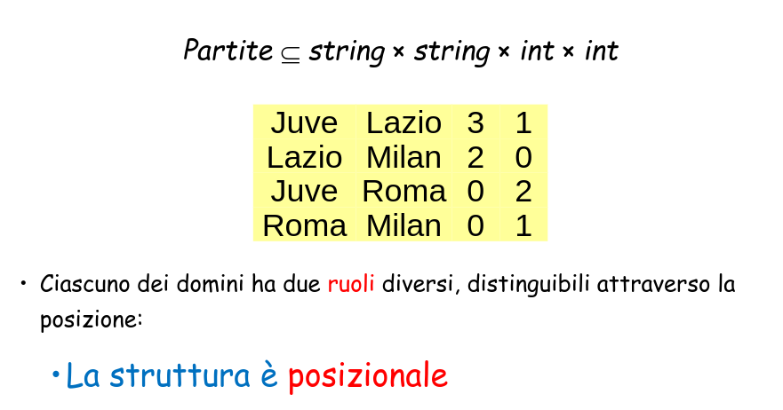
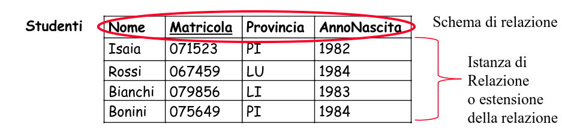
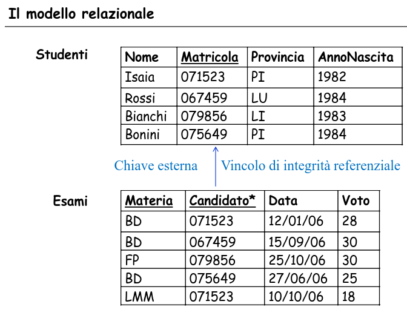

# Basi di Dati Capitolo 3

[Link alle slides](https://elearning.di.unipi.it/pluginfile.php/77030/mod_resource/content/2/4a.ModelloRel_progLogica_Parte_II.pdf)

## Trasformazione di Schemi

Si tratta di tradurre lo schema concettuale in uno schema logico relazionale che rappresenti gli stessi dati in maniera corretta ed efficiente.
Questo richiede una ricostruzione del modello concettuale

- Osservazione:
  - Non si tratta di una pura e semplice traduzione.
    Infatti:
    alcuni costrutti dello schema concettuale non sono direttamete rappresentabiili
    e ne modello logico è necessario tenere conto delle prestazioni.

**Trasformare uno schema a oggetti in uno schema relazionale avviene nei seguenti passi:**

1. rappresentazione delle associazioni uno ad uno e uno a molti;
2. rappresentazione delle associazioni molti a molti o non binarie
3. rappresentazione delle gerarchie di inclusione
4. identificazione delle chiavi primarie
5. rappresentazione degli attributi multivalore
6. appiattimento degli attributi composti

con l'obiettivo di rappresentare le stesse informazioni, minimizzando la ridondanza e producendo uno schema comprensibile per facilitare la scrittura e manutenzione delle applicazioni.

### Esempio di Schema Concettuale

  

## Il modello relazionale

Proposto da E.F Codd nel 1970 per favorire l'indipendenza dei dati.

- Si basa sul concetto di Relazione (come in fodamenti)
- Le relazioni hanno naturale rappresentazione per mezzo di tabelle

- **Relazione matematica:** D_1, ..., D_n

- **Prodotto cartesiano:** D_1 x .... x D_n

- **Relazione matematica:** su D_1 , ..., D_n

_Oss:_ una relazione è un insieme; quindi:

- non c'è ordinamento fra le n-uple;
- le n-uple sono distinte;
- ciascuna n-upla è ordinata: l'i-esimo valore proviene dall'i-esimo dominio

  

Una tabella rappresenta una relazione se:

- i valori di ogni colonna sono fra loro omogenei
- le righe sono diverse fra loro
- le intestazioni delle colonne sono diverse tra loro

In una tabella che rappresenta una relazione:

- l'ordinamento tra le righe è irrelevante
- l'ordinamento tra le colonne è irrelevante

Il modello relazionale è basato su valori
Ciò significa che i riferimenti fra dati in relazioni diverse sono rappresentati per mezzo di valori dei domini che compaiono nelle ennuple.

**Schemi e istanze:**

- In ogni base di dati si distinguono:
- lo schema, sostanzialmente invariante nel tempo, che ne descrive la struttura (aspetto intensionale).
- l'istanza, i valori attuali, che possono cambiare anche molto rapidamente (aspetto estensionale)

Il corpo di ciascuna tabella

  

_Definizione:_ I meccanismi per definire una base di dati con il modello relazionale sono l'ennupla e la relazione:

- un tipo ennupla T è un insieme finito di coppie (Attributo, Tipo Elementare);
- se T è un tipo ennupla, R(T) è lo schema della relazione R;
- lo schema di una base di dati è un insieme di schemi di relazione R_i(T_i)
- un'istanza di uno schema R(T) è un insieme finito di ennuple di tipo T.

- Uguaglianza di de tipi ennupla, due ennuple, due tipi relazione.

**Vantaggi della struttura basata su valori**

- Indipendenza dalle strutture fisiche (si potrebbe avere anche con puntatori di alto livello) che possono cambiare dinamicamente. La rappresentazione logica dei dati non fa riferimento a quella fisica.
- si rappresenta solo ciò che è rilevante dal punto di vista dell'applicazione.
- I dati sono portabili più facilmente da un sistema ad un altro.
- I puntatori sono direzionali.

_Schema (riepilogo)_

- Schema di relazione:
  un nome R con un insieme T di attributi A_1, ..., A_n:
  R(T) = R(A_1,...,A_n)

- Schema di base di dati:
  insieme di schemi di relazione:
  R = {R_1(X_1), ..., R_k(X_k)}

  Dove X_1,...,X_k sono insiemi di attributi

- Una tupla su un insieme di attributi T, denotata con t, è una funzione che associa a ciascun attributo A in T un valore del dominio di A.

- t[A] denota il valore della tupla t sull'attributo A belongs T
- t[X] denota i valori della tupla t sugli attributi X belongs T

- Un'istanza di relazione o relazione su uno schema R(X) è l'insieme r di tuple su X
- Un'istanza di base di dati su uno schema
  R={R_1(X_1),...,R_n(X_n)}
  è l'insieme delle relazioni r = {r_1,...,r_n}

_Valore nullo:_ denota l'assenza di un valore del dominio (e non è un valore del dominio)

- t[A] per ogni attributo A, è un valore del dominio dom(A) oppure il valore nullo NULL

_Vincoli di integrità_: è costituito da un insieme di schemi di relazione e da un insieme di vincoli d'integrità sui possibili valori delle estensioni delle relazioni.

_Uno schema relazionale_ è costituito da un insieme di schemi di relazione e da un insieme di vincoli d'integrità sui possibili valori delle estensioni delle relazioni.

Un vincolo è espresso mediante una funzione booleana (un predicato): associa ad ogni istanza il valore vero o falso.

- Descrizione più accurata della realtà
- Contributo alla "qualità dei dati"
- Utili nella progettazione
- Usati dai DBMS nella esecuzione delle interrogazioni
- Non tutte le proprietà di interesse sono rappresentabili per mezzo di vincoli formulabili in modo esplicito.

_vincoli intrarelazionali:_

- sono i vincoli che devono essere rispettati dai valori contenuti nell relazione considerata.
- vincoli su valori (o di dominio)
- vincoli di ennupla

_vincoli interrelazionali:_
sono i vincoli che devono essere rispettati da valori contenuti in relazioni diverse

_vincoli di ennupla_: esprimono condizioni sui valori di ciascuna ennupla, indipendentemente da altre ennuple.

Caso particolare:
_Vincoli di dominio:_ coninvolgono un solo attributo

  

_Informalmente_: una chiave è un insieme di attributi che identificano le ennuple in una relazione.

_Formalmente:_ Un insieme K di attributi è superchiave per r se r non contiene due ennuple (distinte) t_1 e t_2 con t_1[k] = t_2[k]

_K_ è chiave per r se è una superchiave minimale per r (cioè non contiene un'altra superchiave).

I vincoli corrispondono a proprietà del mondo reale modellato dalla base di dati.

Interessano a livello di schema.

ad uno schema associamo un insieme di vincoli e consideriamo corrette le istanze che soddisfano tutti i vincoli.

Un'istanza può soddisfare altri vincoli.

- Una relazione non può contenere ennuple distinte ma con valori uguali (una relazione è un sottoinsieme del prodotto cartesiano)

- Ogni relazione ha sicuramente come superchiave l'insieme di tutti gli attributi su cui è definita.

- e quindi ogni relazione ha almeno una chiave.

- l'esistenza delle chiavi garantisce l'accessibilità a ciascun dato della base di dati.

- le chiavi permettono di correlare i dati in relazioni diverse:
  - il modello relazionale è basato su valori.

Una chiave primaria è una chiave su cui non sono ammessi valori nulli

- Notazione: sottolineatura.

**Integrità referenziale**

Nel modello relazionale le informazioni in relazioni diverse sono correlate attraverso valori comuni.

In particolare, vengono spesso presi in considerazione i valori delle chiavi (primarie)

Le correlazioni devono essere coerenti.

  

Un vincolo di integrità referenziale ("foreign key") fra gli attributi X di na relazione R_1 e un'altra relazione R_2 impone ai valori su X in R_1 di comparire come valori della chiave primaria di R_2.
