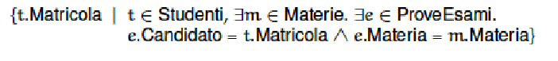

# Basi di Dati Capitolo 4

[Link alle slides](https://elearning.di.unipi.it/pluginfile.php/77038/mod_resource/content/2/4b.ModelloRel_AlgebraRelazionale_Parte_I.pdf)

## Algebra relazionale

_Operazioni sullo schema_

- **DDL: Data Definition Language**
  Operazioni di creazione, cancellazione e modifica di schemi di tabelle, creazioni viste, creazione indici.

_Operazioni sui dati_

- **DML: Data Manipulation language**
  - _data query language:_ Query o interrogazione della base di dati
  - _Aggiornamento dati:_ Inserimento, cancellazione e modifica di dati

### Linguaggi Relazionali

- Algebra relazionale: insieme di operatori su relazioni che danno come risultato relazioni.

- Non si usa come linguaggio di interrogazione dei DBMS ma come rappresentazione interna delle interrogazioni.

- Calcolo relazionale: linguaggio dichiarativo di tipo logico dal quale è stato derivato l'SQL

### Gli operatori dell'algebra relazionale

- unione, intersezione, differenza
- ridenominazione
- selezione
- proiezione
- join (join naturale, prodotto cartesiano, theta-join)

### Operatori Insiemistici

- le relazioni sono insiemi
- i risultati devono essere relazioni
- è possibile applicare unione, intersezione, differenza solo a relazioni definite sugli stessi attributi (nome e tipo), cioè possono operare solo su tuple uniformi.

• Unione: R U S
• Differenza: R – S
• Qual è il tipo del risultato? Se R e S hanno n elementi, quanti ne ha
il risultato?
• Se t1 è un'ennupla non in R , allora:
• R = (R U {t_1}) – {t_1}
• operatore monadico (con un argomento)
• "modifica lo schema" lasciando inalterata l'istanza dell'operando
• È indicato con la lettera rho

  

### Selezione (Restrizione)

- operatore monadico
- produce un risultato che:
  - ha lo stesso schema dell'operando
  - contiene un sottoinsieme delle ennuple dell'operando
  - quelle che soddisfano una condizione espressa combinando, con i connettivi logici and, or, not, condizioni atomiche del tipo A theta B oppure A theta C dove theta è un oepratore di confronto. A e B sono atributi su cui l'operatore theta abbai senso, c una costante compatibile col dominio di A.
    È denotata con sigma, con la condizione messa a pedice.

  

  

_Selezione e proiezione_: combinando selezione e proiezione, possiamo estrarre interessanti informazioni da una relazione.

_Combinando selezione e proiezione_, possiamo estrarre informazioni da una relazione, ma non possiamo però correlare informazioni presenti in relazioni diverse.

Il join è l'operatore più interessante dell'algebra relazionale poichè permette di correlare dati in relazioni diverse.

**Join Naturale**

  

È un operatore binario che correla dati in relazioni diverse, sulla base di valori uguali in attributi con lo stesso nome.

- Produce un risultato:
- sull'unione degli attributi degli operandi
- con ennuple che sono ottenute combinando le ennuple degli operandi con valori uguali sugli attributi in comune.

  

  

### Join esterno, interno, sinistro, destro, completo

  

**Il prodotto cartesiano:** è un join naturale senza attributi in comune e contiene sempre un numero di ennuple pari al prodotto dlle cardinalità degli operandi (le ennuple sono tutte comabinabili)

**Theta-join ed equi-join**

- Prodotto cartesiano: concatena tuple non necessariamente correlate dal punto di vista semantico.

è più utile se fatto seguire da una selezione.
Prodotto cartesiano seguito dalla selezione che mantiene solo le tuple con valori uguali sull'attributo:
Reparto di Impiegati e codice di reparti.

### Theta-join

- Il prodotto cartesiano, in pratica, ha senso solo se seguito da selezione:
  sigma_condizione (R_1 |><| R_2)

- L'operazione viene chiamata theta-join e può essere sintatticamente indicata con
  R_1 |><|\_condizione R_2

#### Perchè theta-join?

La condizione C è spesso una congiunzione di atomi di confronto A_1 theta-join A_2 dove theta_join è uno degli operatori di confronto (=, >,<,...)

- se l'operatore è sempre l'uguaglianza (=) allora si parla di equi-join

  

### Self Join

Supponiamo di considerare la seguente relazione.

  

e di voler ottenere una relazione Nonno-Nipote.

  

Una selezione congiuntiva può essere sostituita da una cascata di selezioni atomiche.

Una proiezione può essere trasformata in una cascata di proiezioni che eliminano i vari attributi in fasi diverse se E è definita su un insieme di attributi che contiene Y oltre che X.

pi*X(E) = pi_X(pi*{XY}(E))

Anticipazione della proiezione rispetto al join (Pushing projections down):
Non ha effetto sull'efficienza ma sulla leggibilità.

In generale se R_1 ed R_2 sono definite sll'insieme di attributi X = AB, e contengono tuple uguali s A e diverse su B.

Il Calcolo relazionale è un linguaggio che permette di definire il risultato di un'interrogazione come l'insieme di quelle ennuple che soddisfano una certa condizone phi

- L'insieme delle matricole degli studenti che hanno superato qualcuno degli esami elencati nella relazione Materie(Materia), si può definire come:

  

Che è equivalente a:

  

