# Basi di Dati Capitolo 5

[Link alle slides](https://elearning.di.unipi.it/pluginfile.php/77549/mod_resource/content/2/6.SQLInterattivo_mod_Parte_I.pdf)

## SQL

```sql
SELECT s.Nome, e.Data
FROM Studenti s, Esami Esami
WHERE e.Materia = 'BD' AND e.Voto = 30 AND e.Matricola = s.Matricola

SELECT s.Name As Nome, 2018 - s.AnnoNascita As Eta, 0 As NumeroEsami

FROM Studenti s
WHERE NON EXISTS (SELECT * FROM Esami e WHERE e.Matricola = s.Matricola)
```

### DML (Data manipulation language) vs DDL (Data definition language)

**Sintassi di SELECT**
SELECT listAttributi
FROM ListaTabelle
[WHERE Condizione]

**Specifica la:**

- target list,
- la clausola FROM per stabilire in quale/quali tabella/e sono contenuti i dati che ci servono
- clausola WHERE per esprimere le condizioni che i dati cercati devono soddisfare

### La target list implementa l'operazione di proiezione edll'algebra relazionale

<p align="center">
  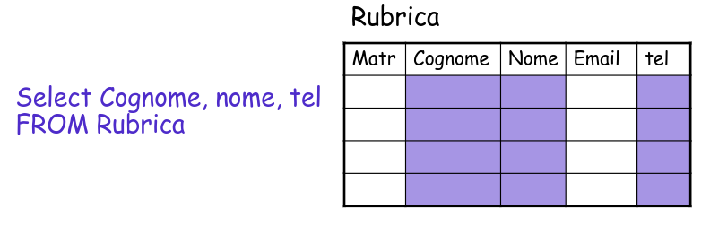
</p>

### WHERE

Serve a scegliere le righe della tabella che soddisfano una certa condizione. In questo modo la clausola where implementa la selezione dell'algebra relazionale.

### FROM

La clausola FROM ha lo scopo di scegliere quali sono le tabelle del database da cui vogliamo estrarre le nostre informazioni.
FROM e WHERE insieme implementano un theta join

### SELECT

```sql
SELECT ListaAttributi
FROM ListaTabelle
[ WHERE Condizione ]

```

- La query considera il prodotto cartesiano tra le tabelle in ListaTabelle(JOIN)

- Fra queste seleziona solo le righe che soddisfano la Condizione(SELEZIONE) e infine valuta le espressioni specificate nella target list ListaAttributi(PROIEZIONE)

- La SELECT implementa quindi gli operatori di Proiezione, Selezione e Join dell'algebra relazionale.

### SQL PER INTERROGARE: SELECT FROM WHERE

- SQL è un calcolo su multiinsiemi

<p align="center">
  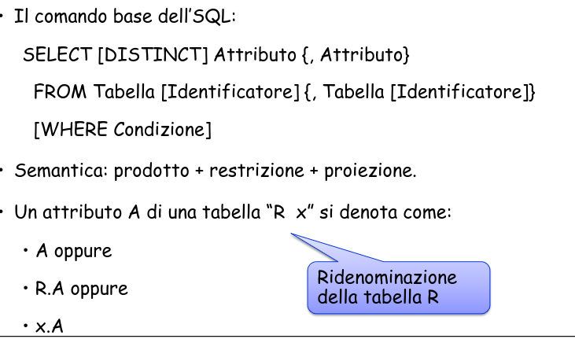
</p>

**La lista degli attributi**

<p align="center">
  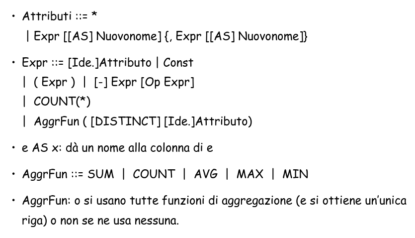
</p>

**La lista delle tabelle**

- Le tabelle si possono combinare usando:

<p align="center">
  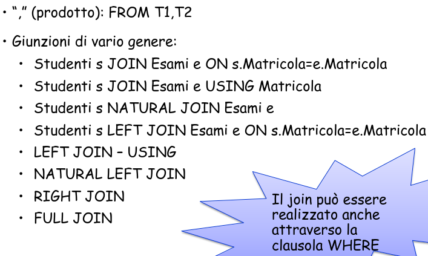
</p>

### Effettuare la selezione dell'algebra relazionale mediante la clausola WHERE

- La clausola WHERE permette infatti di specificare le condizioni che devono soddisfare le righe cercate.
- Ovviamente la clausola WHERE è opzionale, e se si omette, si selezionano tutte le righe della tabella specificata.

```sql
SELECT nome, eta, reddito
FROM persone
WHERE eta < 30
```

Nome e reddito delle persone con meno di trenta anni

pi*nome, Reddito (sima*{Eta<30}(Persone))

### AS , IN , AND , NOT , OR , LIKE , \_ , % , IS NULL

```sql
SELECT *
FROM Insegnanti
WHERE corso IN ('BD1', 'BD2', 'Algoritmi', 'Sistemi')
```

'\_' -> denota un carattere

% -> denota zero o più caratteri

_Esempio di LIKE_

```sql
SELECT *
FROM persone
WHERE name LIKE '%a'
```

oppure

```sql
SELECT *
FROM persone
WHERE name LIKE '%G___G'
```

### ORDER BY

Genera così un ordine alfbetico e può essere ASC or DESC

```sql
SELECT nome, reddito
FROM persone
WHERE reddito < 30
ORDER BY nome
```

### 5 operatori aggregati

• Conteggio (COUNT),
• Minimo (MIN),
• Massimo(MAX),
• Media (AVG),
• Somma (SUM)

### (\*) , ALL , DISTINCT

- (\*) -> TUTTE LE RIGHE SELEZIONATE

- ALL -> TUTTI I VALORI NON NULLI DELLE RIGHE SELEZIONATE

- DISTINCT -> TUTTI I VALORI NON NULLI DISTINTI DELLE RIGHE SELEZIONATE

Di default è ALL

Le funzioni di aggregazione non posono essere usate con attributi normali

### GROUP BY

Un raggruppamento deve essere effettuato su tutti gli elementi della target list che non sono operatori aggregati.

### HAVING

Si usa se se la condizione coinvolge un operatore aggregato altrimenti basta WHERE

HAVING SOLO DOPO GROUP BY E SOLO IN PRESENZA DI UN GROUP BY

**SINTASSI RIASSUNTO**

<p align="center">
  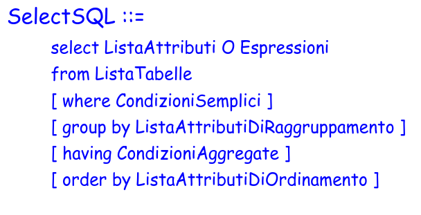
</p>

## SQL E ALGEBRA RELAZIONALE

<p align="center">
  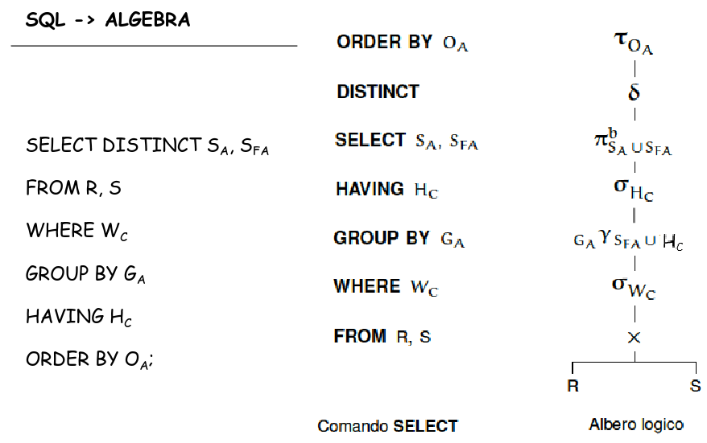
</p>

### JOIN

**Cross Join**
Implementa il prodotto cartesiano, basta usare SELECT e le due o più tabelle coinvolte

```sql
SELECT categorie.*, Fabbriche.*
FROM Categorie, Fabbriche
```

• Se due tabelle del database contengono dei dati in comune, possono
essere correlate mediante un’operazione di JOIN.

• Le colonne delle due tabelle che creano la correlazione rappresentano la
stessa entità, ossia i loro valori appartengono allo stesso dominio.

• In genere le colonne delle due tabelle considerate sono legate da un
vincolo di chiave esterna (ma non è obbligatorio

**Join (equi-join)** fra due tabelle è una terza tabella le cui righe sono tutte e sole quelle ottenute dal prodotto cartesiano delle righe delle due tabelle di partenza i cui valori delle colonne espresse dalla condizione di join sono uguali.

- Il join è una forma particolare di SELECT in cui, FROM indica le due tabelle coinvolte e in WHERE viene espresso il collegamento fra le due tabelle, mediante la condizione di join.

<p align="center">
  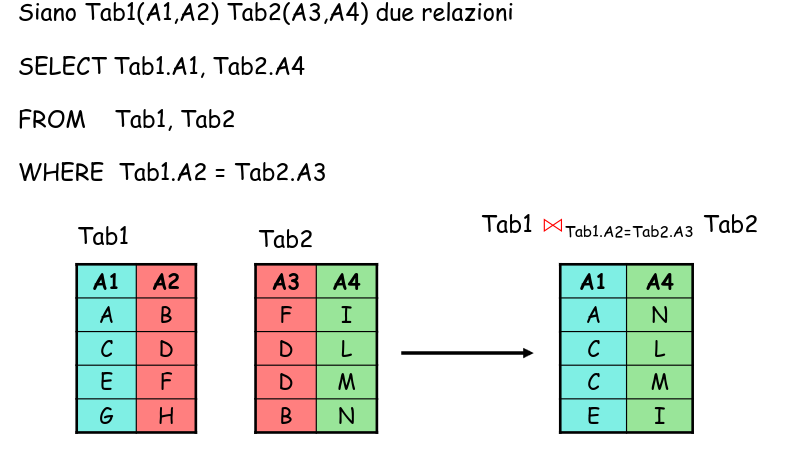
</p>

<p align="center">
  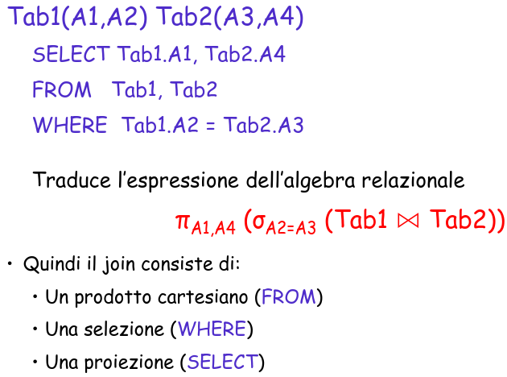
</p>

### INNER-JOIN

Come il join ma la condizione non è necessariamente un uguaglianza

### SELF-JOIN

Un caso particolare di Join è quello che mette in relazione una tabella con se stessa. Questo si può ottenere ridenominando due volte la tabella con nomi diversi, trattandole come due tabelle diverse.

```sql
SELECT X.A1, Y.A4
FROM Tab1 X, Tab2 Y, Tab1 Z
WHERE X.A2 = Y.A3 AND X.A2 = Z.A1
```

### JOIN usando JOIN

```sql
SELECT Attributi
FROM Tab1 JOIN Tab2
ON CondizioneDiJoin
```

### NATURAL JOIN

Se dobbiamo operare una equi-join, ossia un join la cui condizione sia una condizione di uguaglianza, e che sia anche un Natural Join, ossia un join creato su tutte le colonne che hanno il medesimo nome in entrambe le tabelle, possiamo utilizzare la seguente sintassi.

```sql
SELECT listaAttributi
FROM Tab1 NATURAL JOIN Tab
```

### USING

Se invece vogliamo operare una join in cui la condizione riguarda solo una o alcune di queste coppie, si usa la clausola USING seguita dall’elenco degli attributi coinvolti nella condizione.

```sql
SELECT lista attributi
FROM Tab1 JOIN Tab2
USING (attr1,attr2,…)
```

### OUTER JOIN

• Quando vengono correlate mediante una join delle tabelle con colonne
contenenti dati in comune, è possibile che un valore sia presente in una delle
colonne e non nell’altra.
• Effettuando un equi-join la riga corrispondente a tale valore viene scartato.
• In alcuni casi invece può essere necessario mantenere questi valori. Per fare
questo si deve effettuare un outer join.

```sql
Select lista_attributi
From Tab1 LEFT [OUTER] JOIN Tab2

Select lista_attributi
From Tab1 RIGHT [OUTER] JOIN Tab2

Select lista_attributi
From Tab1 FULL [OUTER] JOIN Tab2
```

## SUBQUERY

è un comando select racchiuso tra parentesi tonde, inserito all'interno di un comando SQL.

<p align="center">
  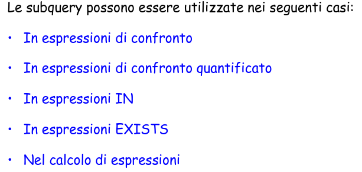
</p>

### Tipi di Subquery

<p align="center">
  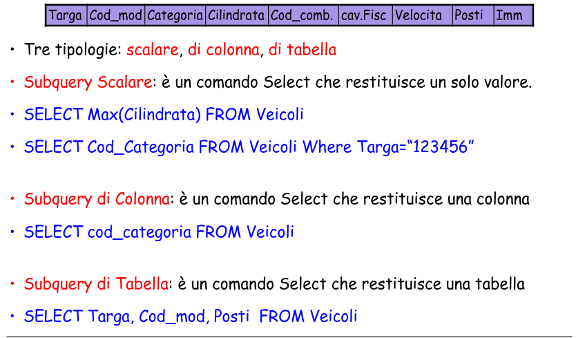
</p>

<p align="center">
  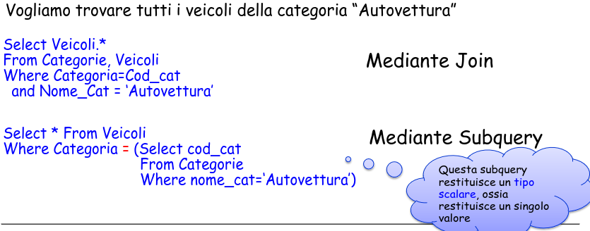
</p>

Nelle select semplici non è possibile utilizzare contemporaneamente funzioni di gruppo e funzioni su singole righe. Questo viene reso possibile mediante l’uso delle subquery.

<p align="center">
  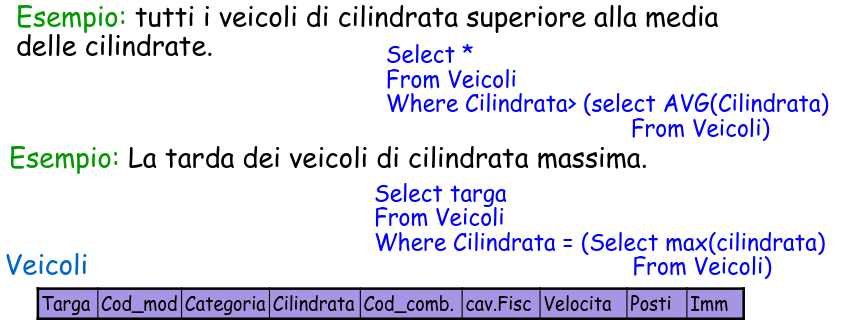
</p>

### Subquery + Join

<p align="center">
  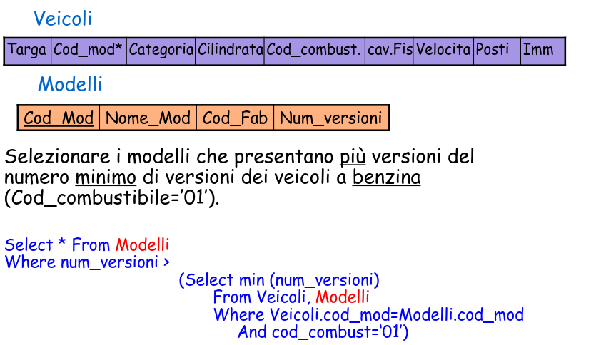
</p>

### Subquey Annidate

<p align="center">
  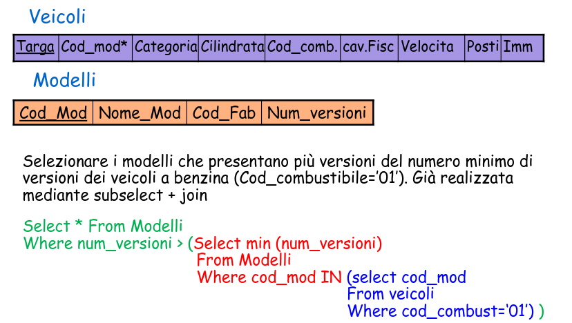
</p>

### Interrogazioni Nidificate, commenti

• La forma nidificata è meno dichiarativa, ma talvolta più leggibile (richiede meno variabili)

• La forma piana e quella nidificata possono essere combinate

• Le subquery non possono contenere operatori insiemistici

• Il problema si supera facilmente con intersezione e differenza (per cui esiste una forma alternativa) ma non sempre per l’unione

• regole di visibilità simili a quelle delle procedure nei linguaggi di
programmazione:

- non è possibile fare riferimenti a variabili definite in blocchi più interni
- se un nome di variabile è omesso, si assume riferimento alla variabile più “vicina”

• in un blocco si può fare riferimento a variabili definite in blocchi più
esterni

<p align="center">
  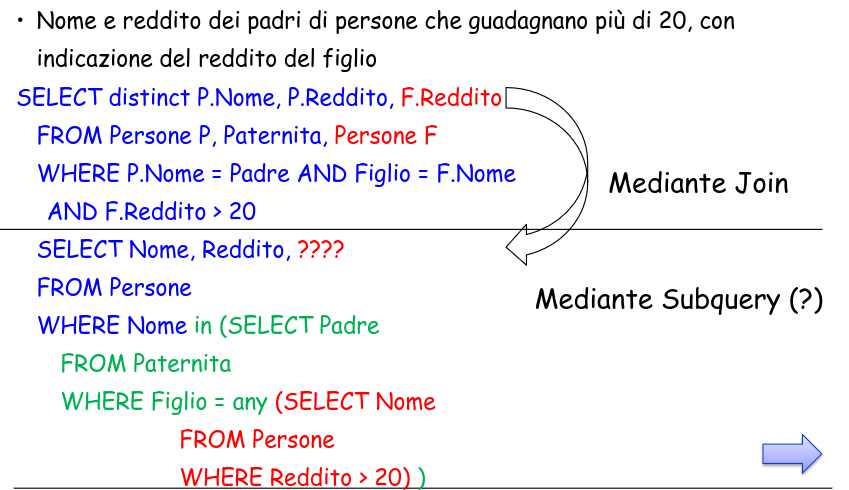
</p>

Query nidificate possono essere “meno dichiarative” in un certo senso ma spesso sono più facilmente interpretabili, in quanto si possono suddividere in blocchi più semplici da interpretare.

• L’utilizzo di variabili deve rispettare le regole di visibilità cioè, una variabile può essere usata solo all’interno dello stesso blocco e in un blocco più interno.

• Comunque, query nidificate complesse possono essere di difficile comprensione, soprattutto quando si usano molte variabili comuni tra blocchi diversi.

## Quantificazione

Tutte le interrogazioni su di una associazione multivalore vanno quantificate

<p align="center">
  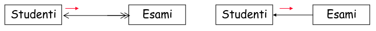
</p>

• Gli studenti che hanno preso sempre (o solo) 30: universale
• Gli studenti che hanno preso qualche (almeno un) 30: esistenziale
• Gli studenti che non hanno preso qualche 30 (senza nessun 30): universale
• Gli studenti che non hanno preso sempre 30: esistenziale

- Universale negata = esistenziale

- Esistenziale negata = universale

### ANY , ALL , EXISTS

<p align="center">
  
</p>

#### Regole per subquery di confronto quantificato

- La subquery deve essere di colonna
- La subquery deve essere inserita DOPO l'operatore di confronto quantificato
- Non è ammesso il confronto tra due subquery
- Nella subquery non è possibile utilizare le clausole having e group by

### EXISTS

<p align="center">
  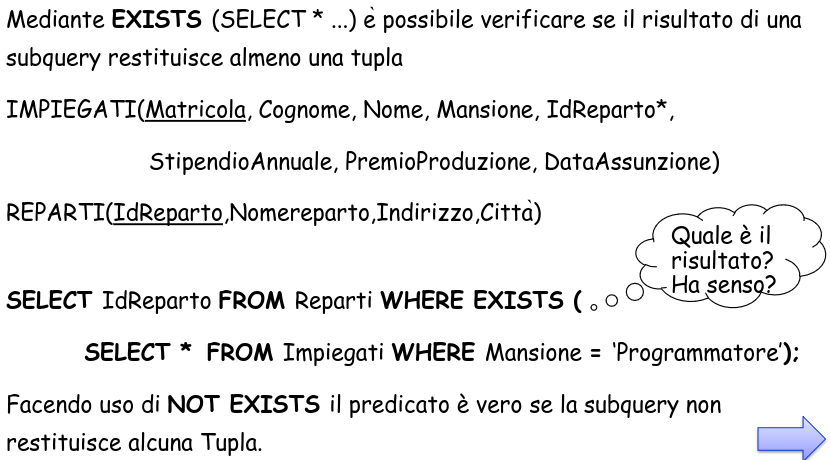
</p>

Occorre un meccanismo per rendere la più flessibile la clausola exists, rendendo le condizioni della subquery dipendenti dalla tupla della query principale.

- Si introduce un legame fra la query e la subquery (query correlate)
- Si definisce una variabile (un alias) nella query esterna, che si utilizza nella subquery

<p align="center">
  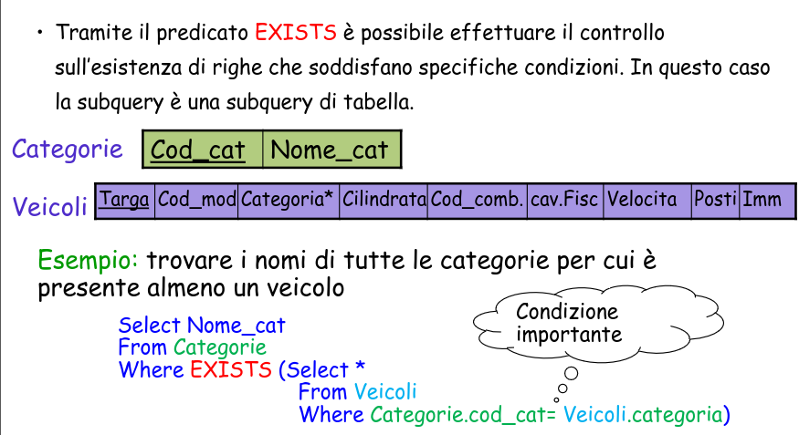
</p>

<p align="center">
  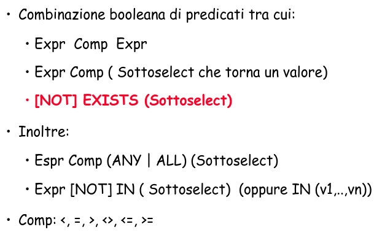
</p>

### Semantica delle espressioni correlate

<p align="center">
  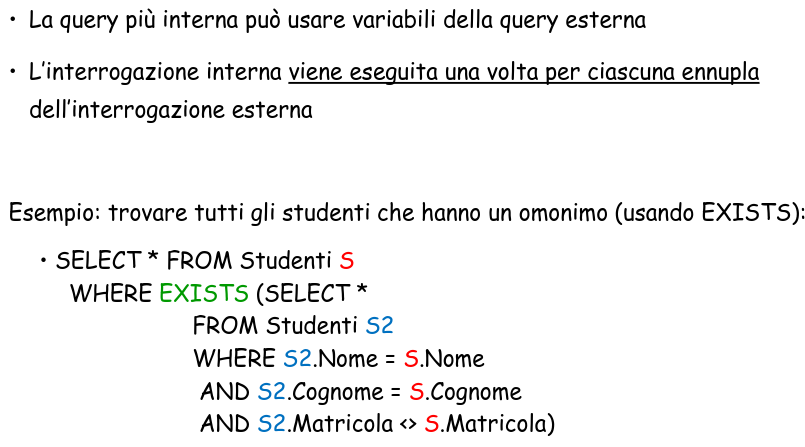
</p>

<p align="center">
  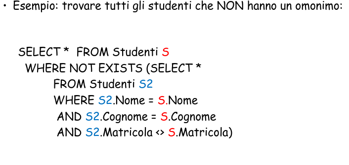
</p>

<p align="center">
  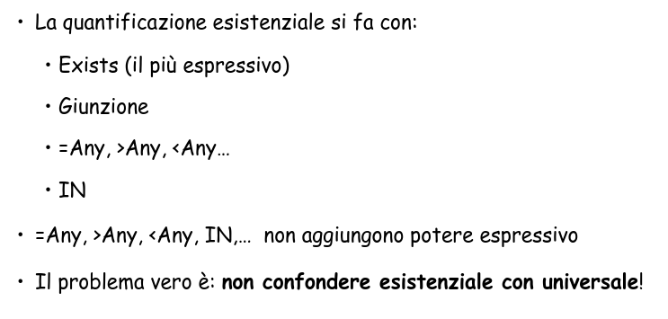
</p>

## La quantificazione UNIVERSALE

### <> ALL , ANY

## Unione, Intersezione, Differenza

A volte può essere utile poter ottenre un'unica tabella contente alcuni dei dati contenuti in due tabelle omogenee, ossia con attributi definiti sullo stesso dominio.

### Union

```sql
SELECT padre as genitore, figlio
FROM paternità
UNION
SELECT madre as genitore, figlio
FROM maternità
```

### Except

```sql
SELECT Nome
FROM Impiegato
EXCEPT
SELECT Cognome as Nome
FROM Impiegato
```

oppure

```sql
SELECT nome
FROM Impiegato
WHERE nome<>All[not in]
(SELECTcognome
FROM Impiegato)
```

## SQL PER LA MODIFICA DI BASI DI DATI

Introduciamo ora il Data Manipulation Language (DML) ossia il linguagio SQL che serve per inserire, modificare e cancellare i dati del database, ma anche per interrogare il database, ossia estrarre i dati dal database.

Inizialmente descriveremo le istruzioni che servono a inserire, cancellare e modificare i dati.

- INSERT INTO

- UPDATE

- DELETE FROM

### Insert semplice

```sql
INSERT INTO Esami (Corso, Matricola, Voto)
VALUES (‘DB1’, ‘123456’, 27)
```

### Delete

```sql
DELETE FROM Esami
WHERE Matricola = ‘123456'
```

### Update

```sql
UPDATE Aule
SET Aula = 7
WHERE Aula = 3
```
