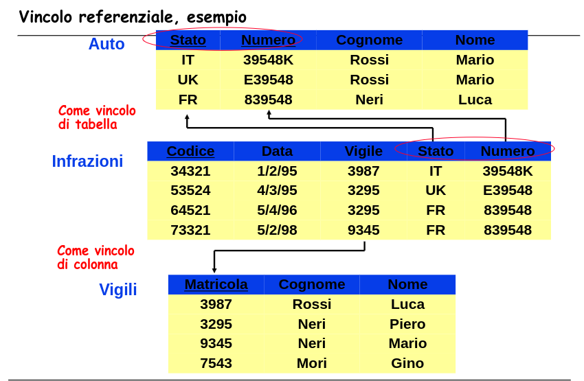
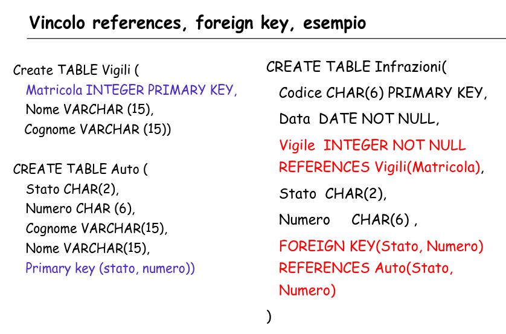
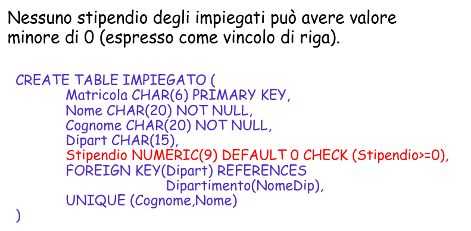
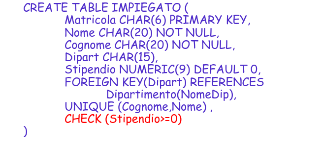
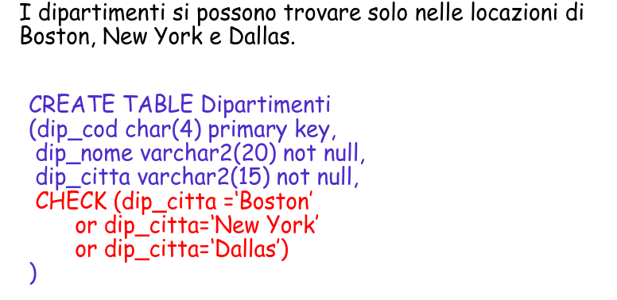
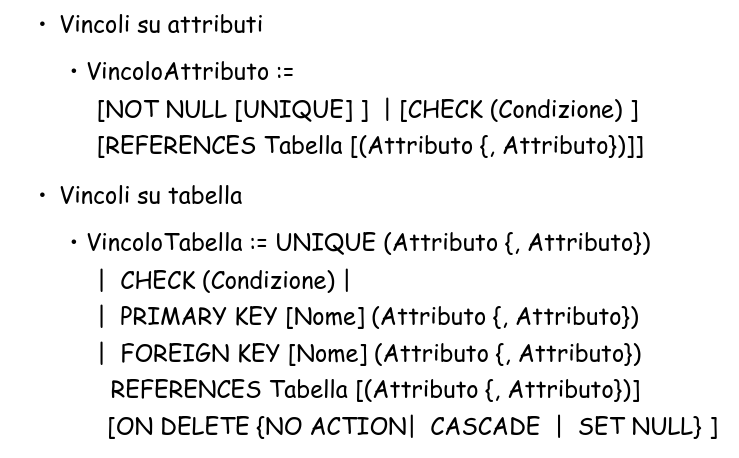

# Basi di Dati Capitolo 6

[Link alle slides](https://elearning.di.unipi.it/pluginfile.php/77729/mod_resource/content/1/7.SQLDefinizioneDati.pdf)

## Data Definition Language (DDL) SQL

Creazione, modifica, cancellazione delle tabelle, dei domini e degli altri oggetti del database, al fine di definire il suo schema logico.

### Definizione delle tabelle

CREATE TABLE, definisce uno schema di relazione e ne crea un'istanza vuota, specifica attributi, domini e vincoli.

DESCRIBE impiegato

• CREATE SCHEMA Nome AUTHORIZATION Utente
• CREATE TABLE o VIEW, con vincoli
• CREATE INDEX
• CREATE PROCEDURE
• CREATE TRIGGER

### I tipi

• CHAR(n) per stringhe di caratteri di lunghezza fissa n;
• VARCHAR(n) per stringhe di caratteri di lunghezza variabile di al massimo n
caratteri;
• INTEGER per interi con la dimensione uguale alla parola di memoria standard
dell’elaboratore;
• REAL per numeri reali con dimensione uguale alla parola di memoria standard
dell’elaboratore;
• NUMBER(p,s) per numeri con p cifre, di cui s decimali;
• FLOAT(p) per numeri binari in virgola mobile, con almeno p cifre significative;
• DATE per valori che rappresentano istanti di tempo (in alcuni sistemi, come
Oracle), oppure solo date (e quindi insieme ad un tipo TIME per indicare ora,
minuti e secondi).

### I caratteri per manipolare CREATE

Si usa DROP per eliminare una tabella creata con create e e si camia con il comando ALTER.

Con il comando ALTER TABLE è possibile (standard sql)

1. Aggiungere una colonna (ADD [COLUMN])
2. Eliminare una colonna (DROP [COLUMN])
3. Modificare la colonna (MODIFY)
4. Aggiungere l’assegnazione di valori di default (SET DEFAULT)
5. Eliminare l’assegnazione di valori di default (DROP DEFAULT)
6. Aggiungere vincoli di tabella (ADD CONSTRAINT)
7. Eliminare vincoli di tabella (DROP CONSTRAINT)
8. Altre opzioni sono possibili nei linguaggi specifici (vedi manuali)

## I vincoli

### Intrarelazionali

- _I vincoli di integrità_ consentono di limitare i valori ammissibili per una determinata colonna della tabella in base a specifici criteri.

- I vincoli di integrità intrarelazionali (ossia che non fanno riferimento ad altre relazioni) sono:
  - NOT NULL
  - UNIQUE
  - PRIMARY KEY
  - CHECK

UNIQUE è una chiave della relazione ma non una chiave primaria

```sql
CREATE TABLE Impiegato(
Matricola CHAR(6) PRIMARY KEY,
Codice_fiscale CHAR(16) UNIQUE,
Nome VARCHAR(20) NOT NULL,
Cognome VARCHAR(20) NOT NULL,
Dipart VARCHAR(15),
Stipendio NUMBER(9) DEFAULT 0,
FOREIGN KEY(Dipart) REFERENCES Dipartimento(NomeDip),
UNIQUE (Cognome,Nome)
)
```

Il _vincolo di unicità_ può anche essere riferito a coppie o insiemi di attributi.
con UNIQUE(lista di attributi)

```sql
CREATE TABLE Impiegato(
Matricola CHAR(6) PRIMARY KEY,
codice_fiscale CHAR(16) UNIQUE,
Nome VARCHAR(20) NOT NULL,
Cognome VARCHAR(20) NOT NULL,
Dipart VARCHAR(15),
Stipendio NUMBER(9) DEFAULT 0,
FOREIGN KEY(Dipart) REFERENCES Dipartimento(NomeDip),
UNIQUE (Cognome,Nome)
)
```

### Chiave primaria

Due forme:

- nella definizione di un attributo, se formato da solo la chiave
- come elemento separato
  Il vincolo PRIMARY KEY è simile a UNIQUE ma definisce la chiave primaria della relazione, ossia un attributo che invidua univocamente un dato.

Implica sia il vincolo UNIQUE che il vincolo NOT NULL (non è ammesso che per uno degli elementi della tabella questo valore sia non definito).
Serve ad identificare univocamente i soggetti del dominio. Questo vincolo permette spesso il collegamento tra due tabelle

```sql
CREATE TABLE Impiegato(
Matricola CHAR(6) PRIMARY KEY,
Codice_fiscale CHAR(16) UNIQUE,
Nome VARCHAR(20) NOT NULL,
Cognome VARCHAR(20) NOT NULL,
Dipart VARCHAR(15),
Stipendio NUMBER(9) DEFAULT 0,
FOREIGN KEY(Dipart) REFERENCES Dipartimento(NomeDip),
UNIQUE (Cognome,Nome)
)
```

anche primary key può essere definito su un insieme di elementi. In tal caso la sintassi è simile a quella di unique.

`Primary key(lista attributi)`

```sql
CREATE TABLE Studente(
Nome VARCHAR(20),
Cognome VARCHAR(20),
nascita DATE,
Corso_Laurea VARCHAR(15),
Facolta VARCHAR (20)
PRIMARY KEY(Cognome,Nome, Nascita)
)
```

### Vincoli Interrelazionali

Sono quei vincoli che vengono imposti quando gli attributi di due diverse tabelle devono essere messi in relazione.

- Creati per rispettare la non ridondanza nei db e per avere i dati sincronizzati.

- Se due tabelle gestiscono gli stessi dati, è bene che di essi non ce ne siano più copie, sia allo scopo di non occupare troppa memoria, sia affinchè le modifiche fatte sui dati uguali utilizzati da due tabelle siano coerenti.

`REFERENCES` e `FOREIGN KEY` permettono di definire vincoli di integrità referenziale.

- di nuovo due sintassi
- per singoli attributi (come vincolo di colonna)
- su più attributi (come vincolo di tabella)

Possibile definire politiche di reazione alla violazione.

### Vincolo di chiave esterna come vincolo di colonna

```sql
CREATE <nome_tabella>
(attributo_1 …,
attributo_2 …,
…
attributo_n …,
FOREIGN KEY (col_referenti) REFERENCES
tab_riferita(col_riferite)
…
)
```

### Vincolo referenziale, esempio

<p align="center">
  
</p>

<p align="center">
  
</p>

### Vincolo: CHECK

Un vincolo di CHECK richiede che una colonna o una combinazione di colonne, soddisfi una condizione per ogni riga della tabella.
Il vincolo CHECK deve essere una espressione booleana che è valutata usando i valori della coonna che vengono inseriti o aggiornati nella riga.

Può essere espresso sia come vincolo di riga che come vincolo di tabella.

Se è espresso coem vincolo di riga, può coinvolgere solo la'attributo su cui è definito, mentre se serve eseguire un check che coinvolge due o più attributi, si deve definire come vincolo di tabella.

#### CHECK ESEMPIO

<p align="center">
  
</p>

<p align="center">
  
</p>

<p align="center">
  
</p>

### Vincoli di integrità: CHIAVI E GENERALI

<p align="center">
  
</p>
