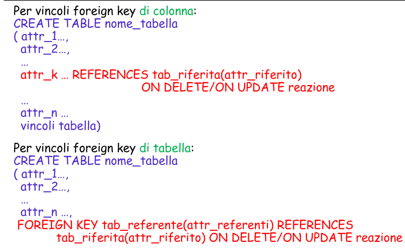
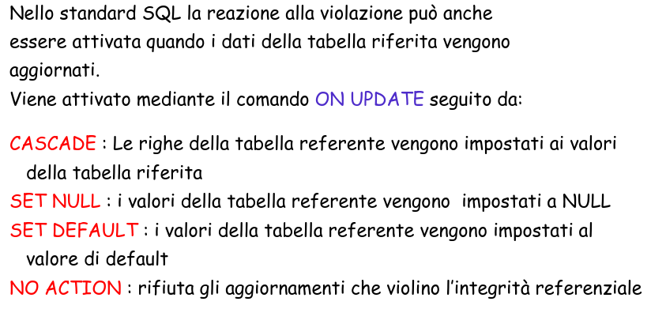
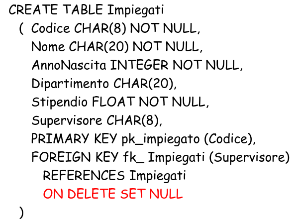
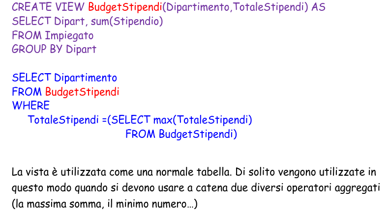
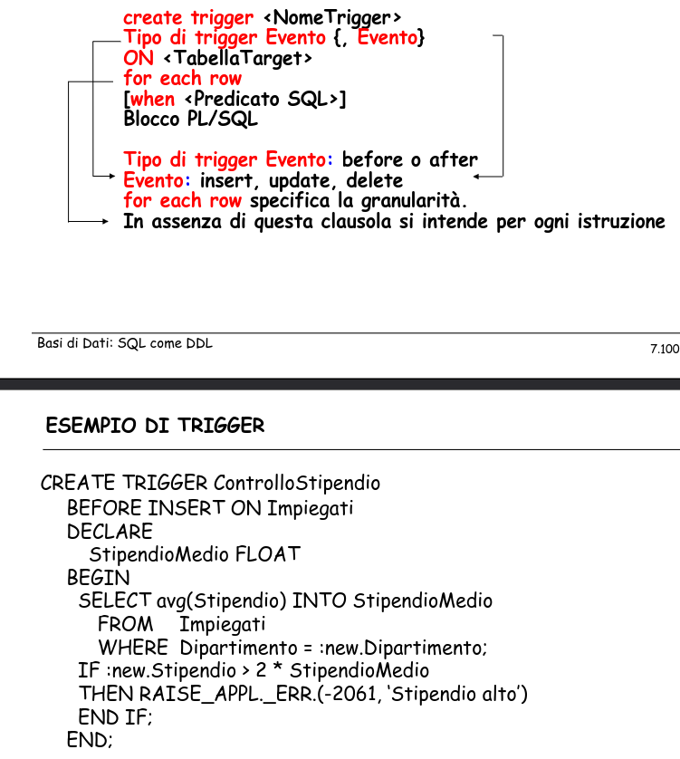

# Basi di Dati Capitolo 6

[Link alle slides](https://elearning.di.unipi.it/pluginfile.php/77729/mod_resource/content/1/7.SQLDefinizioneDati.pdf)

## Data Definition Language (DDL) SQL

Creazione, modifica, cancellazione delle tabelle, dei domini e degli altri oggetti del database, al fine di definire il suo schema logico.

### Definizione delle tabelle

CREATE TABLE, definisce uno schema di relazione e ne crea un'istanza vuota, specifica attributi, domini e vincoli.

DESCRIBE impiegato

• CREATE SCHEMA Nome AUTHORIZATION Utente
• CREATE TABLE o VIEW, con vincoli
• CREATE INDEX
• CREATE PROCEDURE
• CREATE TRIGGER

### I tipi

• CHAR(n) per stringhe di caratteri di lunghezza fissa n;
• VARCHAR(n) per stringhe di caratteri di lunghezza variabile di al massimo n
caratteri;
• INTEGER per interi con la dimensione uguale alla parola di memoria standard
dell’elaboratore;
• REAL per numeri reali con dimensione uguale alla parola di memoria standard
dell’elaboratore;
• NUMBER(p,s) per numeri con p cifre, di cui s decimali;
• FLOAT(p) per numeri binari in virgola mobile, con almeno p cifre significative;
• DATE per valori che rappresentano istanti di tempo (in alcuni sistemi, come
Oracle), oppure solo date (e quindi insieme ad un tipo TIME per indicare ora,
minuti e secondi).

### I caratteri per manipolare CREATE

Si usa DROP per eliminare una tabella creata con create e e si camia con il comando ALTER.

Con il comando ALTER TABLE è possibile (standard sql)

1. Aggiungere una colonna (ADD [COLUMN])
2. Eliminare una colonna (DROP [COLUMN])
3. Modificare la colonna (MODIFY)
4. Aggiungere l’assegnazione di valori di default (SET DEFAULT)
5. Eliminare l’assegnazione di valori di default (DROP DEFAULT)
6. Aggiungere vincoli di tabella (ADD CONSTRAINT)
7. Eliminare vincoli di tabella (DROP CONSTRAINT)
8. Altre opzioni sono possibili nei linguaggi specifici (vedi manuali)

## I vincoli

### Intrarelazionali

- _I vincoli di integrità_ consentono di limitare i valori ammissibili per una determinata colonna della tabella in base a specifici criteri.

- I vincoli di integrità intrarelazionali (ossia che non fanno riferimento ad altre relazioni) sono:
  - NOT NULL
  - UNIQUE
  - PRIMARY KEY
  - CHECK

UNIQUE è una chiave della relazione ma non una chiave primaria

```sql
CREATE TABLE Impiegato(
Matricola CHAR(6) PRIMARY KEY,
Codice_fiscale CHAR(16) UNIQUE,
Nome VARCHAR(20) NOT NULL,
Cognome VARCHAR(20) NOT NULL,
Dipart VARCHAR(15),
Stipendio NUMBER(9) DEFAULT 0,
FOREIGN KEY(Dipart) REFERENCES Dipartimento(NomeDip),
UNIQUE (Cognome,Nome)
)
```

Il _vincolo di unicità_ può anche essere riferito a coppie o insiemi di attributi.
con UNIQUE(lista di attributi)

```sql
CREATE TABLE Impiegato(
Matricola CHAR(6) PRIMARY KEY,
codice_fiscale CHAR(16) UNIQUE,
Nome VARCHAR(20) NOT NULL,
Cognome VARCHAR(20) NOT NULL,
Dipart VARCHAR(15),
Stipendio NUMBER(9) DEFAULT 0,
FOREIGN KEY(Dipart) REFERENCES Dipartimento(NomeDip),
UNIQUE (Cognome,Nome)
)
```

### Chiave primaria

Due forme:

- nella definizione di un attributo, se formato da solo la chiave
- come elemento separato
  Il vincolo PRIMARY KEY è simile a UNIQUE ma definisce la chiave primaria della relazione, ossia un attributo che invidua univocamente un dato.

Implica sia il vincolo UNIQUE che il vincolo NOT NULL (non è ammesso che per uno degli elementi della tabella questo valore sia non definito).
Serve ad identificare univocamente i soggetti del dominio. Questo vincolo permette spesso il collegamento tra due tabelle

```sql
CREATE TABLE Impiegato(
Matricola CHAR(6) PRIMARY KEY,
Codice_fiscale CHAR(16) UNIQUE,
Nome VARCHAR(20) NOT NULL,
Cognome VARCHAR(20) NOT NULL,
Dipart VARCHAR(15),
Stipendio NUMBER(9) DEFAULT 0,
FOREIGN KEY(Dipart) REFERENCES Dipartimento(NomeDip),
UNIQUE (Cognome,Nome)
)
```

anche primary key può essere definito su un insieme di elementi. In tal caso la sintassi è simile a quella di unique.

`Primary key(lista attributi)`

```sql
CREATE TABLE Studente(
Nome VARCHAR(20),
Cognome VARCHAR(20),
nascita DATE,
Corso_Laurea VARCHAR(15),
Facolta VARCHAR (20)
PRIMARY KEY(Cognome,Nome, Nascita)
)
```

### Vincoli Interrelazionali

Sono quei vincoli che vengono imposti quando gli attributi di due diverse tabelle devono essere messi in relazione.

- Creati per rispettare la non ridondanza nei db e per avere i dati sincronizzati.

- Se due tabelle gestiscono gli stessi dati, è bene che di essi non ce ne siano più copie, sia allo scopo di non occupare troppa memoria, sia affinchè le modifiche fatte sui dati uguali utilizzati da due tabelle siano coerenti.

`REFERENCES` e `FOREIGN KEY` permettono di definire vincoli di integrità referenziale.

- di nuovo due sintassi
- per singoli attributi (come vincolo di colonna)
- su più attributi (come vincolo di tabella)

Possibile definire politiche di reazione alla violazione.

### Vincolo di chiave esterna come vincolo di colonna

```sql
CREATE <nome_tabella>
(attributo_1 …,
attributo_2 …,
…
attributo_n …,
FOREIGN KEY (col_referenti) REFERENCES
tab_riferita(col_riferite)
…
)
```

### Vincolo referenziale, esempio

<p align="center">
  
</p>

<p align="center">
  
</p>

### Vincolo: CHECK

Un vincolo di CHECK richiede che una colonna o una combinazione di colonne, soddisfi una condizione per ogni riga della tabella.
Il vincolo CHECK deve essere una espressione booleana che è valutata usando i valori della coonna che vengono inseriti o aggiornati nella riga.

Può essere espresso sia come vincolo di riga che come vincolo di tabella.

Se è espresso coem vincolo di riga, può coinvolgere solo la'attributo su cui è definito, mentre se serve eseguire un check che coinvolge due o più attributi, si deve definire come vincolo di tabella.

#### CHECK ESEMPIO

<p align="center">
  
</p>

<p align="center">
  
</p>

<p align="center">
  
</p>

### Vincoli di integrità: CHIAVI E GENERALI

<p align="center">
  
</p>

### Reazione alla violazione

Quando si crea un vincolo foreign key in una tabella,in SQL standard si può specificare l'azione da intraprendere quando delle righe nella tabella riferita vengono cancellate o modificate.

Tali reazioni alla violazione vengono dichiarate al momento della definizione dei vincoli di foreign key rispettivamente mediante i comandi:
`ON DELETE` e `ON UPDATE`

<p align="center">
  
</p>

### Reazioni alla violazione on delete

<p align="center">
  
</p>

### Reazioni alla violazione on update

<p align="center">
  
</p>

<p align="center">
  
</p>

## Viste

Le viste logiche o Viste o View possono essere definite come delle tabelle virtuali , i cui dati sono riaggregazioni dei dati contenuti nelle tabelle fisiche presenti nel databse.
Le viste forniscono una diversa visione, dinamicamente aggiornata degli stessi dati.
La vista appare all'utente come una normale tabelle, in cui può effettuare interrogazioni e, limitatamente ai suoi privilegi, anche modifiche dei dati.

### Vantaggi

1. Semplificano la rappresentazione dei dati. Oltre ad assegnare un nome alla visita, la sintassi dell'istruzione CREATE VIEW consente di cambiare nomi delle colonne

2. le viste possono essere anche estremamente convenienti per svolgere una serie di query molto complesse.

3. consentono di proteggere i db: le view ad accesso limitato possono essere utilizzate per controllare le informazioni alle quali accede un certo utente del db.

4. Consentono inoltre di convertire le unità di misura e creare nuovi formati

### Limitazioni

1. Non è possibile usare gli operatori booleani: UNION, INTERSECT, EXCEPT

2. intersect ed except possono essere realizzati mediante un select semplice. Non per union

3. Non si può usare ORDER BY

### Sintassi

<p align="center">
  
</p>

### Esempio

<p align="center">
  
</p>

### Modifica di una vista

Sebbene il contenuto sia dinamico, la struttura non lo è.

Se una vista è definita su una subquery

`SELECT * FROM T1`

E in seguito alla tabella T1 viene aggiunta una colonna, questa nuova definizione non si estende alla vista. Ossia, la vista conterrà sempre le stesse colonne che aveva prima dell'inserimento della nuova colonna in T1.

### Viste di Gruppo

È una vista in cui una delle due colonne è una funzione di gruppo. In questo caso è obbligatorio assegnare un nome alla colonna della vista corrispondente alla funzione di gruppo.

<p align="center">
  
</p>

<p align="center">
  
</p>

### Elimazione delle viste

Si usa DROP VIEW

<p align="center">
  
</p>

<p align="center">
  
</p>

### Viste modificabili

Le tabelle delle viste si interrogano come le altre, ma in generale non si possono modificare.

- Deve esistere una corrispondenza biunivoca fra le righe della vista e le righe di una tabella di base, ovvero:

1.  SELECT senza DISTINCT e solo di attributi
2.  FROM una sola tabella modificabile
3.  WHERE senza SottoSelect
4.  GROUP BY e HAVING non sono presenti nella definizione

- Possono esistere anche delle restrizioni su SELECT su viste definite usando GROUP BY

### Aggiornamento delle VIEW

Le operazioni INSERT/UPDATE/DELETE sulle VIEW non erano permesse nelle prime edizioni di SQL.

- I nuovi DBMS permettono di farlo con certe limitazioni dovute alla definizione della VIEW stessa.

- Ha senso aggiornare una VIEW?
  È utile nel caso di accesso dati controllato, esempio:
  `Impiegato(Nome, Cognome, Dipart, Ufficio, Stipendio)`
- Il personale della segreteria non può accedere ai dati dello stipendio ma può modificare gli altri campi della tabella, aggiugnere e /o cancellare tuple
- Si può controllare l'accesso tramite la definizione della VIEW:
  `CREATE VIEW Impiegato2 AS
 SELECT Nome, Cognome, Dipart, Ufficio
 FROM Impiegato
INSER INTO Impiegato2 VALUES(...)`
- Stipendio inizializzato a NULL
- Se NULL non è permesso per Stipendio, l'opeazione fallisce

<p align="center">
  
</p>

<p align="center">
  
</p>

<p align="center">
  
</p>

### Vantaggi delle viste: facilitazione nell'accesso ai dati

• In generale uno dei requisiti per la progettazione di un database relazionale è la normalizzazione dei dati.
• Sebbene la forma normalizzata del database permette una corretta modellazione della realtà che il DB rappresenta, a volte dal punto di vista dell’utente comporta una maggiore difficoltà di comprensione rispetto a una rappresentazione non normalizzata.
• Le viste permettono di fornire all’utente i dati in una forma più intuitiva.

L'uso delle viste come tecnica per assicurare la sicurezza dei dati.

### Vantaggi delle viste: Indipendeza Logica

indipendenza logica delle applicazioni e delle operazioni eseguite dagli utenti rispetto alla struttura logica dei dati.

Ciò significa che è possibile poter operare modifiche allo schema senza dover apportare modifiche alle appliazioni che utilizzano il database.

### Utilità delle visite

- Per nascondere certe modifiche all'organizzazione logica dei dati
- per offrie visioni diverse degli stessi dari senza ricorrere a dupicazioni
- per rendere più semplici o epr rendere possibili, alcune interrogazioni.

<p align="center">
  
</p>

## Procedure e Trigger

Un trigger definisce un'azione che il database deve attivare automaticamente quando si verifica (nel database) un determinato evento.

- Possono essere utilizzati:
  - per migliorare l'integrità referenziale dichiarativa
  - per imporre regole complesse legate all'attività del database
  - per effettuare revisioni sulle modifiche dei dati

L'esecuzione dei trigger è quindi trasparente all'utente.
I trigger vengono eseguiti automaticamente dal database quando specifici tipi di comandi (Eventi) di manipolazione dei dati vengono eseguiti su specifiche tabelle.

- Solitamente trigger sono insert, update, delete e create view
- anche gli aggiornamenti di specifiche colonne possono essere usati coem trigger di eventi

### Trigger a livello di riga

- Vengono eseguiti una volta per ciascuna riga modificata in una transazione; vengono spesso utilizzati in applicazioni di revisione dei dati e si rivelano utili per operazioni di audit dei dati e per mantenere sincronizzati i dati distribuiti.

- per creare un trigger a livello di riga occorre specificare la clausola:
  FOR EACH ROW

- nell'istruzione create trigger

### Trigger a livello di istruzione

- vengono eseguiti una volta sola per ciascuna transazione, indipendentemente dal numero di righe che vengono modificate.

- vengono pertanto utilizzati per attività correlate ai dati; vengono utilizzati di solito per imporrre misure aggiuntive di sicurezza sui tipi di transazione che possono essere eseguiti su una tabella.

- è il tipo di trigger predefinito nel comando create trigger

### Trigger, struttura

- I trigger si basano sul paradigma evento-condizione-azione (ECA)

<p align="center">
  
</p>

<p align="center">
  
</p>

### Tipi di trigger

- BEFORE e AFTER: i trigger possono essere eseguiti prima o dopo l'utilizzo dei comandi insert, update e delete; all'interno del trigger è possibile fare riferimento ai vecchi e nuovi valori coinvolti nella transazione.

### Trigger Attivo / Passivo

- è attivo quando, in corrispondenza di certi eventi, modifica lo stato delle base di dati.

- è passivo se serve a provocare il fallimento della transazione corrente sotto certe condizioni.

**INSTEAD OF:** per specificare che cosa fare invece di eseguire le azioni che hanno attivato il trigger

<p align="center">
  
</p>

### Proprietà essenziali dei trigger

1. terminazione
2. utilità dei trigger: trattare vincoli non esprimibili nello schema
3. attivare automaticamente azioni sulla base di dati quando si verificano certe condizioni

## Controllo degli accessi

1. Ogni componente dello schema (risorsa) può essere protetta.
2. Il possessore della risorsa assegna dei privilegi agli altri utenti.
3. Un utente predefinito rappresenta l'amministratore della base di dati ed ha completo accesso alle risorse.
4. Ogni privilegio è caratterizzato da:
   1. la risorsa a cui si riferisce
   2. l'utente che concede il privilegio
   3. l'utente che riceve il privilegio
   4. l'azione che viene permessa sulla risorsa
   5. se il privilegio può essere trasmesso o meno ad altri utenti

<p align="center">
  
</p>

- Chi crea lo schema della BD è l'unico che può fare CREATE, ALTER e DROP
- Chi crea una tabella stabilisce i modi in cui altri possono farne uso:
  - GRANT Privilegi ON Oggetto TO Utenti [WITH GRANT OPTION]

### GRANT and REVOKE

Per concedere un privilegio ad un utente:
`grant < Privileges | all privileges > on Resource to Users [with grant option]`

`grant option` specifica se ha il privilegio di propagare il privilegio ad altri utenti

`Es: grant select on Department to Stefano`

Per revocare il privilegio:

`revoke Privileges on Resources from Users [restrict | cascade]`

La revoca deve essere fatta dall'utente che aveva concesso I privilegi:

- restrict (di default) specifica che il comando non deve essere eseguito qualora la revoca dei privilegi all'utente comporti qualche altra revoca (dovuta ad un precedente grant option)
- cascade invece forza l'esecuzione del comando

- Attenzione alle reazioni a catena

- Chi definisce una tabella o una VIEW ottiene automaticamente tutti i privilegi su di esse, ed è l'unico che può fare un DROP e può autorizzare altri ad usarla con GRANT.

- Nel caso di viste, il 'creatore' ha i privilegi cha ha sulle tabelle usate nella definizione.

- Le autorizzazioni si annullano con il comando:

  - REVOKE [GRANT OPTION FOR] Privilegi ON Oggetto FROM Utenti [CASCADE]

- Quando si toglie un privilegio ad U, lo si toglie anche a tutti coloro che lo hanno avuto solo da U.

<p align="center">
  
</p>

L'utente I ha reato la tabella R e innesca la seguente successione di eventi:

- I: GRANT SELECT ON R TO A WITH GRANT OPTION
- A: GRANT SELECT ON R TO B WITH GRANT OPTION
- B: GRANT SELECT ON R TO A WITH GRANT OPTION
- I: GRANT SELECT ON R TO C WITH GRANT OPTION
- C: GRANT SELECT ON R TO B WITH GRANT OPTION

<p align="center">
  
</p>

### GRAFO AUTORIZZAZIONI: PROPRIETÀ

- Se un nodo N ha un arco uscente con un privilegio, allora esiste un cammino da SYSTEM a N con ogni arco etichettato dallo stesso privilegio + WGO

- Effetto del REVOKE, ad es.
  I : REVOKE SELECT ON R FROM A CASCADE
- e poi I : REVOKE SELECT ON R FROM C CASCADE

<p align="center">
  
</p>

## Indice e Catalogo

### Crerazione di indici

Non è un comando standard dell'SQL e quindi ci sono differenze nei vari sistemi:

- CREATE INDEX NomeIdx ON Tabella(Attributi)
- CREATE INDEX NomeIdx ON Tabella WITH STRUCTURE = BTREE, KEY = (Attributi)
- DROP INDEX NomeIdx

- Alcuni esempi di tabelle, delle quali si mostrano solo alcuni attributi sono:
  Tabella della password:
  - PASSWORD(username, password)
    Tabella delle basi di dati:
  - SYSDB(dbname, creator, dbpath, remarks)
    Tabella delle tabelle (type = view or table)
  - SYSTABLE(name, creator, type, colcount, filename, remarks)

### Catalogo

- Alcuni esempi di tabelle, delle quali si mostrano solo alcuni attributi sono:

#### RIEPILOGO

<p align="center">
  
</p>
<p align="center">
  
</p>
