# Basi di Dati Capitolo 7

[Link alle slides](https://elearning.di.unipi.it/pluginfile.php/78264/mod_resource/content/1/9.RealizzazioneDBMS_Parte_I.pdf)

## DBMS

- Un sistema sotware che gestisce grandi quantità di dati persistenti e condivisi.

- La gestione di grandi quantità di dati richiede particolare attenzione ai problemi di efficienza.

- La persistenza e la condivisione richiedono che un DBMS fornisca dei meccanismi per garantire l'affidabilità dei dati (fault tolerance), per il controllo degli accessi e per il controllo della concorrenza.

- Diverse altre funzionalità vengono messe a disposizione per motivi di efficacia, ovvero per semplificare la descrizione dei dati, lo sviluppo delle applicazioni, l'amministrazione di un DB.

### Condivisione dei dati

La gestione integrata e la condivisione dei dati permettono di evitare ripetizioni e quindi un intuile spreco di risorse (memoria). Inoltre la ridondanza può dar luogo a problemi di incosistenza delle copie e in ogni caso, comporta la necessità di propagare le modifiche con un ulteriroe spreco di risorse.

<p align="center">
  
</p>

### Il modello dei dati

Dal punto di vista utente un DB è visto come una collezione di dati che modellano una certa posizione della realtà di interesse.
L'astrazione logica con cui i dati vengono resi disponibili all'utente definisce un modello dei dati; più precisamente:

- un modello dei dati è una collezione di concetti che vengono utilizzati per descrivere i dati, le loro associazioni/relazioni, e i vincoli che questi devono rispettare

Un ruolo di primaria importanza nella definizione di un modello dei dati è svolto dai meccanismi che possono essere usati per strutturare i dati. Ad esempio esistono modelli in cui i dati sono descritti solo sotto forma di alberi (modello gerarchico), di grafi (modello reticolare), di oggetti complessi (modello a oggetti), di relazioni (modello relazionale).

### Indipendenza fisica e logica

Tra gli obiettivi di un DBMS vi sono quelli di fornire caratteristiche di:

**Indipendenza fisica:** L'orgaizzazione fisica dei dati dipende da considerazioni legate all'efficienza delle organizzazioni adottate. La riorganizzazione fisica dei dati non deve comportare effetti collaterali sui programmi applicativi.

**Indipendenza Logica:** permette di accedere ai dati logici indipendentemente dalla loro rappresentazione fisica.

**Architettura (semplificata) di un DBMS**

<p align="center">
  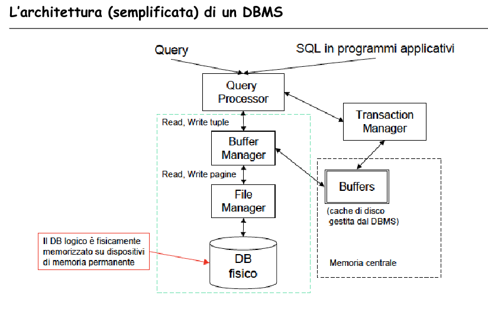
</p>

**ARCHITETTURA DEI DBMS**

<p align="center">
  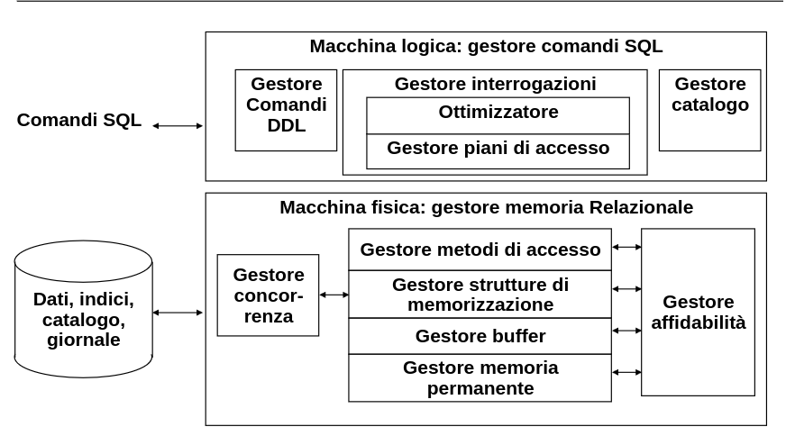
</p>

### Gerarchie delle memorie

<p align="center">
  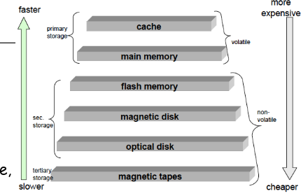
</p>

La memoria di un sistema di calcolo è organizzata in una gerarchia.
Al livello più alto memorie di piccola dimensione molto veloci, molto costose, mentre scendendo lungo la gerarchia la dimensione aumenta, diminuiscono la velocità e il costo.

(Dato un indirizzo di memoria)Le prestazioni di una memoria si misurano in termini di tempo di accesso, determinato dalla somma della latenza e del tempo di trasferimento

**Tempo di accesso = latenza + dimensione dati da trasferire / velocità di trasferimento**

Un db a casa della sua dimensione, risiede normalmente su dischi (ed eventualmente anche su altri tipi di dispositivi). I dati devono essere trasferiti in memoria centrale per essere elaborati dal DBMS.
Il trasferimento non avviene in termini di singole tuple, bensì di blocchi (o pagine).
Spesso le operazioni di I/O costituiscono il collo di bottiglia del sistema, si rende necessario ottimizzare l'implementazione fisica del DB, attraverso:

- Organizzazione efficiente delle tuple su disco
- Strutture di accesso efficienti
- Gestione efficiente dei buffer in memoria
- Strategie di esecuzione efficienti per le query

### Gli hard disk

un dispositivo elettro-meccanico per la conservazione di informazioni sotto forma magnetica, su supporto rotante a forma di piatto su cui agiscono delle testine di lettura / scrittura.

<p align="center">
  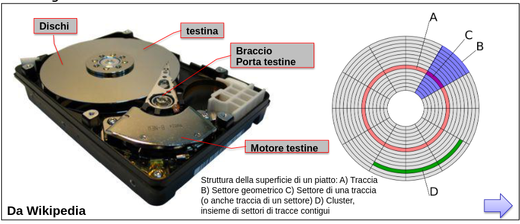
</p>

### Il meccanismo del disk drive

Include organi di registrazione, di posizionamento e di rotazione.
Un'unità a dischi contiene una pila di dischi metallici che ruota a velocità costante ed alcune testine di lettura che si muovono radialmente al disco

<p align="center">
  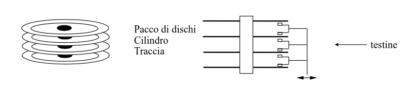
</p>

Una traccia è organizzata in settori di dimensione fissa; i setori sono raggruppati logicamente in blocchi, che sono l'unità di trasferimento.

Trasferire un bloo richiede un tempo di posizionamento delle testine, un tempo di latenza rotazionale e tempo per il trasferimento (trascurabile).

- IBM 3380 (1980) -> 2Gb, 16ms, 8.3ms, 0.8ms/2.4Kb
- IBM Ultrastar 26Z15 (2001) -> 36Gb, 4.2ms, 2ms,0.02ms/Kb

### Pagina

Un blocco o pagina è una sequenza contigua di settori su una traccia, e costituisce l'unità di I/O per il trasferimento di dati da/per la memoria principale.
La dimensione tipica di una pagina è di qualche Kb (4-64 Kb)
Pagine piccole comportano un maggior numero di operazioni di I/O
Pagine grandi tendono ad aumentare la frammentazione interna (pagine parzialemtne riempite) e richiedono più spazio in memoria per essere caricate.
Il tempo di trasferimento di una pagina (Tt) da disco a memoria centrale dipende dalla dimensione della pagina (P) e dal transfer rate (Tr)

- Esempio: con un transfer rate di 21.56 MB/sec e P = 4KB si ha Tt = 0.18ms con P = 64KB si ha Tt = 2.9ms

### Gestore memoria permanente e gestore del buffer

<p align="center">
  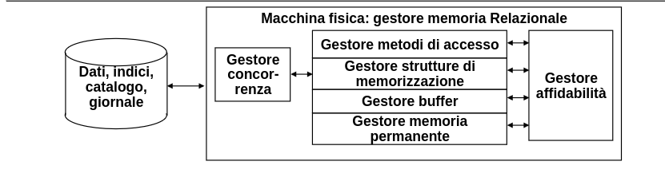
</p>

**Gestore memoria permanente**
Fornisce un'astrazioe della memoria permanente in termini di insiemi di file logici di pagine fisiche di registrazioni, nascondendo le caratteristiche dei dichi e del sistema operativo.

**Gestore del buffer**
Si preoccupa del trasferimento delle pagine tra la memoria temporanea e la memoria permanente, offrendo agli altri livelli una visione della memoria permanente come un insieme di pagine utilizzabili in memoria temporanea, astraendo da quando esse vengono trasferite dalla memoria permanente al buffer e viceversa

### Gesotre del buffer: Area dlle pagine

<p align="center">
  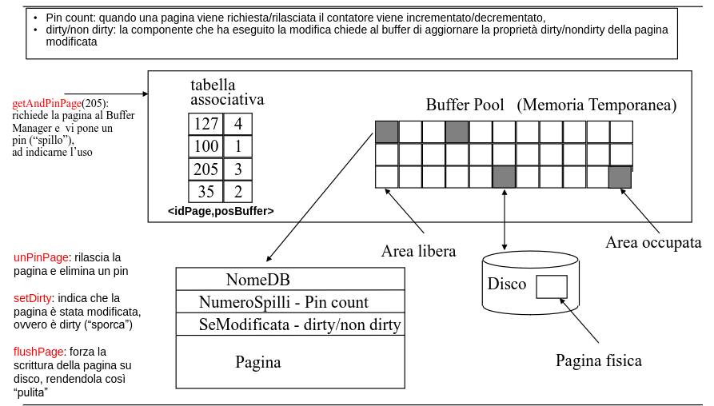
</p>

### Politiche di rimpiazzamento

Nei sistemi operativi una comune politica adottata per decidere quale pagina rimpiazzare è la LRU (Least recently used), ovvero si rimpiazza la pagina che da più tempo non è in uso.
Nei DBMS, LRU non è sempre una buona scelta in quanto alcune query e patern di accesso ai dati è noto e quindi può essere utilizzato epr operare sc3lte più accurate, in grado di migliorare anche di molto le prestazioni.
L'hit ratio overo la frazione di richeiste che non provocano una operazione di I/O, indica sinteticamente quanto buona è una politica di rimpiazzmento.
_Esempio:_ esistono algoritmi di join che scandiscono N volte le tuple di una relazione. In quersto caso la politica miglire sarebbe la MRU (Most Rcently Used), ovvero rimpiazzando la pagina usaa più rcecnte.

### Struttura di una pagina

Struttura fisica: un insieme, di dimensione fissa, di caratteri.
Struttura logica:

- informazioni di servizio
- un'area che contiene le stringhe che rappresentano i record;

Il problema dei riferimenti ai record: cppia (PID della pagina, posizione nella pagina) (RID)

<p align="center">
  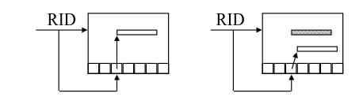
</p>

### Organizzazione a slot delle pagine

<p align="center">
  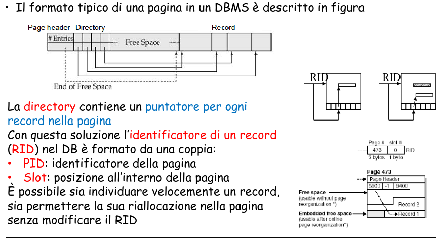
</p>

## PARTE II

### Gestore di strutture di memorizzazione

Tipi di organizzazioni:

- Seriali o Sequenziali
- Per chiave
- Per attributi non chiave

Parametri che caratterizzano un'organizzazione:

- Occupazione di memoria
- Costo delle operazioni di:
- Ricerca per valore o intervallo
- Modifica
- Inserimento
- Cancellazione

### Organizzzioni seriale e sequenziale

seriale (heap file): i dati sono memorizzati in modo disordinato uno dopo l'altro:

- Semplice e a basso costo di memoria
- Poco efficiente
- Va bene per pochi dati

È l'organizzazione standard di ogni DBMS

_sequenziale:_ i dati sono ordinati sul valore di uno o più attributi:

- ricerche più veloci
- nuove inserzioni fanno perdere l'ordinamento

COsto di ricerca:
Ricerca binaria su fiel di dati ordinato richiede log_2b accessi a bloco/pagina
Se il file contiene b, blocchi, la localizzazione di un record richiede:

- ricerca binaria nel file
- accesso al blocco che contiene il record
  Quindi richiede log_2b + 1 accessi a blocco(pagina)

<p align="center">
  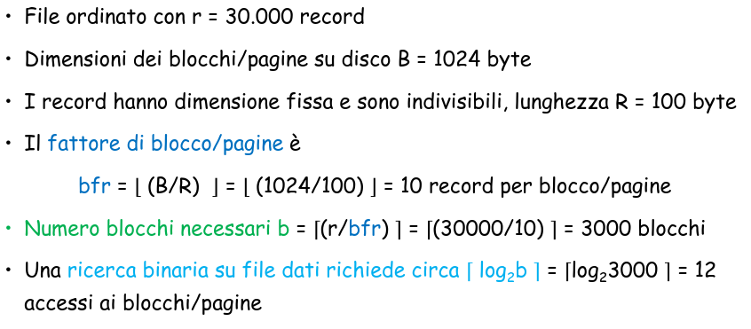
</p>

### Organizzazioni per chiave

- Obiettivo: noto il valore di una chiave, trovare il record di una tabella con qualche accesso al disco (ideale: 1 accesso)

- Alternative:
- Metodo procedurale (hash) o tabellare (indice)
- Organizzazione statica o dinamica

### Hash file

In un file has i record vengono allocati in una pagina il cui indirizzo dipende dal valroe di chiave del record:

`key -> H(key) -> page address`
Una comune funzione hash è il resto della divisione intera:
`H(k) = k mod NP`

Si può applicare anche a chiavi alfanumerici che dopo averle convertite

<p align="center">
  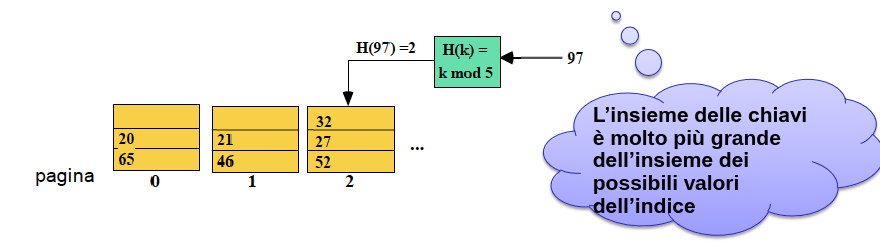
</p>

### Organizzazione per chiave: Metodo procedurale statico

<p align="center">
  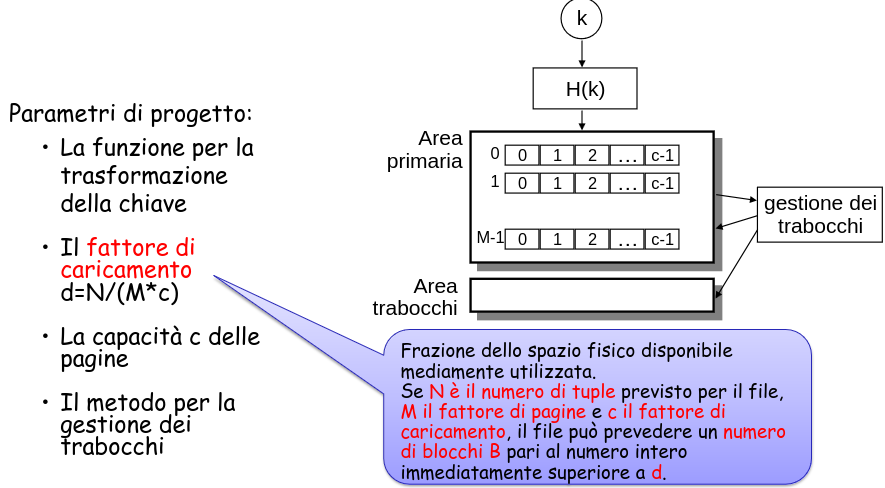
</p>

### Strutture Hash

le collisioni sono di solito gestite con liste linked.

È l'organizzazione più efficiente per l'accesso diretto basato su valori della chiave con condizioni di uguaglianza (accesso puntuale)

non è efficiente per ricerche basate su intervalli

funzionano solo con file la cui dimensione no varia molto nel tmepo

#### Svantaggi

- Trade off :

  - se il numero di blocchi è troppo piccolo rispetto al Databasesi hanno frequenti collisioni (con catene di overflow ecc)
  - Se il numero di blocchi è troppo grande rispetto al database si ha un fattore di riempimento dei blocchi molto basso.

- Non efficienti per query tipo questa:

```sql
SELECT *
FROM STUDENTI
WHERE (MATRICOLA>10000) AND (MATRICOLA<20000)
```

- Struttura Hash non è efficiente per le operazioni che coinvolgono attributi che non sono chiave.

### Organizzazione per chiave: Metodo Tabellare

- Il metodo procedurale (hash) è utile per ricerche per chiave ma non per intervallo. Per entrambi i tipi di ricerche è utile il metodo tabellare:
- si usa un indice, ovvero di un insieme ordinato di coppie (k, r(k)) dove k è un valore della chiave ed r(k) è un riferimento al record con chiave k.

- L'indice è gestito di solito con un'opportuna struttura albero detta B+albero, la struttura più usata e ottimizzata dai DBMS.

-Gli indici possono essere multi-attributi.

- Indice: struttura che contiene informazioni sulla posizione di memorizzazione delle tuple sulla base del valore del campo chiave
  La realizzazione degli indici avviene tipicamente attraverso l'utilizzo di strutture ad albero multi-livello
