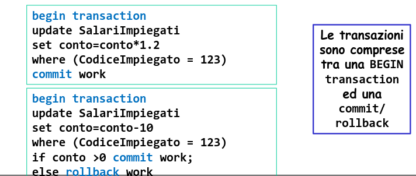

# Basi di Dati Capitolo 8

[Link alle slides](https://elearning.di.unipi.it/pluginfile.php/78413/mod_resource/content/1/9.RealizzazioneDBMS_Parte_IV_Transazioni.pdf)

## Trnasazioni

<p align="center">
  
</p>

Le transazioni rappresentano l'unità di lavoro elementare (insieme di istruzioni SQL) che modificano il contenuto di una base di dati.

Sintatticamente una transazione è contornata dai comandi begin transaction (e end transaction); all'interno possono comparire i comandi di commit work e rollback work

<p align="center">
  
</p>

### Proprietà ACID delle transazioni

- **A**tomicità -> La transazione deve essere eseguita con la regola "tutto o niente"

- **C**consistenza -> La transazione deve essere lasciare il DB in uno stato consistente, eventuali vincoli di integrità non devono essere violati.

- **I**solamento -> L'esecuzione di una transazione deve essere indipendente dalle altre

- **D**urability -> L'effetto di una transazione che ha fatto commit work non deve essere perso.

### Funzioni del DBMS (in breve...)

- Gestione dei dati: cura la memorizzazione permanente dei dati e del loro accesso

- Gestionde del buffer : cura il trasferimento dei dati da memoria di massa a memoria centrale, e il caching dei dati in memoria centrale

- Ottimizzazione delle interrogazioni : seleziona il piano di accesso di costo ottimo con cui valutare ciascuna interrogazione

<p align="center">
  
</p>

### Gestione dell'affidabilità

Una transazione è un'unità logica di elaborazione che corrisponde a una serie di operazioni fisiche elementari (letture/scritture) sul DB

Esempi:
Trasferimetno di una somma da un conto corrento ad un altro

```sql
UPDATE CC
SET Saldo = Saldo - 50
WHERE Conto = '123'
```

Aggiornamento

```sql
UPDATE Imp
SET Stipendio = 1.1*Stipendio
WHERE Sede = 'PISA'
```

Una funzionalità essenziale di un DBMS è la protezione dei dati da malfunzionamenti e da interferenze dovuto all'accesso contemporaneo ai dati da parte di più utenti.

La transazione per il programmatore:

- Una transazione è un programma sequenziale costituito da operazioni che il sistema deve eseguire garantendo:
- Atomicità, Consistenza, Serializzabilità, Persistenza
- (Atomicity, Consistency, Isolation, Durability - ACID)

**Definizione:** Una transazione è una sequenza di azioni di lettura e scrittura in memoria permanente e di elaborazioni di dati in memoria temporanea.

_Gestore dell'affidabilità:_

- Atomicità : Le transazioni che terminano prematuramente sono trattate dal sistema come se non fossero mai iniziate; pertanto eventuali loro effetti sulla base di dati sono annullati.

- Persistenza : Le modifiche sulla base di dati di una transazione terminata normalmente sono permanenti, cioè non sono alterabili da eventuali malfunzionamenti.

_Gestione della concorrenza:_

- Serializzabilità: Nel caso di esecuzioni concorrenti di più transazioni, l'effetto complessivo è quello di una esecuzione seriale.

Per aumentare l'efficienza prestazionale, tutti i DBMS, utilizzano un buffer temporaneo di informazioni in memoria principale, ilquale viene periodicamente scritto su memoria secondaria

<p align="center">
  
</p>

Una transazione può eseguire molte operazioni sui dati recuperati da una base di dati, ma al DBMS interessano solo quelle di lettura o scrittura della base di dati, indicate con `r_i[x]` e `w_i[x]`.

- Un dato letto o scritto può essere un record, un campo di un record o una pagina. per semplicità supporremo che sia una pagina.

- Un'operazione di lettura `r_i[x]` comporta la lettura di una pagina nel buffer, se non già presente.

- Un'operazione di scrittura `w_i[x]` comporta l'eventuale lettura nel buffer di una pagina e la sua modifica nel buffer, ma non necessariamente la sua scrittura nella memoria permanente. Per questa ragione, in caso di malfunzionamento potrebbe perdersi la modifica.

### Multifunzionamento

- Fallimento di transazioni: non comportano la perdità di dati in memoria temporanea nè persistente.

- Fallimento di sistema: comportano la perdità di dati in memoria temporanea ma non di dati in memoria persistente (es. comportamento anomalo del sistema, caduta di corrente, guasti hardware, ecc ecc)

- Disastri: comportano la perdita di dati in memoria persistente.

### Gestore dell'affidabilità

Verifica che siano garantite le proprietà di atomicità e persistenza delle transazioni.

- Responsabile di implementare i comandi di: begin transaction, commit, rollback

- Responsabile di ripristinare il sistema dopo malfunzionamenti software (ripresa a caldo)

- Responsabile di ripristinare il sistema dopo malfunzionamenti hardware (ripresa a freddo)

### File di log:

<p align="center">
  
</p>

### Le primitive undo e redo

Convezioni notazionali:

- data una transazione T, indicheremo con B(T), C(T) e A(T) i record di begin, commit e abort relativi a T, rispettivamente, e con U(T, O, BS, AS); I(T, O, AS) e D(T, O, BS) i record di update, insert e delete, rispettivamente su un oggetto O, dove BS è before state and AS è after state.

I record del log associati ad una transazione, consentono di disfare e rifare le corrispondenti azioni sulla base di dati:

- Primitive di undo: per disfare un'azione su un oggetto O, è sufficiente ricopiare in O il valore BS (l'insert viene disfatto cancellando l'oggetto O)
- Primitiva di redo: per rifare un'azione su un oggetto O, è sufficiente ricopiare in O il valore AS (il delete viene rifatto cancellndo l'oggetto O)

### Il file di log pt 2

Il log si presenta come un file sequenziale suddiviso in record, e ci sono due tipi di record:

- Record di transazione -> tengono traccia delle operazioni svolte da ciascuna transazione sul DBMS. Per ogni transazione, un record di begin (B), record di Insert (I), delete (D) e update (U) e un record di commit (C) o di abort (A).

- Record di sistema -> tengono traccia delle operazioni di sistema (dump/checkpoint)

### L'operazione di dump (copia del DB)

L'operazione di dump produce una copia completa della base di dati, effettuata in mutua esclusione con tutte le altre transazioni quando il sistema non è operativo.

La copia viene memorizzata in memoria stabile (backup)

Al termine del dump, viene scritto nel log un record di dump, che segnala l'avvenuta esecuzione dell'operazione in un dato istante. Il sistema riprende, quindi, il suo funzionamento normale.

#### Protezioni dei dati da malfunzionamenti

- Copia della BD (DUMP)
- log: durante l'uso della BD, il sistema registra nel giornale la storia delle azioni effettuate sulla BD dal momento in cui ne è stata fatta l'ultima copia.

- Contenuto del giornale:
  - (T, begin);
  - Per ogni operazione di modifica:
    - la transazione responsabile
    - il tipo di ogni operazione eseguita
    - la nuova e vecchia versione del dato modificato: (T, write, address, oldV, newV);
  - (T, commit) o (T, abort)

**Due regole**

- Regole di SCRITTURA del log:

  - Regola _Write Ahead Log (WAL)_ -> la parte BS (before state) di ogni record di log deve essere scritta prima che la corrispondente operazione venga effettuata nella base di dati.

  - Regola di _Commit Precedence_ -> la parte AS (after state) di ogni record di log deve essere scritta nel log prima di effettuare il commit della transazione.

  <p align="center">
    
  </p>

Gli algoritmi si differenziano a seconda del modo in cui si trattano le scritture sulla DB e la terminazione delle transazioni

- DISFARE-RIFARE
- DISFARE-NONRIFARE
- NONDISFARE-RIFARE
- NONDISFARE-NONRIFARE

Ipotesi: Le scritture nel giornale vengono portare subito in memoria permanente!

### Disfare

Quando si portano le modifiche nella BD?
Politica della modifica libera: le modifiche possono essere portate nella BD stabile prima che la T termini (disfare o steal)

- Regola per poter disfare: prescrittura nel giornale ("Log Ahead Rule" o "Write Ahead Log"):
- se la nuova versione di una pagina rimpiazza la vecchia sulla BD stabile prima che la transazione T abbia raggiunto il punto di Commit, allora la vecchia versione della pagina deve essere portata prima sul giornale in modo permanente.

### Rifare

Come si gestisce la terminazione?

- Commit libero: una T può essere considerata terminata normalmente prima che tutte le modifiche vengano riportate nella BD stabile (occorre rifare).

Regola per poter rifare una T ("Commit Rule")

- Le modifiche (nuove versioni delle pagina) di una T devono essere portate stabilmente nel giornale prima che la T raggiunga il Commit

### Checkpoint

- Al momento del ripristino, solo gli aggiornamenti più recenti tra quelli riportati sul giornale / log potrebbero non essere stati ancora riportati sulla base di dati. Come ottenere la certezza che non è necessario rieseguire le operazioni più vecchie?

- Periodicamente si fa un Checkpoint (CKP): si scrive la marca CKP sul giornale/log per indicare che tutte le operazioni che la precedono sono state effettivamente effettate sulla BD.

**Un modo troppo semplice per fare il CKP**:

1. si sospende l'attivazione di nuove transazioni,
2. si completano le precedenti, si allinea la base di dati (si riportano su disco tutte le pagine 'sporche' dei buffer),
3. si scrive nel giornale / log la marca `CKP`
4. Si riprende l'esecuzione delle operazioni.

- Si scrive sul giornale una marca di inizio checkpoint che riporta l'elenco delle transazioni attive (BeginCkp, {T1,...,Tn})

- In parallelo alle normali operazioni delle transazioni, il gestore del buffer riporta sul disco tutte le pagine modificate.

- Si scrive sul giornale una marca di EndCkp

- La marca di EndCkp certifica che tutte le scritture avvenuta prima del BeginCkp ora sono sul disco.

- Le scritture avvenute tra BeginCkp e EndCkp forse sono sul disco e forse no.

### Ripresa dai malfunzionamenti (disfare-rifare)

- fallimenti di transazioni: si scrive nel giornale (T, abort) e si applica la procedura disfare.

- fallimenti di sistema:
- La BD viene ripristinata con il comando RESTART (ripartenza di emergenza) a partire dallo stato al punto di allineamento, procedendo come segue:
- Le T non terminate vanno disfatte
- Le T terminate devono essere rifatte

Disastri: si riportano in linea la copia più recente della BD e la si aggiorna rifacendo le modifiche delle T terminate normalmente.

### Ripresa a caldo

- Garantisce atomicità e persistenza delle transazioni
- Quattro fasi:

1.  trovare l'ultimo checkpoint (ripercorrendo il log a ritroso)
2.  costruire gli insiemi UNDO (transazioni da disfare) e REDO (transazioni da rifare)
3.  Ripercorrere il log al'l'indietro, fino alla più vecchia azione delle transazioni in UNDO, disfacendo tutte le azioni delle transazioi in UNDO.
4.  ripercorrere il log in avanti, rifacendo tutte le azioni delle transazioni in REDO

### Ripresa a freddo

- Risponde ad un guasto che provoca il deterioramento della BD.
- Si ripristinano i dati a partire dal backup
- Si eseguono le operazioni registrate sul giornale fino all'istante del guasto
- Si esegue una ripresa a caldo.

  <p align="center">
    
  </p>

### Gestione della concorrenza

**Serializzazione**
Uno schedule s si dice seriale se le azioni di ciascuna transazione appaiono in sequenza, senza essere inframezzate da azioni di altre transazioni.

S = {T_1, T_2,...,T_n}

_Schedule seriale ottenibile se:_

1. Le transazioni sono eseguite uno alla volta (scenario non realistico)
2. Le transazioni sono completamente indipendenti l'una dall'altra

### ACID: Proprietà di isolamento delle transazioni

- Il DBMS transazionale gestisce questi problemi garantendo la proprietà di isolamento

- La proprietà di isolamento di una transazione garantisce che essa sia eseguita come se non ci fosse concorrenza.

- Questa proprietà è assicurata facendo in modo che ciascun insieme di transazioni concorrenti sottoposte al sistema sia "serializzabile"

### Problematica

In un sistema reale, le transazioni vengono eseguite in concorrenza per ragioni di efficienza / scalabilità.

Tuttavita, l'esecuzione concorrente determina un insieme di problematica che devono essere gestite...

T1 = Read(x); x=x+1; Write(x); Commit Work
T2 = Read(x); x=x+1; Write(x); Commit Work

Se x=3, al termine delle due transazioni x vale 5, cosa accade con esecuzione concorrent?

### Anomalie

  <p align="center">
    
  </p>

### Serialità e Serializzabilità

**Definizione:** Un'esecuzione di un insieme di transazioni {T_1, ..., T_n} si dice seriale se per ogni coppia di transazioni T_i e T_j , tuttte le operazioni di T_i vengono eseguite prima di qualsiasi operazione T_j o viceversa.

**Definizione:** Un'esecuzione di un insieme di transazioni si dice serializzabile se produce lo stesso effetto sulla base di dati di quello ottenibile eseguendo serialmente, in un qualche ordine, le sole transazioni terminate normalmente.

### Controllo della concorrenza

Nella pratica i DBMS implementano tecniche di controllo di concorrenza che garantiscono direttamente la serializzazione delle transazioni concorrenti.

Tali tecniche si dividono in due classi principali:

- Protocolli pessimistici / conservativi: tendono a ritardare l'esecuzione di transazioni che potrebbero generare conflitti e quindi anomalie, rispetto alla transazione corrento. Cercando quindi di prevenire.

- Protocolli ottimistici, che permettono l'esecuzione sovrapposta e non sincronizzata di transazioni ed effettuano un controllo sui possibili conflitti generati solo a valle del commit.

### Controllo della concorrenza ottimistico

- Ogni transazione effettua <<liberamente>> le proprie operazioni sugli oggetti della base di dati secondo l'ordine temporale con cui le operazioni stesse sono generate.
- Al commit, viene effettuato un controllo per stabilire se sono stati riscontrati eventuali conflitti, e nel caso, viene effettuato il rollback delle azioni delle transazioni e la relativa riesecuzione.
  In generale, un protocollo di controllo di concorrenza ottimistico è basato su 3 fasi:
- Fase di lettura: ogni transazione legge i valori degli oggetti della BD su cui deve operare e li memorizza in variabili (copie) locali dove sono effettuati eventuali aggiornamenti
- Fase di validazione: vengono effettuati deii controlli sulla serializzabilità nel caso che gli aggiornamenti locali delle transazioni dovessore essere propagati sulla base di dati
- Fase di scrittura: gli aggiornamenti delle transazioni che hanno superato la fase di validazione sono propagati definitivamente sugli oggetti della BD.

### Controllo concorrenza pessimistici/conservativi

Tali tecniche si dividono in due classi principali:

- Metodi basati su lock
- Metodi basati su timestamps

I DBMS commerciali usano il meccanismo dei lock -> per poter efettuare na qualsiasi operazione di lettura/scrittura su una risorsa (tabella o valore di una cella), è necessario aver precedentemente acquisito il controllo (lock) sulla risorsa stessa.

- Lock in lettura (accesso condiviso)
- Lock in scrittura (mutua esclusione)

I DBMS per evitare anomalie nelle transazioni concorrenti usano diverse tecniche.

- Una delle più comuni è basata su lock
- Il lock è un meccanismo che bloccal'accesso ai dati ai quali una transazione accede ad altre transazioni
  - lock a livello riga, tablla, pagina (multi granularità)
  - lock in operazioni di scrittura (mutua esclusione) / lettura (accesso condiviso) (multimodale)
- In generale quando una risorsa è bloccata, le transazioni che ne richiedono l'accesso vengono in genere messe in coda
- quindi devono aspettare
- In sostanza questo è un meccanismo effcace, ma influsce sulle prestazioni.

### Gestione delle Transazioni

Su ogni lock possono essere definite due operazioni:

- Richiesta del lock in lettura/scrittura
- Rilascio del lock (unlock) acquisito in precedenza

  <p align="center">
    
  </p>

### Serializzatore 2PL stretto

Il gestore della concorrenza (serializzatore) dei DBMS ha il compito di stabilire l'ordine secondo il quale vanno eseguite le singole operazioni per rendere serializzabile l'esecuzione di un insieme di transazioni

**Definizione:** Strict Two Phase Locking è definto dalle seguenti regole:

1.  Ogni transazione, prima di effettuare un'operazione acquisisce il blocco corrispondente (chiede il lock)
2.  Transazioni diverse non ottengono blocchi in conflitto
3.  I blocchi/lock si rilasciano alla termianzione della transazione

**2PL** -> I lock di una transazione sono rilasciati solo dopo aver effettuato le operazioni di commit/abort.

_Problema:_ I protocolli 2PL possono generare schedule con situazioni di _deadlock_

  <p align="center">
    
  </p>

Gestire i deadlock con 3 tecniche:

1. Uso dei timeout -> ogni operazione di una transazione ha un timeout entro il quale deve essere completata, pena annullamento della transazione stessa.

 <p align="center">
    
 </p>

2. Deadlock avoidance -> prevenire le configurazioni che potrebbero portare ad un deadlock...COME?

- Lock/Unlock di tutte le risorse allo stesso tempo

- Utilizzo di time-stamp o di classi di priorità tra transazioni (problema: può determinare starvation!\*) \* starvation: quando una transazione è impossibilitata a proseguire la sua esecuzione pe run periodo di tempo indefinito, mentre le altre transazioni del sistema proseguono tranquillamente.

3. Deadlock detection -> utilizzare algoritmi per identificare eventuali situazioni di deadlock e prevedere meccanismi di recovery dal deadlock.

- Grafo delle richieste/risorse utilizzato per identificare la presenza di cicli (corrispondenti a deadlock).

- In caso di ciclo, si fa l'abort delle transazioni coinvolte nel ciclo in modo da eliminare la mutua dipendenza.

### Condizioni di stallo

Il problema si può risolvere con tecniche che prevedono queste situazioni (deadlock prevention) oppure con tecniche che rivelano una situazione di stallo e la sbloccano facendo abortire una o più transazioni in attesa (deadlock detetction and recovery)

Un metodo alternativo al 2PL per la gestione della concorrenza in un DBMS prevede l'utilizzo dei time-stamp delle transazioni (metodo TS).

- Ad ogni transazione si associa un timestamp che rappresenta il momento di inizio della transazione.
- Ogni transazione non può leggere o scrivere un dato scritto da una transazione con timestamp maggiore.
- Ogni transazione non può scrivere su un dato già letto da una transazione con timestamp maggiore.

### Livelli di isolamento/consistenza per ogni transazione

- Serializzabile, assicura che :
- la transazione T legge solo cambiamenti fatti da transazioni concluse (che hanno fatto il commit)
- nessun valore letto o scritto da T verrà cambiato da altre transazioni finchè T non è conclusa
- se T legge un insieme di valori acceduti secondo qualche condizione di ricerca, l'insieme non viene modificato da altre transazioni finchè T non è conclusa.

- Repeatable read, assicura che:
- la transazione T legge solo cambiamenti fatti da transazioni chiuse che hanno fatto il commit.
- nessun valore letto o scritto da T verrà cambiato da altre transazioni finchè T non è conclusa.

- READ COMMITTED, assicura che:
- la transazione T legge solo cambiamenti fatti da transazioni concluse
- T non vede nessun cambiamento eventualmente effettuato da transazioni concorrenti non concluse tra i valori letti all'inizio di T

- READ UNCOMMITTED:
- a questo livello di isolamento una transazione T può leggere modifiche fatte ad un oggetto da una transazione in esecuzione; ovviamente l'oggetto può essere camabito mentre T è in esecuzione. Quindi T è soggetta a effetti fantasma.
