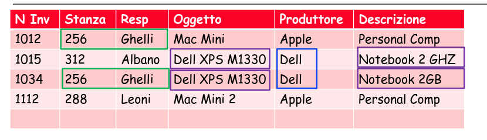
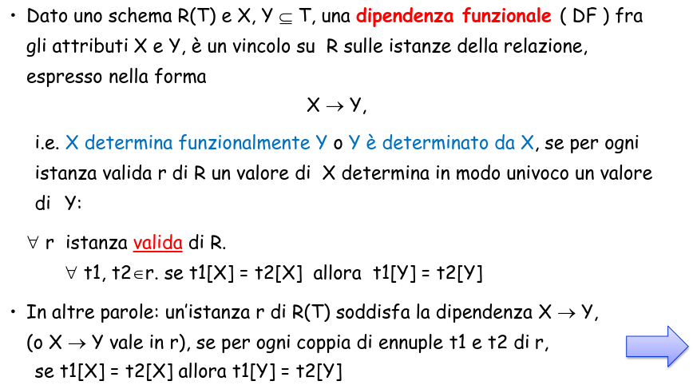
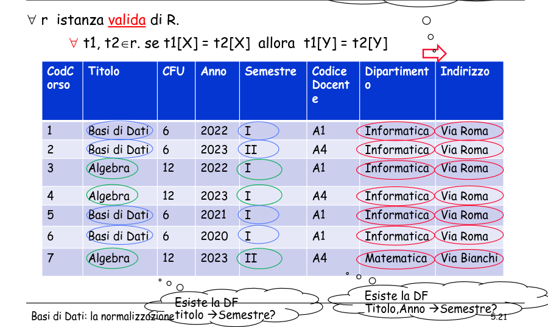
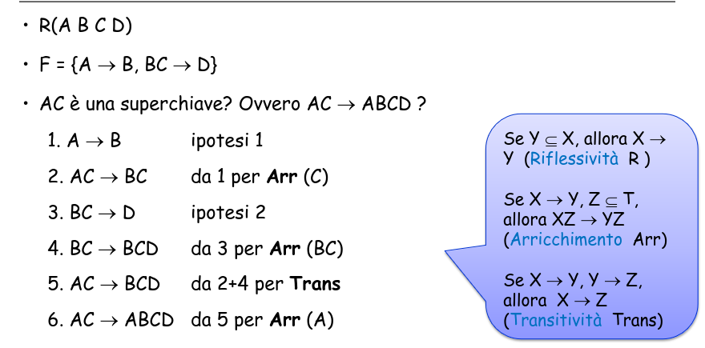
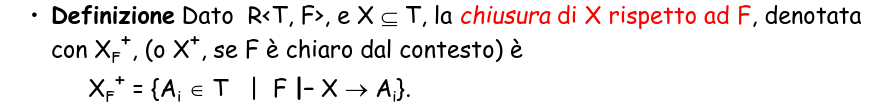

# Basi di dati capitolo 9

[Link alle slides](https://elearning.di.unipi.it/pluginfile.php/78209/mod_resource/content/1/5.Normalizzazione_completo.pdf)

## Normalizzazione

### Parte 1

#### Teoria Relazionale: Introduzione

Due metodi per produrre uno schema relazionale:
a) partire da un buon schema a oggetti e tradurlo
b) partire da uno schema relazionale fatto da altri e modificarlo e completarlo

- Teoria della progettazione relazionale: studia cosa sono le 'anomalie' e come eliminarle (normalizzazione)

- È particolarmente utile se si usa il metodo (b). È moderatamente utile anche quando si usa il metodo (a)

  

È fatta male? Perchè? Come si può correggere?

### Obiettivi

- Nozione base: dipendenze funzionali
- Obiettivi della teoria:
- _Equivalenza_ di schemi: in che misura si può dire che uno schema rappresenta un altro
- _Qualità_ degli schemi (forme normali)
- _Trasformazione_ degli schemi (normalizzazione di schemi)
- Ipotesi dello schema di relazione universale:
- Tutti i fatti sono descritti da attributi di un'unica relazione (relazione universale), cioè gli attributi hanno un significato globale.
- Definizione: Lo schema di relazione universale U di base di dati relazionale ha come attributi l'unione degli attributi di tutte le relazioni della base di dati.

### Obiettivi: Forme Normali

- Una forma normale è una proprietà di una base di dati relazionale che ne garatisce la qualità, cioè l'assenza di determianti difetti

- Quando una relazione non è normalizzata:
- presenta ridondanze
- si presta a comportamenti poco deisderabili durante gli aggiornamenti.

La normalizzazione è una procedura che permette di trasformare schemi non normalizzati in schemi che soddisfano una forma normale.

### Linea Guida per una corretta progettazione

#### Semantica degli attributi

- si progetti ogni schema relazionale in modo tale che sia semplice spiegarne il significato. Non si uniscano attributi proveniente da più tipi di classi e tipi di associazione in una unica relazione.

#### Ridondanza

Si progettino gli schemi relazionali in modo che nelle relazioni non siano presenti anomalie di inserimento, cancellazione o modifica. Se si vogliono introdurre anomalie, che si dichiarino beforehand.

#### Valori Nulli

Per quanto possibile, si eviti di porre in relazione in base attributi i cui valori possono essere nulli. Se è inevitabile, ci si assicuri che essi si presentino solo in casi eccezionali e che non riguardino una maggioranza di tuple nella relazione.

#### Tuple spurie

Si progettino schemi di relazione in modo tale che essi possano essere riuniti tramite JOIN con condizioni di uguaglianza su attributi che sono o chiavi primarie o chiavi esterne in modo da garantire che non vengano generate tuple spurie. Non si abbiano relazioni che contengono attributi di 'accoppiamento' diversi dalle combinazioni chiave esterna-chiave primaria.

### Dipendenze funzionali

Per formalizzare la nozione di schema senza anomalie, occorre una descrizione formale della semantica dei fatti rappresentati in uno schema relazionale.

- Istanza valida di R: è una notazione semantica, che dipende da ciò che sappiamo del dominio del discorso.

Nozione fondamentale: Dipendenza Funzionale

#### Dipendenza funzionale (informale)

- Istanza valida r su R(T)
- Siano X e Y due sottoinsiemi non vuoti di T
- esiste in r una dipendenza funzionale da X a Y se, per ogni coppia di ennuple t_1 e t_2 di r con gli stessi valori su X, risulta che t_1 e t_2 hanno gli stessi valori anche su Y
- La dipendenza funzionale da X a Y si denota X -> Y

Esempio:
Persone(CodiceFiscale, Cognome, Nome, DataNascita)

CodiceFiscale -> Cognome, Nome

### Dipendenze funzionali (formalmente)

  

  

  

Si dice che:

- un'istanza r_o di R soddisfa la DF X -> Y (r_o |= X -> Y) se:
  - la proprietà vale per r_o: per ogni t1, t2 belongs to r, se:
    t1[X] = t2[X] allora t1[Y] = t2[Y]
- e che un'istanza r_o di R soddisfa n insieme F di DF,
  - se per ogni X -> Y belongs F, vale r_o |= X -> Y
    r_o |= X -> Y se per ogni t1, t2 belogns r0. se t1[X] = t2[X] allora t1[Y] = t2[Y]

#### Dipendenze funzionali atomiche - Asimmetria

Ogni dipendenza funzionale X -> A1 A2 ... An, si può scomporre nelle dipendenze funzionali X -> A1, X -> A2, ..., X -> An

Le dipendenze funzionali del tipo X -> A si chiamano dipendenze funzionali atomiche.

#### Decomposizione

Una decomposizione della relazione che non presenti ridondanze e senza perdita di informazione.

Dipendenze funzionali:

- Tipo -> Componente
- Kit -> PrezzoTot
- Kit, Tipo -> PrezzoComponente, QuantCompo, Fornitore

X -> A è non banale se A non è contenuta in X

#### Esprimere le dipendenze funzionali

- Consideriamo: NomeNegozio -> IndNegozio
- Espressione diretta (P => Q):
  Se in due righe il NomeNegozio è uguale, anche l'IndNegozio è uguale:
  - NomeNegozio*= => IndNegozio*=
- Per contrapposizione (¬Q ⇒ ¬P):
  Se l'IndNegozio è diverso allora il NomeNegozio è diverso

Per assurdo:
Non possono esserci due nuple di DotazioniLibri come NomeNegozio uguale e IndNegozio diverso:

- Not (NomeNegozio\_= not IndNegozio)
- NomeNegozio*= not IndNegozio*!= => false

## Parte II

### Dipendenze Funzionali

- R <T, F> denota uno schema con attributi T e dipendenze funzionali F.

- Le DF sono una proprietà semantica, cioè dipendono dai fatti rappresentati e non da come gli attributi sono combinati in schemi di relazione.

- Si parla di DF completa quando X -> Y e per ogni W includes X, non vale W -> Y.

- Se X è una superchiave, allora X determina ogni altro attributo della relazione X -> T

- Se X è una chiave, allora X -> T è una DF completa.

### Proprietà delle DF

Da un insieme F di DF, in generale DF sono 'implicate' da F.
Esempio:
Matricola -> CodFisc |
| -> Matricola -> Cognome
CodFisc -> Cognome |

- Dipendenze implicate (definizione):
  Sia F un insieme di DF sullo schema R, diremo che
  F implica logicamente X -> Y (F |= X -> Y)
  se ogni istanza r di R che soddisfa F soddsfa anche X -> Y

- Dipendenze banali:
  implicate dal vuoto, es {} |= X -> Y

### Regole d'inferenza

Come derivare DF implicate logicamente da F?
Usando un insieme di regole di inferenza

- "Assiomi" di Armstrong:

1. Se Y includes= X, allora X -> Y (riflessività R)

2. Se X -> Y, Z includes= T, allora XZ -> YZ (Arricchimento A)

3. Se X -> Y, Y -> Z, allora X -> Z (Transitività T)

### Derivazione

Sia F un insieme di DF, diremo che X -> Y sia derivabile da F (F |- X -> Y), se X -> Y può essere inferito da F usando gli assiomi di Armstrong.

Si dimostra che valgono anche le regole:

- {X -> Y, X -> Z} |- X -> YZ (unione U)
- Z belongs= Y {X -> Y} |- X -> Z (decomposizione D)

L'unione {X -> Y, X -> Z} |- X -> YZ (unione U)

1. X -> Y

2. X -> XY

3. X -> Z

4. XY -> YZ

5. x -> YZ

**Definizione**

- Sia F un insieme di DF, diremo che X -> Y sia derivabile da F (F |- X -> Y), se X -> Y può essere inferito da F usando gli assiomi di Armstrong.
- Una derivazione di f da F è una sequenza finita f1, ...., fm di dipendenze, dove fm = f e ogni fi è un elemento di F oppure è ottenuta dalle precedenti dipendenze f1,..., fi-1 della derivazione usando una regola di inferenza.

Si dimostra che valgonon anche altre regole:

- {X -> Y, X -> Z} |- X -> YZ (unione U)
- Z includes= Y {X -> Y} |- X -> Z (decomposizone D)

- Da unione e Decomposizione si ricava che se Y = A1A2...An, allora
  X -> Y <=> {X -> A1, X -> A2,..., X -> An}

  

### Correttezza e completezza degli assiomi di Armstrong

- Teorema: Gli assiomi di Armstrong sono corretti e completi.
- Attraverso gli assiomi di Armstrong, si può mostrare l'equivalenza della nozione di implicazione logica (|=) e di quella di derivazione (|-) :
  se una dipendenza è derivaile con gli assiomi di Armstrong allora è anche implicata logicamente (correttezza degli assiomi), e viceversa se una dipendenza è implicata logicamente allora è anche derivabile dagli assiomi (completezza degli assiomi).
- Correttezza degli assiomi:
  per ogni f, F |- f => F |= f

- Completezza degli assiomi:
  per ogni f, F |= f => F |- f

### Chiusura di un Insieme F

- Definizione: Dato un insieme F di DF, la chiusura di F, denotata con F^+, è
  F^+ = {X -> Y | F|- X -> Y}

- un problema che si presenta spesso è quello di decidere se una dipendenza funzionale appartiene a F^+ (problematica dell'implicazione);
- la sua risoluzione con l'algoritmo banale (di generare F^+ applicando ad F ripetutamente gli assiomi di armstrong) ha una complessità esponenziale rispetto al numero di attributi dello schema

  

**Problema dell'implicazione:** controllare se una DF V -> W belongs F^+
Un algoritmo efficiente per risolvere il problema dell'implicazione senza calcolare la chiusura di F, scaturisce dal seguente teorema.

**Teorema/osservazione** F |- X -> Y <=> Y belongs X_f ^+

### Algoritmo per calcolare la chiusura di X rispetto a F

Sia X un insieme di attributi e F un insieme di dipendenze. Vogliamo calcolare la chiusrua di X rispetto ad F.

1. Inizializziamo X^+ con l'insieme X
2. Se fra le dipendenze di F c'è una dipendenza Y -> A con y includes= X^+ allora si inserisce A in X^+, ossia X^+ = X^+ unito {A}
