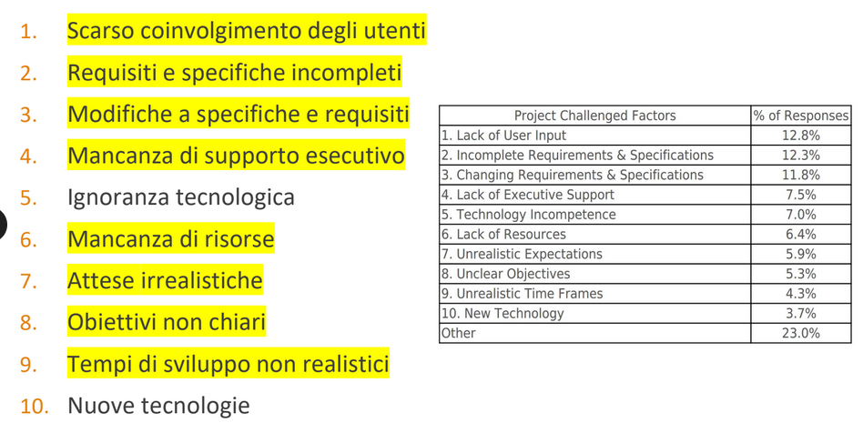
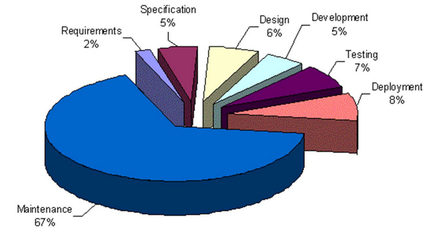

# Ingegneria del Software

[Link alle slides](https://drive.google.com/drive/folders/1myDUt0Lrx2t3SLJG_yu-3i-9y-hdGbDl)

## Capitolo 1

`Processo Software:` inizia quando cominciamo a esplorare il problema e finisce quando il prodotto viene ritirato dal mercato.

`Fasi`:

- analisi dei requisiti
- specifica
- progettazione
- implementazione
- integrazione
- mantenimento
- ritiro

* Riguarda tools e tecniche per lo sviluppo e il mantenimento e tutti i professionisti coinvolti.

**Definizione di IS secondo IEEE**
L'approccio sistematico allo sviluppo, all'operatività, alla manutenzione e al ritiro del software.

1. _Lo scopo è creare fault-free software_
2. Consegnato nei _Tempi previsti_
3. che _rispetti il budget iniziale_
4. che _soddisfi le necessità del committente_
5. facile da _modificare_

### Le cause di abbandono di un progetto software

  

### Specificità del software: Fault Tollerance

è una qualità del sw

### I costi del sw

  

### Importanza della fase di analisi

Se si introduce un errore nella fase di analisi dei requisiti, l'errore appare anche nella specifica, nella progettazione e nel codice.

Prima individui l'errore, meglio è

### La manutenzione del sw

Include tutti i cambiamenti al prodotto software anche dopo che è stato consegnato al cliente.

Si divide in:

1.  _Manutenzione correttiva (20%)_ -> elimina bug ma non cambia la specifica
2.  _Manutenzione migliorativa (80%)_ che può essere:
    - _perfettiva(60%)_ : nuove feature, più qualità in generale
    - _adattiva(20%)_ : cambiamenti a seguito di fattori esterni

### Lavoro in Team

Soprattuto si lavora in teams

Il lavoro in teams pone dei problemi:

- interfaccia tra le diverse componenti del codice
- di comunicazione tra in membri del team

Bisogna saper gestire i rapporti umani, organizzare il team e gestire gli aspetti economci legali

### Tesi di IS

- Processo software
- Realizzazione di sistemi software
- Qualità del software

### Processo SW

- Organizzazione e gestione dei progetti
  - definizione e correlazione attività
- Metodi di composizione dei gruppi di lavoro
- Strumenti di pianificazione, analisi, controllo
- Modelli ideali di processo di sviluppo

### Realizzazione di sistemi SW

- Strategie di analisi e progettazione

  - tecniche per la comprensione e la soluzione di un problema
  - Top-down , bottom-up, progettazione modulare, OO

- Linguaggi di specifica e progettazione

  - Strumenti per la definizione di sistemi software
  - Reti di Petri, Z, OMT, UML

- Ambienti di sviluppo
  - Strumenti per analisi, progettazione e realizzazione
  - Strumenti tradizionali, CASE, CAST

### Qualità del SW

- Modelli di qualità

  - Definizione di caratterstiche della qualità

- Metriche software

  - Unità di misura, scale di riferimento, strumenti
  - Indicatori di qualità

- Metodi di verifica e controllo
  - Metodi di verifica, criteri di progettazione delle prove
  - Controllo della qualità, valutazione del processo di sviluppo

### Stakeholders

- Fornitore (chi lo sviluppa)

- Committente (chi lo richiede e paga)

- Utente(chi lo usa)
