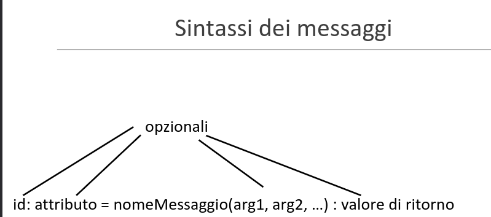
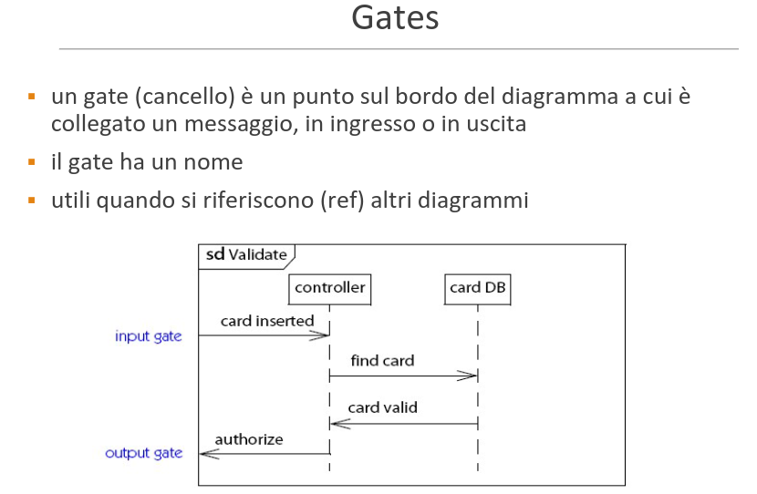
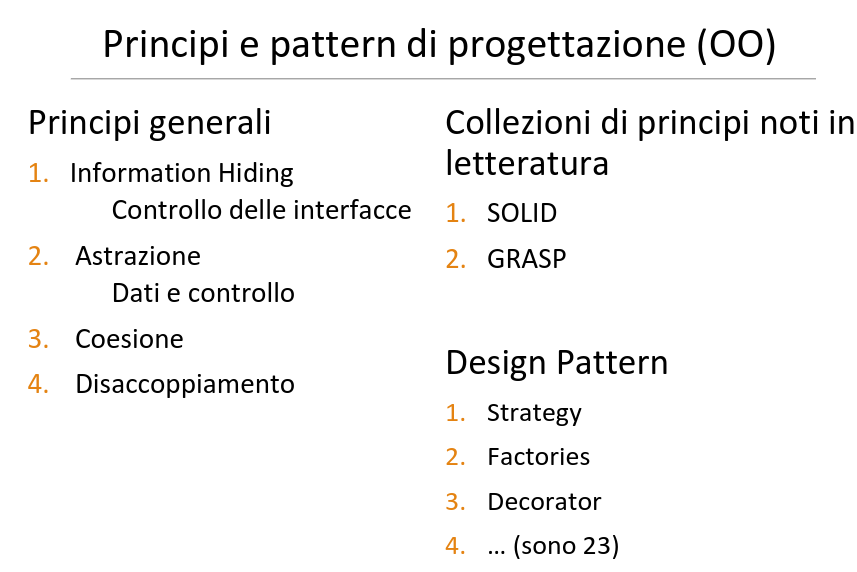

# Diagramma di sequenza Cap 10

[Link alle slides](http://didawiki.cli.di.unipi.it/lib/exe/fetch.php/informatica/is-a/is_12_diagrammisequenza_con_esercizi.pdf)

## Diagrammi di sequenza

Si usano:
◦ per descrivere le interazioni: scambi di messaggi e dati
tra oggetti
◦ organizzati in sequenza temporale
◦ In fase di analisi: tra attori e sistema per la realizzazione di un
caso d’uso
◦ Formalizzano la sequenza principale degli eventi
◦ In fase di progettazione: messaggi scambiati tra componenti,
eventualmente comprendendo anche attori
◦ Illustrano come l’architettura realizza i requisiti

Elementi di un diagramma di sequenza
Oggetti partecipanti alle interazioni sono
rappresentati con linee di vita formate da:
◦ un rettangolo, che indica ruolo (nell’interazione) e/o
tipo dell’oggetto (uno dei due obbligatorio, entrambi
solo se utile)
◦ una linea verticale chiamata linea di vita dell’oggetto
◦ questa linea è tratteggiata quando l’oggetto è inattivo,
◦ continua e doppia quando l’oggetto è attivo. Oggetti sempre
attivi (es attori) hanno l’intera linea di vita continua e doppia.

I messaggi:
Rappresentano invocazione
di operazione o segnali
Possono essere:
▪ Sincroni (1)
▪ di return (1.1)(opzionali)
▪ asincroni (2)
(es invio email)
 asincroni con esplicito
consumo di tempo (3)

  

### Creare e distruggere partecipanti

Alcuni partecipanti
possono essere
◦ aggiunti dinamicamente
all’interazione
◦ N.B. la «create» (va bene
anche «new») è una
dipendenza
◦ cancellati

  

# Principi di progettazione e qualità di un progetto

[Link alle slides](http://didawiki.cli.di.unipi.it/lib/exe/fetch.php/informatica/is-a/is_13_principidiprogettazione.pdf)

## Progetto software

Obiettivo della fase di progettazione non è solo la pianificazione del lavoro.

Le buone pratiche e le tecniche di progettazione mirano a produrre un sistema non solo che realizza i requisiti funzionali e di qulità ma anche:

- facilemente mantenibile: su cui è facile (ed ecnoomco) fare manutenzioen
- Riusabile: è facile riusare parti del distema in altri sistemi futuri

  

