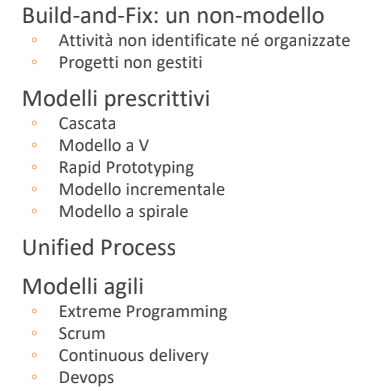

# Ingegneria del Software

[Link alle slides](https://drive.google.com/drive/folders/1myDUt0Lrx2t3SLJG_yu-3i-9y-hdGbDl)

## Capitolo 2

### Il processo software

Il percorso da svolgere per sviluppare un prodotto o sistema software

- Inizia con l'esplorazione dell'idea e finisce con la dismissione del software.

- Il processo software include anche:
  - gli strumenti e le tecniche per lo sviluppo
  - e i professionisti coinvolti

**Modellare il progetto** -> _strutturarlo_

ovvero

- suddividerlo in attività, dire:
  - Cosa
  - Quali progetti
  - Quando

`ISO 12207` -> standard di processo

### Modello di ciclo di Vita

- Organizzazione delle attività
  - Ordinamento delle attività
  - Criteri per terminare e passare alla successiva

### Evoluzione dei modelli di ciclo di vita

  

