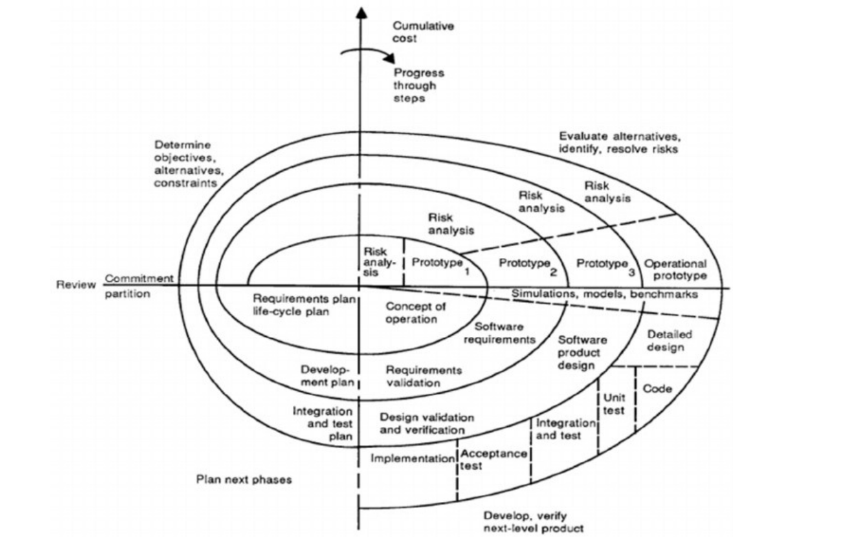

# Ingegneria del Software

[Link alle slides](https://drive.google.com/drive/folders/1myDUt0Lrx2t3SLJG_yu-3i-9y-hdGbDl)

## Capitolo 2

### Il processo software

Il percorso da svolgere per sviluppare un prodotto o sistema software

- Inizia con l'esplorazione dell'idea e finisce con la dismissione del software.

- Il processo software include anche:
  - gli strumenti e le tecniche per lo sviluppo
  - e i professionisti coinvolti

**Modellare il progetto** -> _strutturarlo_

ovvero

- suddividerlo in attività, dire:
  - Cosa
  - Quali progetti
  - Quando

`ISO 12207` -> standard di processo

### Modello di ciclo di Vita

- Organizzazione delle attività
  - Ordinamento delle attività
  - Criteri per terminare e passare alla successiva

### Evoluzione dei modelli di ciclo di vita

  

### Build-and-Fix Model

Il prodotto è sviluppato senza specifica e senza un tentativo di progettazione

- lo sviluppatore scrive un programma
- che poi è modificato più volte finchè non soddisfa il committente

  

Questo non è un vero modello per sviluppare e va bene forse per un progetto di un centinaio di righe di codice.

### Il modello a cascata (Royce, 1970)

  

Lo studiamo perchè è stato il primo a distinguere e a riconoscere le diverse fasi di un processo software. Importani le fasi di analisi e di progettazione. Si può passare alla nuova fase solo dopo il completamento della precedente.

`Modello document driven` -> ogni fase = un doc da approvare

#### Analisi del modello a cascata

1. Manca interazione col cliente che vede solo il prodotto finito alla fine del processo.
   Quindi se il progetto non rispetta le aspettative o il cliente chiede di cambairlo, bisogna ricominicare tutto il processo.

2. Troppi documenti prodotti

3. Lo ricordiamo solo per la rilevanza storica

`Da modello a cascata a modello a caduta è un attimo`

Quindi si è cercato di introdurre i feedback loops

  

### Modello a V

É un modello sequenziale, dove le frecce blu rappresentano il tempo, quelle tratteggiate le dipendenze casuali

  

Evidenzia come sia possibile progettare i test duante le fasi di sviluppo.
Attività di test come parte del processo di sviluppo del software.

**Il modello a V è il modello a cascata con la parte inferiore piegata verso l'alto**.

- Le attività a destra verificano o convalidano i prodotti dell'attività a sinistra.

- Le attività a sinistra rappresentano analisi che scompongono le esigenze degli utenti in pezzi piccoli e gestibili.

- il lato destro mostra le corrispondenti attività di sintesi che aggregano e testano questi pezzi in un sistema che soddisfa le esigenze degli utenti.

`Modello di validazione o di verifica` ed è uno degli standard SQA

  

### Rapid Prototyping

- Costruire velocemente un prototipo per permttere al committente di sperimentarlo.

- Il prototipo aiuta il cliete a descrivere i requisiti

- Utile quando i requisiti non sono chiari

- `Modello evolutivo`

  

### Modello Incrementale

Il sistema è costruito iterativamente aggiungendo nuove funzionalità.
I requisiti e il progetto sono definiti inizialmente. Il sistema è implementato, integrato e testato con una serie di passagi incrementali.

_In caso di requisiti stabili_, serve a :

- ritardare la realizzazione di componenti che dipendono da fattori esterni
- 'uscire' velocemente con qualcosa

`Rischia di diventare un build and fix`

  

### Il modello a spirale (Boehm 1988)s

  

Iterativo, ogni iterazione è organizzata in 4 fasi

1. Definizione degli obiettivi
2. Analisi dei rischi
3. Sviluppo e validazione
4. Pianificazione del nuovo ciclo

  

`Modello astratto` ->

- Va specializzato per dire cosa fare in concreto in ogni iterazione e in ogni sua fase.
- Applicabile ai cicli tradizionali

_Evidenzia gli aspetti gestionali_ :

- Pianificazione delle fasi
- Centrato sull'analisi dei rischi (_risk driven_)

Ispirato al `plan-do-check-act-cycle`.
Prevede maggior comunicazione e confronto con il committente.

### Unified Process (Booch. Jacobson, Roumbaugh 1999)

Guidato dai casi d'uso e dall'analisi dei rischi, incentrato sull'architettura di massima e lasciare i dettagli per dopo. Così si ha subito una visione generale del sistema facilemnte adattabile al cambiamento dei requisiti.

- Iterativo incrementale

  

### Agile

Meno di 50 sviluppatori è l'ideale.

si basa sui principi del **Manifesto di Snowbird, feb 2001**

`Comunicazione`

`Semplicità`

`Feedback`

`Coraggio`

**Concetti chiave che nascono dai processi Agile sono:**

`Continuous Integration`

`Continuous delivery`

`DevOps`

### eXtreme Programming

- è un esempio di processo agile  
  Si basa su un insieme di prassi:
- Pianificazione flessibile
  - basata su scenari proposti dagli utenti
  - coinvolge i programmatori
- Rilasci frequenti
  - due-quattro settimane
  - inizio di una nuova pianificaziones

`Prassi di XP (continua)`

- progetti semplici
- verifica (testing)
- Test Driven Development
- Cliente sempre a disposizione
- Programmazione a coppie
- no lavoro extra
- collettivizzazione del codice
- code refactoring
- daily stand up meeting

### SCRUM

É un processo Agile. Un processo in cui un insieme di persone si muove all'unisono per raggiungere un obiettivo predeterminato, tale obiettivo garantisce la soddisfazione delle ambizioni di squadra e delle ambizioni personali.

É un processo iterativo, incrementale per lo sviluppo e gstione di ogni tipologia di prodotto.

#### SCRUM: Fase 1

**Pre-game phase**

- **Planning sub-phase** -> Product Backlog List

- **Architecture sub-phase** -> design di alto livello del sistema

#### SCRUM: Fase 2

**Development phase** -> sistema sviluppato attraverso una serie di Sprint.

  

#### SCRUM: Fase 3

**Post-game phase (continene la chiusura definitiva della release)**
La gestione conclude il processo di sviluppo e il prodotto viene preparato per il rilascio. Questo include:

- integrazione
- test
- documentazione per l'utente
- formazione e preparazione del materiale di marketing

#### Tre ruoli: Product Owner

Tale ruolo è occupato da uella persona a cui fanno riferimento tutti i soggetti interessati al progetto.
Fa stime, aggiusta i processi che presentano difetti e di gestire l'intero prrocedimento.
Poteri: accetta, rigetta i risultati di un lavoro.
Termina uno sprint se necessario

#### Tre ruoli: Memnro del team

Costruiscono il prodotto e dicdono che fare ad ogni sprint
7 + 2 persone

#### Tre ruoli: Scrum Master

supporta il team garantedno le condizioni ambientali e le motivazini necessarie ad eseguire al meglio il lavoro commissionato.

#### Backlog

  

