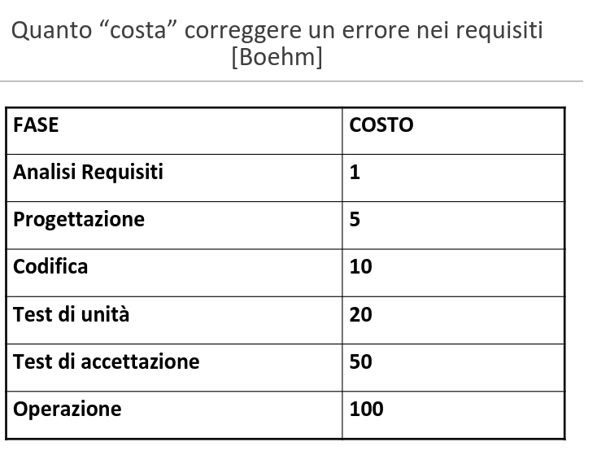

# Ingegneria del Software

[Link alle slides](https://drive.google.com/drive/folders/1myDUt0Lrx2t3SLJG_yu-3i-9y-hdGbDl)

## Capitolo 3

### Analisi dei Requisiti

**Studio di fattibilità**

- Descrizione sommaria
- analisi di mercato
- analisi tecnica

### Attività di Analisi dei Requisiiti

1. Capire cosa
2. Documentare cosa
3. Negoziazioni

**Cos'è l'analisi dei requisiti?**

il processo di studio e analisi delle esigenze del committente e dell'utente per giunger alla definizione del dominio del probelma e dei requisiti del sistema.

**Obiettivi dell'analisi dei requisitii**

1. confini del nuovo sistema e come interagisce con ambiente.
2. Individua e risolve difetti dei requisiti
3. Negozia le priorità
4. Elabora i requisiti del sistema
5. Classificare le info sui requisiti in varie categorie e assegnare i requisiti ai sottosistemi.
6. Definire e analizzare i requisiti di qualità

### Le cause di abbandono secondo lo Standish Group

1. Requisiti incompleti
2. Scarso coinvolgimento dell'utente
3. Mancanza di risorse
4. Atese irrealistiche
5. MOdifiche a specifiche e requsiiti
   ...
   ...
   ...
6. Ignoranza tecnologica

  

`Il 56% degli errori nei requisiti possono essere riferiti al software`

  

#### Si definisce cosa fare non come farlo

### Prodotto dell'attività di analisi

Documento e/o modello che descrive:

- il dominio del sistema da realizzare
- i requisiti utente

Opzionalmente anche:

- manuale utente
- Casi di test

**Dominio**
ambito o contesto in cui il software opera

Prima ancora di incontrare i committenti, il team di analisi deve acuisre conoscenza del dominio.

Si costruire un _glossario_ -> dizionare con la definizione dei termini
Si definiscono un _modello statico_ e un _modello dinamico_.

### Modello statico (usando UML)

  

### Modello dinamico, descrizione testuale

  

### Modello dinamico, usando UML

  

### Descrizione del dominio

- entità
- relazioni
- processi
- comportamenti

che esulano dal sistema software che deve essre realizzato.
Il dominio esiste prima del software.

### Definizione di Requisito

  

### Requisiti funzionali

Descrivono le funzionalità : azioni da compiere, come il sistema reagisce, come si comporta in situazione x (riferite al sitema)

**Esempio**: Ogni nuovo ordine = unique_ID

### Requisiti non funzionali

Descrivono le proprietà del software in relazione a determinati servizi o funzioni e possono anche essere relativi al processo. (software e cose esterne)

Caratteristiche di qualità, del processo di sviluppo, esterne.

**Esempio**: tempo di risposta all'inserimento della password utente deve essere meno di 10sec.

  

  

  

### Documento dei requisiti
