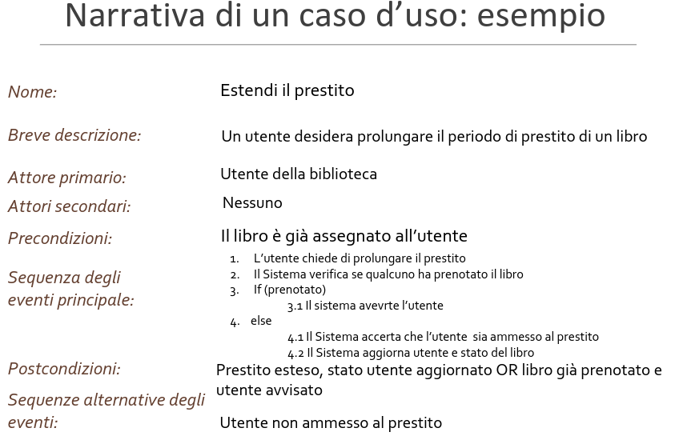

# Ingegneria del Software

[Link alle slides](http://didawiki.cli.di.unipi.it/lib/exe/fetch.php/informatica/is-a/is_04_introuml_casid_uso.pdf)

## Capitolo 4

### Intro a UML e casi d'uso

### Cos'è un modello

- Astrazione del sistema o del dominio usato epr specificarne al struttura / comportamento.

Un modello cattura aspetti importanti e astrae dai dettagli.
É espresso con un formalismo che ne rende facile l'uso e la comprensione.

### Come si modella un sistema?

  

### Come si usa un modello?

- Modello può essere, bozza, progetto dettagliato, eseguibile.

### UML

Unified Modelling Language: linguaggio di modellazione unificato.

Serve per supportare la descrizione e il progetto di sistemi software in
particolare applicazioni Object Oriented, ma non solo
▪ Famiglia di notazioni grafiche
◦ Permettono di descrivere diversi modelli da diversi punti di vista
◦ Sono correlate (descritte da un meta-modello comune)
◦ Sono generalmente facilmente comprensibili a clienti e utenti

è adatto a descrivere aspetti diversi di un progetto software:

Descrizione strutturale (statica) vs Descrizione di un
comportamento (dinamica)
◦ Bozza di progetto vs progetto finale
◦ Descrizione del dominio vs descrizione della struttura del codice

  

### Diagrammi che vedremo nel corso

  

### Diagrammi dei casi d'uso

_Modellazione dei Requisiti_:
aiuta a raccogliere i requisiti funzionali, elaborarli e
documentarli  
_Modello statico:_  
diagramma dei casi d’uso  
_Modello dinamico_:  
narrative associate ai casi d’uso

descrive i requisiti funzionali del sistema  
_Cattura le funzionalità che un sistema deve offrire, visto
dall’esterno:_  
i compiti che un utente può realizzare con l’aiuto del sistema.  
_Un attore è un’entità esterna al sistema, che interagisce_  
direttamente con esso in un determinato ruolo  
_Tre tipologie di attori_

- utente umano in un determinato ruolo
- altro sistema
- tempo (attore speciale)

**Un caso d'uso** è una funzionalità o un servizio offerto dal sistema a uno o più attori, ovvero un compito un attore può svolgere con l'aiuto del sistema ed è espressa come un insieme di scenari.
**Uno scenario** è una sequezna di intrazioni(scambi di messaggi) tra sistema e attori

  

  

  

### Narrativa di un caso d'uso

Documento che descrvie il modello dinmico, gli scenari rilevanti di un caso d'uso, dal punto di vista degli attori, compreso chi lo inizia, i.e. chi è l'attore principale (aka primario)

**Caratteristiche**: inizio, fine, passi intermedi, condizioni eccezzionali, precondizioni, postcondizioni

  

  

Uno scenario è un'istanza di un caso d'uso: una sequezna di passi che introduce un risultato osservabile da uno o più attori.

Gli scenari descritti dalla sequenza principale degli eventi sono quelli che portano alla postcondizione.

  

### Precondizioni e postcondizioni: nota importante

▪ Pre- e postcondizioni sono asserzioni che devono essere
vere in uno stato.

▪ Sono quindi predicati o formule logiche che valgono vero o
falso in uno stato: precondizione prima di iiniziare il caso
d’uso, postcondizioni alla fine

▪ Non sono MAI azioni

### Relazione tra precondizione, postcondizione, sequenza principale e sequenza alternativa
