# Ingegneria del Software

[Link alle slides 9](http://didawiki.cli.di.unipi.it/lib/exe/fetch.php/informatica/is-a/is_08a_attivita.pdf)

## Capitolo 9

### Progettazione: architetture software

- Costituisce la fase ponte fra la specifica e la codifica
- La fase in cui si passa da:
- 'che cosa' deve essere fatto a
- 'come' deve essere fatto

Il suo prodotto si chiama architettura del sw.

### Progettazione : livello di astrazione

- Progettazione architetturale (alto livello)
- scopo è la scomposizione di un sistema in sottoinsiemi

- Progettazione di dettaglio
- decisione su come la specifica di ogni parte sarà realizzata

### Definizione di architettura software

- L'architettura di un sistema software è la struttura del sistema, costituita:
- dalle parti del sistema
- dalle relazioni tra le parti
- dalle loro proprietà visibili

L'architettura definisce la struttura del sistema sw, specifica le comunicazioni tra componenti, considera aspetti non funzionali, è un'astrazione, è un artefatto compleso.

### Le viste

- 3 astrazioni interessanti -> 3 punti di vista simultanei sul sistema sw

1. vista comportamentale
2. vista strutturale
3. vista logica

#### Vista comportamentale

- Aka component-and-connector, aka C&C

- La vista C&C descrive un sistema software come composizione di componenti software:
- `specifica i componenti con le loro interfacce`
- `descrive le caratteristiche dei connettori`
- `descrive la struttura del sistema in esecuzione, flusso di dati, dinamica, parallelismo, replicazioni`

- Utile per, analisi delle caratteristich di qualità a tempo d'esecuzione, prestazioni, affidabilità, disponibilità, sicurezza.

- Utile anche per documentare lo stile dell'architettura

### Vista Strutturale

- Descrive la struttura del sistema come insieme di unità di realizzazione
- classi, packages

Serve ad analizzare dipendenze tra packages, progettare test di unità e di integrazione, valutare al portabilità.

### Vista Logistica

- aka vista di deployment
- Descrive l'allocazione del sw su ambienti di esecuzione

A cosa serve?

- permette di valutare prestazioni e affidabilità

  

### Vista comportamnetale in dettaglio

**Componenti**

- Software: una cs è un'unità di software indipendente e riusabile che esegue na specifica funzione o compito all'interno di un'applicazione più ampia.
- É un'unità concettuale di decomposizione di un sistema a tempo d'esecuzione.
- Incapsuala un insieme di funzionalità e/o di dati di un sistema
- restringe l'accesso a quell'insimee di funzionalità e/o dati tramite delle interfacce defniite
- ha un proprio contesto di esecuzione
  può essere distribuit e installato in modo indipendente da altri componenti

**Sistema software === composizione di componenti software**

  

#### Porti

I porti identificano i punti di interazione di un componente:

- un componente può avere più porti, uno per ogni tipo di connesione con altri componenti
- un porto fornisce o richiede una o più interfacce
- UML: unporto è rappresentato con un 'quadratino', può avere un nome e/o avere associata una molteciplità con l'usuale sintassi.

  

#### Interfacce: descrizione sintetica vs estesa.

  

- **Stile publish-Subscribe**
- **Model-View-Controller**

  

I connettori sono canali di inerazione tra componenti che collegano i porti.
Protocolli, flussi d'informazione, accessi ai depositi.

### Connettori in UML

I connettori collegano i porti:

  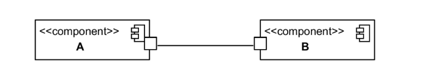

- In UML, i connettori non hanno un descrittore specifico, si modellano con un'associazione.

- Aggiungiamo informazione sul protocollo di comunicazione, descritto sinteticamente indicando lo stile della connesione.

Per documentare il protocollo di interazione si usa uno stereotipo:

  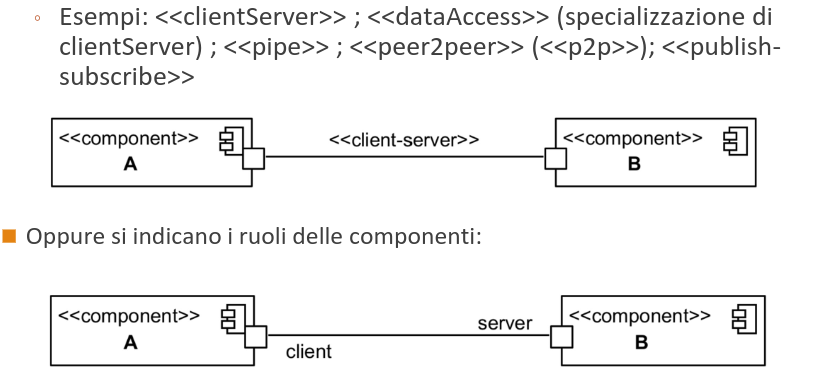

  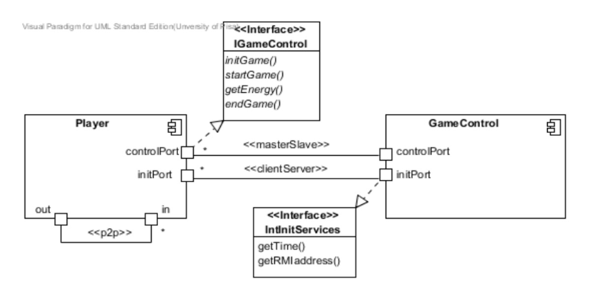

### Stili (o schemi) architetturali

Uno stile è una proprietà di una architettura.
Uno stile caratterizza una famiglia di archietture con caratteristiche comuni.

- Stile a macchine virtuali: i moduli definiscono macchine virtuali

- Stile client-server: caratterizzato da particolari interazioni tra componenti

### Vista C&C

Le funzionalità di componenti interagenti e le caratteristiche delle interazioni tra componenti spesso rispondono a stili (schemi) standard

Nella vista C&C no stile architetturale è caratterizzato da:

- caratteristiche generali delle componenti in gioco
- particolari interazioni tra le componenti e quindi dalle caratteristiche dei porti e dei connettori

- Vedremo gli stili di uso comune
  - le loro caratteristiche
  - un modo per documentarli

### Stili architetturali: condotte (pipe) e filtri

- Componenti, sono di tipo filtro: trasformano uno o più flussi di dati dai porti d'ingresso in uno o più flussi sui porti d'uscita.

- Connettori, sono di tipo condotta (pipe): canale di comunicazione unidirezionale bufferizzato che preserva l'ordine dedi dati dal ruolo d'ingresso a quello d'uscita.

- Usi: pre-elaborazione in sistemi di elaborazione di segnali, analisi dei flussi di dati, e.g. dimensioni del buffer.

### Pipe and filter

  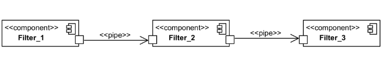

Lo stile Pipes and filters consiste in una catena di filtri per l'elaborazione dei dati, collegati attraverso delle pipe:

- i filtri passano i dati in uscita ai filtri adiacenti attraverso le pipe.

Gli elementi del modello Pipes and Filters possono variare nelle funzioni che svolgono.
Esempi: pipe con supporto per il buffering dei dati, biforcazioni.

  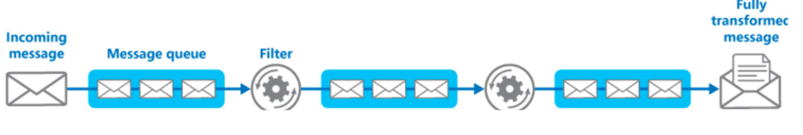

  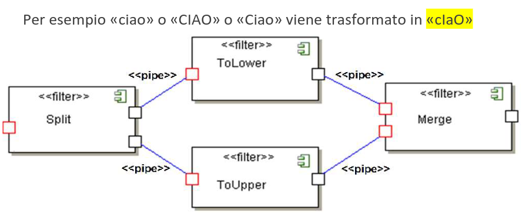

  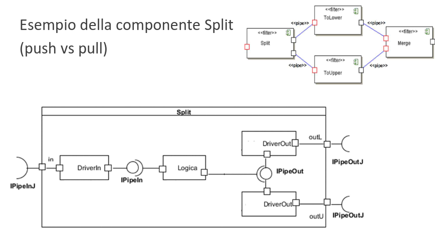

### Stile client-server

Il sistema è formato da due componenti: il client e il server

- spesso, ma non necessariamente, eseguiti su macchine diverse collegate in rete

 

  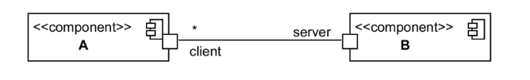

Il server svolge le operazioni necessarie per realizzare un servizio:

- ad esempio gestisce una banca dati
  ecc ecc

- Aspetta le richieste dei client a un porto
- Un client invia al server le richieste ed attende una risposta

### Come si realizza un'architettura client server

Lato server: uno (o più) thread in ascolta delle richieste, più un gestore delle richieste.

Quando riceve una richiesta, il server elabora e invia una risposta al client. I server possono essere ulteriormente classificati come stateless o stateful.

I client di un server stateful possonon fare richieste composite che consistono in più richieste atomiche. Ciò consente un'interazione più colloquiale o transazionale tra client e server. A tal fine, un server stateful conserva un record delle richieste di ciascun cliente corrente. Questo record è chiamato sessione.

### Stile master-slave

Un caso particolare del client-server, ma risponde a esigenze diverse

  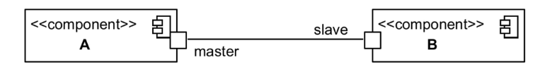

- slave serve un solo cliente (master)

Architettura usata per esempio nella replica di database, il databse master è considerato come fonte autorevole e i database slave sono sincronizzati con esso.

### Stile P2P (peer to peer)

Da pari a pari (peer to peer)

- caso particolare di client server
- tutti i componenti agiscono sia da client sia da server.
- Es: i programmi di scambi audio e video (WinMx, Kazaa, eMule)

Scambio di servizi alla pari

  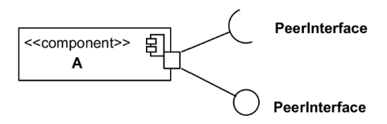

C'è una sola componente nello schema perchè i peer sono tutti sue istanze.

  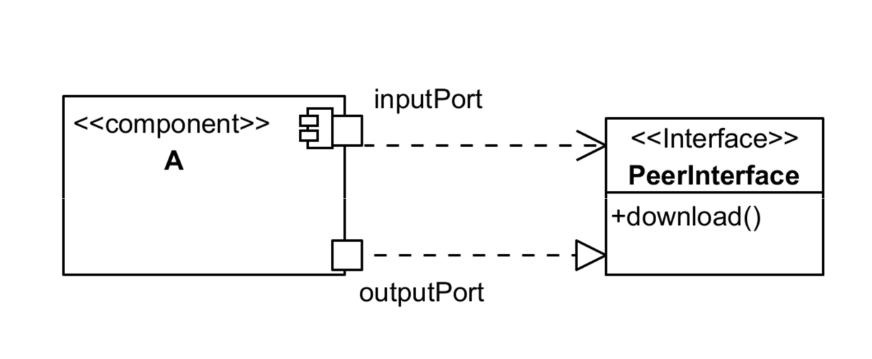

### Stile Publish-Subscribe

I componenti intragiscono annunciando eventi:

- un componente si abbandona alle classi di eventi rilevanti per il suo scopo.
- Ciascuna componente, volendo, può essere sia produttore che consumatoe di eventi.

- Disaccoppia produttori e consumatori di eventi e farisce le modifiche dinamiche del sistema.

Un compoenente può essere sia publischer che subscriber.
Due diversi connettori, uno per le richieste di sottoscrizione e per rihcieste di pubblicazione, uno per diffondere i dati.

  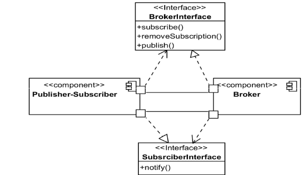

  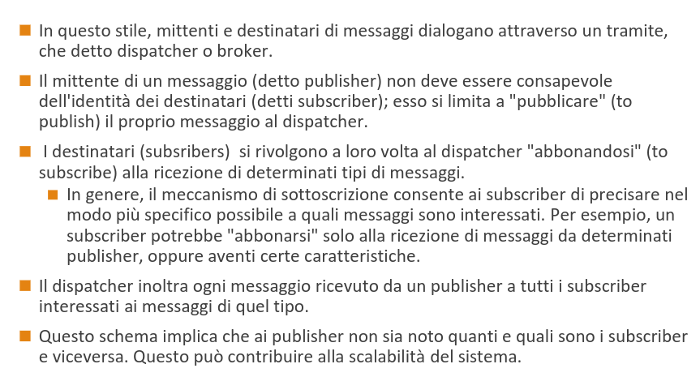

  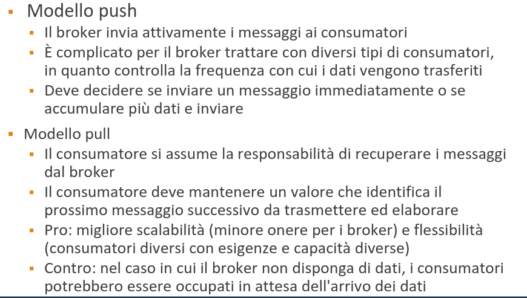

  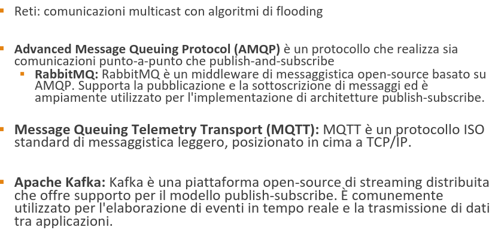

### Publish-Subscribe: DDS

  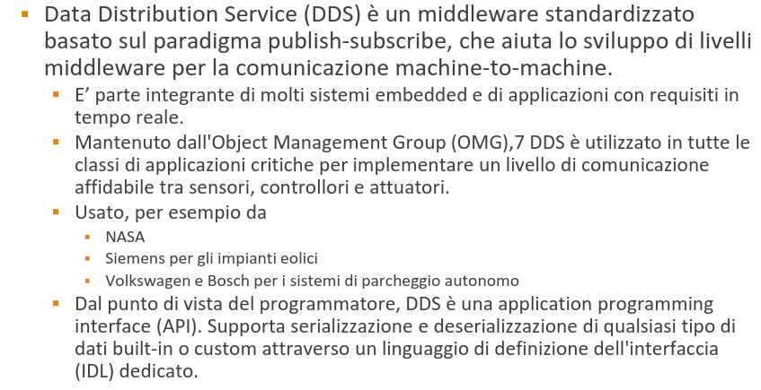

### Stile Model-View COntroller (MVC)

Stile in cui si isola la logica di business dal controllo sull'input e dalla presentazione (vista sui dati), consentendo sviluppo indipendente, test e manutenzione di ciascuno.

- Modello:
  Il modello fornisce il nucleo funzionale di un'applicazione, ed è la rappresentazione del modello dei dati su cui opera l'applicazione. Quando un modello cambia il suo stato, notifica le sue viste associate in modoc he si possano aggiornare: notifica alle viste la modifica dei dati; le viste recuperano le informazioni (e le mostrano all'utente).

- Vista:
  Rende il modello in una forma adatta all'interazione, in genere un elemento dell'interfaccia utente. Ci possono essere più viste per un singolo modello, per scopi diversi.

- Controllore:
  Riceve l'input ed effettua chiamate agli oggetti del modello. I controllori traducono gli eventi in richieste per eseguire operazioni sugli elementi del Modello.

  

  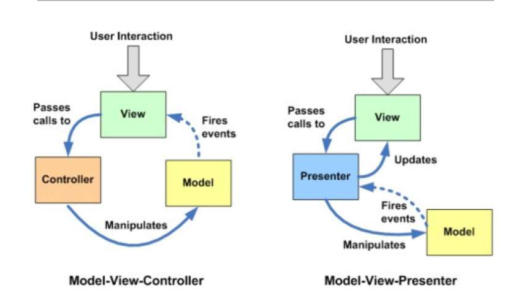

  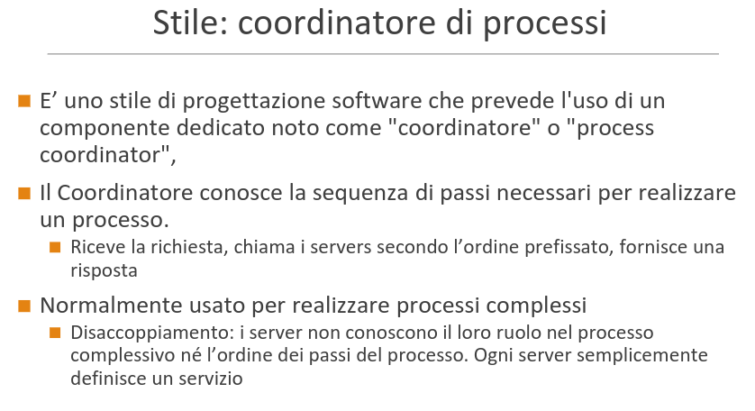

### Viste di tipo strutturale

  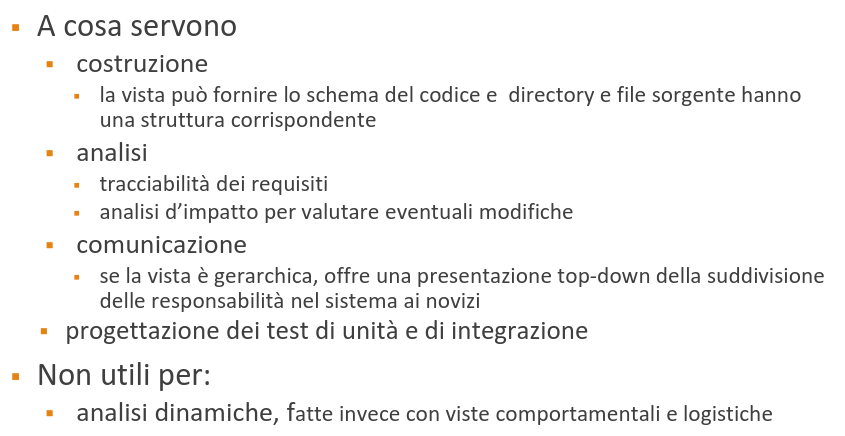

### Vista strutturale di decomposizione

Relazione: parte di

- una classe fa parte di un package
- un package fa parte di uno più grande

Criteri per raggruppare

- incapsulamento per modificabilità
- supporto alle scelte costruisci/compra
- moduli comuni in linee di prodott

A cosa serve questa vista
apprendimenro del sistema
punto di partenza per l'allocazione del lavoro

  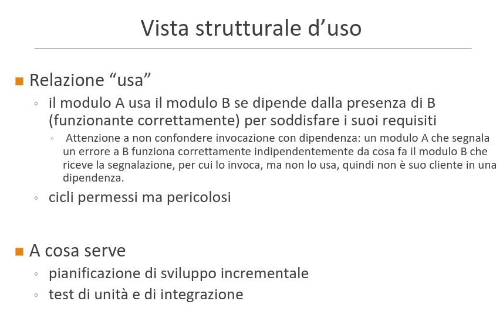

### Vista strutturale a strati

  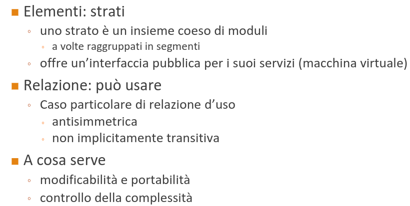

  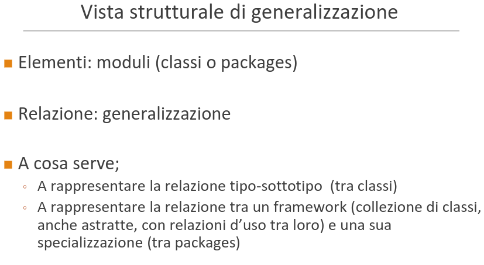

### Vista di dislocazione (deployment)

  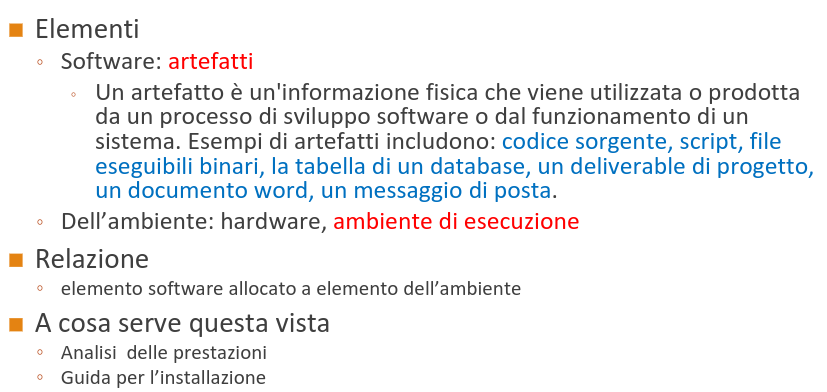

"Deployment" di componenti
Normalmente si parta di deployment di componenti, mentre
in realtà si disloca un artefatto
◦ L’artefatto è una copia di un’implementazione di componente che è
stata installata/rilasciata (deployed) su un particolare
computer/ambiente di esecuzione
L’installazione avviene su un ambiente di esecuzione (nodo)
◦ l’installazione comprende la configurazione e la registrazione del
componente in tale ambiente
Un artefatto (in questo caso anche chiamato componente
installato) «manifesta» un componente
Un componente (che esiste a run time) è un’istanza creata a
partire da un artefatto in un ambiente di esecuzione
