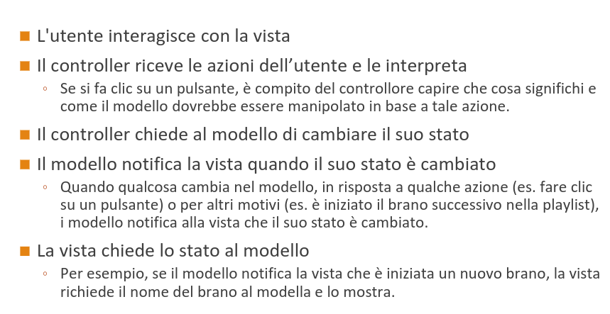

# Ingegneria del Software

[Link alle slides 9](http://didawiki.cli.di.unipi.it/lib/exe/fetch.php/informatica/is-a/is_08a_attivita.pdf)

## Capitolo 9

### Progettazione: architetture software

- Costituisce la fase ponte fra la specifica e la codifica
- La fase in cui si passa da:
- 'che cosa' deve essere fatto a
- 'come' deve essere fatto

Il suo prodotto si chiama architettura del sw.

### Progettazione : livello di astrazione

- Progettazione architetturale (alto livello)
- scopo è la scomposizione di un sistema in sottoinsiemi

- Progettazione di dettaglio
- decisione su come la specifica di ogni parte sarà realizzata

### Definnizione di architettura software

- L'architettura di un sistema software è la struttura del sistema, costituita:
- dalle parti del sistema
- dalle relazioni tra le parti
- dalle loro proprietà visibili

L'architettura definisce la struttura del sistema sw, specifica le comunicazioni tra componenti, considera aspetti non funzionali, è un'astrazione, è un artefatto compleso.

### Le viste

- 3 astrazioni interessanti -> 3 punti di vista simultanei sul sistema sw

1. vista comportamentale
2. vista strutturale
3. vista logica

#### Vista comportamentale

- Aka component-and-connector, aka C&C

- La vista C&C descrive un sistema software come composizione di componenti software:
- `specifica i componenti con le loro interfacce`
- `descrive le caratteristiche dei connettori`
- `descrive la struttura del sistema in esecuzione, flusso di dati, dinamica, parallelismo, replicazioni`

- Utile per, analisi delle caratteristich di qualità a tempo d'esecuzione, prestazioni, affidabilità, disponibilità, sicurezza.

- Utile anche per documentare lo stile dell'architettura

### Vista Strutturale

- Descrive la struttura del sistema come insieme di unità di realizzazione
- classi, packages

Serve ad analizzare dipendenze tra packages, progettare test di unità e di integrazione, valutare al portabilità.

### Vista Logistica

- aka vista di deployment
- Descrive l'allocazione del sw su ambienti di esecuzione

A cosa serve?

- permette di valutare prestazioni e affidabilità

  

### Vista comportamnetale in dettaglio

**Componenti**

- Software: una cs è un'unità di software indipendente e riusabile che esegue na specifica funzione o compito all'interno di un'applicazione più ampia.
- É un'unità concettuale di decomposizione di un sistema a tempo d'esecuzione.
- Incapsuala un insieme di funzionalità e/o di dati di un sistema
- restringe l'accesso a quell'insimee di funzionalità e/o dati tramite delle interfacce defniite
- ha un proprio contesto di esecuzione
  può essere distribuit e installato in modo indipendente da altri componenti

**Sistema software === composizione di componenti software**

  

#### Porti

I porti identificano i punti di interazione di un componente:

- un componente può avere più porti, uno per ogni tipo di connesione con altri componenti
- un porto fornisce o richiede una o più interfacce
- UML: unporto è rappresentato con un 'quadratino', può avere un nome e/o avere associata una molteciplità con l'usuale sintassi.

  

#### Interfacce: descrizione sintetica vs estesa.

  

- **Stile publish-Subscribe**
- **Model-View-Controller**

  

