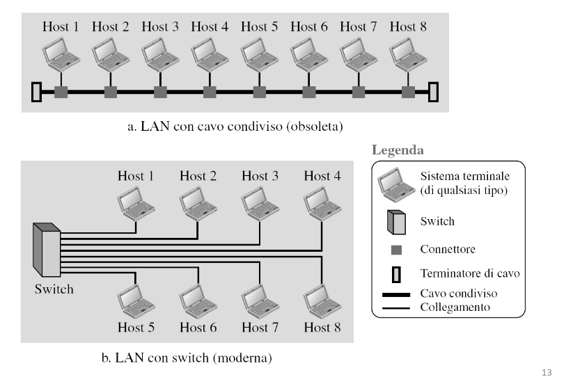
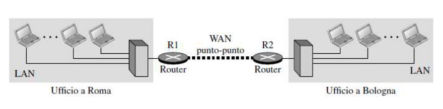
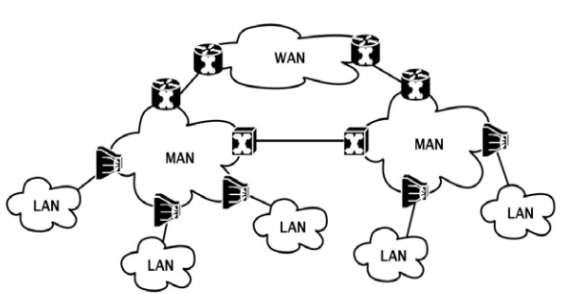

# Reti di Calcolatori

[Link alle slides](https://drive.google.com/drive/folders/1iEMXGyVoyG3R9uhDmQOehlWevSgJkDmE)

## Capitolo 1

Parleremo di Internet, LAN/WAN e Interconnessione di Reti

## Internet

- `Protocolli` :  
  Invio e ricezioni messaggi, HTTP, TCP, IP, WiFi, 4G, Ethernet

- `Internet Standards` :  
  Ogni rete connessa a Internet deve usare IP e rispettare certe convenzioni.  
  Facile scalare con nuove reti.

- `Internet Composto da` :

1.  Miliardi di disp connessi o hosts
2.  Reti di accesso, lInk di comunicazione (fibra, rame, onde, satelliti)
3.  Dispositivi di interconnesione (router e switch)
4.  Reti (insieme di host, dispositivi di interconnessione, router, link gestiti da una org)

- `Internet vista dai servizi` :

1.  Infrastruttura (Web, streaming video ecc ecc)
2.  Interfaccia di programmazione (hooks)

- `Internet vista dalle entità software` :

1.  Applicazioni
2.  Protocollo
3.  Interfacce (sono le membrane che seprano gli strati della pila protocollare)
4.  Standard Internet e Web

### Definizioni

**Rete** :  
 un'interconnesione di dispositivi in grado di scambiarsi informazioni, quali sistemi terminali, router, switch e modem.  
 _I sistemi Terminali_ sono gli _host_ (pc, tablet, laptop)

_I dispositivi di internconnesione_ ->  
 Router (dispositivi che interconnettono reti) / Switch (collegano più host localmente)

## LAN (Local Area Network)

Sono reti locali, circoscritte ad una certa area. Sono private, Tipicamente si estendono qualche km. Usate per connettere sistemi terminali, tipo, pc, wrokstations e stampanti.
Sono o wireless o col cavo di rame.

  

  

## WAN (Wide Area Network)

É una rete il cui compito è interconnettere LAN o singoli host molto distanti tra loro. WAN è solitamente gestita da un operatore di rete che fornisce servizi ai clienti.

`WAN punto-punto`:  
collega due dispositivi tramite un mezzo trasmissivo

  

`WAN a commutazione` :  
collega più di due punti di terminazione (usata nelle dorsali internet)

- _Elementi di commutazione:_  
  eleaboratori specializzati utilizzati per connettere fra loro due po più linee di trasmissione

  

    
  

### Interconnesione di Reti

Solitamente, lo scenario è varie LAN interconnesse da WAN.
Esempio:  
 reti locali nelle sedi di aziende, dislocate sul territorio nazionale.  
 Genera così una rete internet privata che interconnette le reti locali dei vari uffici

 

  

  

  

### Esempio di WAN

  

Utilizzando una rete gestita da un provider di servizi internet (ISP) commerciale è possibile

  

### Rete GARR

Interconnette le uni, biblioteche, centri di ricerca, musei, scuole e altri luoghi in cui si fa istruzione, scienze e cultura ecc ecc. L'infrastruttura in fibra ottica e si sviluppa su circa 15.000 km tra collegamenti di dorsale e di accesso.
Capacità odierna delle singole tratte della dorsale arriva a _200GBps_
_100 punti di presenza_ distribuiti capillari nel territorio.

### Rete di area metropolitana MAN

Rete di computer che collega al'interno di un area metropolitana.

- più grande id una LAN, più città e paesi , ma più piccolà di una WAN.

  

### Network of networks

Gli host si connettono a internet tramite Internet Service Provider (ISP)  
Gli ISP di accesso a loro volta devono essere interconnessi in modo che due host qualsiasi possano inviarsi pacchetti l'uno all'altro.  
La rete che ne viene fuori è molto complessa. Evoluzione guidata dall'economia e dalle politiche nazionali.

**Internet**->

1. è un insieme mondiale di reti interconnesse (internetworks) che collaborano tra loro per scambiarsi informazioni utilizzando IP.
2. Non appartiene a nessuno
3. Si basa su tech e standard coerenti e riconosciuti
4. IEFT, ICANN, IAB

  

Al "centro": poche reti molto complesse

- `tier-1` ISP commerciali, nazionale, internazionale
- `content provider networks`: reti private che collegano i loro data center a Internet anche bypasando ISP tier-1 e regionali.

### IETF/RFC/ICANN

- `Internet Engineering task Force (IEFT)`  
  L'organismo che studia e sviluppa i protocolli in uso su Internet. Si basa su gruppi di lavoro a cui chiunque può accedere.
  RFC/STD (Request for Comments e STanDards): i documenti ufficiali che descrivono i ptotocolli usati in Internet. Sono pubblicamente accessibili in rete.

- `Internet Corporation for Assigned Names and Numbers (ICANN)`  
  Cordina il sistema dei nomi di dominio (DNS), assegna i gruppi di indirizzi di rete, identificativi di protocollo e ha funzioni di controllo(blando) dello sviluppo di internet.

- `World Wide Web Consortium (W3C)`  
  Comunità internazionale che sviluppa standard aperti per favorire lo sviluppo del Web
