# Lo strato di Trasporto Introduzione - Capitolo 10

[Link alle slides](https://elearning.di.unipi.it/pluginfile.php/77494/mod_resource/content/1/L07_Trasporto.pdf)

## Introduzione

### Obiettivo

Realizza una comunicazione logica fra processi residenti in host system diversi.

- Logico: i processi si comportano come se gli host fossero direttamente collegati, non si preoccupano dei dettagli dell'infrastruttura fisica usata per la comunicazione.

Offre servizi allo strato di applicazione

- Un'applicazione interagisce con i protocolli di trasporto per trasmettere o ricevere dati. L'applicazione sceglie lo stile di trasporto: 1) sequenza di messaggi singoli o 2) una sequenza continua di byte. Il programma applicativo passa i dati nella forma richiesta al livello di trasporto per la consegna.

Utilizza i servizi dello strato di rete.

- un livello di rete si occupa della comunicazione tra host
- il protocollo di rete consegna il datagramma all'host destinatario (non al processo)

### Servizi di trasporto

Forniscono la comunicazione logica tra processi applicativi di host differenti.

I protocolli di trasporto vengono eseguiti nei sistemi terminali.

  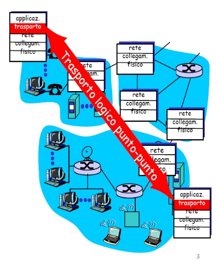

- **Servizio privo di connesione**

  - In un servizio privo di connessione il processo mittente consegna i messaggi al livello di trasporto uno per uno.

  - il livello di trasporto tratta ogni messaggio come entità singola senza mantenere alcuna relazione fra di essi.
    I messaggi possono non essere consegnati o non arrivare in ordine.

- **Servizio oriento alla connesione**
  - in un servizio orientato alla connesione client e server stabiliscono una connesione (logica)

  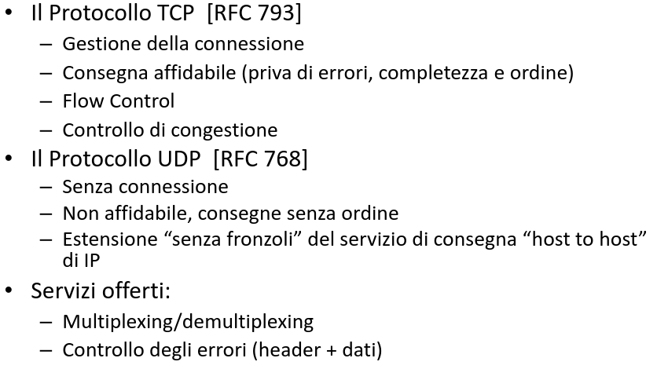

### Azioni del livello di trasporto

  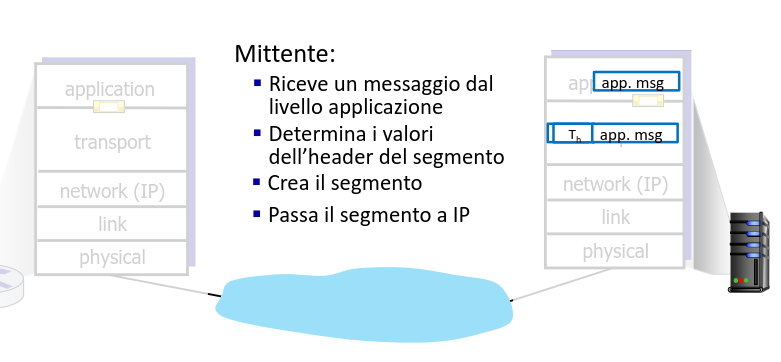

  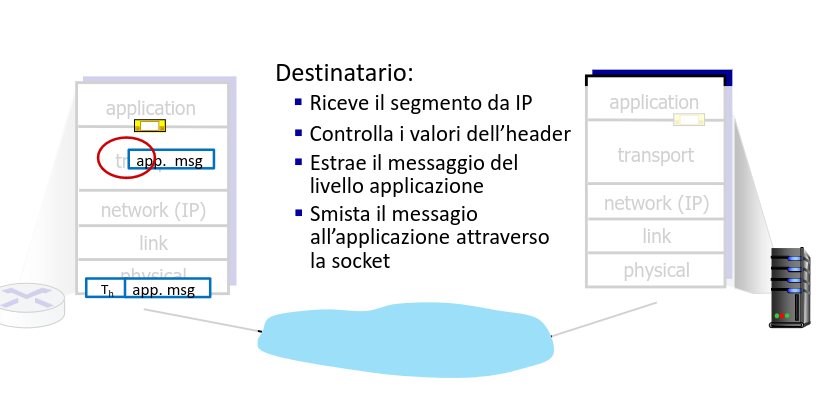

### Demultiplexing

- Lo strato Trasporto provvede allo "smistamento" dei pacchetti fra l rete e le applicazioni (processi)

- Esempio: utente che: scarica pagine Web & trasferisce file con FTP & ha 1 sessione di Telnet aperta:
- ha 3 processi applicazione che utilizzano TCP
- quando il livello trasporto riceve dati (da sotto) deve "dirigerli" a uno di questi processi.

  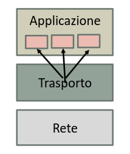

### Multiplexing

- Lo strato trasporto provvede all'"accorpamento" dei flussi dati dai processi verso la rete
- Imbusta i dati ricevuti (dall'alto) con un preambolo
- Le operazioni di multiplexing e demuliplexing si basano sui socket address dei processi.
- Il socket address è identificato dalla combinazione indirizzo IP e numero di porta

  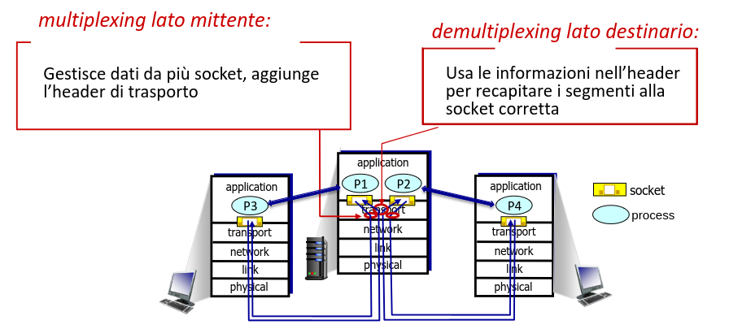

### Come funziona il demultiplexing

  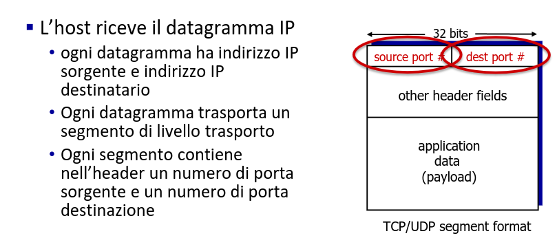

### Concetto di Porta

  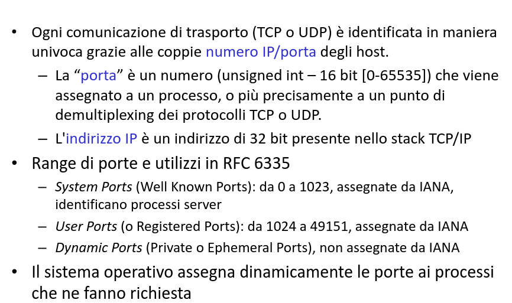

### Well Known ports

  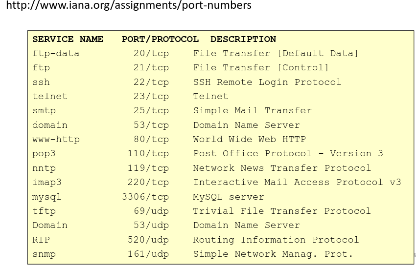

### Demultiplexing senza connesione - UDP

- es. creazione automatica di socket DatagramSocket mySocket = new DatagramSocket()

- Socket UDP identificata dalla coppia (IP, porta)

- Lo strato di trasporto dell'host ricevente consegna il segmento UDP alla socket identificata da IP e porta destinazione

- I datagrammi con IP e/o porta mittente differenti ma stessi Ip e porta destinatari vengono consegnati alla stessa socket.

  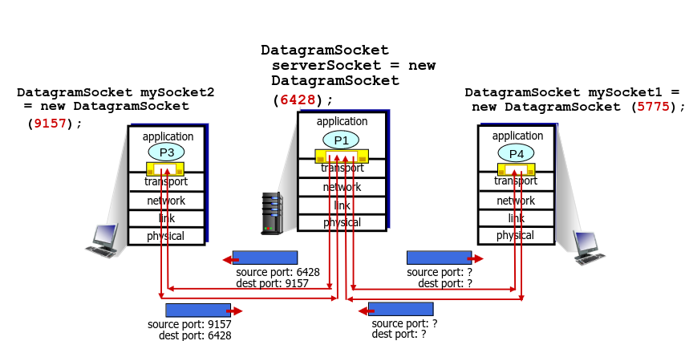

### Demultiplexing orientato alla connesione

- La socket TCP connessa è identificata da 4 parametri:

1. indirizzo IP di origine
2. Numero di porta di origine
3. Indirizzo IP di destinazione
4. Numero di porta di destinazione

- L'host ricevente usa i 4 parametri per inviare il segmento alla socket appropriata
- Un host server può supportare più socket contemporanee
- Es. server Web: socket differenti per ogni cliente

  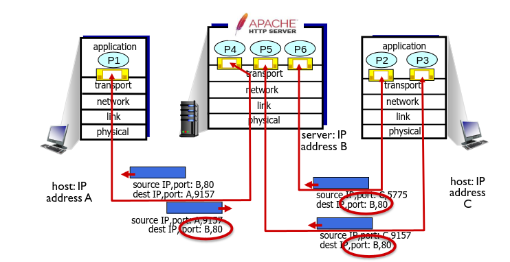

### Interfaccia tra livelli dello stack

  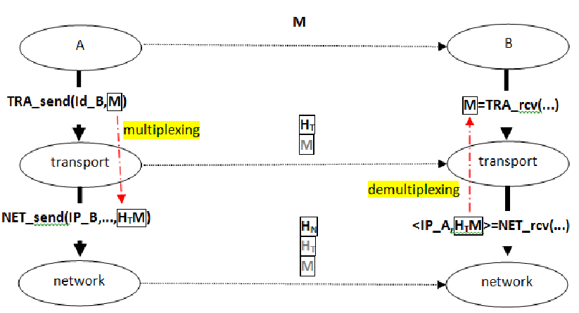

### Demultiplexing senza connesione UDP (2)

  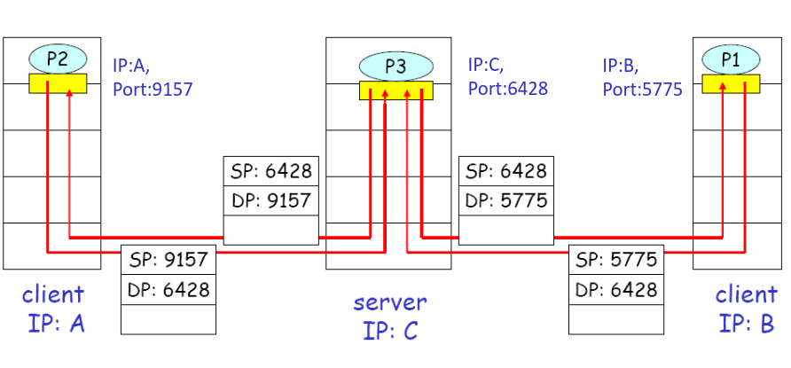

  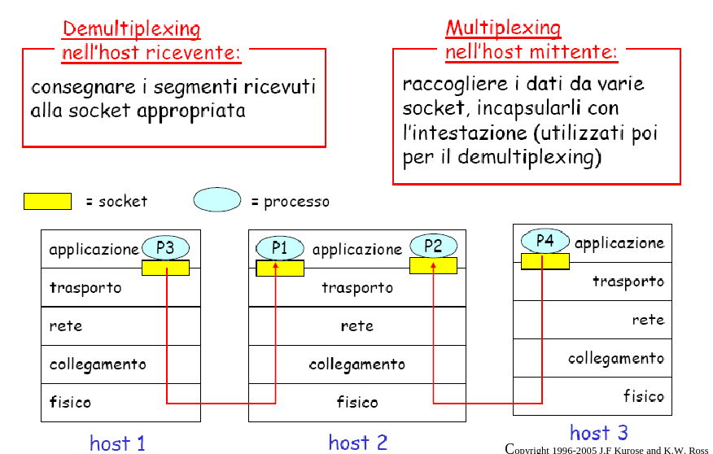

