# TCP

[Link alle slides pt. 1](https://elearning.di.unipi.it/pluginfile.php/77595/mod_resource/content/1/L07_Trasporto_TCP_parte1.pdfhttps://elearning.di.unipi.it/pluginfile.php/77595/mod_resource/content/1/L07_Trasporto_TCP_parte1.pdf)

[Link alle slides pt. 2](https://elearning.di.unipi.it/pluginfile.php/77917/mod_resource/content/1/L07_Trasporto_TCP_parte2.pdf)

## Proprietà del servizio TCP

- Orientamento allo stream:

  - Lunghezza di byte indefinita a priori. Il servizio di consegna dello stream nella macchina di destinazione passa esattamente la medesima sequenza di ottetti che il trasmettitore ha passato al servizio di consegna nella macchina di orgine.

- TCP vede i dati come un flusso di byte ordinati, ma non strutturati.

  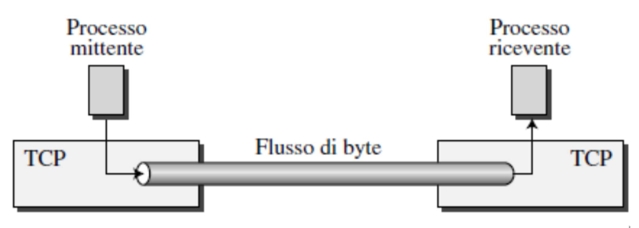

- Orientato alla connesione:

  - I processi effettuano un handshake prima dello scambio dei dati. Invio di informazioni preliminari per preparare lo scambio dei dati.
  - Orientato perchè lo stato della connessione risiede sui punti terminali, non sugli elementi intermedi della rete (ad. es. router)
  - La connesione è vista dagli applicativi (USERS) come un circuito dedicato, quindi il TCP è capace di fornire servizi CONNECTION ORIENTED mentre il protocollo IP su cui appoggia, è in grado di fornire servizi CONNECTION LESS

- Connection full-duplex

  - il flusso dati tra due host può avvenire contemporaneamente nelle due direzioni. le due direzioni sono slegate
  - conneissione punto punto

- Funzioni base per il trasferimento di dati

  - capacità di trasferire un flusso continuo di byte
  - trasferimento bidirezionale (full duplex)

- Multiplexing / demultiplexing

  - consente di assegnare una data connessione ad un particolare processo
    (permette una comunicazione da processo a processo)

- Controllo della connessione

  - meccasnismi di inizio e fine trasmissione (controllo di sessione)

- Trasferimento dati ordinato e affidabile
  si intende la capacità di correggere tutti i tipi di errore, quali:

  - dati corrotti
  - segmenti persi
  - segmenti duplicati
  - segmenti fuori sequenza

- Controllo di flusso

  - evitare di spedire più dati di quanti il ricevitore sia in grado di trattare

- Controllo di congestione

  - ha lo scopo di recuperare situazioni i sovraccarico nella rete

- Trasferimento bufferizzato

  - Il software del protocollo TCP è libero di suddividere il flusso di byte in segmenti in modo indipendente dal programma applicativo che li ha generati. Per fare questo è necessario disporre di un BUFFER dove immagazzinare la sequenza di byte. Appena i dati sono sufficienti per riempire un segmento ragionevolmente grande, questo viene trasmesso attraverso la rete.
  - La bufferizzazione consente una riduzione del traffico sulla rete "ottimizzando" in qualche modo il numero di segmenti da trasmettere

### Trsferimento Bufferizzato

  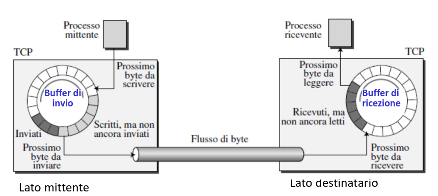

Lato mittente: I processi a livello applicativo scrivono e leggono byte nel/dal buffer.
Questo può avvenire a velocità diverse.
PS. Connesione TCP è bidirezionale, entrambi i lati avranno buffer di invio e buffer di ricezione.

### Segmenti TCP

  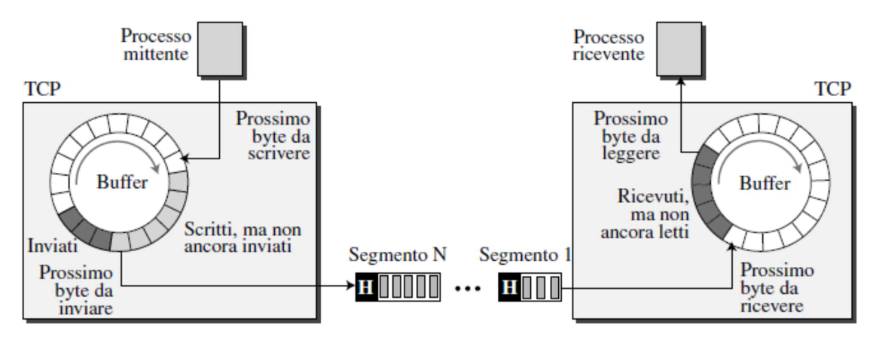

Il flusso di byte viene partizionato in segmenti:

- ogni segmento ha il suo header
- ogni segmento viene consegnato al livello IP

### TCP Formato segmento, apertura e chiusura della connesione

#### Numeri di sequenza e di riscontro

- TCP numera i byte (anzichè i segmenti)
- Numero di sequenza associato a un segmento =
  numero (nel flusso) del primo byte (di dati) del segmento

  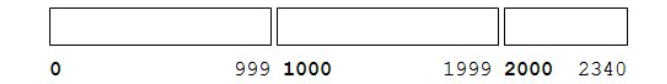

- In genere si partre da un initial sequence number generato in modo casuale (e quindi != 0)

  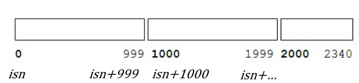

- Numero di riscontro =
  numero ultimo byte correttamente ricevuto +1

- Riscontri intrepetati come "cumulativi"

"ACK=y" significa "aspetto il byte y (ho ricevuto tutti i byte fino a y-1 incluso)"

  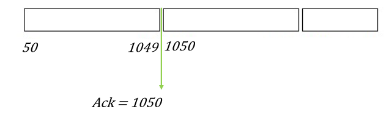

#### Formato segmenti TCP

  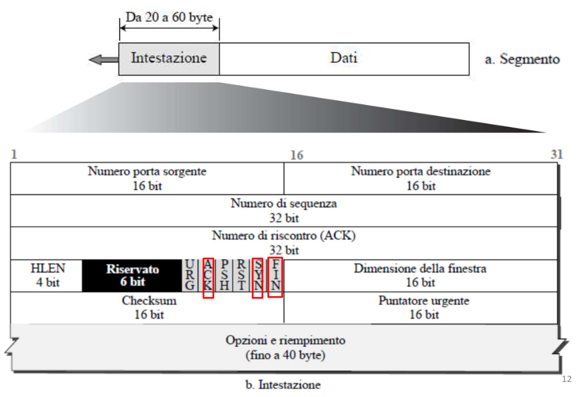

- Numero di sequenza, Numero di riscontro, Finestra
- Essi permettono il flow controll, il meccanismo di ritrasmissione ed il riordino dei pacchetti in ricezione, necessari per la struttura stream-based del TCP.

- Porta (16 bit)
- Numero di sequenza (32 bit): è il numero di sequenza nello stream del primo byte di dati di questo segmento. Se il flag SYN è settato ii numero di sequenza è ISN (Initial Sequence Number) e il primo byte di dati è ISN+1

- Numero di riscontro (32 bit): se il bit ACK è settato, questo campo contiene il valore del prossimo numero di sequenza che il mittente del segmento si aspetta di ricevere dall'altro host. Una volta che la connesione è stabilita è sempre inviato.

- HLen (4 bit): lunghezza dell'header TCp espressa in parole da 4 byte (la lunghezza dell'header può variare tra 20 e 60 byte)

#### Segmento TCP - campi

- Bit codice: sono 6 flag e servono per (da sinistra a destra):

  - URG: il campo Puntatore Urgente è significativo e ci sono dati da trasferire in via prioritaria

- ACK: il campo Numero di Riscontro contiene dati significativi
- PSH: Funzione Push
- RST: Reset della connessione
- SYN: Sincronizza il Numero di Sequenza
- FIN: Non ci sono altri dati dal mittente - chiusura connesione

  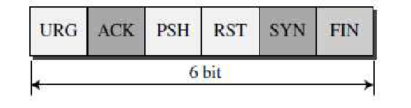

- Finestra di ricezione (16 bit): indica il numero di byte di dati a partire da quello indicato nel campo Numero di Riscontro che il mittente di questo segmento è in grado di accettare. Serve per il controllo di flusso.

- Checksum (16 bit): checksum dell'intero pacchetto (dati, header TCP + parte dell'header IP) per rilevare errori. Si calcola come per UDP (per TCP è obbligatorio).

- Opzioni: negoziazione di vari parametri. Le opzioni sono sempre multipli di 8 bit e il loro valore è considerato per il calcolo della checsksum.

È inoltre presente un campo URGENT che permette la trasmissione di dati "fuori banda", ovvero a priorità maggiore degli altri (la loro gestione però è affidata all'app)

- Puntatore Urgente (16 bits): questo campo è un offeset positivo a partire dal Numero di Sequenza del segmento corrente È interpretato solo se il bit URG è uguale a 1. Punta al primo byte di dati non urgenti a partire dal Numero di Sequenza e consente di far passare i dati urgenti in testa alla coda di ricezione.
  Nel segmento contenente dati urgenti, deve essere presente almeno un byte di dati.

### Gestione della connesione

- Handshake
- Trasferimento dati
- Chiusura della connesione

#### Handshake a tre vie

- Il client invia una richiesta di connesione a un server TCP.
- è attivo il bit SYN, il segmento non contiene dati
- si trasmette anche un numero di sequenza iniziale (ISN)
- Ad esempio: Flag SYN=1 client_isn = 41

Dopo l'handshaking, a livelo di trasporto non c'è più distinzione tra server e client

- Il server estrae il segmento, alloca i buffer e le variabili TCP per la connesione
- invia in risposta un segmento di connesione garantita al client (SYNACK).
  - è attivo SYN, il numero di sequenza è il valore iniziale (server_isn=78)
  - è attivo ACK, il server aspetta client_isn+1 (es. 42)
  - esempio SYN = 1, ACK = client_isn+1, proprio numero di sequenza iniziale server_isn. Segmento SYNACK.

Il client alloca buffer e variabili di connessione, manda un riscontro positivo del messaggio del server.

- SYN è inattivo. Questo segmento pò trasportare dati
- Il prossimo dato sarà client_isn+1 (42) ed il client attende server_isn+1 (79)
- Inizia lo scambio dati, SYN = 0

#### Handshake a tre vie

1. I primi segmenti non hanno carico utile.
2. All'arrivo del primo segmento il server inizializza due buffer (memorie di scambio) e le variabili, necessari per il controllo del flusso e della congetione.
3. Alla ricezione del terzo segmento la connesione è instaurata

  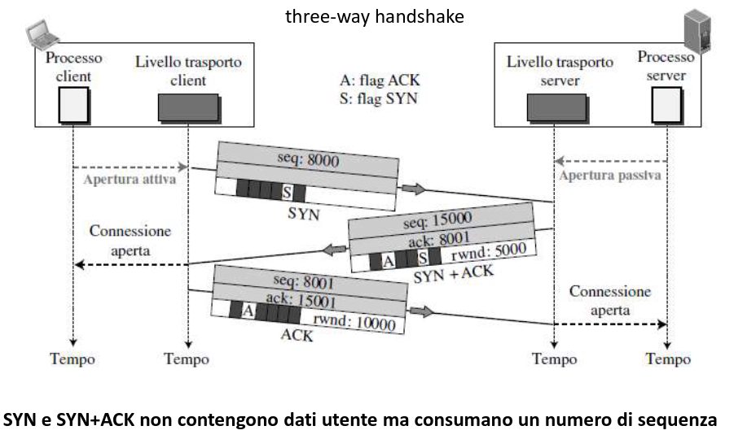

#### TCP: chiusura della connessione

- Client e server chiudono ciascuno il loro lato della connesione.

  - Invio di segmento TCP con bit FIN=1

- Ciascuno risponde al FIN ricevuto con un ACK

  - quando viene ricevuto un FIN, l'ACK può essere combinato con il proprio FIN

- È possibile anche lo scambio simultaneo di FIN

  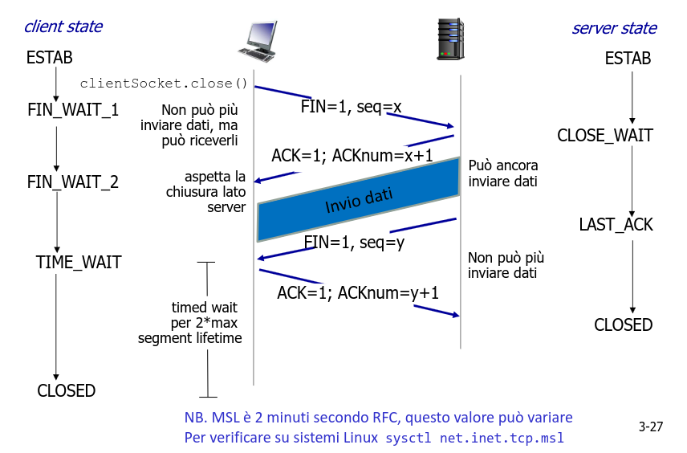

#### Stato TIME-WAIT

- Time_WAIT è lo stato finale in cui il capo di una connesione che esegue la chiusura attiva resta prima di passare alla chisura definitiva della connesione:
- due volte la MSL (Maximum Segment Lifetime).
- La MSL è la stima del massimo periodo di tempo che un pacchetto IP può vivere sulla rete; questo tempo è limitato perchè ogni pacchetto IP può essere ritrasmesso dai router un numero massimo di volte (detto hop limit)
- Ogni implementazione del TCP sceglie un valore per la MSL (RFC 793 2 minuti, Linux 30 o 60 secondi).

- Lo stato TIME_WAIT viene utilizzato dal protocollo per due motivi principali:

  - implementare in maniera affidabile la terminazione della connessione in entrambe le direzioni.
  - Se l'ultimo ACK della sequenza viene perso, chi esegue la chiusura passiva manderà un ulteriore FIN, chi esegue la chiusura attiva deve mantenere lo stato della connessione per poter reinviare l'ACK.

  - consentire l'eliminazione dei segmenti duplicati in rete.

  

    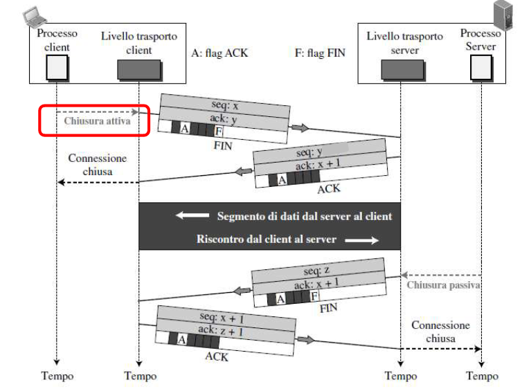
  

#### ASF per chiusura half-close

  

    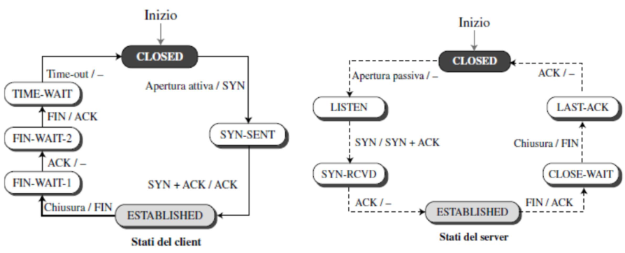
  

  

    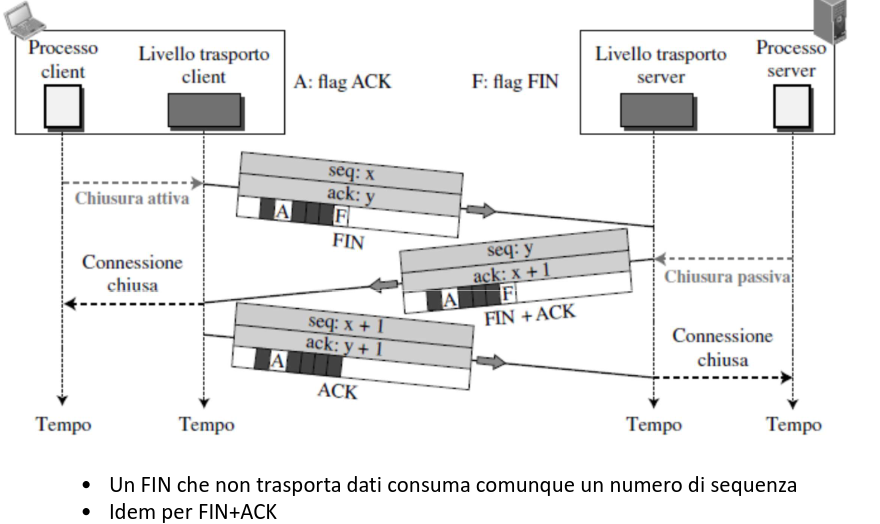
  

### TCP Trasferimento dati affidabile controllo di flusso controllo di congestione

### TCP Trasferimento dati affidabile

- Un segmento può essere smarrito o corrotto
- TCP crea un servizio di trasferimento dati affidabile sul servizio inaffidabile di IP.
- Checksum: controllo obbligatori, i segmenti corrotti vengono scartati
- Riscontri:
  - Numero di sequenza di un segmento è il numero del primo byte del segmento nel flusso di byte. N.B. i numeri di sequezna si applicano ai byte, non ai segmenti trasmessi.
  - Numero di riscontro: il numero di sequenza del byte che l'host attende dall'altro.
  - Riscontro cumulativo: si effettua il riscontro dei byte fino al primo byte mancante nel flusso.
  - Timer

#### Sequenza e riscontro Pipeline

**Pipeline:**

- il mittente può inviare più segmenti senza attendere il riscontro.
- Permette di aumentare la produttività

#### Eventi lato mittente

- TCP riceve i dati dall'applicazione
- Incapsula i dati in uno o più segmenti e assegna numero di sequenza
- Avvio il timer di ritrasmissione (timeout di ritrasmissione - RTO)
  - il timer viene avviato se non è già in funzione per un qualche altro segmento

**Ritrassione** dei segmenti in caso di :

- Timeout
- Ricezione di tre ACK duplicati

- **Timeout**

  - Ritrasmette il segmento che non è stato riscontrato e che ha causato il timeout
  - il timer viene riavviato

- **ACK duplicato**

  - Se il mittente riceve tre ACK duplicati, il segmento successivo a quello riscontrato è andato perso. Ritrasmissione veloce (fast retransmission) prima della scadenza del timer.

- **Segmenti fuori sequenza**

  - I dati possono arrivare fuori sequezna ed essere temporanamente memorizzati dall'entità TCP destinataria.
  - Il TCP non dice come il destinatario deve gestire i pacchetti fuori sequezna, dipende dall'implementazione.

- Nelle versioni più rcenti si implementa la Selective ACK (SACK)

  - I pacchetti ricevuti fuori sequenza vengonon memorizzati
  - riscontro di pacchetti fuori sequenza e duplicati inviato in OPTIONS

  

    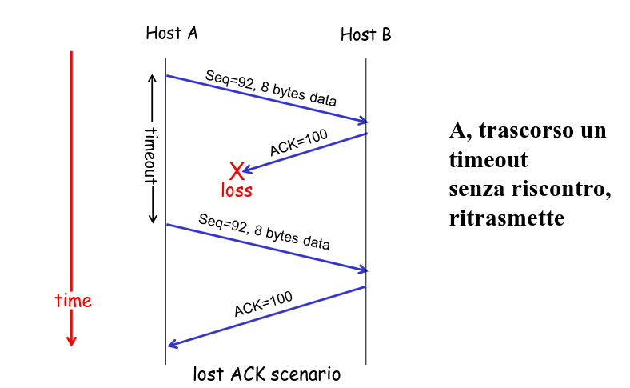
  

#### Lato destinatario

(1) tutti i segmenti inviati per trasmettere dati includono ACK
(2) Se destinatario non ha dati da inviare e riceve segmento <<in ordine>> ritarda invio ACK di 500ms a meo che non riceva nuovo segmento.
(3) Se destinatario riceve segmento atteso e precedente non è stato riscontrato allora invia immediatamente ACK.

Se destinatario riceve (4) segmento fuori sequenza oppure (5) mancante oppure (6) duplicato allroa invia immediatamente un segmento ACK.

  

    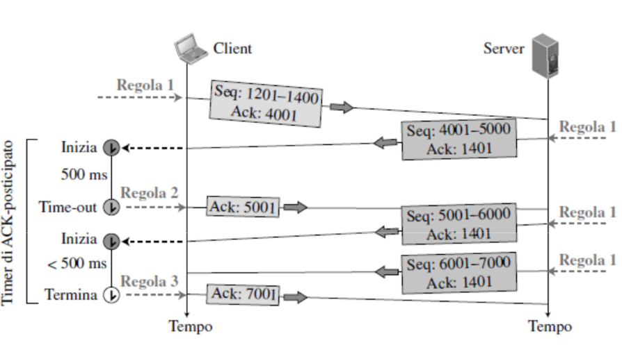
  

### TCP calcolo del timeout(2)

- Il tempo di timeout (RTO) è fondamtale per il funzionamento di TCP
- deve essere maggiore di RTT (Round Trip Time)
- RTT: tempo trascorso da quando si invia un segmento a quando se ne riceve il riscontro.

- Viene Calcolato analizzando gli RTT dei segmenti non ritrasmessi (Sample RTT, stimto per un segmento trasmesso - non per ogni invio).

Estimated RTT = (1 -alpha)^_ EstimatedRTT + a _ Sample RTT

- SampleRTT può fluttuare. Si considera EstimatedRTT: combinazione dei precedenti valori di EstimatedRTT con il nuovo valore sampleRTT.

- Il valore di alpha viene posto a 1/8 in modo da rendere via via meno importnti gli RTT dei pacchetti più vecchi

Estimated RTT = 0,875 _ EstimatedRTT + 0,125 _ Sample RTT

Formula per la variabilità di RTT data dalla seguente formula:

  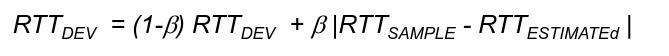

- Stima di quanto SampleRTT si discosa da EstimatedRTT

- Il valore di beta viene posto a 1/4 (RFC 2988)

- Una volta ottenuti questi valori, il timeout viene normalemtne calcolato come:

RTO = RTT_estimated + 4 RTT_Dev

In molte applicazioni, dopo un errore (es. ACK non ricevuto), si raddoppia il timeout: si tratta di un primo meccanismo di controllo della congestione.

#### Finestra di Trasmissione:

- I dati inviati dal proceso a livello applicativo sono mantenuti nel buffer di invio.

- La trasmissione dei dati si basa sulla finestra di trasmissione (sliding window).
  - La finestra sovrapposta sulla sequezna da trasmettere
  - negoziata dinamicamente
  - viene fatta avanzare alla ricezione di un ACK

  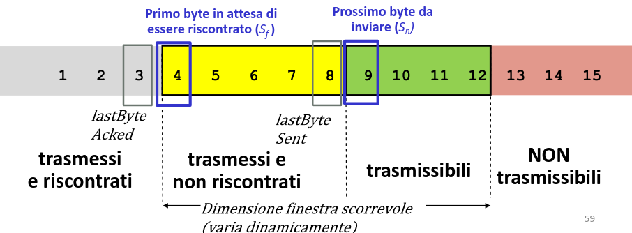

#### Finestra di Trasmissione

  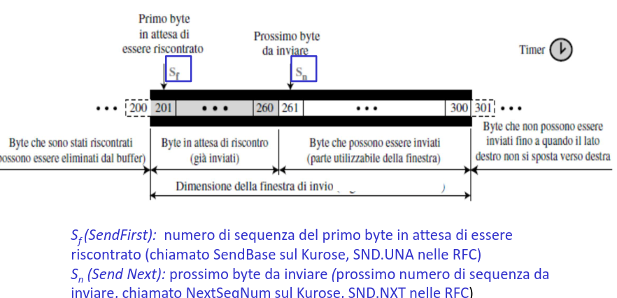

#### Finestra di Ricezione

  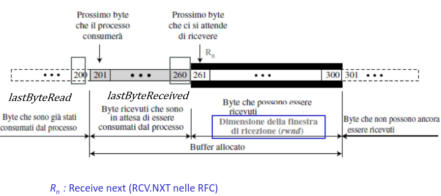

### Controllo di flusso

- Ogni host imposta buffer di invio e di ricezione
- Il processo applicativo destinatario legge i dati dal buffer di ricezione (non necessariamente nell'istante in cui arrivano)

Cosa succede se il,livello di rete fornisce dati più velocemente di quanto il livello applicativo rimuova dati dai buffer dei socket?

Si intende con controllo di flusso la capacità del mittente di evitare la possibilità di saturare il buffer del ricevitore.

Il controllo di flusso mette in relazione la frequenza di invio del mittente con la frequenza di invio del mittente con la frequezna di lettura dell'applicaizone ricevente.

TCP implementa questa caratteristica tramite una variabile detta finestra di ricezione (rwnd) mantenuta nel mittente: questa variabile fornisce un idea di quanto spazio è ancora a disposizione del buffer del ricevitore.

  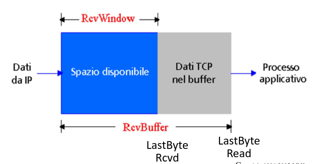

Il destinatario TCP comunica la capacità residua nel buffer di recezione trmaite il campo rwnd field nell'header TCP:

- DImensione di RCVBUffer configurabile tramite socket options (tipicmente il valore di default è 4096 bytes).

- Il mittente limita la quantità di dati unACKed ("in-flight") al vlaore ricevuto di rwnd.

  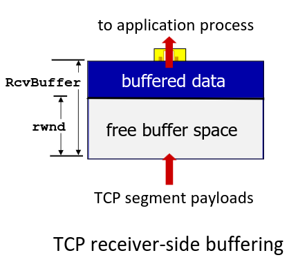

1. Spazio disponibile nel buffer destinatario:

  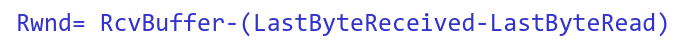

2. rwnd è dinamica

3. L host destinatario comunica la dimensione di rwnd al mittente

4. Il mittente si assicura che :

  

Quantità di dati trasmessi e non ancora riscontrati

N.B se rwnd = 0, il mittente manda segmenti <<sonda>> di 1 byte per ricevere l'aggiornamento sulla dimensione di rwnd

 

  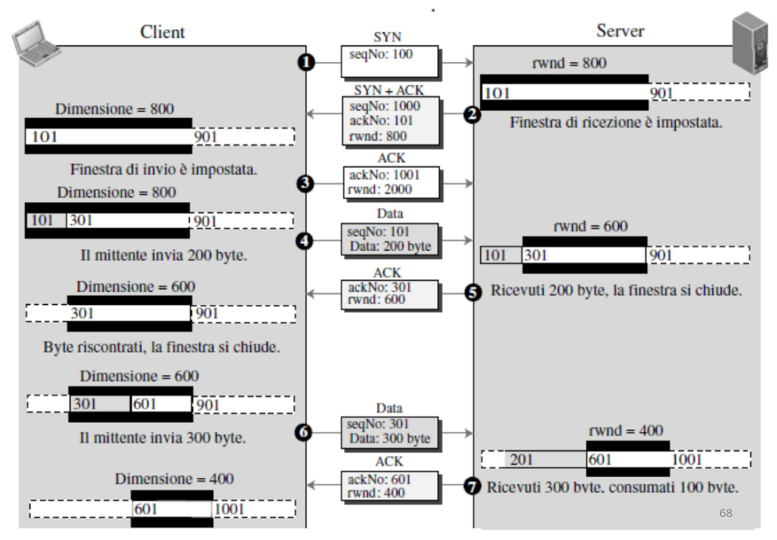

### Controllo congestione

Meccanismo di base: controllo di congestione punto-punto:

- Nessun supporto esplicito della rete
- Congestione dedotta dai sistemi terminali

Il controllo di congestione impone a ciascun mittente di limitare la frequenza di invio di pacchetti sulla connesione, in funzione della congestione percepita.

- capacità di TCP di adattarsi alla velocità della rete.
  Se TCP percepisce scarso traffico, aumenta la frequenza di invio, altrimenti la diminuisce.

  

#### Algoritmo per il controllo della congestione:

L'algoritmo che il mittente TCP utilizza per regolare la propria frequenza di invio in funzione della congestione rilevata, è costituito da tre passi:

1. Partenza lenta (slow start)
2. Incremento additivo e decremtno moltiplicativo (AIMD)
3. Fast recovery
4. Reazione ai Time-out

- La finestra di congestione (cwnd) impone un vincolo alla frequenza di immissione del traffico sulla rete in base alla congestione percepita.
- frequenza di invio dei dati no super cwnd/RTT

#### Congestion Window

- Si misura tipicamente in MSS
- 1 MSS (Maximum Segment Size) è la quantità massima di dati traportabili da un segmento.
- Determinato in base alla MTU (unità trasmissiva massima) - lunghezza massima del payload del frame di collegamento inviabile dall'host mittente.
- MSS scelto in modo tale che il segmento TCP, incapsulato in pacchetto IP, stia dentro un singolo di frame di collegamento.
- Esempi tipici di MSS 1460, 536, 512 byte (olgo dall'MTU 20 byte header TCP + 20 byte header IP).

- RTT (Round Trip Time) è il tempo impiegato da un segmento per effettuare il percoso di andata e ritorno.

#### TCP: AIMD

**Additive Increase Multiplicative Decrease**

- TCP del mittente aumenta proporzionalmente la propria finestra di congestione ad ogni ACK ricevuto.

- Di quanto viene incrementata la finestra?
- Ad ogni ACK la finestra di congestione viene incrementata in modo che si abbia una crescita pari a 1 MSS per ogni RTT (Congestion Avoidance).

- Ad ogni ACK cwnd = cwnd+1/cwnd
- Es cwnd = 4 MSS -> INcremento di MSS/4

- TCP del mittente dimezza la propria CongWin ad ogni evento di perdita

  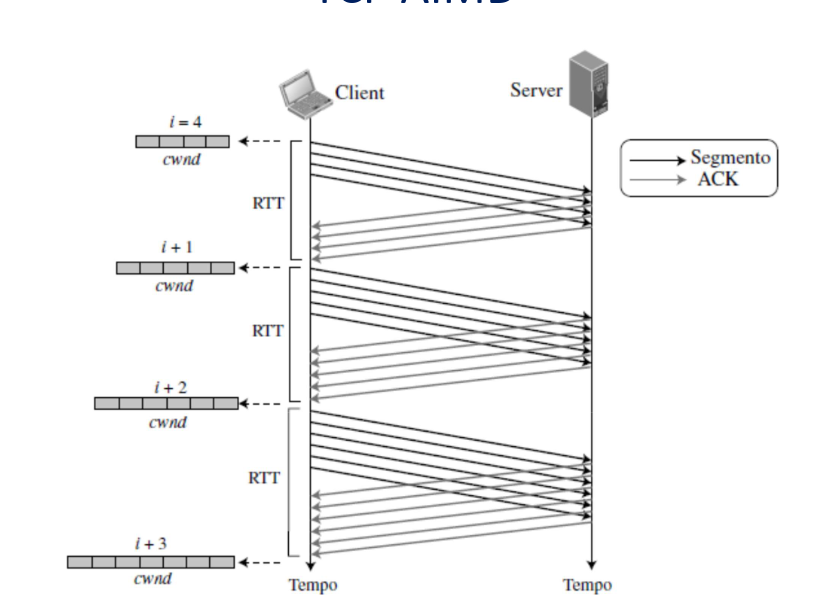

#### Slow Start

All inzio la finestra di congestione, CongWIn è posta pari a 1 MSS .
Se MSS=500 byte e RTT=200 byte si ha una frequenza di invio di circa 20kb/s:
se ho 1Mb/s di banda, impiego moto tempo ad arrivarci con incremento lineare.

- Incremento Congwin di 1MSS ad ogni ACK (non duplicato)
- L'effetto è che ConWIn raddoppia ad ogni RTT -> esponenzile

  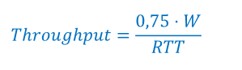

### TCP è equo?

  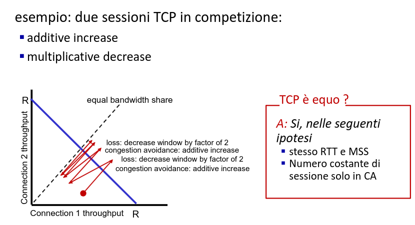

