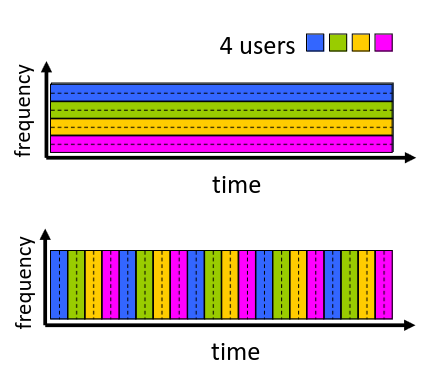
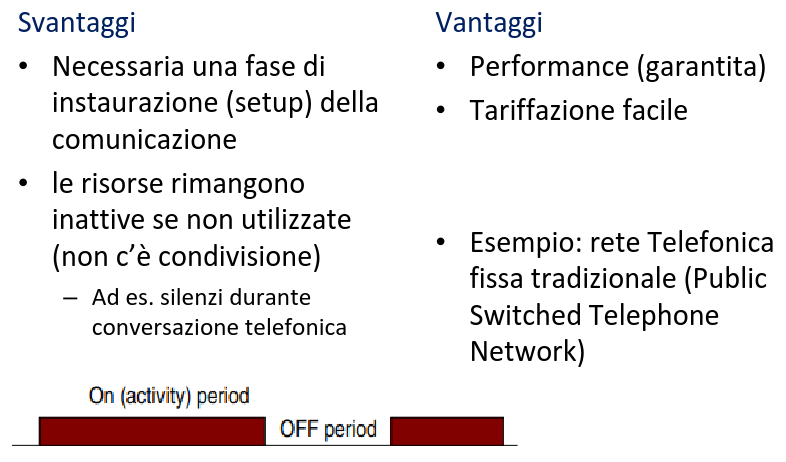
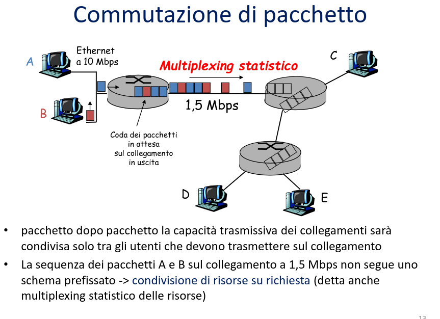
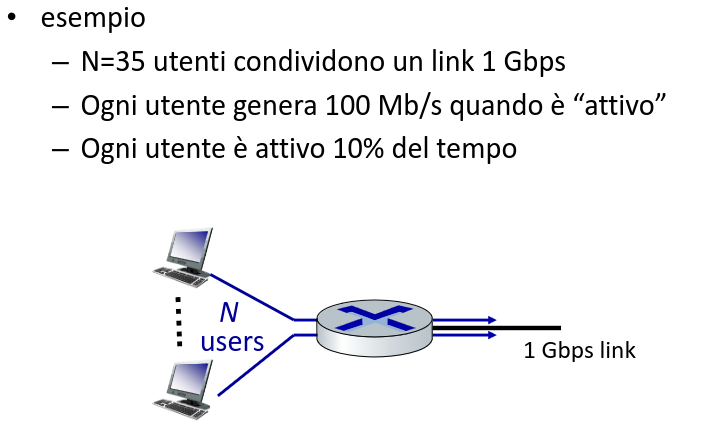
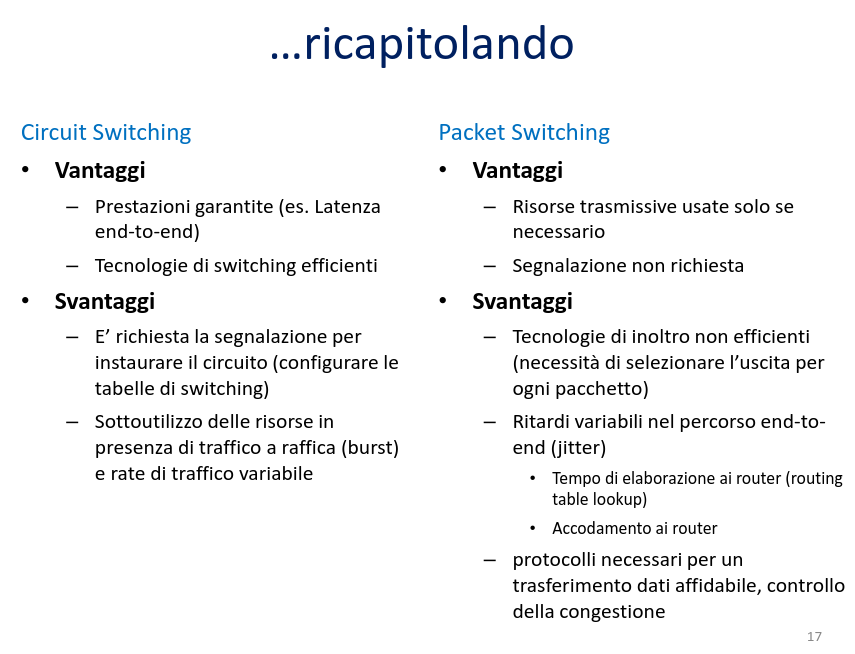
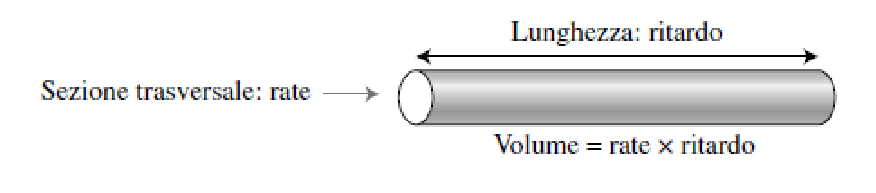
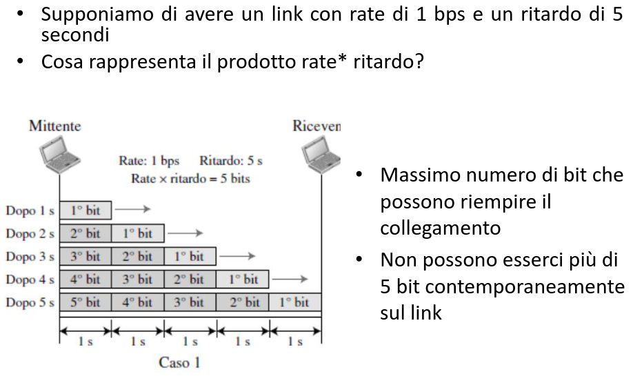

# Reti di Calcolatori

[Link alle slides](https://elearning.di.unipi.it/pluginfile.php/75852/mod_resource/content/1/L01_intro_reti_parte2.pdf)

## Capitolo 2

Parliamo di commutazione di circuito vs commutazione di pacchetto.
Metriche di riferimento, ritardo in una rete a commutazione di pacchetto.

### Commutazione

- Un internework è data dall'internconnesione di reti, composto da link e dispositivi capaci di scambiarsi informazioni.

- In particolare si distungono in dispostivi:

  1. Terminali
  2. Dispositivi di internconnesione che si trovano nel percorso (o rotta) tra i sistemi sorgente e destinazione nella comunicazione tra host.

- Problema : vogliamo stabilire una comunicazione.

- Domande:
  1. Come determinare il percorso da sorgente a destinazione?
  2. Come trasferire delle info da porta di ingresso a uscita?

#### Tecniche di commutazione

Ovvero la modalità con cui viene determinato il percorso sorgente-destinazione e vengono dedicate ad esso le risorse della rete.

Meccanismi principali:

- Circuit-switched netowrk -> _Reti a commutazione di circuito_
- Packet-switched network -> _Reti a commutazione di pacchetto_

### Commutazione di circuito

- Instaura un _cammino dedicato_ tra i due dispositivi che vogliono comunicare.
  l’instradamento avviene una volta per tutte prima della comunicazione, e
  l’attraversamento impegna in modo permanente ed esclusivo le risorse
  fisiche dei nodi della rete, es. telefonia.

### Commutazione di circuito

- Il percorso viene stabilito all'inizio della comunicazione (setup)

- Sul percorso vengono dedicate risorse alla comunicazione (canale logico circuito) in modo esclusivo. Banda di frequenza o slot di trasmissione sui collegamenti. Capacità commutative nei nodi.

Risorse end-end allocate e risrvate alla 'comnicazione' tra sorgente e destinazione.

  

#### Commutazione di circuito: FDM e TDM

- **Frequency Division Multiplexing (FDM)**:
  Frequenze ottiche, elettromagnetiche suddivise in bande di frequenza (strette).  
  Ad ogni comunicazione è assegnata una certa banda

- **Time Division Multiplexing (TDM)**:
  Tempo suddiviso in slot di tempo,  
   ogni comunicazione ha uno o più slot periodici assegnati  
   può trasmettere alla velocità massima di una banda di frequenza (più ampia), ma solo durante i suoi intervalli di tempo.

  

#### Commmutazione di circuito, svantaggi e vantaggi

  

### Commutazione di pacchetto

1. Il flusso di dati punto-punto viene suddiviso in pacchetti

   - i pacchetti degli utenti A e G condividono le risorse di rete
   - ogni pacchetto è instardato singolarmente e indipendentemente dagli altri pacchetti della stessa comunicazione (possono eseguire lo stesso percorso o percorsi diversi)
   - le risorse vengono usate a seconda delle necessità

2. Trasmissione, store and forward
   - Il commmutatore deve ricevere l'intero pacchetto prima di poter cominciare a trasmettere il primo bit del pacchetto sul collegamento in uscita, portando così un ritardo di store e forward.
   - Attesa dei paccheti in code di output (buffer) -> ritardi di coda
   - I buffer hanno dimensione finita -> perdita di pacchetti

  

**Non esiste un canale dedicato**, gli host semplicement esi scambiano pacchetti.

- i pacchetti possono essre memorizati dai router nelle code (buffer).
- Se il collegamento tra i due router è usato alla massima capacità, gli ulteriori pacchetti che arrivano vengono messi in coda.

**Contesa per le risorse**

- La richiesta di risorse può essere essere maggiore di quanto è possibile dare
- Congestione: accodamento dei pacchetti, attesa per l'utilizzo del collegamento
- Utilizzo efficiente delle risorse ma non c'è garanzia nelle prestazioni

### Circuit switching vs packet switching

  

- **Circuit switching**

  - Bisogna riservare 100Mbps per ogni utente, in ogni istante.
  - Il link di output può quindi sopportare un massimo di: `1Gbps/100Mbps = 10 utenti`

- **Packet Switching**
  - 10 o meno utenti simultanei attivi -> banda richiesta `<=1Mbps`, ritardo trascurabile
  - Più di 10 utenti attivi insieme -> frequenza aggregata di arrivo dei dati supera capacità del collegamento in uscita e quindi si incrementa il ritado di accodamento.
  - N.B la propabilità che ci siano 10 o meno utenti attivi insieme è 0.9996
  - con prob tecnica, questo metodo supporta tutti gli utenti senza ritardo

**La commutazione di pacchetto consente a più utenti di usare la rete**

  

### Metriche

Come misurare le prestazioni della rete.

- Ampiezza di banda e bitrate
- Throughput
- Latenza
- Prodotto rate \* ritatdo

#### Larghezza di band e bit rate

- **Trasmission rate**
  quantità di dati (bits) che possono essere trasmessi ("inseriti nella linea")
  nell'unità di tempo (bits/secondo or bps) su un certo collegamento.

- **Bandwidth**
  larghezza dell'intervallo di frequenze utilizzato dal sistema trasmissivo. Si misura in Hertz (Hz - cycles per second).

- **N.B larghezza di banda e bit rate non sono la stessa cosa**

- Trasmission rate dipende dalla larghezza di banda ma è influenzato anche da altri fattori, (tecnica trasmissiva usata, rumore, ecc...)

- Esempio: Il rate di un link Fast Ethernet è di 100Mbps, ovvero tale rete può inviare al massimo 100Mbps

#### Throughput

Quantità di dati che possono essere trasmessi con successo dalla sorgente alla destinazione in un certo intervllo di tempo.

- bitrate e throughput non sono la stessa cosa.
- Th indica la velocità con cui trasferiamo i dati, al netto di perdite sulla rete, dupicazioni, protocolli
- Il rate è una misura della potenziale velocità di un link, il th è una misura effettiva della velocità di un link

- Throughputm < trasmission rate

  

- Il throughput dipende sia dalla velocità di trasmissione del collegamento ma anche dalla quantità di dati (flussi di traffico aggiuntivi rispetto a quello di interesse), effeti dei protocolli, ecc

- La definizione esatta e metodologia di misura dipendono dal sistema che stiamo osservando (System UndertTest - SUT)

  

  

#### Latenza (ritardo)

tempo richiesto affinchè un messaggio arrivi a destinazione dal momento in cui il primo bit parte dalla sorgente.

`Da cosa è determinato il valore della latenza in una rete a commutazione di pacchetto?`

#### Come si verificano ritardi e perdite?

I pacchetti si accodano nei buffer dei router

- Il ritardo di accodamento dipende dal tasso di arrivo dei pacchetti e dalla capacità del collegamento in uscita.
- I pacchetti si accodano in attesa del proprio turno.
- All'aumentare del tasso di arrivo dei pacchetti sul collegamento, il riatdo di accodamento aumenta.
- capacità del buffer è fniita

  

  

  

#### Esempio

  

### Ricapitolando

  

### Ritardo end-to-end

  

### Traceroute

É un comando che traccia un pacchetto dal tuo computer all'host e mostra anche il ritardo e il numero di passaggi (salti) necessari per raggiungerlo dal mittente per ogni passaggio.

### Prodotto rate-ritardo

  

Il prodotto rate-ritardo è il numero massimo di bit che il link può contenere ad un certo istante.

  

