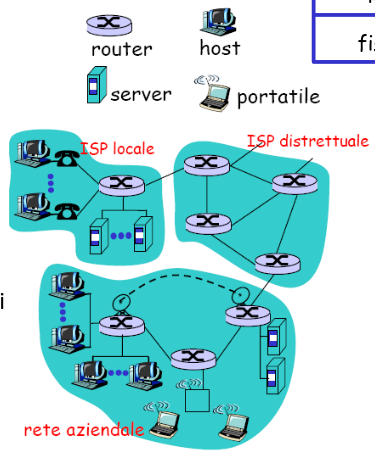
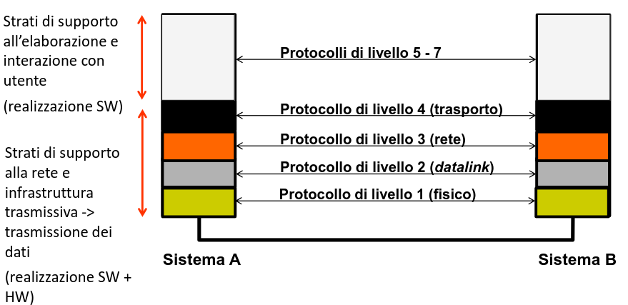

# Reti di Calcolatori

[Link alle slides](https://elearning.di.unipi.it/pluginfile.php/76326/mod_resource/content/1/L01_intro_reti_parte3.pdf)

## Capitolo 3

Parliamo di modello stratificato, principi base, vantaggi(svantaggi).
Definizione di strati, struttura, entità, azioni, interfacce, protocolli, componenti e funzionalità.

### Cos'è un protocollo?

Insieme di regole che permettono a due entità di comunicare.
Perchè si usa una organizzazione di protocolli in livelli?

#### Perchè stratifichiamo

Scomposizione dei sistemi complessi:

1. La struttura esplicita permette l'identificazione delle relazionin tra gli elementi di un sistema complesso.

- modello di riferimento stratificato
- suddivisione di funzioni e attori

2. La modularizzazione facilita la manutenzione e l'aggiornamento del sistema

- un modulo (o più precisamente livello/strato) svolge un insieme limitato di compiti e nel sistema appare come una black box (input/ouput)
- ciascun Livello offre servizi allo strato superiore, implementando azioni all'interno del livello stesso e utilizzando servizi del livello inferiore.

3. Separazione tra servizi offerti (interfaccia) e implementazione: il cambiamento dell'implementazione di un servizio in un livello è sostanzialmente trasparente per il resto del sistema

#### Come stratificare

- Separation of concern

- Information Hiding

Modello stratificato
– costituito da sistemi di consumatori/produttori
– sistemi organizzati in strati funzionali (livelli)
– ogni strato fornisce servizi allo strato superiori e usa i servizi di quello
inferiore
– ogni strato scambia informazioni direttamente solo con gli strati
adiacenti
– in ogni comunicazione i due strati omologhi svolgono funzioni
reciproche
– esistono sistemi (intermedi) che implementano solo alcune funzioni
• Requisiti
– efficiente: minimizzare lo sforzo globale di consegnare le lettere (non
la singola!)
– efficace: consegnare la maggior quota possibile di lettere
Vantaggi del modello stratificato
• scompone il problema in sottoproblemi più semplici da trattare -> il
singolo strato è più semplice del sistema nel suo complesso
– Semplificazione della progettazione, implementazione e manutenzione
del software
• rende i vari livelli indipendenti
Posso modificare l’implementazione di uno strato senza dover cambiare gli
altri strati (adiacenti e non), a patto che l’interfaccia non cambi
– I servizi forniti dagli strati inferiori possono essere usati da più entità negli
strati adiacenti superiori
• definendo solamente servizi e interfacce, i livelli diversi possono essere
sviluppati da soggetti diversi

#### Come definire gli strati?

1. Ogni livello logico di astrazione è realizzato in un apposito strato
2. ogni strato svolge una sola e ben definita funzione
3. il flusso dati attraverso le interfacce di ogni starto deve essere minimizzato
4. il numero degli strati deve essere minimizzato, compatibilmente con la loro complessità.

### OSI RM (Open systems interconnection)

**Sistemi chiusi** -> non interoperabili e bla bla, nati poi i sistemi  
**Sistemi Aperti** =  
creati con lo scopo di creare una rete di calcolatori in cui qualasiasi terminale comnica con un qualsiasi fornitore di servizi mediante qualsiasi rete.  
Per realizzare un sistema aperto è necessario stabilire delle regole comuni:

**Si creano quindi degli standard:**

un set di protocolli è aperto se : i dettagli del protocollo sono disponibili pubblicamente, i cambiamenti sono gestiti da un'organizzazione la cui parteciapzieone è aperta al pubblico.

- Un sistema che implementa protocolli aperti è un sistema aperto (open system).

- ISO ha specificato uno standard per l'interconnesione di sistemi aperti.

### Modello ISO/OSI

- Dividere le funzionalità del protocollo di telecomunicazione in starti o layers ognuno dei quali svolge una parte piccola e indipendente dalle altre.

- Comunnicazione tra vari livelli è assicurata da chiamate standard; ogni livello è tenuto a rispondere in maniera corretta alle chiamate che gli competono e che verranno geerate dai due livelli ad esso adiacenti.

- La modalità con cui le funzioni competenti ad aun livello vengono svolte non è visibile dall'esterno che ne è così svincolato.

#### Modello a strati

1. uno strato fornisce servizi allo stato superiore e riceve servizi dallo strato inferiore
2. La comunicazione tra due starti avviene attraverso un'interfaccia
3. Lo strato n-esimo di una entità comunica con lo strato n-esimo di un altra entità secondo un protocollo assegnato.

#### Definzioni

- **Strato**: è un modulo interamente definito attraverso i servizi, protocolli e le interfacce che lo caratterizzano. Indicato spesso col nome LIVELLO

- **Servizio**: quello che uno strato fornisce ad uno starto sovrastante atraverso primitive di servizio (es CONNECT.requst)

- **Interfaccia**: insieme di regole che governanoil formato e il significao delle unità di dati che vengono scambaiti tra due strati adiacenti della stessa entità.

  

#### Cosa specificare in un protocollo?

- La sintassi di un messaggio
- La semantica del messaggio
- Le azioni da intraprendere dopo la ricezione di un msg

  

