# Reti di Calcolatori

[Link alle slides](https://elearning.di.unipi.it/pluginfile.php/76463/mod_resource/content/1/L02_StratoApplicativo_URI_HTTP.pdf)

## Capitolo 4

### Lo strato applicativo URI-HTTP

#### Pila Protocollare di Internet

- _applicazione_: supporta le applicazioni di rete (ftp, smtp, http)
- _trasporto_ : trasferimento dati end-to-end (utp, udp)
- _rete_ : instradamento dei datagrammi dalla sorgente alla destinazione
- _link_ : trasferimento dati tra elementi di rete vicini
- _fisico_ : bit 'sul filo'

  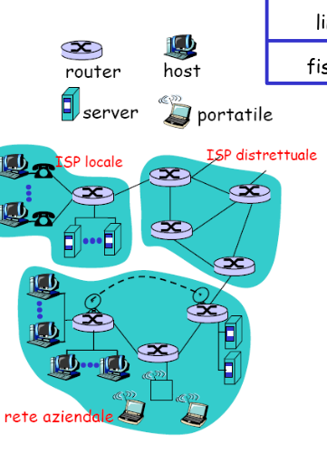

### Applicazioni di Rete

- Applicazioni formate da processi distribuiti comunicanti

- I processi sono programmi eseguiti dai dispositivi terminali o host o end system di una rete

- All'interno dello stesso host, due processi possono anche comunicare attraverso la comunicazione inter-processo definita dal sistema operativo.

- Nella comunicazione a livello applicativo fra due dispositivi terminali diversi di una rete, due o più processi girano su ciascuno degli host comunicanti e si scambiano messaggi.

### Livello applicazione

- I livelli applicazione nei due lati della comunicazione agiscono come se esistesse un collegamento diretto attraverso il quale poter inviare e ricevere messaggi

  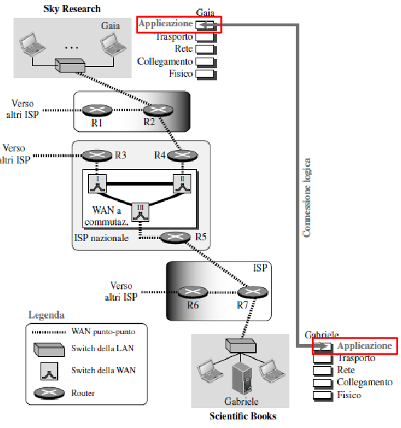

### Protocollo dello Strato di Applicazione

- Definisce i _tipi di messaggi_ scambiati a livello applicativo (es: di richiesta e di risposta)

- la sintassi dei vari tipi di messaggio (i campi del messaggio)

- la semantica dei campi (significato)

- le regole per determinare quando e come un pricesso invia messaggi o risponde ai messaggi.

### Paradigma del livello applicazione

- Programmi applicativi su host diversi che comunicano tra di loo scambiandosi messaggi.

- Es. WEB, gestione di un elaboratore remoto, trasferimento e condivisione file, posta elettronica, comunicazione multimediale

- I due programmi applicativi devono essere entrambi in grado di richiedere e offrire servizi, oppure ciscuno deve occuparsi di uno dei due compiti?

**Paradigmi**

- Client-server :
  - numero limitato di processi server che offrono un servizio e sono in esecuzione, in attesa di ricevere richieste.
  - Client: programma che richiede un servizio.
- _Peer to Peer_ : peer che possono offrire servizi e inviare richieste
- _Misto_

#### Il paradigma client-server

**Client**

- Inizia il contatto con il server ("parla per primo")

- tipicamente richiede un servizio al server

**Server**

- forninsce al client il servizio richiesto

- Sempre attivo

  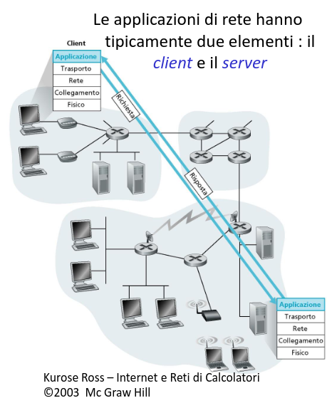

### Componenti di un'applicazione di rete: due esempi

**Web**

- Browser sul client
- Server WEB
- Standard per il formato dei documenti (risorse)
- Protocollo HTTP

**Posta Elettronica**

- Standard per il formato dei messaggi
- Programmi di lettura/scrittura sul client
- Server di posta di internet
- Protocolli SMTP, POP3, ecc

**N.B. Il protocollo a livello applicativo è solo un parte dell'applicazione di rete!**

### Applicazione di rete: terminologia

**API: Application programming interface**

- insieme di regole che un programmatore deve rispettare per utilizzare delle risorse.

  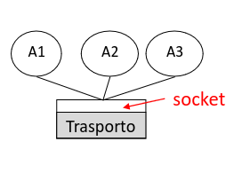

- un processo a livello applicazione vuole inviare un messaggio al suo omologo su un altro host
- Interagisce con il sistema operativo che implementa i sottostanti livelli dello stack TCP/IP attraverso un'interfaccia.

**Interfaccia Socket**:

- API che funge da interfaccia tra gli strati di un applicazione e di trasporto.
- Socket è la API di Internet per eccellenza.

### Interfaccia Socket

  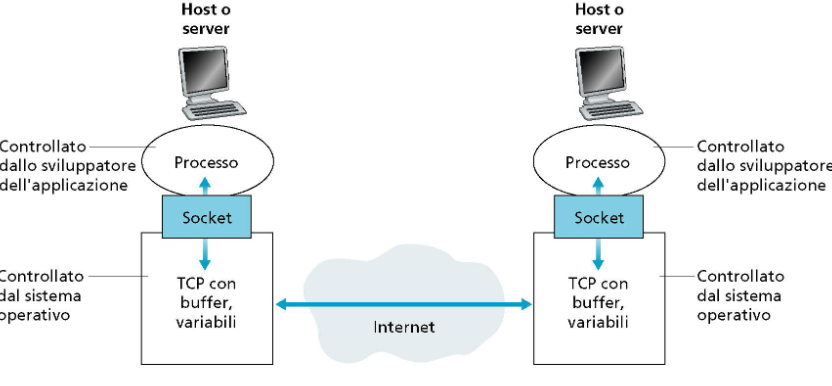

Due processi comunicano mandando dati alla socket e leggendoli da questa:

- Connesione logica tra i due processi, l'invio/ricezione dei dati è responsabilità dei restanti quattro livelli dello stack TCP/IP nel sistema operativo.

- Socket è un'astrazione. Si tratta di una struttura dati utilizzata dal programma applicativo. La comunicazione tra un processo client e server è realizzata attraverso la comunicazione tra i due socket (endpoint della comunicazione, socket = connettore, presa)
- Il client considera la socket come l'entità che riceve le richieste e fornisce le risposte, per il server la socket è l'entità da cui riceve le richieste e a cui inviare le risposte.

  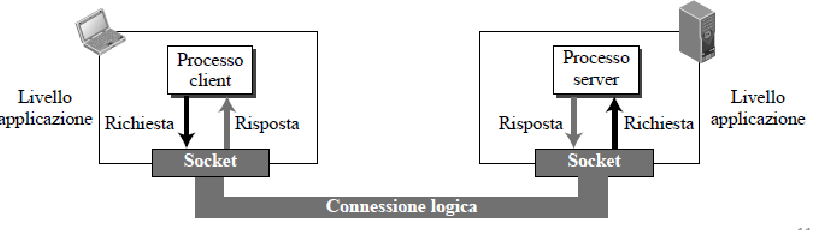

### Indirizzare processi

- Per ricevere messaggi, un processo deve avere un identificatore
- La macchina host ha un indirizzo IP di 32 bit
- L'identificativo include l'indirizzo IP e numero di porta associate al process
- Esempi di numeri di porta:
  - HTTP server 80,
  - mail server 25
    Per inviare messaggi HTTP al server web

### Esempio di API: TCP

  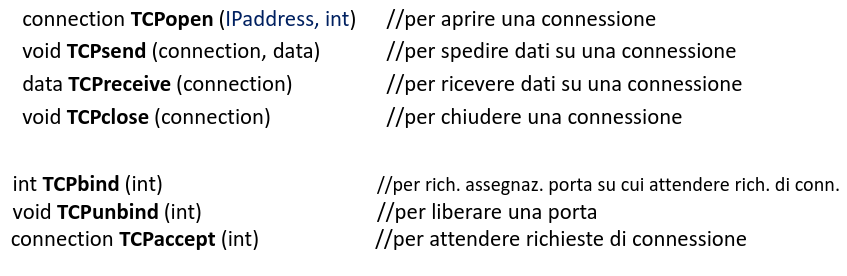

### Uso dei servizi di transporto

Una coppia di processi fornisce servizi agli utenti di internet, siano questi persone o applicazioni.  
La coppia di processi, tuttavia, deve utilizzare i servizi offerti dal livello trasporto per la comunicazione, poichè non vi è una comunicazion fisica a livello applicazione.
Nel livello trasporto della pila di protocolli TCP/IP sono previsti due protocolli principali.

- **TCP**: servizio connection-oriented, basato su stream
- **UDP:** servizio connection-less, orientato al messaggio

### Concetti generali

Applicazioni di rete realizzate "sopra" servizi Internet di trasporto dati

  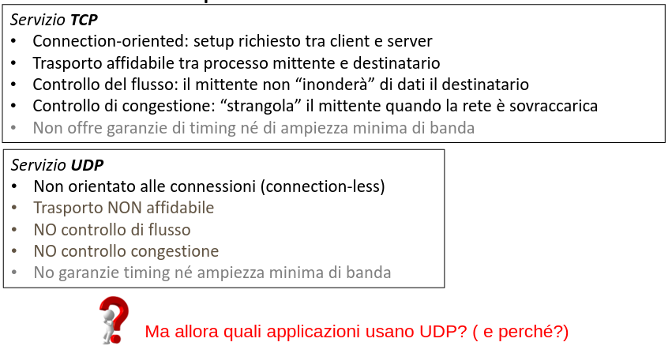

#### Che tipo di trasporto è richiesto da un'applicazione?

**Throughput**
Tasso al quale il processo mittente può inviare i bit al processo ricevente.
alcune applicazioni richiedono un certo throughput per essere efficaci.

**Perdita dei dati**

**Sensibilità ai ritardi**

### Trasporto richiesto da applicazioni comuni

  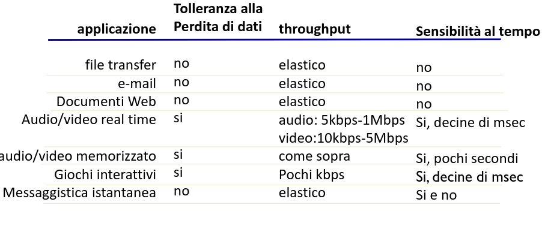

### Applicazioni Internet

  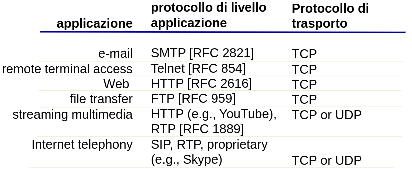

## Il Web: Terminologia

- Pagina Web: consiste di 'oggetti' formati da:
  - un file HTML di base
  - diversi oggetti referenziati (altre pagine, immagine JPEG, file audio)
  - Ciascun oggetto è indirizzabile tramite una URL (Uniform Resource Locator)

  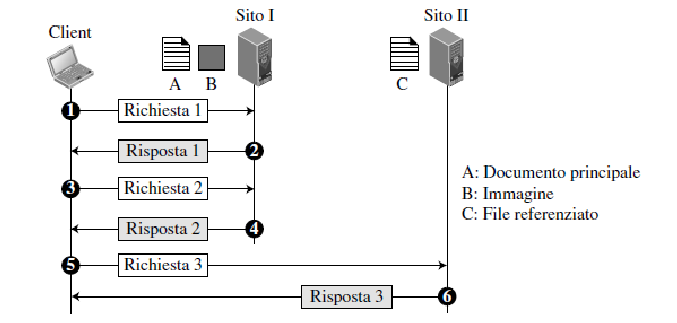

