# Lo strato Applicativo HTTP FORMATO DEL MESSAGGIO

[Link alle slides](https://elearning.di.unipi.it/pluginfile.php/76893/mod_resource/content/1/L02_StratoApplicativo_HTTP_formatomessaggio.pdf)

## Pipelining

- Serve per migliorare ulteriormente le prestazioni

- Consiste nell'invio da parte del client di molteplici richeiste senza aspettare la ricezione di ciascuna porta

- Il server DEVE inviare le risposte nello stesso ordine in cui sono state ricevute le richieste

- Il client non può inviare in pipeline richieste che usano metodi HTTP non idempotenti

<p align="center">
  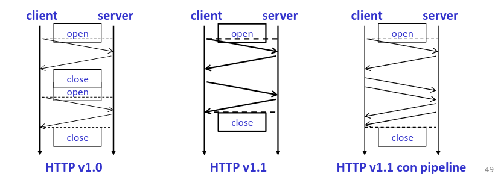
</p>

## Pipelining e HOLB

- Server web che rispettano HTTP/1.1 devono supportare il pipelining

- Implementato in pochi browser

- Le risposte devono essere inviate in ordine (se una richiesta richiede tempo per essere processata, le risposte alle richieste successive sono bloccate (Head Of Line Blocking)

- In questi casi l'obiettivo di diminuire il tempo di caricamento di una pagina non è raggiunto

## Messaggi HTTP

- Un messagio HTTp può essere di due tipi:
  **request** o **response**

- La riga iniziale distingue la richiesta dalla risposta
  (start-line)

- Seguono una serie di header (coppie nome-valore)

- Un corpo del messaggio (non sempre presente)

## HTTP REQUEST MESSAGE

<p align="center">
  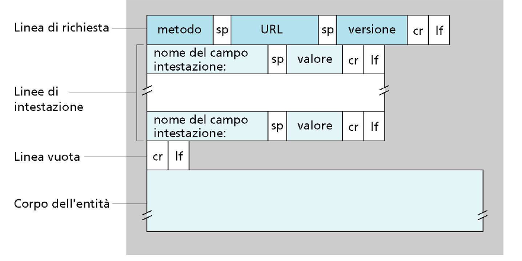
</p>

## HTTP RESPONSE MESSAGE

<p align="center">
  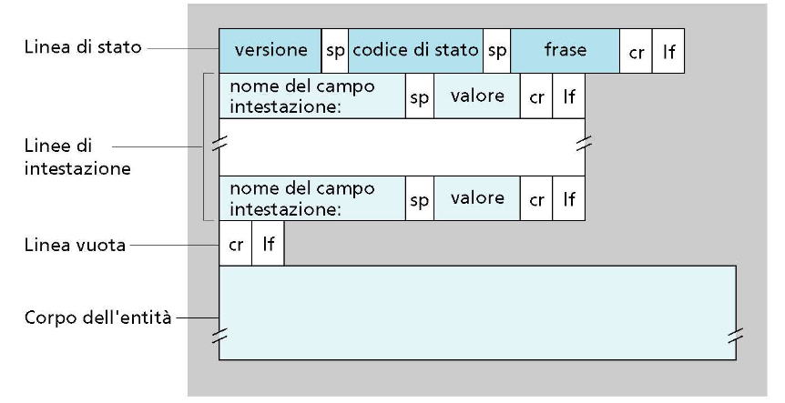
</p>

### HTTP request

```http
Request = Request-Line
          *(general-header
            | request-header
            | entity-header)
            CRLF
            [message-body]
```

<p align="center">
  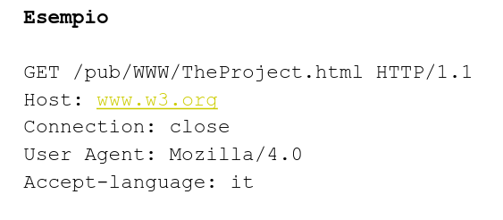
</p>

## HTTP request line

<p align="center">
  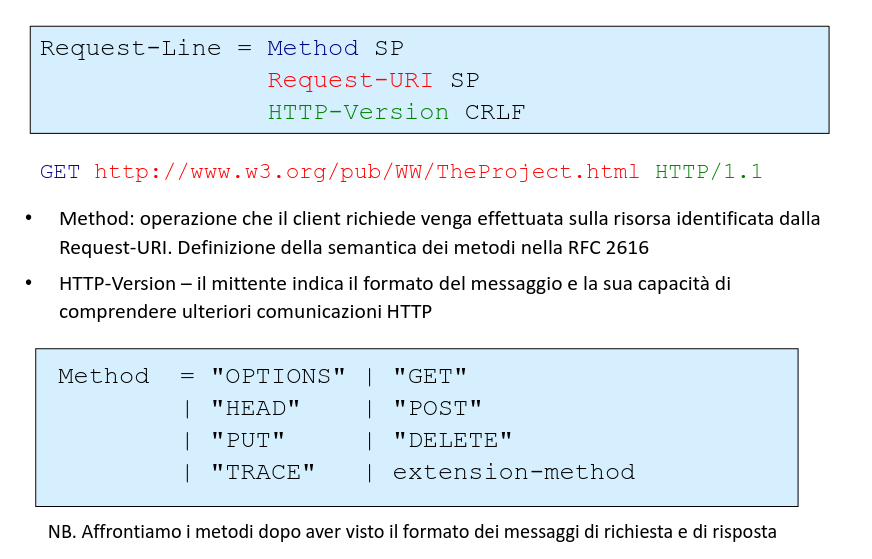
</p>

## Header

Gli header sono insiemi di coppie (nome:valore) che specificano alcuni parametri del messaggio trasmesso o ricevuto:

- _General Header_ - relativi alla trasmissione

  - Es. Data, codifica, connesione

- _Entity Header_ - relativi all'entità trasmessa

  - Content-type, Content-Length, data di scadenza, ecc.

- _Request header_ - relativi alla richiesta

  - Chi fa la richiesta, a chi viene fatta la richiesta, che ti po di caratteristiche il client è in grado di accettare, autorizzazione, ecc.

- _Response header_ - nel messaggio di risposta
  - Server, autorizzazione richiesta, ecc

## Status Line

<p align="center">
  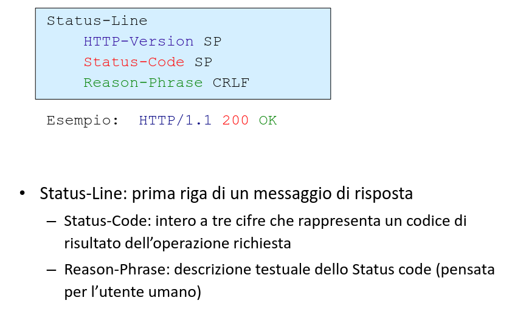
</p>

## Status Code

<p align="center">
  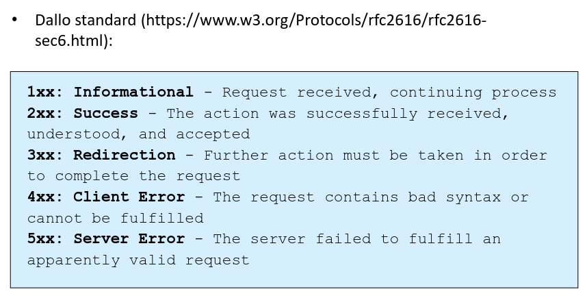
</p>

<p align="center">
  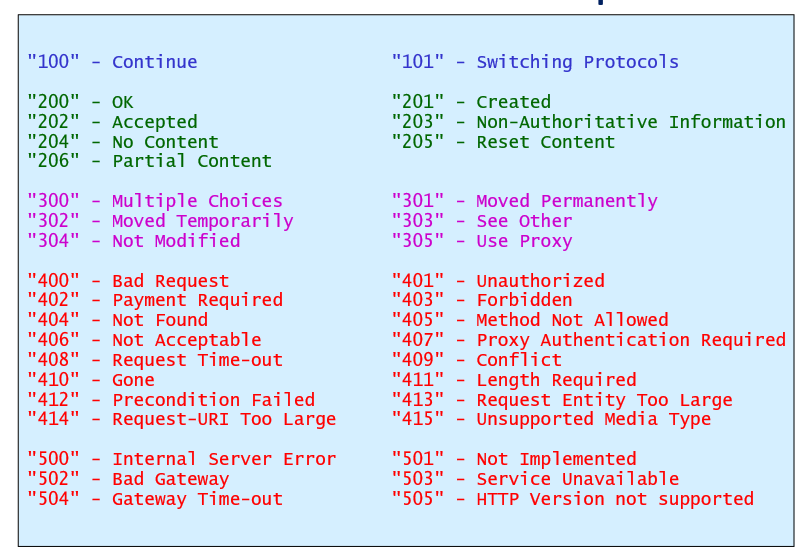
</p>

## Response Headers

<p align="center">
  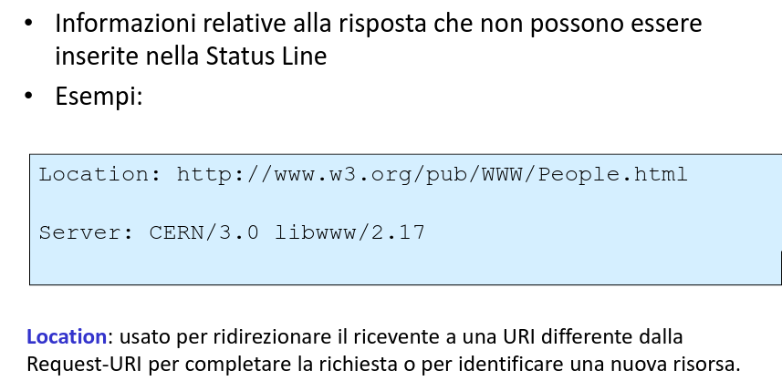
</p>

## Entity Headers

<p align="center">
  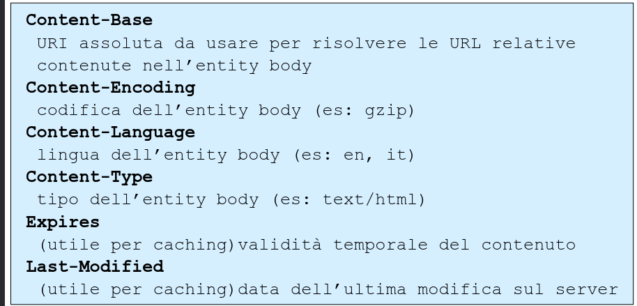
</p>

### Content Negotiation

- Le risorse possono essere disponibili in più rappresentazioni (lingua, formato di dati, dimensioni, ecc..)

- Content negotiation:
  Meccanismo per selezionare la rappresentazione appropriata quando viene servita una richiesta (uso di Request ed Entity headers)

<p align="center">
  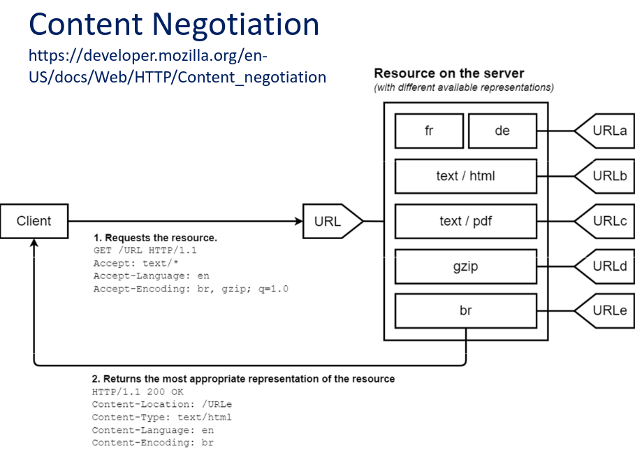
</p>

### Request method - OPTIONS

<p align="center">
  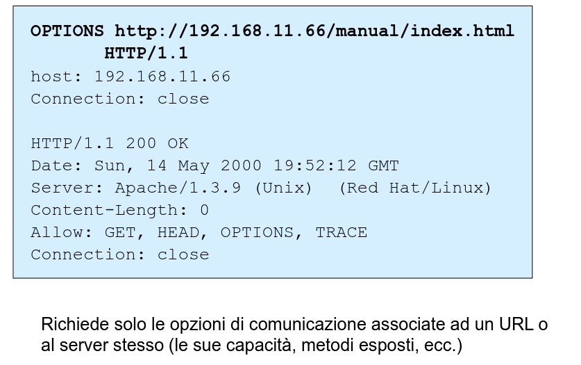
</p>

### Request method - GET (request)

<p align="center">
  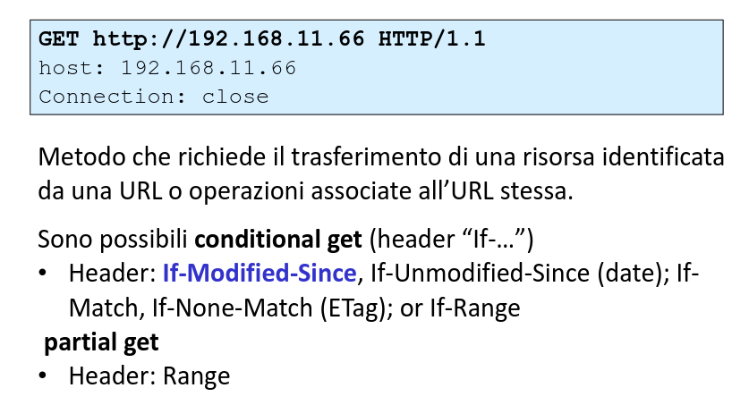
</p>

### Request method - GET (response)

<p align="center">
  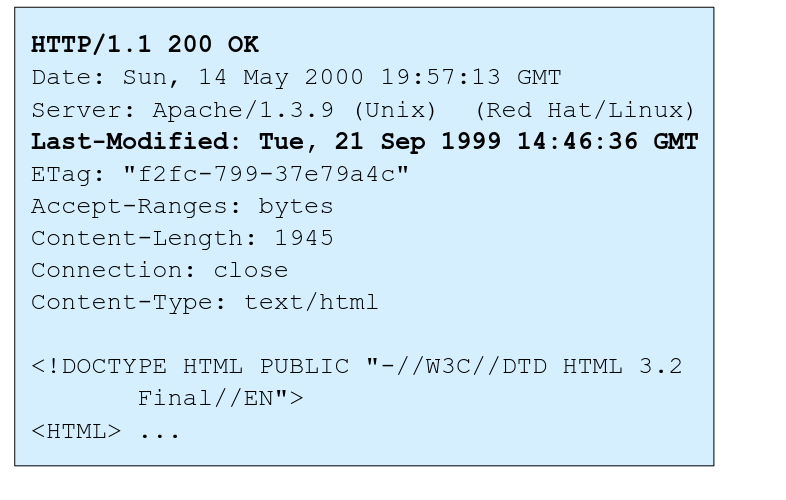
</p>

### GET condizionale

<p align="center">
  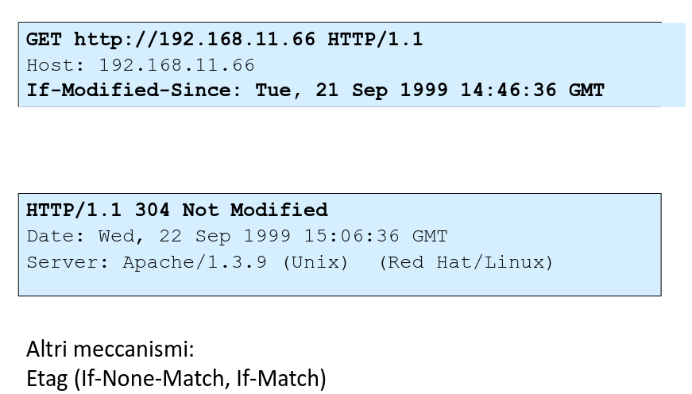
</p>

<p align="center">
  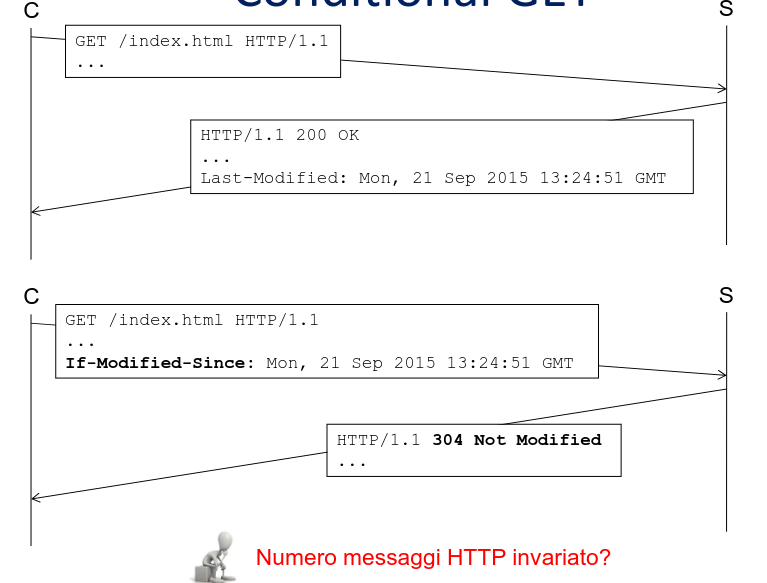
</p>

### Request methohd - HEAD (request)

<p align="center">
  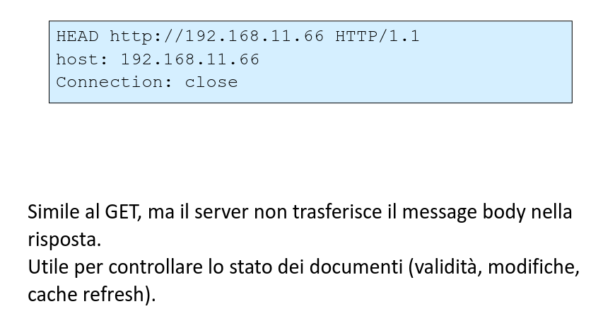
</p>

### Request methohd - HEAD (response)

<p align="center">
  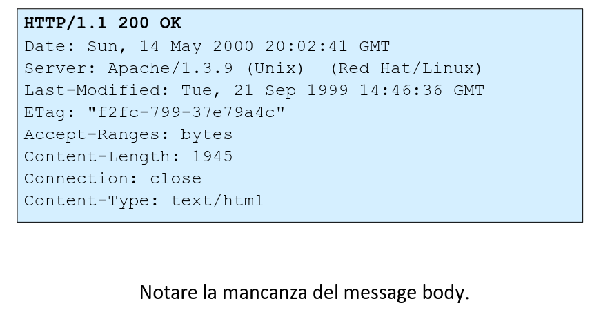
</p>

### Request Method - POST

- Il metodo POST serve per inviare dal client al server informazioni inserite nel body del messaggio.

- In teoria lo standard dice che...
  Il metodo POST è usato per chiedere che il server accetti l'entità (risorsa) nel corpo della richiesta come una nuova subordinata della risorsa identificata dalla REQUEST-URI nella request line

  - In pratica...
    La funzione effettiva eseguita dal POST è determinata dal server e dipende tipicamente dalla Request-URI.

  Esempi: Annotazioni ad URL esistenti, FORMs, Posting a messe boards, newsgroup, mailing list

  NB con le API REST vengono rispettate le specifiche HTTP

  <p align="center">
    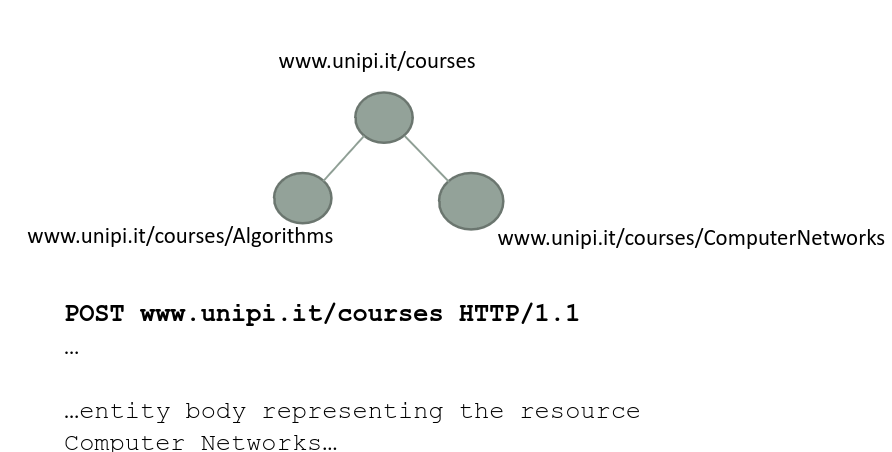
  </p>

### Request method - PUT & DELETE

- PUT: Il client chiede al server di creare / modificare una risorsa:

  - il client specifica nella REquest URI l'identificativo della risorsa (facendo una GET poi posso recuperare la risorsa)

- DELETE: il client chiede di cancellare una risorsa identificata dalla Request URI

- Metodi normalmente non abilitati sui server web pubblici

<p align="center">
  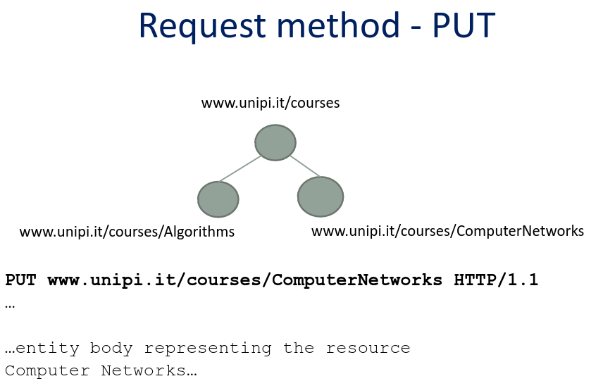
</p>

### Metodi sicuri e idempotenti

- Safe methods:
- metodi che non hanno effetti collaterali, es, non modificano la risorsa.
- GET, HEAD, OPTIONS, TRACE

- Idempotent Methods
  - I metodi possono avere la proprietà di "idempotenza" negli effetti collaterali se
    N > 0 richieste identiche hanno lo stesso effetto di una richiesta singola
  - GET, HEAD, PUT, DELETE, OPTIONS, TRACE

### Web Caching

Obiettivo: soddisfare richiesta del cliente senza contattare server

- Memorizzare copie temporanee di risorse Web (es. pagine HTML, imagini) e servirle al client per ridurre l'uso di risorse (e.g. banda, workload sul server) e diminuire tempo di risposta al client.

- User Agent Cache: Lo user agent (il browser) mantiene una copia delle risorse visitate dall'utente

- Proxy Cache
  - il proxy intercetta il traffico e mette in cache le risposte. Successive richieste alla stessa REQUEST-URI possono essere servite dal proxy senza inoltrare la richiesta al server
- Utente configura il browser: accessi Web via proxy

<p align="center">
  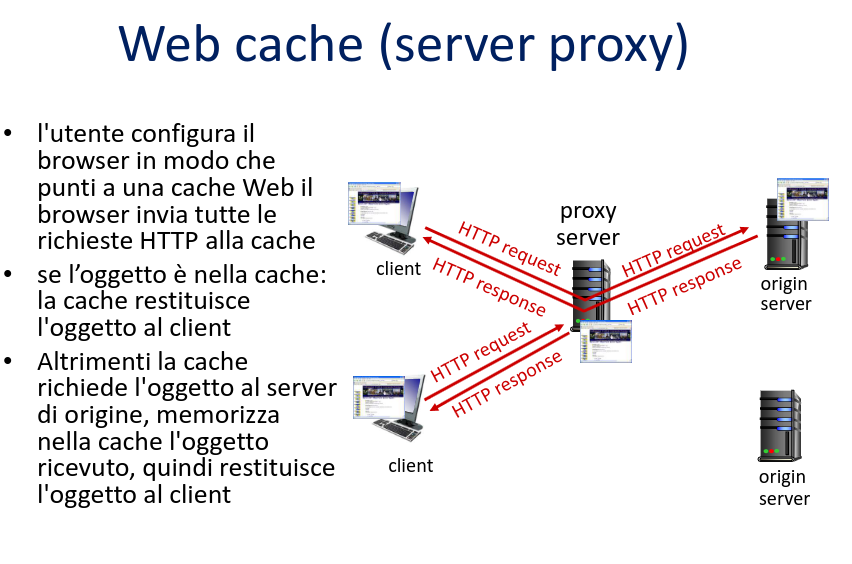
</p>

<p align="center">
  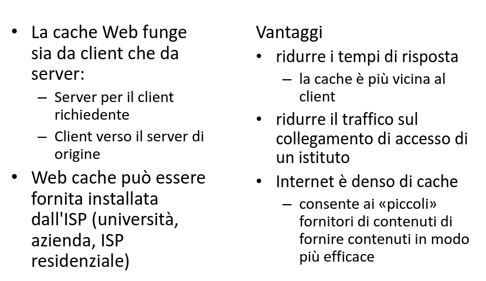
</p>

### I cookie

<p align="center">
  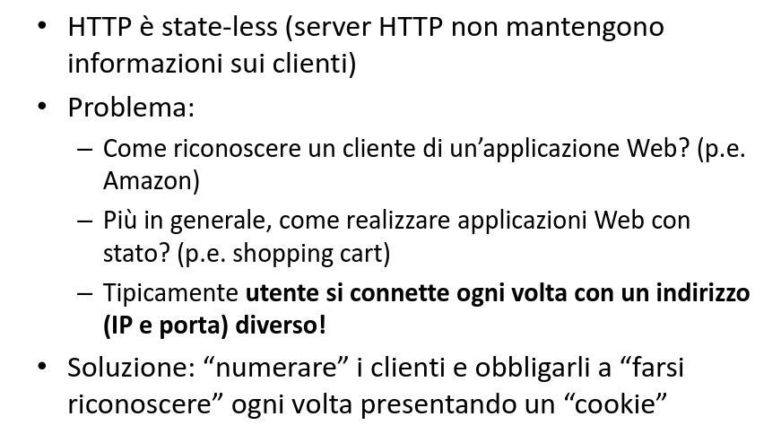
</p>

<p align="center">
  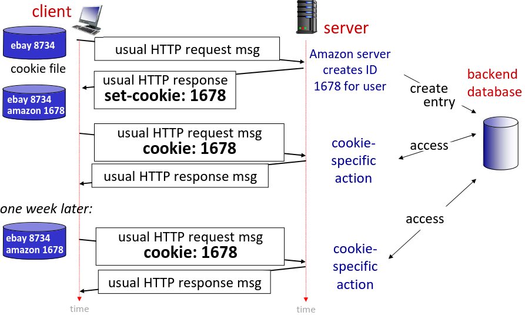
</p>

<p align="center">
  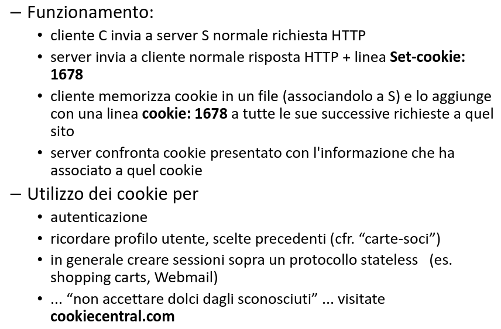
</p>
