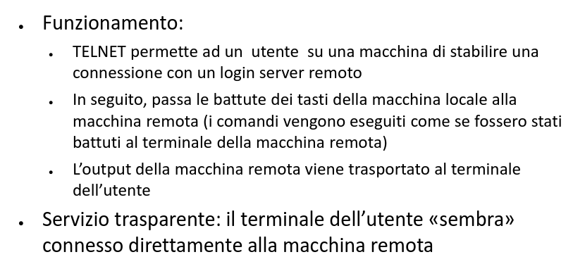

# Lo strato applicativo Telnet

[Link alle slides](https://elearning.di.unipi.it/pluginfile.php/76971/mod_resource/content/1/L03_StratoApplicativo_Telnet.pdf)

## Telnet

TErminaL NETwork: Protocolo di terminle remoto il cui scopo è quello di permettere l'uso interattivo di macchine remote:

- lavoro remoto
- accesso multiplo ad un computer
- N.B. coppie generiche client server per login rmeoto (non specializzate per tipo di applicativo)

Invece di offrire server specializzati per servizi interattivi, l'approccio consiste nel permettere all'utente di effettuare una sessione di login nella macchina remota e quindi inviare i comandi. Tramite il login remoto gli utenti hanno accesso ai comandi e programmi disponibili nella macchina remota.

- Compito non semplice
- A tal fine il TELNET:
  - maschera sia la rete che i sistemi operativi
  - utilizza un'interfaccia minima

  

  

### Local Login

  

### Remote Login

  

Pseudo terminale Driver: entry point del sistema operativo che consente di trasferire caratteri a un processo come se provenissero dal terminale.

Ha il compit di accettare i caratteri dal server Telnet e trasmetterli al sistema operativo. Il sistema operativo consegna i caratteri all'applicazione opportua

### Problema con Telnet

TELNET deve poter operare con il numero massimo di sistemi e quindi gestire dettagli di sistemi operativi eterogenei. I terminali possono differire gli uni dagli altri per:
● il set e codifica di caratteri
● la larghezza della linea e lunghezza della pagina
● i tasti funzione individuati da diverse sequenze di caratteri (escape
sequence)

es. diversa combinazione di tasti per interrompere un processo (CTRL-C,
ESC), caratteri ASCII diversi per terminazione righe di testo

### Soluzione:

definizione di un terminale virtuale. Sulla rete si considera un unico terminale standard e in corrispondenza di ogni host, si effettuano la conversione da terminale locale a terminale virtuale e viceversa. Telnet assume che sui due host sia in esecuzione un **Network Virtual Terminal (NVT)**.

La connessione TCP è instaurata tra questi due terminali NVT.

_L’NVT è un dispositivo “immaginario” che fornisce una rappresentazione astratta di un terminale canonico. Gli host, sia client che server, traducono le loro caratteristiche locali così da apparire esternamente come un NVT e assumono che l’host remoto sia un NVT_

  

### Come funziona il NVT Telnet

I terminali NVT si scambiano dati in formato 7-bit US-ASCII. Ogni carattere è inviato come un ottetto con il primo bit settato a zero.

I byte con il bit più significativo a 1 usati per le sequenze di comandi.

I comandi iniziano con un ottetto speciale (Interpret as Command - IAC) di 1

-> Inband signalling (comandi e dati sulla stessa connesione)

- I messaggi di controllo iniziali sono usati per scambiare informazioni sulle caratteristiche degli host (Telnet option negotiation)

- Il client invia un login identifier e una password

- Il client interagisce con la macchina remota

- Telnet non è sicuro -> SSH Secure Shell (SSH) Connection Protocol

  

