# Lo strato applicativo EMAIL-SMTP

[Link alle slides](https://elearning.di.unipi.it/pluginfile.php/77070/mod_resource/content/1/L04_StratoApplicativo_Mail.pdf)

## Posta elettronica

- Uno dei primi servizi applicativi di internet
- Trasferimento di un messaggio tra uno user mittente e uno user destinatario

  - il destinatario potrebbe non essere in quel momento disponibile ad accettare messaggi di posta:
  - utente impegnato
  - computer spento

- Il servizio di posta elettronica si basa su componenti intermediari per trasferire i messaggi
  - Disaccoppiando lato mittente e destinatario
  - Analogia con posta tradizionale

  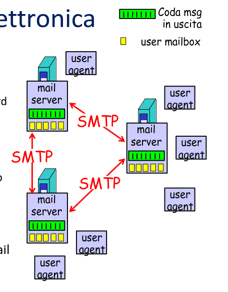

- _User agent_:

  - per la composizione, editing, lettura di messaggi di posta

- _Mail server_:

  - i messaggi in entrata ed uscita vengono archiviati sul server
  - le mailbox contengono messagi in ingresso diretti all'utente
  - una coda di messaggi in uscita

- _Protocollo SMTP: dialogo tra mail server_

  - client: mail server che invia
  - server : mail server che riceve

- Un destinatario è identificato da un indirizzo email nella forma:

local-part@domain-name

- domani-name : specifica un mail server. Determina il nome di dominio di una destinazione a cui la mail dovrebbe essere recapitata.

- local part : specifica la cassetta di posta nel mail server. Spesso è identica al nome di login o al nome completo dell'utente

  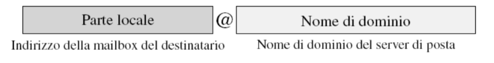

### La storia di un messaggio

  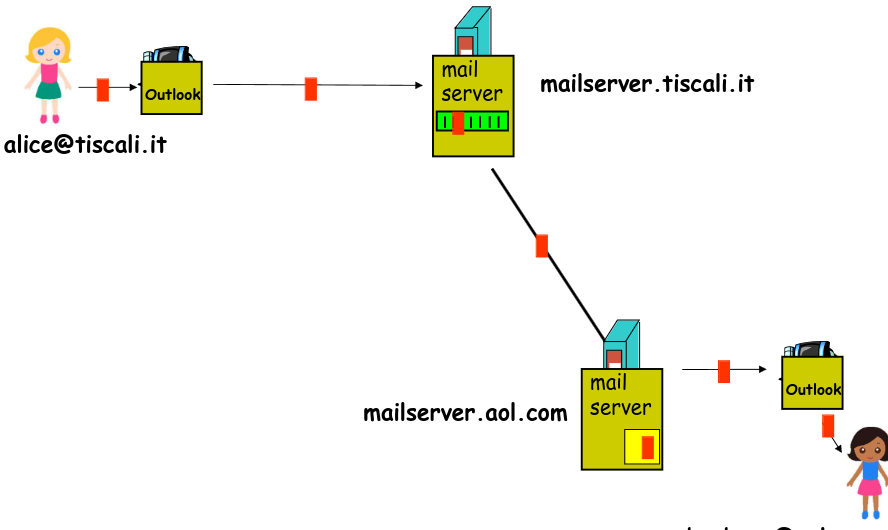

### Server postale (con gestione alias)

  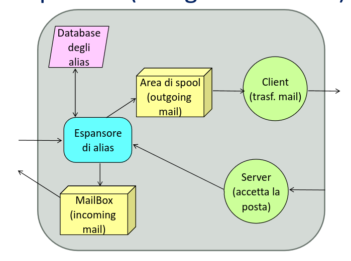

### Server postale (schema di principio)

- I server di posta adottano una tecnica, denominata spooling:
  L'utente invia un messaggio, il sistema ne pone una copia in memoria (spool), insieme con id mittente, id destinatario, id macchina di destinazione e tempo di deposito.

- Il sistema avvia il trasferimento alla macchina remota. Il sistema (client) stabilisce una connessione TCP con la macchina destinazione.

- Se la connessione viene aperta, inizia il trasferimento del messagio.

- Se il trasferimento va a buon fine il client cancella la copia locale della mail

- Se il trasferimento non va a buon fine, il processo di trasferimento scandisce periodicamente l'area di spooling, e tenta il trasferimento dei messaggi non consegnati. Oltre un certo intervallo di tempo se ilmessaggio non è stato consegnato, viene inviata na notifica all'utente mittente

### Server postale (Gestione alias)

L'alias è una cassetta postale virtuale che serve a ridistribuire i messaggi verso uno o più indirizzi di posta elettronica personali.

- Molti-uno -> il sistema di alias permette ad un singolo utente di avere identificatori di mail multipli, assegnando un set di identificatori
  ad una singola persona -> Un utente - più indirizzi postali

- uno-molti: il sistema permette di associare un gruppo di destinatari ad un singolo identificatore -> un indirizzo postale - più utenti destinatari

- Meccanismo di espansione degli ALIAS postali: conversione di identificatori di indirizzi postali in uno o più indirizzi postali nuovi.
- Se l'alias database specifica che all'indirizzo x deve essere assegnato il nuovo indirizzo y, l'espansione dell'alias riscriverà l'indirizzo di destinazione; si provvederà poi a detemrinare se y specifichi un indirizzo locale o remoto e lo posizionerà nell'area di spool relativa.

## Protocollo di trasferimento della posta

  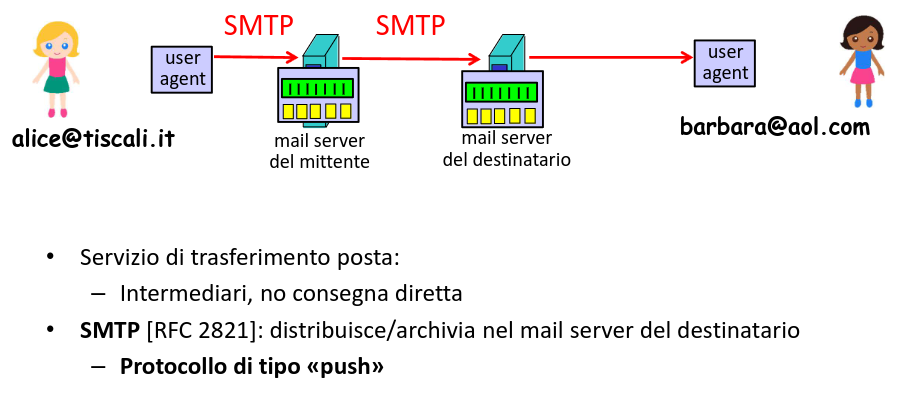

## Simple Mail Transfer Protocol

- RFC 821, 2821, 5321

- L'obiettivo di SMTP è il trasferimento affidabile ed efficiente di mail

- SMTP è indipendente dal sistema di trasmissione usato e richiede solo il trasferimento di stream di byte ordinato e affidabile (RFC discute SMTP su TCP)

- Una caratteristica di SMTP è la capacità di trasportare mail attraverso più reti. Un messaggio di mail può passare attraverso server intermedi nel percorso da mittente e destinatario finale.

## SMTP Model

Quando un client SMTP vuole trasferire un messaggio, stabilisce un canale di trasmissione bidirezionale con un server SMTP. La responsabilità di un client è di trasferire la mail a un server SMTP o comunicare un eventuale insuccess (scambio formale di responsabilità).

Un client SMTP determina l'indirizzo di un host appropriato che ospita un server SMTP risolvendo il nome della destinazione in un indirizzo del mail server destinazione.

- risoluzione di nome in indirizzo IP del mail server destinatario attraverso il DNS.

  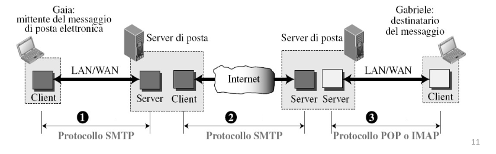

  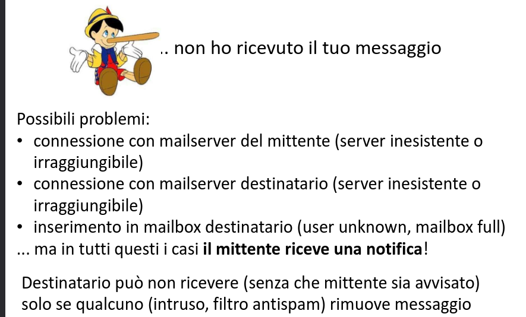

## SMTP Protocollo

In pratica: uso il protocollo TCP (porta 25) per consegnare in modo affidabile messaggi dal client al server.

- Tre fasi durante via SMTP:

1.  handshaking
2.  Trasferimento del messaggio
3.  Chiusura della connesione

- Interazione comando/risposta (command/response)

  - comandi: testo ASCII
  - riposta: codice di stato e descrizione (facoltativa)

- Messaggi (header e body): testo con caratteri ASCII a 7-bit

### Handshaking

- Il client stabilisce la connessione e attendo che il server invii 220 READY FOR MAIL

- Il client risponde con il comando HELO

- Il server risponde identificandosi

- A questo punto il client può trasmettere i messaggi

  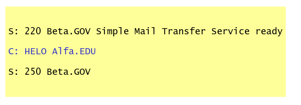

### Comandi SMTP

Alcuni comandi:

- HELO <client identifier>
- MAIL FROM:<reverse-path><CRLF>
- RCPT TO:<forward-path><CRLF>
- DATA
- QUIT

- N.B. <CRLF>.<CRLF> per detemrinare la fine di un messaggio

### Formato messaggi email

SMTP: protocollo per lo scambio dei messaggi

RFC 2822: standard per il formato testo:

- linee intestazione, es. ,
- To:
- From:
- Subject:
  sono diversi dai comandi SMTP!
- body:
  il messaggio, solamente caratteri ASCII a 7 bit

  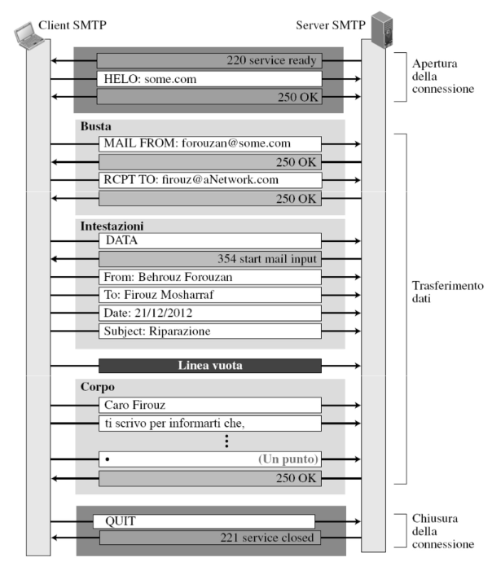

### Format dei messaggi: estensioni multimediali

RFC 822 permette di inviare solo messaggi di testo in ASCII

- Problema: come permette agli utenti di internet di inviare/ricevere messaggi in:

1. lingue con acceti, in alfabeti non latini, in lingue senza alfabeto
2. contenenti audio e video

**MIME**

Idea di base: continuare a usare il formato del messaggio specifico in RFC 822 ma aggiungengo una struttura al message body e definenedo regole di codifica (encoding) per il trasferimento di testo non -ASCII

Grandioso perchè ha permesso di mantenere i protocolli e mail server esistenti cambiando solo gli User Agents

### Format dei messaggi: estensioni multimediali

MIME: Multipurpose Internt Mail Extension (MIME), RFC 2045, 2046 è un internet standard che estende il formato di email per supportare :

1. testo in set di cartteri diversi da US-ASCII
2. allegati in formato non testuale
3. corpo del messaggio con più parti (multi-part)
4. header in set di caratteri non-ASCII

MIME (RFC 2045) definisce un insieme di metodi per rappresntare dati binari in formato ASCII, linee di intestazione aggiuntive per dichiarare il tipo di contenuti MIME

  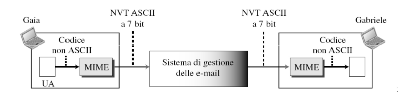

  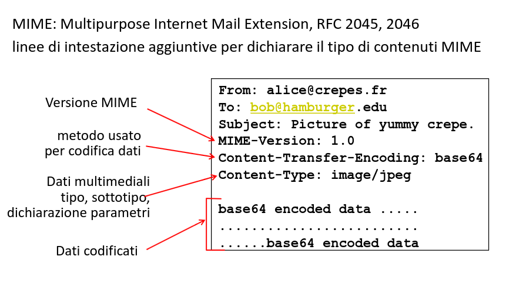

Client e server SMTP si aspettano messaggi ASCII (che usano 7 degli 8 bit di un byte).
I dati binari usano invece tutti gli 8 bit di un byte.

- MIME fornisce vari schemi di transfer encoding, tra cui:
- ASCII encoding binary data: base 64 encoding. Ovvero gruppi di 24 bit sono divisi in 4 unità da 6 bit e ciascuna viene inviata come un carattere ASCII
- Quoted-printable encoding: per emssagi testuali con pochi caratteri non-ASCII, più efficiente.

Oggi i mail server possono negozioare l'invio di dati in 8 bit , se la negoziazione non ha successo si usano i caratteri 7bit-ASCII

  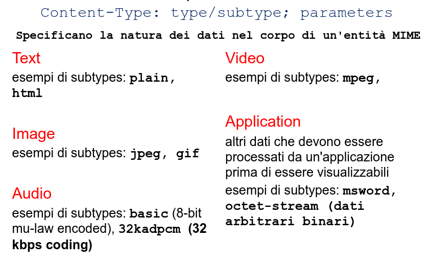

## Protocolli di accesso alla Mail

  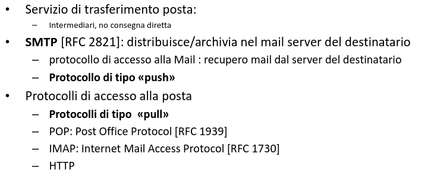

### Accesso alla posta: POP3

- User Agent apre una connesione TCP (porta 110) verso il server di posta
- Fasi di: autorizzazione, transazione, aggiornamento

  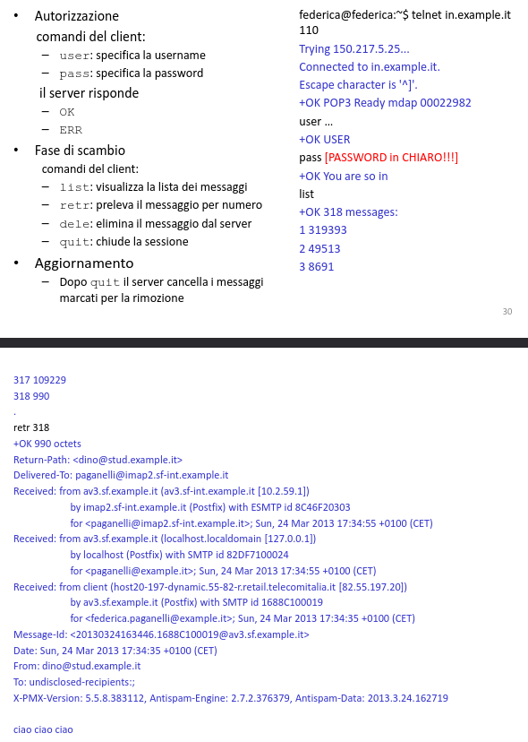

### Accesso alla posta

- IMAP:

  - più feature (e più complesso) di POP3 (no inf di stato tra le sessioni)
  - manipolazioni di messaggi memorizzati sul server (p.e folder)
  - comandi per estrarre solo alcuni componenti dei messaggi (p.e. solo intestazioni se si sta usando una connessione lenta)

- HTTP: Hotmail, yahoo!, Mail, gmail, etc
