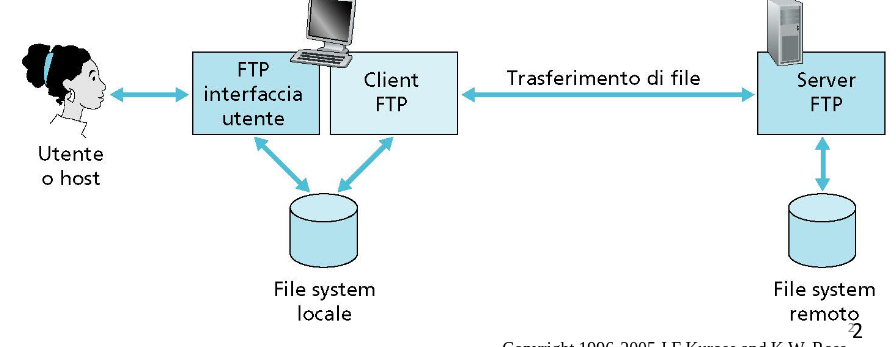
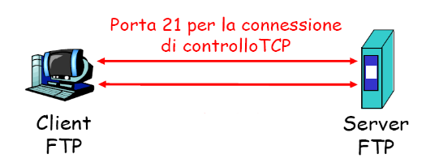
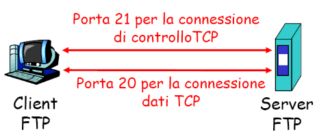
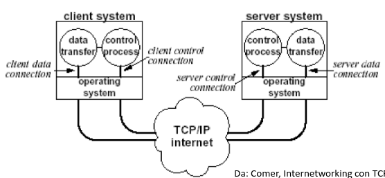
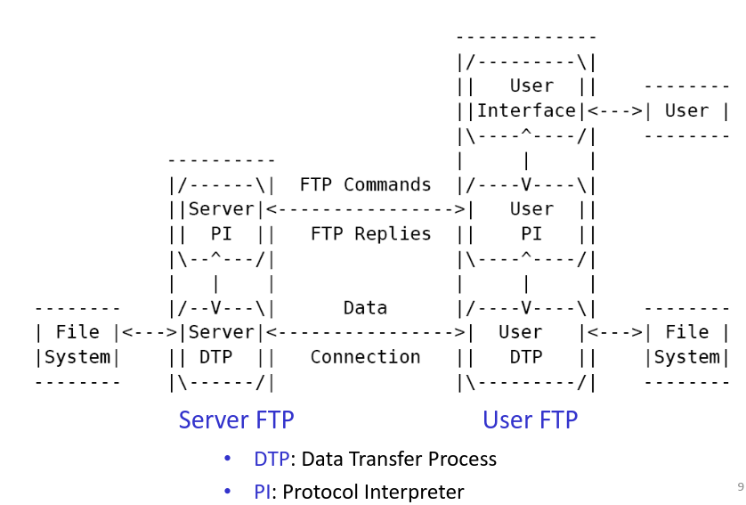
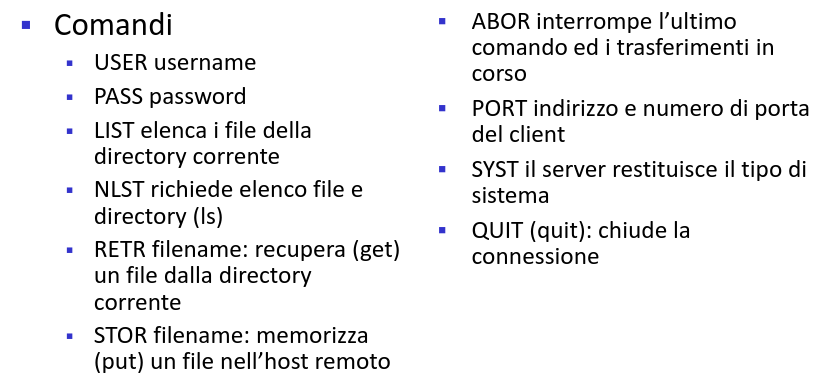
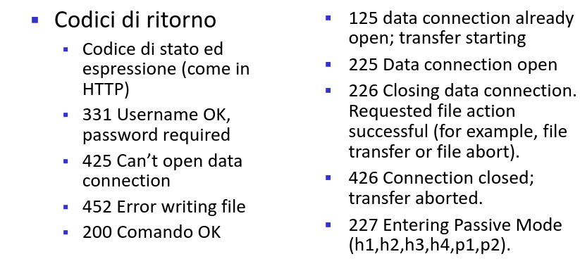
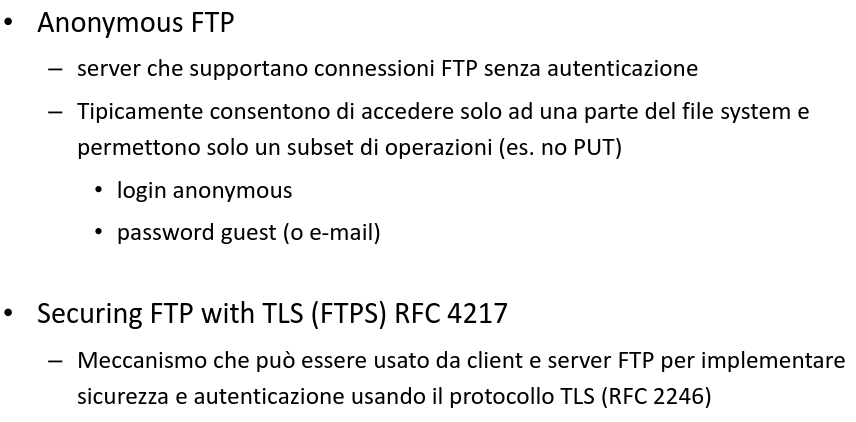
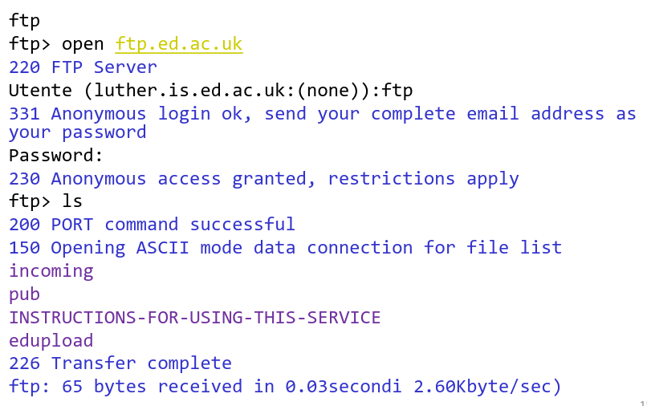

# Strato Applicativo File Transfer Protocol

[Link alle slides](https://elearning.di.unipi.it/pluginfile.php/77071/mod_resource/content/1/L05_Applicativo_FTP.pdf)

## Strato applicativo File Transfer Protocol

**FTP: file transfer protocol (RFC 959)**

- Trasferimento file a/da un host remoto
- Modello client/server
  - client: il lato che chiede il trasferimento
  - server : host remoto

  

É lo standard per il, trasferimento di file in reti TCP/IP

- Servizio diverso dall'accesso convdiviso on-line
- Trasferimento file: si ottiene una copia locale

FTP, Fornisce funzionalità aggiuntive rispetto al semplice trasferimento file

- accesso interattivo, l'utente può cambiare/modificare l'albero di directory nel file system remoto

- specifica del formato dei dati da trasferire
- Autenticazione: il client può specificare login e password

### Modello FTP

- RFC 959
- Due tipi di connesione:
  - control connection:
    scambio di comandi e risposte tra client e server. Segue il protocollo Telnet
  - data connection:
    Connessione su cui i dati sono trasferiti con modi e tipi specificati. I dati trasferiti possono essere parte di un file, un file o un set di file.

**FTP è un protocollo STATEFUL**

- Il server deve tener traccia dello stato dell'utente (connesione di controllo associata ad un account, directory attuale, ecc...)

### Connessione di controllo

- Il client FTP contatta il server FTP alla porta 21
- Il client ottiene l'autorizzazione sulla connesione di controllo
- Il client invia i comandi sulla connesione di controllo (es. cambio directory, invio file, ecc.)
- La connessione di controllo è persistente

  

### Connesione Dati

- Quando il server riceve un comando per trasferire un file (da o verso il client) sulla connessione di controllo:

1.  il server apre una connesione dati TCP con il client (Active Mode)
2.  Trasferisce il file sulla connesione dati
3.  Dopo il trasferimento di un file, il server chiude la connessione

- Connesione dati non persistente, una per ciascun trasferimento

  

### Precisazioni

Quando un client attiva la connesione di controllo con il server, usa un numero di porta assegnato localmente in modo casuale e contatta il server ad una porta nota(21).
FTP usa la connessione di controllo per permettere a client e server di coordinare l'uso delle porte assegnate dinamicamente per il trasferimento dati.
La comunicazione sulla connesione di controllo avviene per mezzo di caratteri con una codiica standard NVT ASCII, sia per i comandi che per le risposte (Telnet).

  

### Modello FTP

  

### Active vs Passive Mode

Per creare la connesione TCP per il trasferimento dati sono possibili due modalità:

- Active Mode: modalità descritta precedentemente

  - Il server apre una connesione dati TCP con il client
  - Il server deve conoscere il numero di porta lato client (il client gliela comunica sulla connesione di controllo)

- Passive Mode: Il client chiede al server di mettersi in ascolto su una porta per una connessione dati, ottiene questo numero di porta dal server e lo usa per aprire la connessione con il server (porta 20 ma non necessariamente).

### Modalità di trasmissione

- Stream mode: FTP invia i dati a TCP con un flusso continuo di bit

- Block mode: FTP invia i dati a TCP suddivisi in blocchi. Ogni blocco è preceduto da un header.

- Compressed mode: si trasmette il file compresso.

  

  

### Infine

  

### Esempio

  

