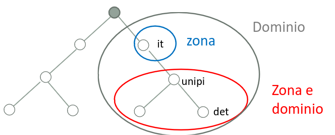
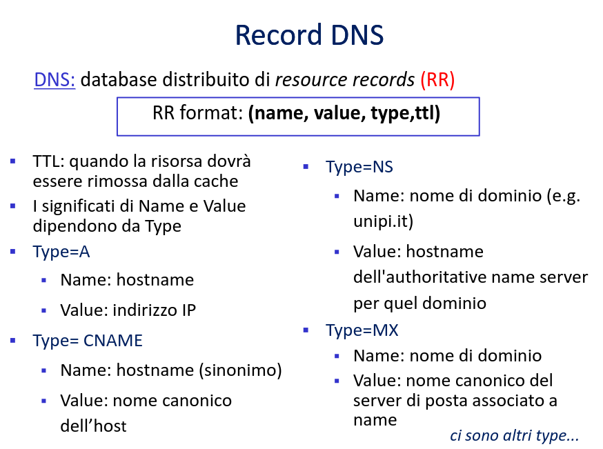

# Lo strato applicativo Capitolo 9

[Link alle slides](https://elearning.di.unipi.it/pluginfile.php/77433/mod_resource/content/1/L06_Applicativo_DNS.pdf)

## DNS

### Obiettivo: Identiicare il processo

Ogni processo di livello applicativo ha necessità di individuare il processo omologo con il quale vuole comunicare.

- Il processo omologo:
  risiede su una particolare macchina (remota), anch'essa da individuare che sua lo stesso protocollo.

### Nomi e Indirizzi

  

### DNS : Domain Name System

Inizialmente l'associazione tra nomi logici e indirizzi IP era statica:

1. tutti i nomi logici e i relativi indirizzi iP erano contenuti in un file (host file)
2. periodicamente tutti gli host prelevano una versione aggiornata del file da un server ufficiale.

Siccome internet es muy grande ahora, si utilisa el DNS.

### el servicio de resolucion

El DNS esta posizionado el nel livello applicativo.

  

- Gira su sistem terminali, adotta il paradigma client/server
- Si affida al sottostante protocollo di trasporto punto-punto per trasferire messaggi tra sistemi terminali.
- NB1: Non interagisce con gli utenti direttamente
- NB2: Filosofia di Internet: complessità alle estremità della rete

  

Il DNS è un meccanismo che deve:

- specificare la sintassi dei nomi e le regole per gestirli
- consentire la conversione da nomi a indirizzi e viceversa

- Esso è costituito essenzialmente da :

1. Uno schema di assegnazioe dei nomi gerarchico basato su domini
2. Un database distribuito contenente i nomi e le corrispondenze con gli indirizzi IP implementato con una gerarghia di name server.
3. Un protocollo per la distribuzione delle informazioni sui nomi tra name server:
   - host, name server comunicano per risolvere nomi
   - utilizzando UDP (porta 35) [oppure TCP]

### Servizi DNS

- Risoluzione di nomi di alto livello (hostname) in indirizzi IP
- Host Aliasing:

  1. un host può avere più nomi (nome canonico + sinonimi o alias)
  2. Traduzione dei nomi in nome canonico/indirizzo IP
  3. p.e. relay1.west-cost.enterprise.com (canonico) può avere 2 aliases enterprise.com e www.enterprise.com

- Mail server aliasing
  - Sinonimi per mail server
- Distribuzione carico
  - Distribuzione carico tra server replicati
  - Ad un hostname canonico corrispondono più indirizzi IP
  - Il DNS restituisce la lista di IP variandone l'ordinamento ad ogni risposta

## Spazio dei nomi

### Struttura dei nomi -l

Spazio dei nomi: deve permettere di identificare in modo univoco un host

- Struttura gerarchica:

  - un nome è costituito da diverse parti
  - Nome organizzaizone, dipartimento, ufficio, ecc..

  - assegnazione dei nomi delegabile -> sistema (in buona parte)
  - Delega dell'autorità per l'assegnazione delle varie parti dello spazio dei nomi
  - Distribuzione responsabilità della conversione tra nomi e indirizzi.

### Nomi di dominio

- Spazio dei nomi con struttura gerarchica
- I nomi hanno una struttura ad albero con un numero di livelli variabile
- ogni nodo è individuato da un'etichetta (max 63 char)
  alla radice c'è un etichetta vuota

  Ogni albero ha un nome di dominio

  - una sequenza di etichette separati da punti
  - DOMINIO: sottoalbero nello spazio dei nomi di dominio che viene identificato dal nome di dominio del nodo radice del sottoalbero.
  - Un dominio può essere suddiviso in ulteriori domini, detti sottodimini

  

I nomi gerarchici delle macchine sono assegnati in base alla struttura delle organizzazioni che ottengono l'autorità per porzioni dello spazio dei nomi.

- La struttura gerarchica permette autonomia nella scelta dei nomi all'interno di un dominio (l'univocità è sempre garantita).

  

## Gerarchia dei name server

**Name servers**

- DNS: Database distribuito implementato in una gerarchia di più name servers
- Name server: programma che gestisce la conversione da nome di dominio a indirizzo IP.

  

- Informazioni sui domini ripartite su più name server
- Zona: porzione dello spazio dei nomi di dominio che è gestita da una specifica amministrazione.
- Zone e dominio non coincidono necessariamente
- Il server immagazzina le informazioni relative alla propria zona inclusi i riferimetni ai name server dei domini di livello inferiore

  

- Server radice (Root Name Server):
  1. responsabile dei record della zona radice
     1.1 server che riconosce tutti i domini di massimo livelo e conosce il server che risolve ciascun dominio
     1.2 restituisce le informazioni sui name server di TLD
     ~ centinaia di root name servers in tutto il mondo

  

- **Server top-level domain:**

  - mantiene le informazioni dei nomi di dominio che appartengono a un certo TLD
  - restituisce le informazioni sui name server di competenza dei sottodomini

- **Server di competenza:**
  - Autorità per una certa zona
  - Memorizza nome e indirizzo IP di un insieme di host
  - può effettuare traduzioni nome/indirizzo per quegli host
  - Per una certa zona ci possono essere server di competenza primari e secondari
    - primari : mantengono il file di zona
    - secondari : ricevono il file e offrono il servizio di risoluzione

### Local Name Server

Quando un programma, deve trasfromare un nome in un indirizzo IP chiama un programma in locale detto resolver, passando il nome come parametro di ingresso.

Se il resolver non ha l'associazione richeista, interroga un name servr di cui conoce l'IP (local name server)

Il local name server cerca il nome nelle sue tabelle, se trova l'associazione restituisce l'indirizzo al resolver, altriemtni, inoltra la query alla gerarchia DNS.

Local name server:

- non appartiene strettamente alla gerarchia dei server
- ogni ISP ha ii suo (default) name server locale
- Le query DNS vengono prima rivolte al name server locale
- il server DNS locale opera da ppoxy e inoltra la query in una gerarchia di server DNS.

  

### Esempio

  

  

### DNS: caching ed aggiornamento dei record

Una volta che un name server ha appreso una associazione, la mette nella cache

- I record nella cache vengono cancellti dopo un certo tempo (timeout-TTL)

I meccanismi di update/notifica sono descritti nella RFC 2136
Migliora il ritardo e riduce il numero di messaggi DNS

  

  

### Messaggi DNS

  

